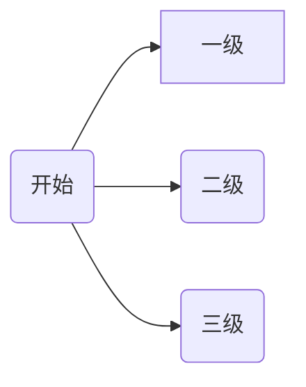

---
{"dg-publish":true,"dg-permalink":"content/obsidian/basic","tags":["obsidian"],"permalink":"/content/obsidian/basic/","dgPassFrontmatter":true}
---


[Obsidian Help - Home ](https://help.obsidian.md/Home)

## 写在前面

obsidian是什么？
- 码字工具
- 深度管理知识内容片段的工具
	- 内容为基础
	- 链接为核心

Obsidian不是什么？
- 不是信息收集工具
- 不是Word
- 不是时间管理工具

我要用obsidian做什么？
- 写作
- 建立深度知识库
	- 关联知识点
	- 发现新知识点
- 建立索引
- 写清单日记

学obsidian真正重要的事
- 运用markdown码字
- 运用双链建立知识网络
- 最终形成自己的知识管理系统

- [GitHub - cumany/Blue-topaz-examples: Blue topaz themes example vault for Obsidian](https://github.com/cumany/Blue-topaz-examples)
    - 有非常多奇技淫巧，我个人建议可以将其作为大而全的词典，借鉴用法和代码，不推荐全盘照搬。
- [GitHub - Rainbell129/Obsidian-Homepage: A dashboard for your obsidian vault.](https://github.com/Rainbell129/Obsidian-Homepage)
    - 和cuman的库挺像，但功能收缩了很多，特色在于，dataview运用的很娴熟，可以作为dataview的实践教材。
- [给Obsidian新手科研人的开箱即用库：BCS’s Vault for Researchers V1.1](https://forum-zh.obsidian.md/t/topic/8114)
        - 这个库挺符合我的口味，对obsidian要用来做什么，不用来做什么有很清晰的定界。
- [GitHub - juestchaos/Obsidian-Plug-and-Play: 一个简单的Obsidian 库](https://github.com/juestchaos/Obsidian-Plug-and-Play)
        - 关注文本和内容本身，值得学习。
- [GitHub - sheldonxxd/obsidian_vault_template_for_researcher: This is an vault template for researchers using obsidian.](https://github.com/sheldonxxd/obsidian_vault_template_for_researcher)
        - 科研向的库，拒绝花里胡哨，符合我的胃口。
- [GitHub - laozhou-in-germany/Chens_LMS_Public: The LMS (Life Management System) is a free tool for personal knowledge management and goal management based on Obsidian.md.](https://github.com/laozhou-in-germany/Chens_LMS_Public)
        - 主打目标管理+dailynote+知识管理+回顾系统。配有各种丰富的模板。
[「回归 Obsidian 的纯与真，写给普通人的入门指南」](https://sspai.com/post/72697)


## 文件结构

资料库：

obsidian每个资料库是独立的，不同资料库里的信息无法互相连接，创建时需要想好这个资料库的定位是什么，要如何去使用这个资料库，不宜分太多，大类相同就放在一个库。

库内的.obsidian文件夹：

存放配置文件的文件夹，设置、主题、插件都是存放于此，创建新的库是没有这些配置的，可以把.obsidian文件夹直接复制到新库内，就可以直接使用。

## 认识界面

**一、最左侧称为功能区：**

快速切换：快速搜索笔记，创建切换笔记（常用，建议后期为此功能分配快捷键）

关系图谱：以图谱的形式展示所有笔记之间的链接关系

命令面板：让obsidian快速的去执行一些特定的命令


切换资料库
帮助：
设置：常用，内有各种设置，默认快捷键Ctrl+逗号

**二、笔记列表区：**

展示所有的文件夹和笔记

功能：新建文件、新建文件夹、排序

搜索功能（后期讲搜索技巧）

注意事项：库内笔记修改尽量在obsidian中进行

**三、展示区：**

查看、编辑笔记

**四、面板区：**

功能需要自定义设置

## 基础设置

语言：设置-关于-语言；

外观：背景颜色、字体大小、快速调整字体大小功能（Ctrl+鼠标滚轮）、主题（建议用默认）


编辑器：默认编辑模式（建议设置为实时预览）、其他功能较多，也比较常用

文件与链接（重要）：

删除时确认删除提示：建议设置为需要提示确认删除

删除文件设置：建议设置为软件自带的回收站文件夹（.trash）

新建笔记的存放位置：推荐在根目录新建一个“00 inbox”文件夹作为新笔记的存放位置

附件默认存放路径：推荐在根目录新建一个“asset”文件夹作为附件的存放位置

快捷键：暂不涉及

核心插件（重要，是自带的插件，功能很多，但是需要自己手动开启）
	建议打开的插件：
	标签列表：显示打标签的笔记的信息
	日记（后面详细讲）
	模板（后面详细讲）
	星标：标记重点笔记
	大纲：目录功能
	幻灯片：精简PPT的功能 
	录音：录制音频保存到附件
	工作区：打开多个窗口，保存设置好的工作区布局

标签
#book 

内联标签

笔记有一个内联标签 #learn  ，而 frontmatter 中没有标签 

# 双链

入链（反向链接）

出链

双链的意义就在于，将所有的知识编织、串联起来，形成一个网络，每个信息都不是独立的，从一个信息点就可以链接到很多很多的信息点。

## 如何运用双链

### 创建链接

链接到文章：输入两个中括号即可生成链接。 

[[01 Project/人民公仆/行测的思维\|行测的思维]]

链接到文章内某个标题：在链接内的文章名尾部输入“#”即可选择标题。

[[Easy Hugo#你的第一页 Your first page\|Easy Hugo#你的第一页 Your first page]]

链接到文章内的段落，指向具体的块：选中链接的文本块后输入”^“会自动生成随机的链接代码，可以自定义修改；在链接内的文章内容块尾部输入“^”即可选择文本块。

[[01 Project/Program/Python/列表的使用#^3f2edd\|列表的使用#^3f2edd]]

为链接的内容起一个别名：在链接内的文章名尾部输入“|”即可自定义链接别名

[[02 Area/沟通与表达#^4b541a\|个人特质]]

 “ #” “^” “|” 可以组合使用

要将链接到的内容直接嵌入显示在当前文章中：在链接的开头，方括号前方加上“ ! ”


<div class="transclusion internal-embed is-loaded"><div class="markdown-embed">


[[03 Resource/Book/饶丰书房\|饶丰书房]]


</div></div>


### 查看链接

查看链接内容

核心插件->页面预览

按住Ctrl鼠标放到链接上，预览链接内容，如果无法预览，打开设置-核心插件-页面预览，打开即可。


打开链接面板

核心插件->反向链接&出链，可关闭开启。

关系图谱

### 双链的意义

线性笔记（各个独立笔记之间缺乏关联） vs 知识网络

管理知识片段

链接 ->关联思维
片段 -> 整合思维

---
# Markdown

<mark style="background: transparent; color: yellow">黄色字体</mark>

==文本高亮==

[markdown语法 | obsidian](https://coffeetea.top/zh/markdown/)

**加粗：左右各两个星号**

*斜体：左右各一个星号*

~~删除线：左右各两个波浪线“~”~~

- 无序列表：*
* 无序列表：-
+ 无序列表：+

- [ ] 待办任务列表：- [ ] ，空框："-"+空格+[]+空格，快捷键：Ctrl+L
- [x] 勾选任务列表：- [x] ，空框："-"+空格+[x]+空格，

> 引用：英文大于符号+空格

分割线：英文状态下三个“-”

链接：英文中括号[]+小括号()，中括号内放链接名，小括号内放网址链接


绘制表格

可鼠标右键插入

```md
| 左栏 | 中间栏 | 右栏 |
| -------- | -------- | ----- |
| 单元格 1 | 居中 | $1600 |
| 单元格 2 | 单元格 3 | $12 |
```

| 左栏    | 中间栏   | 右栏    |
| ----- | ----- | ----- |
| 单元格 1 | 居中    | $1600 |
| 单元格 2 | 单元格 3 | $12   |


绘制流程图



脚标

There is a footnote here [^1]
[^1]: Here are some extra information in a footnote


Callout 标注

```md
>[!info] 自定义标题
包裹的内容
可以是多行的内容
```
在标题部分可以使用 `-`和`+`符号，让callout面板折叠或者展开
```md
>[!info]+ 自定义标题
包裹的内容
可以是多行的内容
```

>[!info]+ 这是一个可折叠的info
> 包裹的内容
> 可以是折叠的多行的内容

>[!note] Note

>[!abstract] Abstract

>[!todo] Todo

>[!tip] Tip

>[!Question] Question

>[!warning] Warning

>[!failure] Failure

>[!danger] Danger

>[!bug] Bug

>[!example]

>[!quote]


MathJax / LaTex

[MathJax 参考手册](https://math.meta.stackexchange.com/questions/5020/mathjax-basic-tutorial-and-quick-reference)

Latex输出公式
$$for\quad变量\quad in\quad序列:$$
$\frac{1}{0} = \infty$


[在线编辑器](https://www.zybuluo.com/mdeditor)

### 在 Markdown 中绘制函数图像 

首先用 [Mathematica]([matlab和mathmatica的在线版|Jerkwin](https://jerkwin.github.io/2020/11/18/matlab%E5%92%8Cmathmatica%E7%9A%84%E5%9C%A8%E7%BA%BF%E7%89%88/)) 绘图并导出 SVG

```
Plot[Sin[x], {x, -4, 4}, PlotPoints -> 2]
Export["sin.svg", %]
```

接下来使用 [svgo](https://github.com/svg/svgo) 做一下压缩：

```sh
svgo --pretty sin.svg
```

得到的代码直接复制进来就好啦～
 
<svg xmlns="http://www.w3.org/2000/svg" xmlns:xlink="http://www.w3.org/1999/xlink" width="480" height="223pt" viewBox="0 0 360 223">
    <defs>
        <symbol overflow="visible" id="a">
            <path d="M5.29-2.191H.55v-.82h4.74zm0 0"/>
        </symbol>
        <symbol overflow="visible" id="b">
            <path d="M3.234 0v-1.715H.125v-.805l3.27-4.636h.714v4.636h.97v.805h-.97V0zm0-2.52v-3.226L.992-2.52zm0 0"/>
        </symbol>
        <symbol overflow="visible" id="c">
            <path d="M5.035-.844V0H.305a1.54 1.54 0 01.101-.61c.121-.324.313-.64.578-.953.266-.312.649-.671 1.149-1.085.777-.637 1.304-1.141 1.578-1.516.273-.371.41-.723.41-1.055 0-.347-.125-.644-.375-.883-.246-.238-.574-.359-.973-.359-.421 0-.761.129-1.015.383-.254.254-.383.605-.387 1.055L.47-5.117c.062-.672.293-1.188.699-1.54.402-.355.945-.53 1.625-.53.687 0 1.23.19 1.629.57.402.383.601.855.601 1.418 0 .285-.058.566-.175.844-.118.277-.313.566-.582.875-.274.304-.723.726-1.356 1.257-.527.442-.867.743-1.015.903a2.868 2.868 0 00-.372.476zm0 0"/>
        </symbol>
        <symbol overflow="visible" id="d">
            <path d="M3.727 0h-.88v-5.602c-.21.204-.488.407-.831.606a5.902 5.902 0 01-.926.457v-.852c.492-.23.922-.511 1.289-.84.367-.328.629-.648.781-.957h.567zm0 0"/>
        </symbol>
        <symbol overflow="visible" id="e">
            <path d="M.906 0v-1H1.91v1zm0 0"/>
        </symbol>
        <symbol overflow="visible" id="f">
            <path d="M.414-3.531c0-.844.09-1.528.262-2.043.176-.516.433-.914.777-1.192.344-.28.774-.421 1.297-.421.383 0 .719.078 1.008.23.289.156.531.379.719.672.187.289.335.644.445 1.062.11.418.16.985.16 1.692 0 .84-.086 1.52-.258 2.035-.172.516-.43.914-.773 1.195-.344.281-.778.422-1.301.422-.691 0-1.234-.246-1.625-.742-.473-.594-.71-1.567-.71-2.91zm.906 0c0 1.176.137 1.957.41 2.347.278.387.614.582 1.02.582.402 0 .742-.195 1.016-.586.277-.39.414-1.171.414-2.343 0-1.18-.137-1.961-.414-2.348-.274-.387-.618-.582-1.028-.582-.402 0-.726.172-.965.516-.304.433-.453 1.238-.453 2.414zm0 0"/>
        </symbol>
        <symbol overflow="visible" id="g">
            <path d="M.414-1.875l.922-.078c.07.45.23.785.476 1.012.25.226.551.34.903.34.422 0 .781-.16 1.074-.477.293-.32.438-.742.438-1.27 0-.504-.141-.898-.422-1.187-.282-.29-.649-.434-1.106-.434a1.526 1.526 0 00-1.3.692L.57-3.383l.696-3.68h3.558v.844H1.97l-.387 1.922c.43-.3.879-.45 1.352-.45a2.14 2.14 0 011.582.65c.43.433.644.992.644 1.671 0 .649-.187 1.207-.566 1.68-.457.578-1.086.867-1.88.867-.651 0-1.183-.18-1.593-.547-.41-.363-.648-.847-.707-1.449zm0 0"/>
        </symbol>
    </defs>
    <path d="M7.66 35.668l5.371 8.715 5.367 9.754L23.77 64.78l5.37 11.371 5.372 11.914 5.367 12.274L50.62 125.2l5.371 12.198 5.367 11.786 5.371 11.195 5.372 10.426 5.367 9.492 5.37 8.414 5.372 7.203 5.371 5.883 5.367 4.465 5.371 2.98 5.371 1.453 5.368-.105 5.37-1.656 5.372-3.18 5.37-4.66 5.368-6.063 5.371-7.37 5.371-8.567 5.367-9.625 5.372-10.535 5.37-11.286 5.372-11.851 10.738-24.668 5.371-12.434 5.367-12.234 5.371-11.856 5.371-11.28 5.372-10.536 5.367-9.629 5.37-8.566 5.372-7.371 5.367-6.063 5.371-4.656 5.371-3.184 5.371-1.652 5.368-.105 5.37 1.449 5.372 2.984 5.367 4.465 5.371 5.879 5.371 7.203 5.371 8.418 5.367 9.492 5.372 10.426 5.37 11.191 10.739 23.985 5.371 12.418 5.371 12.441 5.367 12.277 5.371 11.914 5.371 11.368 5.372 10.644 5.367 9.758 5.37 8.715" fill="none" stroke-width="1.6" stroke-linecap="square" stroke="#5e81b5" stroke-miterlimit="3.25"/>
    <path d="M7.66 111.129v-4" fill="none" stroke-width=".2" stroke="#666" stroke-miterlimit="3.25"/>
    <use xlink:href="#a" x="1.66" y="123.128" fill="#666"/>
    <use xlink:href="#b" x="7.66" y="123.128" fill="#666"/>
    <path d="M29.14 111.129v-2.402M50.621 111.129v-2.402M72.102 111.129v-2.402M93.578 111.129v-4" fill="none" stroke-width=".2" stroke="#666" stroke-miterlimit="3.25"/>
    <use xlink:href="#a" x="87.58" y="123.128" fill="#666"/>
    <use xlink:href="#c" x="93.58" y="123.128" fill="#666"/>
    <path d="M115.059 111.129v-2.402M136.54 111.129v-2.402M158.02 111.129v-2.402M179.5 111.129v-4M200.98 111.129v-2.402M222.46 111.129v-2.402M243.941 111.129v-2.402M265.422 111.129v-4" fill="none" stroke-width=".2" stroke="#666" stroke-miterlimit="3.25"/>
    <use xlink:href="#c" x="262.42" y="123.128" fill="#666"/>
    <path d="M286.898 111.129v-2.402M308.379 111.129v-2.402M329.86 111.129v-2.402M351.34 111.129v-4" fill="none" stroke-width=".2" stroke="#666" stroke-miterlimit="3.25"/>
    <use xlink:href="#b" x="348.34" y="123.128" fill="#666"/>
    <path d="M.5 111.129h358M179.5 220.813h2.398M179.5 210.84h4" fill="none" stroke-width=".2" stroke="#666" stroke-miterlimit="3.25"/>
    <use xlink:href="#a" x="156.5" y="213.34" fill="#666"/>
    <g fill="#666">
        <use xlink:href="#d" x="162.5" y="213.34"/>
        <use xlink:href="#e" x="168.062" y="213.34"/>
        <use xlink:href="#f" x="170.84" y="213.34"/>
    </g>
    <path d="M179.5 200.867h2.398M179.5 190.898h2.398M179.5 180.926h2.398M179.5 170.957h2.398M179.5 160.984h4" fill="none" stroke-width=".2" stroke="#666" stroke-miterlimit="3.25"/>
    <use xlink:href="#a" x="156.5" y="163.484" fill="#666"/>
    <g fill="#666">
        <use xlink:href="#f" x="162.5" y="163.484"/>
        <use xlink:href="#e" x="168.062" y="163.484"/>
        <use xlink:href="#g" x="170.84" y="163.484"/>
    </g>
    <path d="M179.5 151.012h2.398M179.5 141.043h2.398M179.5 131.07h2.398M179.5 121.098h2.398M179.5 111.129h4M179.5 101.156h2.398M179.5 91.188h2.398M179.5 81.215h2.398M179.5 71.242h2.398M179.5 61.273h4" fill="none" stroke-width=".2" stroke="#666" stroke-miterlimit="3.25"/>
    <g fill="#666">
        <use xlink:href="#f" x="162.5" y="63.772"/>
        <use xlink:href="#e" x="168.062" y="63.772"/>
        <use xlink:href="#g" x="170.84" y="63.772"/>
    </g>
    <path d="M179.5 51.3h2.398M179.5 41.328h2.398M179.5 31.36h2.398M179.5 21.387h2.398M179.5 11.418h4" fill="none" stroke-width=".2" stroke="#666" stroke-miterlimit="3.25"/>
    <g fill="#666">
        <use xlink:href="#d" x="162.5" y="13.916"/>
        <use xlink:href="#e" x="168.062" y="13.916"/>
        <use xlink:href="#f" x="170.84" y="13.916"/>
    </g>
    <path d="M179.5 1.445h2.398M179.5 221.758V.5" fill="none" stroke-width=".2" stroke="#666" stroke-miterlimit="3.25"/>
</svg>

## 使用建议

单个的符号后面都最好空一格

不同段落之间空一行

进度条
<progress value=20 max=100></progress>

[PKMer_Dataview 实战 - 进度条](https://pkmer.cn/Pkmer-Docs/10-obsidian/obsidian%E7%A4%BE%E5%8C%BA%E6%8F%92%E4%BB%B6/dataview/dataview%E7%A4%BE%E5%8C%BA%E5%AE%9E%E8%B7%B5%E7%BB%8F%E9%AA%8C/dataview%E5%AE%9E%E6%88%98-%E8%BF%9B%E5%BA%A6%E6%9D%A1/)

汉字注音
```html
<ruby>咖<rp>(</rp><rt>ka</rt><rp>)</rp> 啡<rp>(</rp><rt>fei</rt><rp>)</rp> 豆<rp>(</rp><rt>dou</rt><rp>)</rp> 的<rp>(</rp><rt>de</rt><rp>)</rp> 拼<rp>(</rp><rt>pin</rt><rp>)</rp> 音<rp>(</rp><rt>yin</rt><rp>)</rp> 注<rp>(</rp><rt>zhu</rt><rp>)</rp> 解<rp>(</rp><rt>jie</rt><rp>)</rp> 小<rp>(</rp><rt>xiao</rt><rp>)</rp> 程<rp>(</rp><rt>cheng</rt><rp>)</rp> 序<rp>(</rp><rt>xu</rt><rp>)</rp> </ruby>
```

<ruby>咖<rp>(</rp><rt>ka</rt><rp>)</rp> 啡<rp>(</rp><rt>fei</rt><rp>)</rp> 豆<rp>(</rp><rt>dou</rt><rp>)</rp> 的<rp>(</rp><rt>de</rt><rp>)</rp> 拼<rp>(</rp><rt>pin</rt><rp>)</rp> 音<rp>(</rp><rt>yin</rt><rp>)</rp> 注<rp>(</rp><rt>zhu</rt><rp>)</rp> 解<rp>(</rp><rt>jie</rt><rp>)</rp> 小<rp>(</rp><rt>xiao</rt><rp>)</rp> 程<rp>(</rp><rt>cheng</rt><rp>)</rp> 序<rp>(</rp><rt>xu</rt><rp>)</rp> </ruby>

简单批注
```html
我们<u title="游戏狂">咖啡豆</u>喜欢的obsidian
```

我们<u title="游戏狂">咖啡豆</u>喜欢的obsidian

图片链接

[](https://buymeacoffee.com/)

# obsidian白板
信息的可视化、逻辑化，更直观的解决信息筛选过滤，理清问题背后的逻辑关系。

# 模板

### 应用场景

结构相同而内容不同：读书笔记、会议记录、日记......

### 创建模板的方法

模板作为核心插件存在，以日记为例

1. 新建一个文件夹用来存放所有模板

2. 在其中创建需要的模板，如日记、会议记录

3. 在设置-核心插件-模板，指定模板文件夹的位置


### 使用模板的方法

1. 新建笔记

2. 点击左侧工具栏“插入模板”图标


### 占位符


官方文档详细教程：ob界面左下角，小问号，第一个选项，点进去有中文的


## obsidian命令面板（尽量使用英文版）

快捷键：Ctrl + P，集合了各种功能方便使用


### obsidian快捷键

设置 - 快捷键，内可以设置各种快捷键功能

分配常用的功能

建议：为你设置的快捷键列出清单

Ctrl+Alt+←/→方向键代表前进后退


# 搜索和查询

搜索：针对笔记内容的查找，条件单一无需保存结果

搜索当前文档：Ctrl+F

搜索整个资料库：Ctrl+Shift+F（需要先切換成英文）

搜索面板

搜索技巧：

直接搜索关键词

搜索包含多个关键词的文档（空格间隔，与）

搜索包含某一个关键词的文档（OR，或）

关键词之间介入-表示非的关系，包含前者但是不含后面的关键词

指定搜索范围：
```
文件名——file:word
文本内容——content:word
标签——tag:word
同一行中的多个关键词——line:word1 word2
同一章节中的多个关键词——section:word1 word2
同一段落（块）中的多个关键词——block:word1 word2

搜索任务
task：“”
task-todo：“”——未完成的任务
task-done：“”——已完成的任务

```

通过代码保存查询结果

搜索这项技能，概率小但一定会用到，对于“知道自己不知道”的知识进行妥善保存，当你需要时，知道在哪里能够找到。


# 插件

社区插件搜索下载&复制到plugins文件夹

使用插件的提醒：本身的功能定位最重要

不推荐的插件：改变OB自身定位、改变数据结构

插件类型：提供个性化功能；界面增强；展现增强；数据格式增强

推荐插件

`File Explorer Note Count`：文件数量

`Recent File`：最近文件

Pandoc：word转换

Minimal Theme Setting：主题设置

Mindmap：把内容转换成思维导图，但不能编辑

Calendar：方便日记/周记新建和查找

Tasks：Ctrl+P调用命令面板，搜索Tasks

Obsidian memos：灵感记录，会在日记中过滤标签

Excalidraw：流程图设计

Quick Explore


## DateView

```dataview
Table file.ctime as "创建日期"
Where date(today) - file.ctime <= dur(3 day)
Sort file.ctime desc
```

把满足今天的日期减去创建文件的日期小于等于三天的文件，按照倒序排列，以表格的形式展示满足条件的文件的创建日期。
[PKMer_Obsidian 插件：Dataview](https://pkmer.cn/Pkmer-Docs/10-obsidian/obsidian%E7%A4%BE%E5%8C%BA%E6%8F%92%E4%BB%B6/dataview/dataview/)

[unable redener inline dataviewquery](https://github.com/oleeskild/digitalgarden/issues/141)

[Dataview 示例文件库](https://s-blu.github.io/obsidian_dataview_example_vault/)

[DataviewJS 小白手册](https://forum-zh.obsidian.md/t/topic/27370)

[Dataviewjs的奇技淫巧](https://forum-zh.obsidian.md/t/topic/5954)
# HTML + CSS + SVG

## CSS

多栏布局

参考MCL CSS：[MCL Multi Column—通过 CSS 和Callout实现分栏样式](https://pkmer.cn/Pkmer-Docs/10-obsidian/obsidian%E5%A4%96%E8%A7%82/css-%E7%89%87%E6%AE%B5/obsidian%E6%A0%B7%E5%BC%8F-mcl-multi-column/)

> [!multi-column]
>
>> [!note]+ Work
>> your notes or lists here. using markdown formatting
>
>> [!warning]+ Personal
>> your notes or lists here. using markdown formatting
>
>> [!summary]+ Charity
>> your notes or lists here. using markdown formatting


