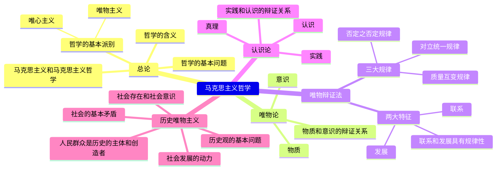

---
{"dg-publish":true,"dg-permalink":"civil-servant-exam/AAT/political-theory-2025","permalink":"/civil-servant-exam/AAT/political-theory-2025/","metatags":{"description":"","og:site_name":"DavonOs","og:title":"政治理论","og:type":"article","og:url":"https://zuji.eu.org/civil-servant-exam/AAT/political-theory-2025","og:image":null,"og:image:width":"200","og:image:alt":"articlecover","og:locale":"zh_cn"},"dgShowInlineTitle":true,"created":"2025-10-18 22:24","updated":"2025-10-19 08:34"}
---

行测的思维．政治理论／粉笔公考编著．--海口：海南出版社，2025.3.

I. D630.3

版次：2025年3月第1版

2025年，国考行测发生重大变化，即新增了“政治理论”模块，后续各省（市）考也纷纷跟进。经认真研析本年度国省（市）考试题，我们总结了新模块的考情，具体如下：

1. 新模块题量较大，平时要强化练习，提高做题速度

在国考中，政治理论作为单独的模块出现在试卷的第一部分，共考查了20道题。

在省（市）考中，四川、浙江、山东政治理论模块题量为10道，与常识判断平分秋色；天津虽然未单独设置政治理论模块，但其考查政治常识的题量为12道，所占比例接近常识判断总题量的一半；此外，据考生回忆，考查题量为10道、15道、20道的省份均有。

我们可以从题量上看到这一新增模块的重要性，并且通过观察试题，还可以发现该模块中半数以上的题目题干较长，这提示我们平时需要多加练习，熟悉相关话题，以提高做题速度。

2. 重要文件占比较高，要定期进行全面梳理

从具体考查内容上看，政治理论的考查大致可以分为重要文件、马哲与马政经、重要会议及讲话等方面。其中，最突出的是对重要文件的考查，如2024年党的二十届三中全会通过的《中共中央关于进一步全面深化改革、推进中国式现代化的决定》，在国考中一共有7道题涉及了这个文件，分别考查了构建支持全面创新体制机制、健全保障和改善民生制度体系、完善高水平对外开放体制机制、健全全过程人民民主制度体系、深化生态文明体制改革、构建高水平社会主义市场经济体制部分的内容；在省（市）考中，也基本上每个考试都至少考查了1道与之相关的题目。《中共中央办公厅 国务院办公厅关于完善市场准入制度的意见》《中共中央 国务院关于加快经济社会发展全面绿色转型的意见》等重要文件在考试中也均有出现。此外，国考还有1道题考查《中国共产党纪律处分条例》，该文件是2023年修订过的。

这提醒考生需要熟悉本年度中共中央、国务院发布的重要文件，并理解相关指示精神。

3. 新增对马哲、马政经等的考查，基础理论不可轻易放弃

马哲与马政经作为基础理论内容，在国考中共考查了3道题，涉及矛盾的普遍性、客观性、特殊性，商品的二因素和生产商品的劳动的二重性，真理尺度与价值尺度的辩证统一等知识点。山东、四川考查了马哲相关原理；此外，江苏、北京、上海、深圳、广东等地每年也必考这部分知识点，这一部分的重点内容有唯物论、辩证法，考查形式通常为给出一句重要讲话、古语或一个案例，要求结合理论分析其背后蕴含的哲理。

这部分内容考查难度适中，需要考生掌握好基础理论知识，通过练习提升自己的案例分析能力。

4. 重要会议及讲话、文章仍是政治理论的“宠儿”，冲刺背诵要有针对性

国考考查的重要会议及讲话包括金融事业高质量发展、粮食安全、高质量充分就业、党的自我革命、自主创新、宣传思想文化工作、正确政绩观、新时代推动西部大开发等，均为考试周期内的时政热点。

省（市）考则考查了《发展新质生产力是推动高质量发展的内在要求和重要着力点》《扎实推动共同富裕》《以人口高质量发展支撑中国式现代化》等重要文章，以及中央军委政治工作会议、文化传承发展座谈会、全国教育大会、新时代推动中部地区崛起座谈会、和平共处五项原则发表70周年纪念大会等重要会议。

这部分内容考查难度不大，多以考查原文为主，备考中要对重要论述心中有底。

5. 创新理论的考查与热点结合紧密

党的创新理论是新大纲中对政治理论考查范围的一个重要表述，通常指的是新时代中国特色社会主义思想，比如经济思想、生态文明思想、文化思想等。2025年对文化思想、党的自我革命重要思想、强军思想等均进行了考查，而前两个就是与时政

热点紧密关联的，也是最近一两年形成的习近平重要思想。

这提醒我们，党的创新理论要结合新的时政热点进行记忆。比如2024年召开了中央军委政治工作会议，那么强军思想就可能结合该会议进行考查；又比如习近平总书记在二十届中央纪委三次全会上发表重要讲话，深刻阐述了党的自我革命的重要思想，考试就对相关内容进行了考查。

6. 本省（市）时政不可忽视，增设新模块后，考试可能会增加对这部分的考查

在省（市）考中，四川、山东、天津、上海、深圳、北京、陕西、新疆、广东等地均会出现与本地时政相关的题目，涉及本地召开的会议、发布的文件等。

在平时的学习中，我们可以以全国时政为主，但在考前要对本省（市）时政进行梳理了解，确保复习无死角。

7. 综合性强，围绕一个话题，结合不同时期的热点，如重要讲话、文件、文章等进行考查

之前的政治常识试题，通常是围绕一个文件、讲话、文章、会议进行考查，但分析政治理论试题后我们可以发现，现在考试的难度有所上升，不会单纯地考查一个热点，而是围绕一个话题，结合不同的热点进行考查。

这提醒我们，在备考中务必展开联想，可采用话题串联的方式记忆不同时期的重要论述。

【总结寄语】

不论是国考还是省（市）考，政治理论均紧扣考纲，围绕“党的创新理论及党和国家方针政策”展开多方面的考查，突出公务员考试对考生政治素养的重视。根据2025年的考查情况，我们编写了本书，意在总结政治理论模块的高频考点，并辅以经典试题强化练习。同时，也建议考生重点关注考试周期内党建、经济、民生、科技、生态文明、军事等方面的重要讲话及政策，领会精神、融会贯通，争取在政治理论部分取得好成绩！

## 第一章 | 基础理论

### [[01 Project/关于公务员暨事业编备考的办法/行测的思维/政治理论/专题1 马克思主义哲学\|专题1 马克思主义哲学]]

### 专题2 马克思主义政治经济学

# 一、商品经济理论

（一）商品经济

商品经济不是从来就有的，而是在一定的历史条件下，作为自然经济的对立物而产生和发展起来的。商品经济是以交换为目的而进行生产的经济形式。商品经济产生的历史条件有两个：一是社会分工，二是生产资料和劳动产品属于不同的所有者。

其中，社会分工是商品经济产生的前提。

 > [!info]+ 知识链接

社会基本经济形态：

（1）自然经济即自给自足的经济，如农民饲养的自用牛羊。  
（2）商品经济即以交换为目的的经济，如王某用自家大米换了邻居家的肉。  
（3）产品经济即马克思设想的在商品经济消亡以后的未来社会的交换方式。社会成员取得自己需要的东西不是通过交换，而是通过社会中心机构集中的、统一的分配来取得，即按需分配。

（二）商品及其基本属性

# 1.商品的含义

商品是用来交换的能满足人们某种需要的劳动产品。

# 2.商品的基本属性

商品具有使用价值和价值两种属性。

（1）使用价值：能满足人们某种需要的物品的效用，即物品的有用性。这是商品本身就有、天生自带的属性，叫作自然属性。  
（2）价值：凝结在商品中的无差别的人类劳动。这是商品的社会属性，也是其特有属性。

（三）劳动二重性

商品是劳动产品，生产商品的劳动可以分为具体劳动和抽象劳动。

（1）具体劳动：各种形式的有用劳动，生产使用价值。  
（2）抽象劳动：无差别的人类劳动，形成价值实体。

具体劳动和抽象劳动不可分割，生产商品的劳动是具体劳动与抽象劳动的统一。

具体劳动与抽象劳动是同一劳动过程的两个方面，不是两次劳动，更不是两种劳动。

（四）商品价值量

商品的价值量是指商品价值的大小，通常指单位商品价值量。商品的价值量不是由各个商品生产者所耗费的个别劳动时间决定的，而是由社会必要劳动时间决定的。

生产商品所需要的社会必要劳动时间随着劳动生产率的变化而变化。若其他因素不变，单位商品的价值量与生产该商品的社会必要劳动时间成正比，与社会劳动生产率成反比。

 > [!info]+ 知识链接

社会必要劳动时间是指在现有社会正常的生产条件下，在社会平均的劳动熟练程度和劳动强度下，制造任何一个使用价值所需要的劳动时间。通俗理解就是，一个行业生产一种商品的平均时间。

（五）价值规律

# 1.基本内容

价值规律是商品经济的基本规律。它的基本内容是：商品的价值量由生产该商品的社会必要劳动时间决定；商品交换以价值量为基础实行等价交换。

# 2. 表现形式

价格围绕价值上下波动。

# 3. 作用

（1）价值规律自发地调节生产资料和劳动力在社会各生产部门之间按比例分配，即调节社会资源。  
（2）价值规律自发地刺激商品生产者改进技术，改善经营管理，进而促进社会生产力的发展。

(3) 价值规律会引起和促进商品生产者的两极分化, 造成优胜劣汰的结果。

（六）货币

# 1.货币的含义

货币是在长期交换过程中形成的固定地充当一般等价物的特殊商品。

# 2.货币的职能

<table><tr><td rowspan="2">价值尺度</td><td>价值尺度是指货币以自己为尺度来表现和衡量其他一切商品的价值</td></tr><tr><td>货币执行价值尺度职能，不需要现实的货币，只需要观念上的货币。常见形式为标价</td></tr><tr><td rowspan="2">流通手段</td><td>流通手段是指货币充当商品交换的媒介</td></tr><tr><td>货币充当流通手段，必须是现实的货币，且需要一手交钱一手交货</td></tr><tr><td rowspan="2">支付手段</td><td>支付手段是指在发生赊购赊销的情况下，货币用于清偿债务所执行的职能</td></tr><tr><td>货币作为支付手段，已被广泛运用于缴纳租金、税金和发放工资等方面</td></tr><tr><td rowspan="2">贮藏手段</td><td>贮藏手段是指货币退出流通领域，被人们当作社会财富的一般代表加以贮藏</td></tr><tr><td>货币作为贮藏手段，必须是足值的金属货币或金属条块</td></tr><tr><td rowspan="2">世界货币</td><td>世界货币是指货币在世界上作为一种购买手段、支付手段和社会财富的代表所发挥的作用</td></tr><tr><td>货币执行世界货币的职能是随着国与国之间的商品交换以及其他贸易活动的发展而发展起来的，它实际上是货币职能越出国界而在世界范围的延伸和应用</td></tr></table>

价值尺度和流通手段是货币的两种最基本职能，其他三种职能是在这两种基本职能的基础上派生和发展出来的。

# 二、剩余价值理论

（一）剩余价值

剩余价值是雇佣工人所创造的并被资本家无偿占有的超过劳动力价值的那部分价值。它是雇佣工人剩余劳动的凝结，体现了资本家与雇佣工人之间剥削与被剥削的关系。

（二）资本

资本在资本主义生产过程中以生产资料和劳动力两种形态存在。根据这两部分资本在剩余价值生产中所起的不同作用，可将资本分为不变资本和可变资本。

（1）不变资本，是指以生产资料形态存在的那部分资本，其价值在生产过程中一次或多次转移到新产品中去，不会发生增殖（不会带来剩余价值），因此叫作不变资本（c）。不变资本包括原材料、机器设备、厂房等。  
（2）可变资本，是指以劳动力价值形态存在的那部分资本，在生产过程中可以使价值增殖（可以带来剩余价值），因此叫作可变资本（v）。可变资本只有劳动力。

（三）剩余价值的生产方法

资本家剥削工人的具体方法是多种多样的，但概括起来主要有两种基本方法：绝对剩余价值生产和相对剩余价值生产。

(1) 绝对剩余价值是指在必要劳动时间不变的条件下，通过延长工作时间所获得的剩余价值。  
(2) 相对剩余价值是指在工作时间不变的条件下, 由于缩短必要劳动时间而相对延长剩余劳动时间所生产的剩余价值。相对剩余价值是各个资本家追逐超额剩余价值而实现的。

【备注】超额剩余价值是指单个资本家通过提高劳动生产率使商品的个别价值低于社会价值而比一般资本家多得的那部分价值。

（四）资本积累

# 1. 含义

资本积累就是剩余价值的资本化。把榨取的剩余价值作为资本再次投入生产，可以给资本家带来更多的剩余价值，简单理解就是“钱生钱”的过程。

# 2. 实质

资本积累的实质是资本家通过无偿占有工人劳动的一部分，来扩大无偿占有工人劳动的权力。

（五）经济危机

1.资本主义经济危机爆发的根本原因

资本主义经济危机爆发的根本原因在于资本主义固有的基本矛盾，即生产资料资本主义私人占有和生产社会化之间的矛盾。

2.资本主义经济危机的本质特征

资本主义经济危机的本质特征：生产相对过剩。

# 试题演练

（2025国考）关于马克思主义政治经济学，下列说法正确的是：

A. 商品的价值量是由生产该商品所需的个别劳动时间决定的  
B. 货币的价值尺度职能是通过实际的物质交换来实现的  
C. 具体劳动和抽象劳动是不同商品生产过程中的不同劳动  
D. 具体劳动创造商品的使用价值，抽象劳动形成商品的价值

【答案】D

【解析】A项错误：商品的价值量是指商品价值的大小，是由生产商品的社会必要劳动时间决定的。社会必要劳动时间是指在现有的社会正常的生产条件下，在社会平均的劳动熟练程度和劳动强度下制造某种使用价值所需要的劳动时间。  
B项错误：货币的价值尺度职能是指以自身价值作为尺度来衡量其他商品的价值。货币执行价值尺度职能，不需要现实的货币，只需要观念上的货币，不需要通过实际的物质交换来实现。  
C项错误：具体劳动和抽象劳动是生产商品的同一劳动过程的两个方面，而不是两种劳动或两次劳动。具体劳动说明的是劳动是什么样的，是怎样进行的；抽象劳动说明的是劳动的量的多少、劳动时间的长短。  
D项正确：具体劳动是指生产一定使用价值的具体形式的劳动，体现着人和自然的关系。抽象劳动是指撇开一切具体形式的、无差别的一般人类劳动，即人的体力和脑力的消耗。抽象劳动形成商品的价值。

故正确答案为  D 。

### 专题3 试题提升

1.（2025国考）习近平总书记指出，问题是事物矛盾的表现形式，我们强调增强问题意识、坚持问题导向，就是承认矛盾的普遍性、客观性，就是要善于把认识和化解矛盾作为打开工作局面的突破口。关于矛盾的普遍性、客观性，下列说法正确的是：

A. 矛盾的普遍性是有条件的，并根据条件的变化而变化  
B. 矛盾的客观性从属于主观性，不能脱离人的认知、情感、意志而存在  
C. 矛盾的普遍性是矛盾的共性，矛盾的特殊性是矛盾的个性  
D. 矛盾的普遍性、客观性决定了事物的不同性质，是认清事物本质和发展规律的基础

【答案】C

【解析】A项错误：矛盾的普遍性是指矛盾存在于一切事物中，存在于一切事物发展过程的始终，旧的矛盾解决了，新的矛盾又产生，事物始终在矛盾中运动。矛盾的普遍性即矛盾的共性，矛盾的共性是无条件的、绝对的。故“矛盾的普遍性是有条件的”说法错误。  
B项错误：矛盾具有普遍性和客观性，是不以人的意志为转移的。“矛盾的客观性从属于主观性，不能脱离人的认知、情感、意志而存在”的观点认为主观决定客观，属于唯心主义的范畴。故该项说法错误。  
C项正确：矛盾的普遍性和特殊性是辩证统一的关系。矛盾的普遍性是矛盾的共性，矛盾的特殊性是矛盾的个性。矛盾的共性是无条件的、绝对的，矛盾的个性是有条件的、相对的。  
D项错误：矛盾的特殊性是指具体事物包含的矛盾以及每一矛盾的各个方面都有其特点。矛盾的特殊性决定了事物的不同性质，如实地分析矛盾的特殊性是认清事物本质和发展规律的基础。故该项说法错误。

故正确答案为C。

2.（2024湖北选调）习近平总书记指出，新时代中国特色社会主义思想内容涵盖改革发展稳定、内政外交国防、治党治国治军等方方面面，构成一个完整的科学体系。党的二十大报告明确指出，“十个明确”“十四个坚持”“十三个方面成就”概括了这

一思想的主要内容。我们既要全面系统地学习掌握这些主要内容，又要整体把握这一思想的科学体系，做到融会贯通。对各领域提出的新理念、新思想、新战略，对各方面工作提出的具体要求，都要放在整个科学体系中来认识和把握，避免碎片化、片面性，不能只见树木、不见森林。就哲学方法论而言，以上论述要求我们运用 _______，学习贯彻习近平新时代中国特色社会主义思想。

A. 历史唯物主义这一伟大认识工具  
B. 既见树木又见森林的融会贯通法  
C. 联系、发展、全面和系统的方法  
D. 理论联系实际的马克思主义学风

【答案】C

【解析】A项错误：历史唯物主义是马克思主义哲学中关于人类社会发展一般规律的理论，是科学的社会历史观和认识、改造社会的科学方法论。与题意无关。  
B项错误：“既见树木又见森林”指既要看到局部的事物，又要看到整体的情况。这只是题干表述内容的其中一个方面，且其表述方式不符合“哲学原理”的要求。  
C项正确：联系、发展、全面和系统的方法符合马克思主义哲学中辩证法的要求，强调要用联系、发展的观点看问题，并需要获得对事物全面、透彻的理解。习近平新时代中国特色社会主义思想是一个完整的科学体系，涵盖诸多方面，要全面系统地学习其主要内容，整体把握这一科学体系，避免碎片化、片面性，就是运用联系、发展、全面和系统的方法。  
D项错误：理论联系实际的马克思主义学风，是马克思主义“活的灵魂”，是中国共产党的三大优良作风之一，是我们党在长期革命和建设实践中确立的思想路线。与题意无关。

故正确答案为  $\mathbf{C}$  。

3.（2024 湖北选调）在一篇序言中，习近平总书记曾写道：“几年下来，我几乎跑遍了浙江的山山水水，也跑深了与浙江广大干部群众的真切感情，并在实践中逐渐跑透了浙江的省情市情县情。”上述字里行间蕴含的哲理是：

A. 实践是认识的来源  
B. 实践是认识的目的

C. 实践具有直接现实性  
D. 实践是检验真理的唯一标准

【答案】A

【解析】A项正确：习近平总书记对浙江省情市情县情的熟悉是从“几乎跑遍了浙江的山山水水”中得到的，这来自他的直接经验，体现了实践是认识的来源。

B项错误：实践是认识的目的体现了人们认识世界的目的在于改造世界。人们通过实践，达到对客观世界的正确认识，然后用这种认识指导实践，实现对客观世界的改造，以满足人们的需要。与题意无关。  
C项错误：实践的直接现实性是指实践是改造世界的客观物质活动，实践能够引起客观世界的某种变化，可以把人脑中观念的存在变成现实的存在，给人们提供现实的成果。与题意无关。  
D项错误：人们从实践中获得的对客观世界的认识，是否与客观对象相符合、相一致，是否正确地反映了客观事物的本质及其规律，必须通过实践的检验才能得到证明。唯有实践才是检验认识真理性的标准。与题意无关。

故正确答案为A。

4.（2024吉林）习近平经济思想彰显了马克思主义哲学的坚定立场和科学方法，下列经济思想与其彰显的马克思主义哲学对应正确的有几项？

(1)努力构建新发展格局——内因与外因关系  
②推动经济高质量发展——量变和质变关系  
③坚持以人民为中心的发展思想——人民历史主体地位  
(4)处理好政府和市场关系——主要矛盾和次要矛盾关系  
(5)坚持系统观念解决发展不平衡不充分问题——事物普遍联系

A. 4 项

B. 5 项

C. 2 项

D. 3 项

【答案】B

【解析】①正确：构建新发展格局是指构建以国内大循环为主体、国内国际双循环相互促进的新发展格局。马克思主义哲学强调，事物的发展是内外因共同作用的结果。内因是事物发展变化的根据，是第一位的原因；外因是事物发展变化的条件，是

第二位的原因；外因通过内因而起作用。构建新发展格局中，国内大循环为内因，国际循环为外因，“以国内大循环为主体、国内国际双循环相互促进”体现了内因和外因关系的原理。

②正确：经济高质量发展即经济发展，经济发展是指量的增长和质的提升，是量和质的有机统一。“质”通常是指经济发展的结构、效益，“量”通常是指经济发展的规模、速度。质的提升为量的增长提供持续动力，量的增长为质的提升提供重要基础，二者相辅相成。马克思主义哲学强调，量变是质变的必要准备，质变是量变的必然结果，量变达到一定程度必然引起质变。故“推动经济高质量发展”体现了质变和量变关系的原理。

③正确：以人民为中心的发展思想是中国共产党总结几千年历史兴衰成败得出的重要结论，是对中国共产党“全心全意为人民服务”这一根本宗旨的坚持和深化，是党长期治国理政的伟大实践在理念上的凝练和升华。马克思主义哲学强调，人民群众是社会历史的主体，是历史的创造者。在社会历史发展过程中，人民群众起着决定性的作用。人民群众是社会物质财富的创造者，是社会精神财富的创造者，是社会变革的决定力量。

④正确：正确处理政府和市场的关系，就要充分发挥市场在资源配置中的决定性作用，更好发挥政府作用。马克思主义哲学强调，主要矛盾在事物发展过程中处于支配地位，对事物发展起决定作用，次要矛盾在事物发展过程中处于从属地位，对事物发展不起决定作用。主要矛盾和次要矛盾是相互联系、相互依赖、相互影响的，并在一定条件下可以相互转化。这要求我们要坚持两点论和重点论相统一的方法。故“处理好政府和市场的关系”体现了主要矛盾和次要矛盾关系的原理。

⑤正确：系统是由相互联系、相互作用的若干要素所组成的有机整体，系统的性质和功能不是各要素的简单相加，整体功能大于部分功能之和。坚持系统观念解决发展不平衡不充分问题是指既能解决发展面临的主要矛盾和矛盾的主要方面，又能兼顾发展的方方面面，统筹兼顾发展质量与发展效益、发展成本与发展收益分配，凝聚各级政府、各类企业、各种社会力量共同参与。马克思主义哲学强调，事物是普遍联系的，任何事物都不能孤立地存在，都同其他事物发生着联系。这要求我们用联系的观点看问题，要正确认识和处理整体和部分的辩证关系，掌握系统优化的方法。故“坚持系统观念解决发展不平衡不充分问题”体现了事物普遍联系的原理。

综上，①②③④⑤表述正确，共5项。

故正确答案为B。

5.（2024辽宁）马克思主义和中华优秀传统文化之所以能够有机结合，是因为彼此存在高度的契合性。下列马克思主义观点与中华优秀传统文化理念相契合的有几项？

(1)要通过批判旧世界发现新世界——兴天下之利，除天下之害  
②共产党人可以把自己的理论概括为一句话：消灭私有制——大道之行也，天下为公  
③哲学家们只是用不同的方式解释世界，问题在于改变世界——祸兮，福之所倚；福兮，祸之所伏  
④只有在社会中，自然界才是人自己的人的存在的基础——天地与我并生，而万物与我为一

A. 1 项

B. 2 项

C. 3 项

D. 4 项

【答案】A

【解析】①错误：“兴天下之利，除天下之害”出自《墨子》，意思是应当努力去做对天下人都有利的事情，消除对天下人都有害的事情。这句话主要体现了马克思主义观点中的人民性。“要通过批判旧世界发现新世界”强调了批判的重要性。故两者不相契合。

②正确：“大道之行也，天下为公”出自《礼记·礼运》，意思是当大道行于天下的时候，天下就是人们所共有的。这句话主要体现了马克思主义观点中的消灭私有制，实现公有制。“共产党人可以把自己的理论概括为一句话：消灭私有制”强调了消灭私有制的重要性。故两者相契合。  
③错误：“祸兮，福之所倚；福兮，祸之所伏”出自《道德经》，意思是福与祸相互依存，相互转化。这句话主要体现了马克思主义观点中的矛盾双方在一定条件下相互转化。“哲学家们只是用不同的方式解释世界，问题在于改变世界”强调了实践的重要性。故两者不相契合。  
④错误：“天地与我并生，而万物与我为一”出自《庄子·齐物论》，意思是天地与我同生，万物与我是一个整体。这句话主要强调了人与自然是生命共同体。“只有在社会中，自然界才是人自己的人的存在的基础”强调了人的社会属性。故两者不相契合。

综上可知，只有②相契合。

故正确答案为A。

6.（2024深圳）我国民间俗语说：“宅中现四喜，家中出贵人。”“四喜”即堂前飞燕、喜鹊来朝、枯木逢春、壁虎进宅。这种说法的盲目性在于否定了联系的：

A. 客观性

B.普遍性

C. 多样性

D. 系统性

【答案】A

【解析】A项正确：联系的客观性是指联系是事物本身所固有的，不以人的意志为转移。将堂前飞燕、喜鹊来朝、枯木逢春和壁虎进宅等现象当作贵人出现的象征是一种主观臆造，否定了联系的客观性。

B项错误：联系的普遍性是指事物或现象之间以及事物内部诸要素之间相互依赖、相互影响、相互作用、相互转化等相互关系。题干未体现。  
C项错误：联系的多样性是指世界上的事物是多种多样的，事物之间的联系也是多种多样的。题干未体现。  
D项错误：联系的系统性是指事物的相互作用形成系统，系统是普遍联系中的系统，是联系的一种存在形态。题干未体现。

故正确答案为A。

7.（2024山东）智能导航系统、AI机器人、数字火炬手……“智能”融入第19届杭州亚运会的方方面面，彰显出本届亚运异彩纷呈的独特魅力。这表明：

A. 人工智能是人的意识能动性的一种特殊表现  
B. 人工智能向人类思维的逼近只是模仿性趋近  
C. 科技进步催生了人工智能的自我意识  
D. 人工智能取代或超越人类智能将在曲折中实现

【答案】A

【解析】A项正确：意识能动性指人的意识可以能动地反映物质又通过实践反作用于物质的特性。人工智能是人的意识能动性的一种特殊表现，是人的本质力量的对象化、现实化。人工智能的出现表明，人类意识已经发展到能够把意识活动部分地从人脑中分离出来，物化为机器的物理运动从而延伸意识器官功能的新阶段。  
B项错误：人类的自然语言是思维的物质外壳和意识的现实形式，而人工智能难以完全具备理解自然语言真实意义的能力，因此，人工智能向人类思维的逼近只是模仿性趋近。题干并未表明这一点。

C项错误：意识是人脑对大脑内外表象的觉察，是人类所独有的。人工智能只是对人类的理性智能的模拟和扩展，不具备情感、信念、意志等人类意识形态，因此人工智能不会产生自我意识。  
D项错误：人工智能在某些特定领域超越人类智能，或者说在某些程度上比人类更有能力，比如下棋、做决策等，已经成为现实。但是事实证明，人类的潜能会由于工具的发展而不断地被开发出来，人类因为有了智能机器将会变得越来越聪明。题干并未表明人工智能能否取代或超越人类智能。

故正确答案为A。

8.（2023深圳）唐诗《小松》有云：“自小刺头深草里，而今渐觉出蓬蒿。时人不识凌云木，直待凌云始道高。”下列选项中蕴含的哲理与此诗相似的是：

A. 静者静动，非不动也  
B. 寄言持重者，微物莫全轻  
C. 天下之难持者莫如心，天下之易染者莫如欲  
D. 多见者博, 多闻者知, 距谏者塞, 专己者孤

【答案】B

【解析】《小松》这首诗的意思是长满松针的小松树长在深草丛中看不出来，现在才发现它已经长得比蓬蒿高出许多；世上的人不认识这是将来可以高入云霄的树木，一直等到它已经高入云霄了才承认它的伟岸。量变是事物数量的增减或场所的变更，质变是事物根本性质的变化，量变是质变的必要准备，质变是量变的必然结果。此诗体现的哲学原理是质量互变规律。

A项错误：“静者静动，非不动也”的意思是静止的事物在安静地运动，而不是不运动。静止是运动的一种特殊状态，是相对的。该句体现的哲学原理是绝对运动与相对静止，与题干中的哲学原理不符。  
B项正确：“寄言持重者，微物莫全轻”的意思是告诫把持重物者，微小的东西不要全都轻视。该句体现的哲学原理是量变达到一定程度会引起质变，与题干中的哲学原理相符。  
C项错误：“天下之难持者莫如心，天下之易染者莫如欲”的意思是天下最难以把持的是人的内心，而天下最容易受到污染的是人的欲望。马克思辩证唯物主义认为，意识对物质具有能动的反作用，正确的意识可以促进事物的发展，错误的意识会阻碍

事物的发展。因此，“天下之难持者莫如心，天下之易染者莫如欲”中的“心”“欲”都体现了意识对物质具有能动的反作用，与题干中的哲学原理不符。

D项错误：“多见者博，多闻者知，距谏者塞，专己者孤”的意思是见得多的人学识广博，听得多的人头脑智慧，拒绝接受别人意见的人视听闭塞，独断专行的人会被孤立。这句话体现的哲学原理包括实践是认识的来源以及外因的重要作用，与题干中的哲学原理不符。

故正确答案为  $\mathbf{B}$  。

9.（2023辽宁）习近平总书记指出：“我们要实现14亿人共同富裕，必须脚踏实地、久久为功，不是所有人都同时富裕，也不是所有地区同时达到一个富裕水准，不同人群不仅实现富裕的程度有高有低，时间上也会有先有后，不同地区富裕程度还会存在一定差异，不可能齐头并进。这是一个在动态中向前发展的过程，要持续推动，不断取得成效。”下列选项与这一论断蕴含的哲理相同的是：

A. 骐骥一跃, 不能十步; 弩马十驾, 功在不舍  
B. 将欲弱之, 必固强之; 将欲废之, 必固举之  
C.《阳春》之曲，和者必寡；盛名之下，其实难副  
D. 苟利于民，不必法古；苟周于事，不必循旧

【答案】A

【解析】A项正确：“骐骥一跃，不能十步；弩马十驾，功在不舍”出自荀子的《劝学》，意思是骏马一跃，也不足十步远；劣马跑十天，也能跑很远。该句强调量变达到一定程度会引起质变，与题干强调的坚持才能不断取得成效的观点相符。  
B项错误：“将欲弱之，必固强之；将欲废之，必固举之”出自老子的《道德经》，意思是想要削弱它，必先加强它；想要废止它，必先抬举它。该句强调了矛盾的观点，而题干未体现矛盾，与题意不符。  
C项错误：“《阳春》之曲，和者必寡；盛名之下，其实难副”出自《后汉书·左周黄列传》，意思是高雅的乐曲，能和唱的人一定很少；名望很大的人，实际的才德常常很难跟名声相符。与题意不符。  
D项错误：“苟利于民，不必法古；苟周于事，不必循旧”出自《淮南子·氾论训》，意思是只要有利于百姓，不必遵循古制；只要适合实际情况，不必依循旧章。与题意不符。

故正确答案为A。

10.（2023 湖北选调）某影像杂志社编辑在广大革命老区从事摄影创作多年。他说，老区人民在脱贫攻坚奔小康的伟大实践中所展现出的艰苦奋斗、开拓进取、奋发向上的精神风貌，时时刻刻感动和吸引着我，给我提供了不竭的工作动力、喷涌的艺术灵感和丰沛的创作资源。以上事例体现的马克思主义哲学道理是：

①实践出真知  
②生有涯知无涯  
③实践是认识的来源  
④认识服务实践、指导实践

A. ①③

B. ①④

C. ①②③

D. ②③④

【答案】A

【解析】①正确：“实践出真知”的意思是任何事情只有通过亲自尝试，才能真正地认识、理解、掌握。老区人民通过伟大的实践，才对脱贫攻坚有了更深刻的认识和理解，展现出了艰苦奋斗、开拓进取、奋发向上的精神风貌。

②错误：“生有涯知无涯”的意思是生命是有限的，而知识无穷，应加倍努力学习。这句话体现的哲学道理是认识的无限性，题干没有体现。  
③正确：实践是认识的来源，不论是亲身参与实践活动而获得的直接经验，还是通过知识的学习和传递而获得的间接经验，都是实践的产物。老区人民通过直接经验获得认识，影像杂志社编辑则通过老区人民的亲身经历获得了认识，即间接经验。  
④错误：实践是认识的目的，认识活动的目的并不在于认识活动本身，而在于更好地改造客体，更有效地指导和服务实践。老区人民的精神给影像杂志社编辑提供了不竭的工作动力、喷涌的艺术灵感和丰沛的创作资源，而工作动力、艺术灵感和创作资源都属于认识，没有体现认识服务实践、指导实践。

故正确答案为A。

11.（2024 石家庄事业单位）马克思、恩格斯认为，经济危机是资本主义经济发展的必然产物，经济危机的爆发表明，生产资料的集中和劳动的社会化，达到了同它们的资本主义外壳不能容忍的地步，这个外壳就要炸裂了。这深刻揭示了经济危机爆发的根源是：

A.资本主义的基本矛盾

B.资本主义市场的局限

C.资本主义的生产方式

D. 物质资料生产的短缺

【答案】A

【解析】资本主义经济危机爆发的根源是资本主义社会的基本矛盾，即生产的社会化和生产资料资本主义私人占有之间的矛盾。这一矛盾有两个表现：一是个别企业内部生产的有组织性和整个社会生产的无政府状态之间的矛盾，二是资本主义生产无限扩大的趋势同劳动人民有支付能力的需求相对缩小之间的矛盾。它们的激化导致资本主义经济危机的爆发。

故正确答案为A。

12.（2023茂名事业单位）2023年2月，张某工资收入4000元，购买了标价2000元的电动车，支付了1000元的房租。据此，未体现的货币职能是：

A. 支付手段

B. 贮藏手段

C. 价值尺度

D. 流通手段

【答案】B

【解析】货币职能是指货币在人们的经济生活中所起的作用，主要包括价值尺度、流通手段、贮藏手段、支付手段和世界货币五种职能。

A项正确：支付手段是指货币用于清偿债务、缴纳租金或赋税、支付工资或利息等的职能，此时钱货分离，先交钱，后服务，或先服务，后交钱，比如工资、租金、定金等。所以，张某工资收入4000元，房租1000元，体现了货币的支付手段职能。  
B项错误：贮藏手段是指货币退出流通领域，作为财富被保存起来。题干未体现货币的贮藏手段职能。  
C项正确：价值尺度是指货币可以用自身的价值去衡量其他商品的价值。题干中，电动车标价2000元，体现了货币的价值尺度职能。  
D项正确：流通手段是指货币充当商品交换的媒介，即一手交钱一手交货，同时进行。题干中，张某购买了标价2000元的电动车，一手交钱一手交货，钱货交换同时发生，体现了货币的流通手段职能。

本题为选非题，故正确答案为B。

13.（2023 张家界事业单位）中秋节期间，于某一家想去外省玩。于某主张坐飞机去，他认为虽然机票价格贵，但是省时间。于某的妻子则主张坐高铁去，她认为虽然坐高铁会慢一些，但比机票便宜，划算一些。上述材料说明：

A. 人们选择商品关注的是使用价值与价值的统一  
B. 人们选择商品关注的是其实用性  
C. 价格是人们选择商品与否的决定性因素  
D. 使用价值的高低是商品价格的决定性因素

【答案】A

【解析】A项正确：商品是使用价值和价值的统一体，人们购买商品的过程中，最终目的是获取商品的使用价值，即题干中提到的到达目的地。但是，人们同样也会衡量该商品的价格（价格是价值的货币表现形式），即题干中提到的坐飞机和坐高铁之间，人们愿意选择相对便宜的。故本题体现的是人们在购买商品的过程中，关注的是商品的使用价值和价值的统一。  
B项错误：商品的使用价值是指商品能够满足人们需要的物品的有用性，题干中虽然体现了关注商品的实际用途即实用性，但也提到了坐飞机和坐高铁之间，人们倾向于选择价格低的那个。故该项说法过于片面，人们在选择商品的过程中，除了关注实用性之外，也会关注价格。  
C项错误：人们选择商品的因素是多样的，如消费者自身经济状况、年龄、性别，商品的价格以及社会相关群体的影响等。故影响消费者选择商品的因素并不是单一的价格可以决定的。  
D项错误：商品的价格是由价值决定的，并受供求关系的影响，不是由使用价值的高低决定的。

故正确答案为A。

14.（2017山东选调）马克思把商品转换成货币称为“商品的惊险的跳跃”，这个跳跃如果不成功，摔坏的不是商品，但一定是商品的占有者。这是因为只有商品变为货币：

A. 货币才能转化为资本  
B. 价值才能转化为使用价值

C. 抽象劳动才能转化为具体劳动  
D. 私人劳动才能转化为社会劳动

【答案】D

【解析】A项错误：劳动力成为商品是货币转化为资本的前提条件，此选项与本题无关。

B项错误：选项本身说法错误。商品的使用价值与价值共处于商品的统一体中，互相依赖、不可分割。价值是体现在商品里的社会必要劳动，使用价值是价值的物质承担者。当商品变为货币，也就是商品交换成功时，使用价值可以转化成价值，但是价值不可转化为使用价值。  
C项错误：选项本身说法错误。具体劳动反映的是人与自然的关系，抽象劳动反映的是社会生产关系。商品变为货币也就是商品交换成功时，具体劳动才能转化为抽象劳动，但是抽象劳动不能转化为具体劳动。  
D项正确：任何商品在没有通过货币交易前，都属于私人物品，或为私人劳动成果，通过货币交易，私有物品变成了社会共享的商品。通过这种转变，所有私人劳动就变成了社会劳动。

故正确答案为  $\mathbf{D}$  。

15.（2024 石家庄事业单位）在我国，以前价格昂贵的高档商品只有少数家庭才能消费得起，如今许多高档商品的价格不断下降，变成了大众消费品。造成这种价格变化的根本原因是：

A.居民的收入不断增加  
B. 社会劳动生产率提高  
C. 人民币发行不断增加  
D.商品的供给小于需求

【答案】B

【解析】A项错误：一般来说，居民的收入增加会引起需求量的增加。但题干强调高档商品价格下降的原因，这并非由收入增加导致。

B项正确：商品价值决定价格，价格围绕价值上下波动。价值量的大小取决于生产这一商品所需的社会必要劳动时间的多少。因此，形成价格下跌这一趋势的根本原因是社会必要劳动时间减少，社会劳动生产率提高，商品价值下降。

C项错误：价格受纸币发行量的制约。当纸币发行量与实际所需要的货币量不相

符时，会引起通货膨胀或紧缩，导致商品价格波动。人民币发行不断增加，容易造成通货膨胀，会导致货币贬值、物价上涨。

D项错误：当市场上某种商品供不应求时，价格上涨；供过于求时，价格下降。供求关系影响价格，但并非价格变化的根本原因。

故正确答案为B。

## 第二章 | 创新理论与政策

### 专题1 新时代中国特色社会主义思想总论

# 一、概述

党的十八大以来，以习近平同志为主要代表的中国共产党人，坚持把马克思主义

基本原理同中国具体实际相结合、同中华优秀传统文化相结合，坚持毛泽东思想、邓小平理论、“三个代表”重要思想、科学发展观，深刻总结并充分运用党成立以来的历史经验，从新的实际出发，创立了习近平新时代中国特色社会主义思想。

习近平新时代中国特色社会主义思想是当代中国马克思主义、二十一世纪马克思主义，是中华文化和中国精神的时代精华，实现了马克思主义中国化新的飞跃。习近平同志是习近平新时代中国特色社会主义思想的主要创立者。

 > [!info]+ 知识链接

党的十九届六中全会审议通过的《中共中央关于党的百年奋斗重大成就和历史经验的决议》阐明实现了马克思主义中国化的三大飞跃，即毛泽东思想是马克思主义中国化的第一次历史性飞跃，中国特色社会主义理论体系实现了马克思主义中国化新的飞跃，习近平新时代中国特色社会主义思想是当代中国马克思主义、二十一世纪马克思主义，是中华文化和中国精神的时代精华，实现了马克思主义中国化新的飞跃。

# 二、形成与发展

<table><tr><td>时间</td><td>事件</td></tr><tr><td>2017年10月18日</td><td>在中国共产党第十九次全国代表大会上，习近平总书记首次提出“新时代中国特色社会主义思想”</td></tr><tr><td>2017年10月24日</td><td>中国共产党第十九次全国代表大会通过了关于《中国共产党章程(修正案)》的决议，习近平新时代中国特色社会主义思想写入党章</td></tr><tr><td>2021年11月11日</td><td>党的十九届六中全会通过的《中共中央关于党的百年奋斗重大成就和历史经验的决议》，在党的十九大报告“八个明确”的基础上，用“十个明确”对习近平新时代中国特色社会主义思想的核心内容作了进一步系统概括，并从十三个方面分领域总结成就、概括原创性理念和思想，提出“两个确立”重要论断：确立习近平同志党中央的核心、全党的核心地位，确立习近平新时代中国特色社会主义思想的指导地位</td></tr></table>

续表  

<table><tr><td>时间</td><td>事件</td></tr><tr><td>2022年10月22日</td><td>中国共产党第二十次全国代表大会提出“六个必须坚持”，概括阐述了习近平新时代中国特色社会主义思想的世界观、方法论和贯穿其中的立场观点方法。会议审议通过的《中国共产党章程（修正案）》，把党的十九大以来习近平新时代中国特色社会主义思想新发展写入党章</td></tr></table>

# 三、核心内容

（一）“十个明确”

（1）明确中国特色社会主义最本质的特征是中国共产党领导，中国特色社会主义制度的最大优势是中国共产党领导，中国共产党是最高政治领导力量，全党必须增强“四个意识”、坚定“四个自信”、做到“两个维护”。

 > [!info]+ 知识链接

(1) “四个意识”: 即政治意识、大局意识、核心意识、看齐意识。它是习近平总书记在 2016 年 1 月召开的中共中央政治局会议上正式提出的。  
(2) “四个自信”: 即中国特色社会主义道路自信、理论自信、制度自信、文化自信。它是习近平总书记在庆祝中国共产党成立 95 周年大会上提出的。  
（3）“两个维护”：即坚决维护习近平总书记党中央的核心、全党的核心地位，坚决维护以习近平同志为核心的党中央权威和集中统一领导。带头做到“两个维护”，是加强中央和国家机关党的建设的首要任务。

（2）明确坚持和发展中国特色社会主义，总任务是实现社会主义现代化和中华民族伟大复兴，在全面建成小康社会的基础上，分两步走在本世纪中叶建成富强民主文明和谐美丽的社会主义现代化强国，以中国式现代化推进中华民族伟大复兴。  
（3）明确新时代我国社会主要矛盾是人民日益增长的美好生活需要和不平衡不充分的发展之间的矛盾，必须坚持以人民为中心的发展思想，发展全过程人民民主，推动人的全面发展、全体人民共同富裕取得更为明显的实质性进展。  
(4) 明确中国特色社会主义事业总体布局是经济建设、政治建设、文化建设、社

会建设、生态文明建设五位一体，战略布局是全面建设社会主义现代化国家、全面深化改革、全面依法治国、全面从严治党四个全面。

（5）明确全面深化改革总目标是完善和发展中国特色社会主义制度、推进国家治理体系和治理能力现代化。  
(6) 明确全面推进依法治国总目标是建设中国特色社会主义法治体系、建设社会主义法治国家。  
（7）明确必须坚持和完善社会主义基本经济制度，使市场在资源配置中起决定性作用，更好发挥政府作用，把握新发展阶段，贯彻创新、协调、绿色、开放、共享的新发展理念，加快构建以国内大循环为主体、国内国际双循环相互促进的新发展格局，推动高质量发展，统筹发展和安全。  
（8）明确党在新时代的强军目标是建设一支听党指挥、能打胜仗、作风优良的人民军队，把人民军队建设成为世界一流军队。  
（9）明确中国特色大国外交要服务民族复兴、促进人类进步，推动建设新型国际关系，推动构建人类命运共同体。  
(10) 明确全面从严治党的战略方针, 提出新时代党的建设总要求, 全面推进党的政治建设、思想建设、组织建设、作风建设、纪律建设, 把制度建设贯穿其中, 深入推进反腐败斗争, 落实管党治党政治责任, 以伟大自我革命引领伟大社会革命。

 > [!info]+ 知识链接

从“八个明确”到“十个明确”，新增的两条是：

（1）明确必须坚持和完善社会主义基本经济制度，使市场在资源配置中起决定性作用，更好发挥政府作用，把握新发展阶段，贯彻创新、协调、绿色、开放、共享的新发展理念，加快构建以国内大循环为主体、国内国际双循环相互促进的新发展格局，推动高质量发展，统筹发展和安全；  
（2）明确全面从严治党的战略方针，提出新时代党的建设总要求，全面推进党的政治建设、思想建设、组织建设、作风建设、纪律建设，把制度建设贯穿其中，深入推进反腐败斗争，落实管党治党政治责任，以伟大自我革命引领伟大社会革命。

（二）“十四个坚持”

# 1.坚持党对一切工作的领导

党政军民学，东西南北中，党是领导一切的。必须增强政治意识、大局意识、核心意识、看齐意识，自觉维护党中央权威和集中统一领导，自觉在思想上政治上行动上同党中央保持高度一致，完善坚持党的领导的体制机制，坚持稳中求进工作总基调，统筹推进“五位一体”总体布局，协调推进“四个全面”战略布局，提高党把方向、谋大局、定政策、促改革的能力和定力，确保党始终总揽全局、协调各方。

# 2. 坚持以人民为中心

人民是历史的创造者，是决定党和国家前途命运的根本力量。必须坚持人民主体地位，坚持立党为公、执政为民，践行全心全意为人民服务的根本宗旨，把党的群众路线贯彻到治国理政全部活动之中，把人民对美好生活的向往作为奋斗目标，依靠人民创造历史伟业。

# 3. 坚持全面深化改革

只有社会主义才能救中国，只有改革开放才能发展中国、发展社会主义、发展马克思主义。必须坚持和完善中国特色社会主义制度，不断推进国家治理体系和治理能力现代化，坚决破除一切不合时宜的思想观念和体制机制弊端，突破利益固化的藩篱，吸收人类文明有益成果，构建系统完备、科学规范、运行有效的制度体系，充分发挥我国社会主义制度优越性。

# 4. 坚持新发展理念

发展是解决我国一切问题的基础和关键，发展必须是科学发展，必须坚定不移贯彻创新、协调、绿色、开放、共享的发展理念。必须坚持和完善我国社会主义基本经济制度和分配制度，毫不动摇巩固和发展公有制经济，毫不动摇鼓励、支持、引导非公有制经济发展，使市场在资源配置中起决定性作用，更好发挥政府作用，推动新型工业化、信息化、城镇化、农业现代化同步发展，主动参与和推动经济全球化进程，发展更高层次的开放型经济，不断壮大我国经济实力和综合国力。

# 5. 坚持人民当家作主

坚持党的领导、人民当家作主、依法治国有机统一是社会主义政治发展的必然要求。必须坚持中国特色社会主义政治发展道路，坚持和完善人民代表大会制度、中国共产党领导的多党合作和政治协商制度、民族区域自治制度、基层群众自治制度，巩

固和发展最广泛的爱国统一战线，发展社会主义协商民主，健全民主制度，丰富民主形式，拓宽民主渠道，保证人民当家作主落实到国家政治生活和社会生活之中。

# 6. 坚持全面依法治国

全面依法治国是中国特色社会主义的本质要求和重要保障。必须把党的领导贯彻落实到依法治国全过程和各方面，坚定不移走中国特色社会主义法治道路，完善以宪法为核心的中国特色社会主义法律体系，建设中国特色社会主义法治体系，建设社会主义法治国家，发展中国特色社会主义法治理论，坚持依法治国、依法执政、依法行政共同推进，坚持法治国家、法治政府、法治社会一体建设，坚持依法治国和以德治国相结合，依法治国和依规治党有机统一，深化司法体制改革，提高全民族法治素养和道德素质。

# 7. 坚持社会主义核心价值体系

文化自信是一个国家、一个民族发展中更基本、更深沉、更持久的力量。必须坚持马克思主义，牢固树立共产主义远大理想和中国特色社会主义共同理想，培育和践行社会主义核心价值观，不断增强意识形态领域主导权和话语权，推动中华优秀传统文化创造性转化、创新性发展，继承革命文化，发展社会主义先进文化，不忘本来、吸收外来、面向未来，更好构筑中国精神、中国价值、中国力量，为人民提供精神指引。

 > [!info]+ 知识链接

建设社会主义核心价值体系是构建社会主义和谐社会的重要条件，分为：

国家层面的价值目标：富强、民主、文明、和谐。

社会层面的价值取向：自由、平等、公正、法治。

个人层面的价值准则：爱国、敬业、诚信、友善。

# 8. 坚持在发展中保障和改善民生

增进民生福祉是发展的根本目的。必须多谋民生之利、多解民生之忧，在发展中补齐民生短板、促进社会公平正义，在幼有所育、学有所教、劳有所得、病有所医、老有所养、住有所居、弱有所扶上不断取得新进展，深入开展脱贫攻坚，保证全体人民在共建共享发展中有更多获得感，不断促进人的全面发展、全体人民共同富裕。建

设平安中国，加强和创新社会治理，维护社会和谐稳定，确保国家长治久安、人民安居乐业。

# 9. 坚持人与自然和谐共生

建设生态文明是中华民族永续发展的千年大计。必须树立和践行绿水青山就是金山银山的理念，坚持节约资源和保护环境的基本国策，像对待生命一样对待生态环境，统筹山水林田湖草系统治理，实行最严格的生态环境保护制度，形成绿色发展方式和生活方式，坚定走生产发展、生活富裕、生态良好的文明发展道路，建设美丽中国，为人民创造良好生产生活环境，为全球生态安全作出贡献。

# 10. 坚持总体国家安全观

统筹发展和安全，增强忧患意识，做到居安思危，是我们党治国理政的一个重大原则。必须坚持国家利益至上，以人民安全为宗旨，以政治安全为根本，统筹外部安全和内部安全、国土安全和国民安全、传统安全和非传统安全、自身安全和共同安全，完善国家安全制度体系，加强国家安全能力建设，坚决维护国家主权、安全、发展利益。

# 11. 坚持党对人民军队的绝对领导

建设一支听党指挥、能打胜仗、作风优良的人民军队，是实现“两个一百年”奋斗目标、实现中华民族伟大复兴的战略支撑。必须全面贯彻党领导人民军队的一系列根本原则和制度，确立新时代党的强军思想在国防和军队建设中的指导地位，坚持政治建军、改革强军、科技兴军、依法治军，更加注重聚焦实战，更加注重创新驱动，更加注重体系建设，更加注重集约高效，更加注重军民融合，实现党在新时代的强军目标。

# 12. 坚持“一国两制”和推进祖国统一

保持香港、澳门长期繁荣稳定，实现祖国完全统一，是实现中华民族伟大复兴的必然要求。必须把维护中央对香港、澳门特别行政区全面管治权和保障特别行政区高度自治权有机结合起来，确保“一国两制”方针不会变、不动摇，确保“一国两制”实践不变形、不走样。必须坚持一个中国原则，坚持“九二共识”，推动两岸关系和平发展，深化两岸经济合作和文化往来，推动两岸同胞共同反对一切分裂国家的活动，共同为实现中华民族伟大复兴而奋斗。

# 13. 坚持推动构建人类命运共同体

中国人民的梦想同各国人民的梦想息息相通，实现中国梦离不开和平的国际环境。

和稳定的国际秩序。必须统筹国内国际两个大局，始终不渝走和平发展道路、奉行互利共赢的开放战略，坚持正确义利观，树立共同、综合、合作、可持续的新安全观，谋求开放创新、包容互惠的发展前景，促进和而不同、兼收并蓄的文明交流，构筑尊崇自然、绿色发展的生态体系，始终做世界和平的建设者、全球发展的贡献者、国际秩序的维护者。

# 14. 坚持全面从严治党

勇于自我革命，从严管党治党，是我们党最鲜明的品格。必须以党章为根本遵循，把党的政治建设摆在首位，思想建党和制度治党同向发力，统筹推进党的各项建设，抓住“关键少数”，坚持“三严三实”，坚持民主集中制，严肃党内政治生活，严明党的纪律，强化党内监督，发展积极健康的党内政治文化，全面净化党内政治生态，坚决纠正各种不正之风，以零容忍态度惩治腐败，不断增强党自我净化、自我完善、自我革新、自我提高的能力，始终保持党同人民群众的血肉联系。

（三）“十三个方面成就”

1. 在坚持党的全面领导上

党中央权威和集中统一领导得到有力保证，党的领导制度体系不断完善，党的领导方式更加科学，全党思想上更加统一、政治上更加团结、行动上更加一致，党的政治领导力、思想引领力、群众组织力、社会号召力显著增强。

2. 在全面从严治党上

党的自我净化、自我完善、自我革新、自我提高能力显著增强，管党治党宽松软状况得到根本扭转，反腐败斗争取得压倒性胜利并全面巩固，党在革命性锻造中更加坚强。

3. 在经济建设上

我国经济发展平衡性、协调性、可持续性明显增强，国家经济实力、科技实力、综合国力跃上新台阶，我国经济迈上更高质量、更有效率、更加公平、更可持续、更为安全的发展之路。

4. 在全面深化改革开放上

党不断推动全面深化改革向广度和深度进军，中国特色社会主义制度更加成熟更加定型，国家治理体系和治理能力现代化水平不断提高，党和国家事业焕发出新的生机活力。

5. 在政治建设上

积极发展全过程人民民主，我国社会主义民主政治制度化、规范化、程序化全面推进，中国特色社会主义政治制度优越性得到更好发挥，生动活泼、安定团结的政治局面得到巩固和发展。

6. 在全面依法治国上

中国特色社会主义法治体系不断健全，法治中国建设迈出坚实步伐，党运用法治方式领导和治理国家的能力显著增强。

7. 在文化建设上

我国意识形态领域形势发生全局性、根本性转变，全党全国各族人民文化自信明显增强，全社会凝聚力和向心力极大提升，为新时代开创党和国家事业新局面提供了坚强思想保证和强大精神力量。

8. 在社会建设上

人民生活全方位改善，社会治理社会化、法治化、智能化、专业化水平大幅度提升，发展了人民安居乐业、社会安定有序的良好局面，续写了社会长期稳定奇迹。

9. 在生态文明建设上

党中央以前所未有的力度抓生态文明建设，美丽中国建设迈出重大步伐，我国生态环境保护发生历史性、转折性、全局性变化。

10. 在国防和军队建设上

人民军队实现整体性革命性重塑、重整行装再出发，国防实力和经济实力同步提升，人民军队坚决履行新时代使命任务，以顽强斗争精神和实际行动捍卫了国家主权、安全、发展利益。

11. 在维护国家安全上

国家安全得到全面加强，经受住了来自政治、经济、意识形态、自然界等方面的风险挑战考验，为党和国家兴旺发达、长治久安提供了有力保证。

12. 在坚持“一国两制”和推进祖国统一上

党中央采取一系列标本兼治的举措，坚定落实“爱国者治港”“爱国者治澳”，推动香港局势实现由乱到治的重大转折，为推进依法治港治澳、促进“一国两制”实践行稳致远打下了坚实基础；坚持一个中国原则和“九二共识”，坚决反对“台独”分裂行径，坚决反对外部势力干涉，牢牢把握两岸关系主导权和主动权。

13. 在外交工作上

中国特色大国外交全面推进，构建人类命运共同体成为引领时代潮流和人类前进方向的鲜明旗帜，我国外交在世界大变局中开创新局、在世界乱局中化危为机，我国国际影响力、感召力、塑造力显著提升。

（四）“六个必须坚持”

实践没有止境，理论创新也没有止境。不断谱写马克思主义中国化时代化新篇章，是当代中国共产党人的庄严历史责任。继续推进实践基础上的理论创新，首先要把握好新时代中国特色社会主义思想的世界观和方法论，坚持好、运用好贯穿其中的立场观点方法。

# 1. 必须坚持人民至上

人民性是马克思主义的本质属性，党的理论是来自人民、为了人民、造福人民的理论，人民的创造性实践是理论创新的不竭源泉。一切脱离人民的理论都是苍白无力的，一切不为人民造福的理论都是没有生命力的。我们要站稳人民立场、把握人民愿望、尊重人民创造、集中人民智慧，形成为人民所喜爱、所认同、所拥有的理论，使之成为指导人民认识世界和改造世界的强大思想武器。

# 2. 必须坚持自信自立

中国人民和中华民族从近代以后的深重苦难走向伟大复兴的光明前景，从来就没有教科书，更没有现成答案。党的百年奋斗成功道路是党领导人民独立自主探索开辟出来的，马克思主义的中国篇章是中国共产党人依靠自身力量实践出来的，贯穿其中的一个基本点就是中国的问题必须从中国基本国情出发，由中国人自己来解答。我们要坚持对马克思主义的坚定信仰、对中国特色社会主义的坚定信念，坚定道路自信、理论自信、制度自信、文化自信，以更加积极的历史担当和创造精神为发展马克思主义作出新的贡献，既不能刻舟求剑、封闭僵化，也不能照抄照搬、食洋不化。

# 3. 必须坚持守正创新

我们从事的是前无古人的伟大事业，守正才能不迷失方向、不犯颠覆性错误，创新才能把握时代、引领时代。我们要以科学的态度对待科学、以真理的精神追求真理，坚持马克思主义基本原理不动摇，坚持党的全面领导不动摇，坚持中国特色社会主义不动摇，紧跟时代步伐，顺应实践发展，以满腔热忱对待一切新生事物，不断拓展认识的广度和深度，敢于说前人没有说过的新话，敢于干前人没有干过的事情，以新的

理论指导新的实践。

# 4. 必须坚持问题导向

问题是时代的声音，回答并指导解决问题是理论的根本任务。今天我们所面临问题的复杂程度、解决问题的艰巨程度明显加大，给理论创新提出了全新要求。我们要增强问题意识，聚焦实践遇到的新问题、改革发展稳定存在的深层次问题、人民群众急难愁盼问题、国际变局中的重大问题、党的建设面临的突出问题，不断提出真正解决问题的新理念新思路新办法。

# 5. 必须坚持系统观念

万事万物是相互联系、相互依存的。只有用普遍联系的、全面系统的、发展变化的观点观察事物，才能把握事物发展规律。我国是一个发展中大国，仍处于社会主义初级阶段，正在经历广泛而深刻的社会变革，推进改革发展、调整利益关系往往牵一发而动全身。我们要善于通过历史看现实、透过现象看本质，把握好全局和局部、当前和长远、宏观和微观、主要矛盾和次要矛盾、特殊和一般的关系，不断提高战略思维、历史思维、辩证思维、系统思维、创新思维、法治思维、底线思维能力，为前瞻性思考、全局性谋划、整体性推进党和国家各项事业提供科学思想方法。

# 6. 必须坚持胸怀天下

中国共产党是为中国人民谋幸福、为中华民族谋复兴的党，也是为人类谋进步、为世界谋大同的党。我们要拓展世界眼光，深刻洞察人类发展进步潮流，积极回应各国人民普遍关切，为解决人类面临的共同问题作出贡献，以海纳百川的宽阔胸襟借鉴吸收人类一切优秀文明成果，推动建设更加美好的世界。

# 试题演练

1.（2024 湖北选调）习近平总书记在党的二十大报告中明确提出“六个必须坚持”，即必须坚持人民至上、必须坚持自信自立、必须坚持守正创新、必须坚持问题导向、必须坚持系统观念、必须坚持胸怀天下。“六个必须坚持”深刻彰显了习近平新时代中国特色社会主义思想的 ，以及贯穿其中的立场观点方法，为中国共产党团结带领中国人民认识世界和改造世界提供了强大思想武器。

A. 时代性和科学性

B. 世界观和方法论

C. 世界观和价值观

D. 认识论和方法论

【答案】B

【解析】习近平总书记在党的二十大报告中明确提出“六个必须坚持”，即必须坚持人民至上、必须坚持自信自立、必须坚持守正创新、必须坚持问题导向、必须坚持系统观念、必须坚持胸怀天下。“六个必须坚持”是一个逻辑严密、有机统一的整体，深刻彰显了习近平新时代中国特色社会主义思想的世界观、方法论和贯穿其中的立场观点方法，为中国共产党团结带领中国人民认识世界和改造世界提供了强大思想武器。

故正确答案为  $\mathbf{B}$  。

2.（2025 浙江A）习近平新时代中国特色社会主义思想是当代中国马克思主义、二十一世纪马克思主义，是中华文化和中国精神的时代精华，实现了马克思主义中国化时代化新的飞跃。下列有关表述正确的有几项？

①习近平新时代中国特色社会主义思想，体现了以习近平同志为核心的党中央对共产党执政规律、社会主义建设规律、人类社会发展规律认识的深化、拓展、升华  
②党的二十大提出的“六个必须坚持”概括阐述了习近平新时代中国特色社会主义思想的世界观、方法论和贯穿其中的立场观点方法  
③ “两个确立”是指“确立习近平同志党中央的核心、全党的核心地位，确立习近平新时代中国特色社会主义思想的指导地位”  
④坚持和发展中国特色社会主义，总任务是实现社会主义现代化和中华民族伟大复兴

A. 1

B. 2

C. 3

D. 4

【答案】D

【解析】①正确：《人民日报》发表的题为《习近平新时代中国特色社会主义思想的重大意义》的文章中指出：“党的十九大报告提出的‘八个明确’和‘十四个坚持’，是习近平新时代中国特色社会主义思想的核心内容，体现了以习近平同志为核心的党中央对共产党执政规律、社会主义建设规律、人类社会发展规律认识的深化、拓展、升华。”其中“八个明确”（丰富发展为“十个明确”）和“十四个坚持”均为习近平新时代中国特色社会主义思想的重要内容。

②正确：《习近平新时代中国特色社会主义思想学习纲要》指出：“党的二十大提出的‘六个必须坚持’，是习近平新时代中国特色社会主义思想的世界观、方法论和贯穿其中的立场观点方法的重要体现。”  
③正确：中国共产党第十九届中央委员会第六次全体会议通过的《中共中央关于党的百年奋斗重大成就和历史经验的决议》指出：“党确立习近平同志党中央的核心、全党的核心地位，确立习近平新时代中国特色社会主义思想的指导地位，反映了全党全军全国各族人民共同心愿，对新时代党和国家事业发展、对推进中华民族伟大复兴历史进程具有决定性意义。”  
④正确：习近平总书记在党的十九大报告中指出：“新时代中国特色社会主义思想，明确坚持和发展中国特色社会主义，总任务是实现社会主义现代化和中华民族伟大复兴，在全面建成小康社会的基础上，分两步走在本世纪中叶建成富强民主文明和谐美丽的社会主义现代化强国。”

综上，①②③④表述正确，共4项。

故正确答案为  $\mathbf{D}$  。

### 专题2 新时代坚持和发展中国特色社会主义

### 一、新时代坚持和发展中国特色社会主义——关于当代中国进步的根本方向

（一）中国特色社会主义进入新时代

# 1. 历史定位

习近平总书记指出：“经过长期努力，中国特色社会主义进入了新时代，这是我国发展新的历史方位。”

# 2. 新时代的本质内涵

中国特色社会主义新时代，是承前启后、继往开来、在新的历史条件下继续夺取中国特色社会主义伟大胜利的时代，是决胜全面建成小康社会、进而全面建设社会主义现代化强国的时代，是全国各族人民团结奋斗、不断创造美好生活、逐步实现全体人民共同富裕的时代，是全体中华儿女勠力同心、奋力实现中华民族伟大复兴中国梦的时代，是我国日益走近世界舞台中央、不断为人类作出更大贡献的时代。

# 3.我国社会的主要矛盾

中国特色社会主义进入新时代，我国社会主要矛盾已经转化为人民日益增长的美好生活需要和不平衡不充分的发展之间的矛盾。

我国社会主要矛盾的变化，没有改变我们对我国社会主义所处历史阶段的判断，我国仍处于并将长期处于社会主义初级阶段的基本国情没有变，我国是世界最大发展中国家的国际地位没有变。

（二）中国特色社会主义事业总体布局和战略布局

党的十八大以来，我们党形成并统筹推进经济建设、政治建设、文化建设、社会建设、生态文明建设“五位一体”总体布局，形成并协调推进全面建成小康社会、全面深化改革、全面依法治国、全面从严治党“四个全面”战略布局。党的十九届五中全会作出我国进入新发展阶段的科学判断，将“四个全面”中的第一个“全面”明确为“全面建设社会主义现代化国家”。

全面建设社会主义现代化国家是战略目标，在“四个全面”中居于引领地位；全面深化改革、全面依法治国、全面从严治党是三大战略举措，为全面建设社会主义现代化国家提供重要保障。

（三）坚定道路自信、理论自信、制度自信、文化自信

改革开放以来，我们取得一切成绩和进步的根本原因，归结起来就是：开辟了中国特色社会主义道路，形成了中国特色社会主义理论体系，确立了中国特色社会主义制度，发展了中国特色社会主义文化。其中，中国特色社会主义道路是实现途径，中国特色社会主义理论体系是行动指南，中国特色社会主义制度是根本保障，中国特色社会主义文化是精神力量，四者统一于中国特色社会主义伟大实践。这是中国特色社会主义最鲜明的特色，必须坚定道路自信、理论自信、制度自信、文化自信。

 > [!info]+ 知识链接

2016年7月1日，习近平总书记在庆祝中国共产党成立95周年大会上的讲话中指出：“坚持不忘初心、继续前进，就要坚持中国特色社会主义道路自信、理论自信、制度自信、文化自信，坚持党的基本路线不动摇，不断把中国特色社会主义伟大事业推向前进。”这是首次提出“四个自信”。

（四）在“两个结合”中开辟马克思主义时代化新境界

推进马克思主义中国化时代化，根本途径就是坚持把马克思主义基本原理同中国具体实际相结合、同中华优秀传统文化相结合。只有做到“两个结合”，把坚持马克思主义和发展马克思主义统一起来，用马克思主义之“矢”去射中国之“的”，才能不断赋予马克思主义新的时代内涵，使之呈现出更多中国特色、中国风格、中国气派。

 > [!info]+ 知识链接

# “两个结合”的重要意义

2023年6月2日，中共中央总书记、国家主席、中央军委主席习近平在北京出席文化传承发展座谈会并发表重要讲话，深刻阐释了“两个结合”的重要意义。具体如下：

第一，“结合”的前提是彼此契合。“结合”不是硬凑在一起的。马克思主义和中华优秀传统文化来源不同，但彼此存在高度的契合性。

第二，“结合”的结果是互相成就。“结合”不是“拼盘”，不是简单的“物理

反应”，而是深刻的“化学反应”，造就了一个有机统一的新的文化生命体。

第三，“结合”筑牢了道路根基。我们的社会主义为什么不一样？为什么能够生机勃勃、充满活力？关键就在于中国特色。中国特色的关键就在于“两个结合”。中国特色社会主义道路首先是社会主义，这是从马克思主义那里来的；同时，中国文化中朴素的社会主义元素也提供了中国接受马克思主义的文化基础。

第四，“结合”打开了创新空间。“结合”本身就是创新，同时又开启了广阔的理论和实践创新空间。“第二个结合”让我们掌握了思想和文化主动，并有力地作用于道路、理论和制度。从这个角度看，我们党开创的人民代表大会制度、政治协商制度，与中华文明的民本思想，天下共治理念，“共和”“商量”的施政传统，“兼容并包、求同存异”的政治智慧都有深刻关联。

第五，“结合”巩固了文化主体性。任何文化要立得住、行得远，要有引领力、凝聚力、塑造力、辐射力，就必须有自己的主体性。中国共产党历来重视文化，新时代我们在道路自信、理论自信、制度自信的基础上增加了文化自信。

（五）新时代坚持和发展中国特色社会主义要一以贯之

中国共产党的历史就是一部持续进行伟大社会革命的历史，党领导人民创造了新民主主义革命、社会主义革命和建设、改革开放和社会主义现代化建设、新时代中国特色社会主义的伟大成就。习近平总书记强调：“新时代中国特色社会主义是我们党领导人民进行伟大社会革命的成果，也是我们党领导人民进行伟大社会革命的继续，必须一以贯之进行下去。”

# 二、以中国式现代化全面推进中华民族伟大复兴——关于新时代坚持和发展中国特色社会主义的目标任务

（一）实现中华民族伟大复兴是中国共产党的历史使命

中国共产党一经成立，就把实现共产主义作为党的最高理想和最终目标，义无反顾肩负起实现中华民族伟大复兴的历史使命。习近平总书记在庆祝中国共产党成立100周年大会上的讲话中指出，一百年来，中国共产党团结带领中国人民进行的一切奋斗、一切牺牲、一切创造，归结起来就是一个主题：实现中华民族伟大复兴。

实现中华民族伟大复兴的中国梦，本质是国家富强、民族振兴、人民幸福。国家

富强，就是要在全面建成小康社会基础上，全面建成富强民主文明和谐美丽的社会主义现代化强国；民族振兴，就是要使中华民族更加坚强有力地自立于世界民族之林，为人类作出新的更大的贡献；人民幸福，就是要坚持以人民为中心，增进人民福祉，促进人的全面发展。

（二）中国式现代化是强国建设、民族复兴的唯一正确道路

建设社会主义现代化强国，实现中华民族伟大复兴，是中华民族的最高利益和根本利益。我们党团结带领人民追求民族复兴的历史，也是一部不断探索现代化道路的历史。习近平总书记指出：“中国式现代化，是我们为如何唤醒‘睡狮’、实现民族复兴这个重大历史课题所给出的答案。”

历史证明，中国式现代化是我们党领导人民长期探索和实践的重大成果，这条路走得通、行得稳，是强国建设、民族复兴的唯一正确道路。新时代新征程，中国共产党的中心任务就是团结带领全国各族人民全面建成社会主义现代化强国、实现第二个百年奋斗目标，以中国式现代化全面推进中华民族伟大复兴。

（三）中国式现代化是中国共产党领导的社会主义现代化

中国人民之所以能够扭转近代以来的历史命运，探索出中国式现代化道路，最根本在于党的领导。中国式现代化，是中国共产党领导的社会主义现代化，这是对中国式现代化的定性，是管总、管根本的。习近平总书记指出：“党的领导直接关系中国式现代化的根本方向、前途命运、最终成败。”

党的领导决定中国式现代化的根本性质。党的性质宗旨、初心使命、信仰信念、政策主张决定了中国式现代化是社会主义现代化，而不是别的什么现代化。我们党始终高举中国特色社会主义伟大旗帜，坚持和发展中国特色社会主义道路、理论、制度、文化，确保中国式现代化在正确的轨道上顺利推进，为中国式现代化提供科学思想指引、坚强制度保证和强大精神力量。

党的领导确保中国式现代化锚定奋斗目标行稳致远。我们党始终坚守初心使命，坚持把远大理想和阶段性目标统一起来，一旦确立目标，就咬定青山不放松，接续奋斗、艰苦奋斗、不懈奋斗，从根本上超越了资本主义国家政党纷争、党派偏私，政策前后不一、朝令夕改的弊端。

党的领导激发建设中国式现代化的强劲动力。改革开放是决定当代中国命运的关键一招，也是决定中国式现代化成败的关键一招。党的十八大以来，我们党以巨大政

治勇气全面深化改革，坚决破除各方面体制机制弊端，许多领域实现历史性变革、系统性重塑、整体性重构，为中国式现代化注入了不竭动力。

党的领导凝聚建设中国式现代化的磅礴力量。现代化的最终目标是实现人自由而全面发展。中国式现代化是亿万人民自己的事业，人民是中国式现代化的主体，是全面建成社会主义现代化强国的决定性力量。只有紧紧依靠人民，尊重人民创造精神，汇集全体人民的智慧和力量，才能推动中国式现代化不断向前发展。

（四）中国式现代化的中国特色、本质要求和重大原则

党的二十大报告集中概括了中国式现代化的中国特色、本质要求和重大原则，初步构建了中国式现代化理论体系，使中国式现代化更加清晰、更加科学、更加可感可行。

中国式现代化的中国特色、本质要求和重大原则是对推进中国式现代化的最高顶层设计。中国式现代化具有五个方面的中国特色，包括人口规模巨大、全体人民共同富裕、物质文明和精神文明相协调、人与自然和谐共生、走和平发展道路。中国式现代化的本质要求是：坚持中国共产党领导，坚持中国特色社会主义，实现高质量发展，发展全过程人民民主，丰富人民精神世界，实现全体人民共同富裕，促进人与自然和谐共生，推动构建人类命运共同体，创造人类文明新形态。推进中国式现代化，必须牢牢把握五个重大原则，即坚持和加强党的全面领导、坚持中国特色社会主义道路、坚持以人民为中心的发展思想、坚持深化改革开放、坚持发扬斗争精神。

 > [!info]+ 知识链接

# 《中国式现代化是强国建设、民族复兴的康庄大道》

2023年8月16日出版的第16期《求是》杂志发表了中共中央总书记、国家主席、中央军委主席习近平的重要文章《中国式现代化是强国建设、民族复兴的康庄大道》。

文章指出，要把中国式现代化的中国特色变为成功实践，把鲜明特色变成独特优势，需要付出艰巨努力。第一，人口规模巨大的现代化。这是中国式现代化的显著特征。中国14亿多人口整体迈入现代化，规模超过现有发达国家人口的总和，将极大地改变现代化的世界版图。这是人类历史上规模最大的现代化，也是

难度最大的现代化。我们想问题、作决策、办事情，首先要考虑人口基数问题，考虑我国城乡区域发展水平差异大等实际，既不能好高骛远，也不能因循守旧，要保持历史耐心，坚持稳中求进、循序渐进、持续推进。第二，全体人民共同富裕的现代化。这是中国式现代化的本质特征，也是区别于西方现代化的显著标志。要在推动高质量发展、做好做大“蛋糕”的同时，进一步分好“蛋糕”，让现代化建设成果更多更公平惠及全体人民，坚决防止两极分化。第三，物质文明和精神文明相协调的现代化。既要物质富足、也要精神富有，是中国式现代化的崇高追求。要坚持两手抓、两手硬，促进物质文明和精神文明相互协调、相互促进。要建设具有强大凝聚力和引领力的社会主义意识形态，不断丰富人民精神世界，提高全社会文明程度，促进人的全面发展。第四，人与自然和谐共生的现代化。尊重自然、顺应自然、保护自然，促进人与自然和谐共生，是中国式现代化的鲜明特点。要牢固树立和践行绿水青山就是金山银山的理念，以高品质的生态环境支撑高质量发展。第五，走和平发展道路的现代化。坚持和平发展，在坚定维护世界和平与发展中谋求自身发展，又以自身发展更好维护世界和平与发展，推动构建人类命运共同体，是中国式现代化的突出特征。我们要始终高举和平、发展、合作、共赢旗帜，奉行互利共赢的开放战略，践行真正的多边主义，弘扬全人类共同价值，努力为人类和平与发展作出更大贡献。

（五）中国式现代化是一种全新的人类文明形态

习近平总书记指出，中国式现代化是绝无仅有、史无前例、空前伟大的。中国式现代化，深深根植于中华传统优秀文化，体现科学社会主义的先进本质，借鉴吸收一切人类优秀文明成果，代表人类文明进步的发展方向，展现了不同于西方现代化模式的新图景。中国式现代化创造了人类文明新形态，既是我们强国建设、民族复兴的康庄大道，也是中国谋求人类进步、世界大同的必由之路。

（六）推进中国式现代化需要正确处理一系列重大关系

习近平总书记指出：“推进中国式现代化是一个系统工程，需要统筹兼顾、系统谋划、整体推进，正确处理好一系列重大关系。”

正确处理好顶层设计与实践探索的关系。中国式现代化是分阶段、分领域推进的，实现各个阶段发展目标、落实各个领域发展战略离不开顶层设计。要深刻洞察世界发

展大势，准确把握人民群众共同愿望，深入认识经济社会发展规律，制定好规划和政策体系，做好远近结合、上下贯通、内容协调。同时，还要在实践中大胆探索，通过改革创新推动事业发展，决不能刻舟求剑、守株待兔。

正确处理战略与策略的关系。正确运用战略和策略是我们党不断从胜利走向胜利的成功秘诀，推进中国式现代化必须把这一成功秘诀传承好、运用好、发展好。要增强战略的前瞻性，准确把握事物发展的必然趋势，敏锐洞悉前进道路上可能出现的机遇和挑战；增强战略的全局性，着眼于解决事关党和国家事业兴衰成败、牵一发而动全身的重大问题，谋划战略目标、制定战略举措、作出战略部署；增强战略的稳定性，战略一经形成就要长期坚持、一抓到底、善作善成。

正确处理守正与创新的关系。中国式现代化的探索是一个在继承中发展、在守正中创新的历史过程。要守好中国式现代化的本和源、根和魂，毫不动摇坚持中国式现代化的中国特色、本质要求、重大原则，确保中国式现代化的正确方向。把创新摆在国家发展全局的突出位置，顺应时代发展要求，着眼于解决重大理论和实践问题，大力推进改革创新，不断塑造发展新动能新优势。

正确处理效率和公平的关系。中国式现代化既要创造比资本主义更高的效率，又要更有效地维护社会公平，更好地实现效率与公平相兼顾、相促进、相统一。要坚持和完善社会主义基本经济制度，构建全国统一大市场，加快建立社会公平保障体系，深入推进司法体制改革，健全基本公共服务体系，扎实推进共同富裕取得更为明显的实质性进展。

正确处理好活力与秩序的关系。中国式现代化应当能够实现活而不乱、活跃有序的动态平衡。要深化各方面体制机制改革，充分释放全社会创造潜能，鼓励各方面人才特别是青年人才创新创造，充分调动党员干部干事创业积极性。健全国家安全体系，完善社会治理体系，正确处理新形势下人民内部矛盾，确保人民安居乐业。

正确处理自立自强与对外开放的关系。推进中国式现代化必须坚持独立自主、自立自强，坚持把国家和民族发展放在自己力量的基点上，坚持把我国发展进步的命运牢牢掌握在自己手中，同时坚定扩大对外开放，以开放促改革、促发展。要加快构建新发展格局，坚决打赢关键核心技术攻坚战，维护好经济安全特别是粮食安全、能源安全、产业链供应链安全。不断扩大高水平对外开放，深度参与全国产业分工和合作，用好国内国际两种资源，拓展中国式现代化的发展空间。

 > [!info]+ 知识链接

2025年1月1日出版的第1期《求是》杂志发表了中共中央总书记、国家主席、中央军委主席习近平的重要文章《以中国式现代化全面推进强国建设、民族复兴伟业》。

文章指出，推进中国式现代化必须进行伟大斗争。历史反复证明，以斗争求安全则安全存，以软弱退让求安全则安全亡；以斗争谋发展则发展兴，以软弱退让谋发展则发展衰。要保持战略清醒，对各种风险挑战做到胸中有数。要保持战略自信，增强斗争的底气。要保持战略主动，增强斗争本领。

# 三、坚持以人民为中心——关于新时代坚持和发展中国特色社会主义的根本立场

（一) 江山就是人民, 人民就是江山

习近平总书记指出，江山就是人民，人民就是江山，人心向背关系党的生死存亡。打江山、守江山，守的是人民的心。要坚持以人民为中心，树牢群众观点，贯彻群众路线，尊重人民首创精神，坚持一切为了人民、一切依靠人民，始终保持同人民群众的血肉联系，始终接受人民批评和监督，始终同人民同呼吸、共命运、心连心。

 > [!info]+ 知识链接

首创精神是敢于突破已经陈旧的观念、程式的创造性的思想和活动。与自觉性相联系，是积极性的一种层次较高的表现形式。具体表现在社会变革、科学发现、理论创见、文艺创作，以及生产劳动和学习生活等方面。在社会变革和建设新社会的时期，首创精神具有特别重大的意义。资本主义生产方式为发展私人企业的首创精神创造了条件，促进了劳动生产率的迅速提高；但同时又“空前残暴地压制人民群众的进取心、毅力和大胆首创精神”（《列宁全集》第26卷第378页）。

（二）永远把人民对美好生活的向往作为奋斗目标

治国有常，利民为本。为民造福是立党为公、执政为民的本质要求。习近平总书记指出：“民之所忧，我必念之；民之所盼，我必行之。”必须把人民对美好生活的向往

作为我们的奋斗目标，始终把人民放在心中最高的位置，始终全心全意为人民服务，始终为人民利益和幸福而努力奋斗。

始终同人民在一起，为人民利益而奋斗，是马克思主义政党同其他政党的根本区别。中国共产党作为马克思主义政党，党性和人民性从来都是一致的、统一的，除了国家、民族、人民的利益，没有任何自己的特殊利益，从来不代表任何利益集团、任何权势团体、任何特权阶层的利益。不谋私利才能谋根本、谋大利，才能从党的性质和根本宗旨出发，从人民根本利益出发，全心全意为人民服务。

（三）扎实推进全体人民共同富裕

共同富裕，是马克思主义的一个基本目标。按照马克思、恩格斯的构想，共产主义社会将彻底消除阶级之间、城乡之间、脑力劳动和体力劳动之间的对立和差别，实行各尽所能、按需分配，真正实现社会共享、实现每个人自由而全面的发展。到那时，“生产将以所有的人富裕为目的”，“所有人共同享受大家创造出来的福利”。实现共同富裕，反映了社会主义的本质要求，体现了以人民为中心的根本立场。

实现共同富裕，首先要通过全国人民共同奋斗把“蛋糕”做大做好，然后通过合理的制度安排正确处理增长和分配关系，把“蛋糕”切好分好，让人民群众真真切切感受到共同富裕不仅仅是一个口号，而是看得见、摸得着、真实可感的事实。

促进共同富裕，要把握好鼓励勤劳创新致富、坚持基本经济制度、尽力而为量力而行、坚持循序渐进的原则。总的道路是，坚持以人民为中心的发展思想，在高质量发展中促进共同富裕，正确处理效率和公平的关系，构建初次分配、再分配、第三次分配协调配套的基础性制度安排，加大税收、社保、转移支付等调节力度并提高精准性，扩大中等收入群体比重，增加低收入群体收入，合理调节高收入，取缔非法收入，形成中间大、两头小的橄榄型分配结构，促进社会公平正义，促进人的全面发展，使全体人民朝着共同富裕目标扎实推进。

 > [!info]+ 知识链接

习近平总书记指出，共同富裕本身就是社会主义现代化的一个重要目标。我们要始终把满足人民对美好生活的新期待作为发展的出发点和落脚点，在实现现代化过程中不断地、逐步地解决好这个问题。《中华人民共和国国民经济和社会发

展第十四个五年规划和2035年远景目标纲要》提出，支持浙江高质量发展建设共同富裕示范区。

（四）群众路线是党的生命线和根本工作路线

习近平总书记指出：“群众路线是我们党的生命线和根本工作路线，是我们党永葆青春活力和战斗力的重要传家宝。不论过去、现在和将来，我们都要坚持一切为了群众，一切依靠群众，从群众中来，到群众中去，把党的正确主张变为群众的自觉行动，把群众路线贯彻到治国理政全部活动之中。”

坚持群众路线，核心的问题是党要始终保持同人民群众的血肉联系，一刻也不脱离群众。密切联系群众，是党的性质和宗旨的体现。我们党是在同人民群众的密切联系中成长、发展、壮大起来的，是靠宣传群众、组织群众、依靠群众起家，从胜利走向胜利的。党的最大政治优势是密切联系群众，党执政后的最大危险是脱离群众。能否保持党同人民群众的血肉联系，决定着党的事业的成败。要从政治的高度深刻认识密切联系群众的重要性，任何时候任何情况下，与人民群众同呼吸共命运的立场不能变，全心全意为人民服务的宗旨不能忘，坚信群众是真正英雄的历史唯物主义观点不能丢。

群众路线是我们党始终坚持的根本工作方法。党的领导工作的正确方法，就是将群众意见集中起来形成正确的决策，又到群众中宣传解释，将决策化为群众的行动，并在群众实践中检验这些决策是否正确。

 > [!info]+ 知识链接

毛泽东思想活的灵魂有三个基本方面，即实事求是、群众路线、独立自主。实事求是是毛泽东思想的根本出发点和精髓，群众路线是中国共产党的根本路线，独立自主是中国革命和建设的基本立足点，是坚持实事求是、依靠群众进行革命和建设的必然结论。

# 四、迈上全面建设社会主义现代化国家新征程——关于新时代坚持和发展中国特色社会主义的战略安排

（一）在中华大地上全面建成小康社会

全面建成小康社会，是“两个一百年”奋斗目标的第一个百年奋斗目标，是我们党向人民、向历史作出的郑重承诺。

2021年7月1日，习近平总书记在庆祝中国共产党成立100周年大会上庄严宣告：“经过全党全国各族人民持续奋斗，我们实现了第一个百年奋斗目标，在中华大地上全面建成了小康社会，历史性地解决了绝对贫困问题，正在意气风发向着全面建成社会主义现代化强国的第二个百年奋斗目标迈进。”如期全面建成小康社会、打赢脱贫攻坚战，使中华民族伟大复兴向前迈出新的一大步，实现了从大幅落后于时代到大步赶上时代的新跨越。这是我们党给人民的交代，也是对世界的贡献，在中国共产党奋斗史、新中国发展史、中华民族文明史上都具有里程碑意义。

（二）我国进入向第二个百年奋斗目标进军的新发展阶段

全面建成小康社会、实现第一个百年奋斗目标之后，我们就进入了全面建设社会主义现代化国家、向第二个百年奋斗目标进军的新发展阶段。习近平总书记指出：“进入新发展阶段，是中华民族伟大复兴历史进程的大跨越。”这一战略判断有着深刻的依据，必须从理论和实践、历史和现实的角度全面加以把握。

新发展阶段就是我们党领导人民迎来从站起来、富起来到强起来历史性跨越的新阶段。

我国正处于社会主义初级阶段，新发展阶段是社会主义初级阶段中的一个阶段，同时是其中经过几十年积累、站到了新的起点上的一个阶段。社会主义初级阶段不是一个静态、一成不变、停滞不前的阶段，也不是一个自发、被动、不用费多大气力自然而然就可以跨过的阶段，而是一个动态、积极有为、始终洋溢着蓬勃生机活力的过程，是一个阶梯式递进、不断发展进步、日益接近质的飞跃的量的积累和发展变化的过程。全面建设社会主义现代化国家、基本实现社会主义现代化，既是社会主义初级阶段我国发展的要求，也是我国社会主义从初级阶段向更高阶段迈进的要求。

（三）分两步走全面建成社会主义现代化强国

改革开放之后，我们党曾提出社会主义现代化建设“三步走”战略目标，即解决人民温饱问题、人民生活总体上达到小康水平、基本实现现代化。前两个目标已提前

实现。在这个基础上，我们党提出，到中国共产党成立一百年时全面建成小康社会，然后再奋斗三十年，到新中国成立一百年时，基本实现现代化，把我国建成社会主义现代化国家。

站在历史新的更高起点上，以习近平同志为核心的党中央综合分析国际国内形势和我国发展条件，对新时代推进社会主义现代化建设作出新的顶层设计，提出在全面建成小康社会的基础上，分两步走在本世纪中叶建成富强民主文明和谐美丽的社会主义现代化强国，以中国式现代化全面推进中华民族伟大复兴。从全面建成小康社会到基本实现现代化，再到全面建成社会主义现代化强国，是新时代中国特色社会主义发展的战略安排。

第一步，从2020年到2035年，基本实现社会主义现代化。到2035年，我国发展的总体目标是：经济实力、科技实力、综合国力大幅跃升，人均国内生产总值迈上新的大台阶，达到中等发达国家水平；实现高水平科技自立自强，进入创新型国家前列；建成现代化经济体系，形成新发展格局，基本实现新型工业化、信息化、城镇化、农业现代化；基本实现国家治理体系和治理能力现代化，全过程人民民主制度更加健全，基本建成法治国家、法治政府、法治社会；建成教育强国、科技强国、人才强国、文化强国、体育强国、健康中国，国家文化软实力显著增强；人民生活更加幸福美好，居民人均可支配收入再上新台阶，中等收入群体比重明显提高，基本公共服务实现均等化，农村基本具备现代生活条件，社会保持长期稳定，人的全面发展、全体人民共同富裕取得更为明显的实质性进展；广泛形成绿色生产生活方式，碳排放达峰后稳中有降，生态环境根本好转，美丽中国目标基本实现；国家安全体系和能力全面加强，基本实现国防和军队现代化。

第二步，在基本实现现代化的基础上，我们要继续奋斗，到本世纪中叶，把我国建设成为综合国力和国际影响力领先的社会主义现代化强国。到那时，我国物质文明、政治文明、精神文明、社会文明、生态文明将全面提升，实现国家治理体系和治理能力现代化，全体人民共同富裕基本实现，我国人民将享有更加幸福安康的生活，中华民族将以更加昂扬的姿态屹立于世界民族之林。

# 五、全面深化改革——关于新时代坚持和发展中国特色社会主义的根本动力

（一）改革开放是决定当代中国命运的关键一招

改革开放是我们党的第一次伟大觉醒，正是这个伟大觉醒孕育了我们党从理论到实践的伟大创造。改革开放是中国人民和中华民族发展史上一次伟大革命，正是这个伟大革命推动了中国特色社会主义事业的伟大飞跃。

习近平总书记指出：“改革开放是决定当代中国命运的关键一招，也是决定实现两个一百年’奋斗目标、实现中华民族伟大复兴的关键一招。”改革开放已成为当代中国最鲜明的特色、当代中国共产党人最鲜明的品格。

改革开放只有进行时，没有完成时。新时代坚持和发展中国特色社会主义，根本动力仍然是全面深化改革开放。前进道路上，要坚定不移推进改革，坚定不移扩大开放，进一步解放思想、进一步解放和发展社会生产力、进一步解放和增强社会活力，继续用足用好改革开放这个关键一招，将改革开放进行到底。

（二）全面深化改革是有方向、有立场、有原则的

全面深化改革往什么方向走，这是一个带有根本性的问题。回答好这一问题，要完整理解和把握全面深化改革总目标。习近平总书记指出，全面化改革总目标是完善和发展中国特色社会主义制度、推进国家治理体系和治理能力现代化。这两句话是一个统一整体，前一句规定了根本方向，这个方向就是中国特色社会主义道路，而不是其他什么道路。后一句规定了在根本方向指引下完善和发展中国特色社会主义制度的鲜明指向。两句话都讲，才是完整的、全面的。

新时代谋划全面深化改革，要以坚持和完善中国特色社会主义制度、推进国家治理体系和治理能力现代化为主轴，继续深化各领域各方面体制机制改革，推动各方面制度更加成熟更加定型，不断实现国家治理体系和治理能力现代化。

坚持社会主义市场经济改革方向，是全面深化改革的重要依托。现在，我们对市场规律的认识和驾驭能力不断提高，宏观调控体系更为健全，主客观条件具备，应该在完善社会主义市场经济体制上迈出新的步伐。在全面深化改革中，要坚持以经济体制改革为重点，充分发挥经济体制改革牵引作用。

习近平总书记指出：“推进改革的目的是要不断推进我国社会主义制度自我完善和发展，赋予社会主义新的生机活力。这里面最核心的是坚持和改善党的领导、坚持和完善中国特色社会主义制度，偏离了这一条，那就南辕北辙了。”

（三）推进国家治理体系和治理能力现代化

我国国家治理一切工作和活动都依照中国特色社会主义制度展开，我国国家治理体系和治理能力是中国特色社会主义制度及其执行能力的集中体现。国家治理体系是在党领导下管理国家的制度体系，包括经济、政治、文化、社会、生态文明和党的建设等各领域体制机制、法律法规安排，是一整套紧密相连、相互协调的国家制度；国家治理能力则是运用国家制度管理社会各方面事务的能力，包括改革发展稳定、内政外交国防、治党治国治军等各个方面。国家治理体系和治理能力是一个有机整体，两者相辅相成，有了好的国家治理体系才能提高国家治理能力，提高国家治理能力才能充分发挥国家治理体系的效能。

我国国家制度和国家治理体系具有多方面的显著优势，主要是：坚持党的集中统一领导，坚持党的科学理论，保持政治稳定，确保国家始终沿着社会主义方向前进的显著优势；坚持人民当家作主，发展人民民主，密切联系群众，紧紧依靠人民推动国家发展的显著优势；坚持全面依法治国，建设社会主义法治国家，切实保障社会公平正义和人民权利的显著优势；坚持全国一盘棋，调动各方面积极性，集中力量办大事的显著优势；坚持各民族一律平等，铸牢中华民族共同体意识，实现共同团结奋斗、共同繁荣发展的显著优势；坚持公有制为主体、多种所有制经济共同发展和按劳分配为主体、多种分配方式并存，把社会主义制度和市场经济有机结合起来，不断解放和发展社会生产力的显著优势；坚持共同的理想信念、价值理念、道德观念，弘扬中华优秀传统文化、革命文化、社会主义先进文化，促进全体人民在思想上紧紧团结在一起的显著优势；坚持以人民为中心的发展思想，不断保障和改善民生、增进人民福祉，走共同富裕道路的显著优势；坚持改革创新、与时俱进，善于自我完善、自我发展，使社会始终充满生机活力的显著优势；坚持德才兼备、选贤任能，聚天下英才而用之，培养造就更多更优秀人才的显著优势；坚持党指挥枪，确保人民军队绝对忠诚于党和人民，有力保障国家主权、安全、发展利益的显著优势；坚持“一国两制”，保持香港、澳门长期繁荣稳定，促进祖国和平统一的显著优势；坚持独立自主和对外开放相统一，积极参与全球治理，为构建人类命运共同体不断作出贡献的显著优势。这些显著优势，是我们坚定中国特色社会主义道路自信、理论自信、制度自信、文化自信的基本依据。

习近平总书记强调，推进国家治理体系和治理能力现代化，绝不是西方化、资本

主义化。我们不排斥任何有利于中国文明发展进步的他国国家治理经验，积极吸收借鉴人类制度文明有益成果，但绝不照抄照搬他国制度模式，绝不放弃我国社会主义制度的根本。

（四）全面深化改革要坚持正确的方法论

习近平总书记指出：“改革开放是前无古人的崭新事业，必须坚持正确的方法论，在不断实践探索中推进。”全面深化改革是一个涉及经济社会发展各领域的复杂系统工程，需要统筹谋划各个方面、各个层次、各个要素，注重推动各项改革相互促进、良性互动、协同配合。

注重系统性、整体性、协同性是全面深化改革的内在要求，也是推进改革的重要方法。要厘清重大改革的逻辑关系，推动有条件的地方和领域实现改革举措系统集成，打好改革“组合拳”，压茬推进重要改革，做到前后呼应、衔接配套。坚持整体推进，讲求整体效果，防止畸重畸轻、单兵突进、顾此失彼。

加强顶层设计和摸着石头过河相结合，是富有中国特色、符合中国国情的改革方法。摸着石头过河就是摸规律，对必须取得突破但一时还不那么有把握的改革，可以试点探索、投石问路，看得很准了再推开。随着改革不断推进，必须加强顶层设计和总体规划，提高改革决策科学性、增强改革措施协调性。

全面深化改革胆子要大，但步子一定要稳。胆子要大，就是改革再难也要向前推进，敢于担当，敢于迎难而上。步子要稳，就是方向一定要准，行驶一定要稳，尤其是不能犯颠覆性错误。

改革、发展、稳定是我国社会主义现代化建设的三个重要支点。改革是经济社会发展的强大动力，发展是解决一切经济社会问题的关键。我国发展走到今天，发展和改革深度融合、高效联动，发展前进一步就需要改革前进一步，改革不断前进也能为发展提供强劲动力。稳定是改革发展的前提。

（五）推动全面深化改革落地生根

改革重在落实，也难在落实。当前改革又到了一个新的历史关头，能否坚定信心、凝聚共识、攻坚克难，确保各项改革举措落地生根，直接决定着改革成败。习近平总书记强调，改革要聚焦、聚神、聚力抓落实，做到紧之又紧、细之又细、实之又实。

（六）中国开放的大门只会越来越大

开放也是改革。以开放促改革、促发展，是我国发展不断取得新成就的重要法宝。

改革不停顿，开放不止步。习近平总书记强调，中国开放的大门只会越开越大，永远不会关上。

开放带来进步，封闭必然落后。开放是当代中国的鲜明标识。改革开放以来，我们坚持对外开放基本国策，打开国门搞建设，实现了从封闭半封闭到全方位开放的伟大历史转折。中国在对外开放中展现大国担当，成为世界经济增长的主要稳定器和动力源，促进了人类和平与发展的崇高事业。

# 试题演练

1.（2024 深圳）习近平总书记重要文章《中国式现代化是强国建设、民族复兴的康庄大道》强调，一个国家走向现代化，既要遵循现代化一般规律，更要符合本国实际，具有本国特色。中国式现代化的中国特色体现在：

①人口规模巨大的现代化  
②全体人民共同富裕的现代化  
③走和平发展道路的现代化  
(4)人与自然和谐共生的现代化  
⑤物质文明和精神文明相协调的现代化

A. ①②③④

B. ①②③⑤

C. ②③④⑤

D. ①②③④⑤

【答案】D

【解析】2023年8月16日，第16期《求是》杂志发表了习近平总书记的重要文章《中国式现代化是强国建设、民族复兴的康庄大道》。文章指出：“康庄大道并不等于一马平川。要把中国式现代化5个方面的中国特色变为成功实践，把鲜明特色变成独特优势，需要付出艰巨努力。”

①正确：文章指出：“第一，人口规模巨大的现代化。这是中国式现代化的显著特征。人口规模不同，现代化的任务就不同，其艰巨性、复杂性就不同，发展途径和推进方式也必然具有自己的特点……”  
②正确：文章指出：“第二，全体人民共同富裕的现代化。这是中国式现代化的本质特征，也是区别于西方现代化的显著标志……”

③正确：文章指出：“第五，走和平发展道路的现代化。坚持和平发展，在坚定维护世界和平与发展中谋求自身发展，又以自身发展更好维护世界和平与发展，推动构建人类命运共同体，是中国式现代化的突出特征……”  
④正确：文章指出：“第四，人与自然和谐共生的现代化。尊重自然、顺应自然、保护自然，促进人与自然和谐共生，是中国式现代化的鲜明特点……”  
⑤正确：文章指出：“第三，物质文明和精神文明相协调的现代化。既要物质富足、也要精神富有，是中国式现代化的崇高追求……”

故正确答案为  $\mathbf{D}$  。

2.（2025四川）习近平总书记在文化传承发展座谈会上指出，“第二个结合”是又一次的思想解放，让我们能够在更广阔的文化空间中，充分运用中华优秀传统文化的宝贵资源，探索面向未来的理论和制度创新。下列对“第二个结合”的理解正确的是：

①其实现过程，就是将中华民族的“根脉”与马克思主义的“魂脉”扭在一起、各行其“脉”，形成新的理论优势  
②不是简单的“拼盘”，而是马克思主义同中华优秀传统文化相“结合”的深刻“物理反应”，形成中国式现代化的文化形态  
③是我们不断吸取思想精华推动马克思主义中国化时代化、开辟和发展中国特色社会主义的必由之路  
④打开了创新空间，不断赋予马克思主义新的中国内涵、中国特色，让马克思主义成为中国的，中华优秀传统文化成为现代的

A. ①②

B. ②③

C. ②④

D. ③④

【答案】D

【解析】“第二个结合”，即把马克思主义基本原理同中华优秀传统文化相结合。

①错误：实现“第二个结合”，不是简单地将马克思主义和中华优秀传统文化扭在一起、各行其“脉”，而是两“脉”贯通，有效把马克思主义思想精髓同中华优秀传统文化精华贯通起来，聚变为新的理论优势，不断攀登新的思想高峰。  
(2)错误: 2023 年 6 月 2 日, 中共中央总书记、国家主席、中央军委主席习近平在文化传承发展座谈会上的讲话中指出: “第二, ‘结合’的结果是互相成就。‘结合’

不是‘拼盘’，不是简单的‘物理反应’，而是深刻的‘化学反应’，造就了一个有机统一的新的文化生命体。”

③正确：“第二个结合”既是中国共产党一百多年来扎根中华文化沃土、坚持和发展马克思主义的深刻总结，也是我们不断汲取思想精华推动马克思主义中国化时代化、开辟和发展中国特色社会主义的必由之路。  
④正确：“第二个结合”打开了创新空间，不断赋予马克思主义新的中国内涵、中国特色，让马克思主义成为中国的，中华优秀传统文化成为现代的，让经由“结合”而形成的新文化成为中国式现代化的文化形态。

故正确答案为  $\mathbf{D}$  。

### 专题3 经济建设

# 一、习近平经济思想

（一）地位

习近平经济思想是习近平新时代中国特色社会主义思想的重要组成部分，是运用马克思主义基本原理指导我国经济发展实践形成的重大理论成果，是新时代做好经济工作的行动指南，是党和国家十分宝贵的精神财富，必须长期坚持、不断丰富发展。

（二）提出

2017年12月18日至20日，中央经济工作会议第一次提出“习近平新时代中国特色社会主义经济思想”。

（三）基本内容

2022年6月，由中共中央宣传部、国家发展和改革委员会组织编写的《习近平经济思想学习纲要》，将习近平经济思想基本内容梳理归纳为“十三个方面”：

（1）加强党对经济工作的全面领导是我国经济发展的根本保证。  
（2）坚持以人民为中心的发展思想是我国经济发展的根本立场。  
（3）进入新发展阶段是我国经济发展的历史方位。  
（4）坚持新发展理念是我国经济发展的指导原则。  
（5）构建新发展格局是我国经济发展的路径选择。  
（6）推动高质量发展是我国经济发展的鲜明主题。  
（7）坚持和完善社会主义基本经济制度是我国经济发展的制度基础。  
（8）坚持问题导向部署实施国家重大发展战略是我国经济发展的战略举措。  
（9）坚持创新驱动发展是我国经济发展的第一动力。  
（10）大力发展制造业和实体经济是我国经济发展的主要着力点。  
（11）坚定不移全面扩大开放是我国经济发展的重要法宝。  
（12）统筹发展和安全是我国经济发展的重要保障。  
（13）坚持正确工作策略和方法是做好经济工作的方法论。

 > [!info]+ 知识链接

# 中央经济工作会议

中央经济工作会议是中共中央、国务院召开的规格最高的年度经济会议。自1994年以来每年举行一次，一般每年11月到12月在北京举行。中央经济工作会议是判断当下经济形势和定调第二年宏观经济政策最权威的风向标。通过中央经济工作会议总结一年来的成绩和经验，部署安排来年的相关工作，已经成为党治国理政的重要制度安排。

2024年12月11日至12日，中央经济工作会议在北京举行。中共中央总书记、国家主席、中央军委主席习近平出席会议并发表重要讲话。

# 1. 当前经济形势

当前外部环境变化带来的不利影响加深，我国经济运行仍面临不少困难和挑战，主要是国内需求不足，部分企业生产经营困难，群众就业增收面临压力，风险隐患仍然较多。同时必须看到，我国经济基础稳、优势多、韧性强、潜能大，长期向好的支撑条件和基本趋势没有变。我们要正视困难、坚定信心，努力把各方面积极因素转化为发展实绩。

# 2. 五个“必须统筹”

（1）必须统筹好有效市场和有为政府的关系，形成既“放得活”又“管得住”的经济秩序。  
（2）必须统筹好总供给和总需求的关系，畅通国民经济循环。  
(3) 必须统筹好培育新动能和更新旧动能的关系，因地制宜发展新质生产力。  
（4）必须统筹好做优增量和盘活存量的关系，全面提高资源配置效率。  
（5）必须统筹好提升质量和做大总量的关系，夯实中国式现代化的物质基础。

# 3.2025年经济工作的总要求

要坚持稳中求进、以进促稳，守正创新、先立后破，系统集成、协同配合，充实完善政策工具箱，提高宏观调控的前瞻性、针对性、有效性。

要实施更加积极的财政政策。

要实施适度宽松的货币政策。

要打好政策“组合拳”。

4.2025年经济工作重点任务

一是大力提振消费、提高投资效益，全方位扩大国内需求。

二是以科技创新引领新质生产力发展，建设现代化产业体系。

三是发挥经济体制改革牵引作用，推动标志性改革举措落地见效。

四是扩大高水平对外开放，稳外贸、稳外资。

五是有效防范化解重点领域风险，牢牢守住不发生系统性风险底线。

六是统筹推进新型城镇化和乡村全面振兴，促进城乡融合发展。

七是加大区域战略实施力度，增强区域发展活力。

八是协同推进降碳减污扩绿增长，加紧经济社会发展全面绿色转型。

九是加大保障和改善民生力度，增强人民群众获得感幸福感安全感。

# 二、重要理论与政策

（一）完整、准确、全面贯彻新发展理念

发展是党执政兴国的第一要务，是解决我国一切问题的基础和关键。没有坚实的物质技术基础，就不可能全面建成社会主义现代化强国。习近平总书记指出，新时代抓发展，必须更加突出发展理念，坚定不移贯彻创新、协调、绿色、开放、共享的新发展理念。

（1）创新是引领发展的第一动力，创新发展注重的是解决发展动力问题，必须坚持创新在我国现代化建设全局中的核心地位，让创新贯穿党和国家一切工作，全面提升创新能力和效率，把创新发展主动权牢牢掌握在自己手中。  
（2）协调是持续健康发展的内在要求，协调发展注重的是解决发展不平衡问题，必须正确处理局部和全局、当前和长远、重点和非重点的关系，在发展中促进相对平衡，不断增强发展的整体性。  
（3）绿色是永续发展的必要条件和人民对美好生活追求的重要体现，绿色发展注重的是解决人与自然和谐共生问题，必须实现经济社会发展和生态环境保护协同共进，加快发展方式绿色转型，推动形成绿色低碳的生产方式和生活方式。  
（4）开放是国家繁荣发展的必由之路，开放发展注重的是解决发展内外联动问题，必须推动形成更大范围、更宽领域、更深层次对外开放格局，不断增强我国国际经济合作和竞争新优势。

（5）共享是中国特色社会主义的本质要求，共享发展注重的是解决社会公平正义问题，必须坚持全民共享、全面共享、共建共享、渐进共享，不断推进全体人民共同富裕。

（二）坚持以推动高质量发展为主题

# 1. 高质量发展

高质量发展是全面建设社会主义现代化国家的首要任务。习近平总书记强调，新时代中国经济发展的重要特征是，由高速增长转向高质量发展、从量的扩张转向质的提升。推动高质量发展，是保持经济持续健康发展的必然要求，是适应我国社会主要矛盾变化、全面建设社会主义现代化国家的必然要求，是遵循经济规律发展的必然要求。

2017年，党的十九大提出我国经济已由高速增长阶段转向高质量发展阶段。2020年，党的十九届五中全会提出以推动高质量发展为主题。2022年，党的二十大明确实现高质量发展是中国式现代化的本质要求。

# 2.建设现代化经济体系

建设现代化经济体系，是我国发展的战略目标，是推动高质量发展、全面提高经济整体竞争力的必然要求。

现代化经济体系，是由社会经济活动各个环节、各个层面、各个领域的相互关系和内在联系构成的有机整体。要建设创新引领、协同发展的产业体系，统一开放、竞争有序的市场体系，体现效率、促进公平的收入分配体系，彰显优势、协调联动的城乡区域发展体系，资源节约、环境友好的绿色发展体系，多元平衡、安全高效的全面开放体系，充分发挥市场作用、更好发挥政府作用的经济体制。这几个体系是统一整体，要一体建设、一体推进。

 > [!info]+ 知识链接

# 新质生产力

2023年9月，习近平总书记在黑龙江考察调研期间首次提到“新质生产力”。

新质生产力是创新起主导作用，摆脱传统经济增长方式、生产力发展路径，具有高科技、高效能、高质量特征，符合新发展理念的先进生产力质态。它由技

术革命性突破、生产要素创新性配置、产业深度转型升级而催生。以劳动者、劳动资料、劳动对象及其优化组合的跃升为基本内涵，以全要素生产率大幅提升为核心标志，特点是创新，关键在质优，本质是先进生产力。

（三）加快构建新发展格局

加快构建以国内大循环为主体、国内国际双循环相互促进的新发展格局，是立足实现第二个百年奋斗目标、统筹发展和安全作出的战略决策，也是贯彻新发展理念、推动高质量发展的重大举措，需要从全局高度准确把握和积极推进。

以国内大循环为主体、国内国际双循环相互促进，必须立足国内大循环，坚持扩大内需这个战略基点，以国内大循环吸引全球资源要素。要加强国内大循环在双循环中的主导作用，使生产、分配、流通、消费更多依托国内市场，加快培育完整内需体系，增强国内大循环内生动力和可靠性，形成对全球资源要素的强大吸引力、在激烈国际竞争中的强大竞争力、在全球资源配置中的强大推动力。

构建新发展格局是开放的国内国际双循环，不是封闭的国内单循环。我国经济已经深度融入世界经济，同全球很多国家的产业关联和相互依赖程度都比较高，内外需市场本身是相互依存、相互促进的。在新发展格局下，中国市场潜力将充分激发，中国开放的大门将进一步敞开，同世界各国共享发展机遇，实现互利共赢。要通过参与国际市场竞争，更好利用国内国际两个市场两种资源，使国内市场和国际市场更好联通，提高在全球配置资源能力，增强我国在全球产业链供应链创新链中的影响力。

构建新发展格局是以全国统一大市场基础上的国内大循环为主体，不是各地都搞自我小循环。

（四）坚持“两个毫不动摇”

我国基本经济制度是中国特色社会主义制度的重要支柱。公有制为主体、多种所有制经济共同发展，按劳分配为主体、多种分配方式并存，社会主义市场经济体制等社会主义基本经济制度，既体现了社会主义制度优越性，又同我国社会主义初级阶段社会生产力发展水平相适应，是党和人民的伟大创造。

公有制经济和非公有制经济都是社会主义市场经济的重要组成部分，都是我国经济社会发展的重要基础。习近平总书记强调，我们必须毫不动摇巩固和发展公有制经济，毫不动摇鼓励、支持、引导非公有制经济发展。

公有制经济是全体人民的宝贵财富，公有制主体地位不能动摇，国有经济主导作用不能动摇，这是保证我国各族人民共享发展成果的制度性保证，也是巩固党的执政地位、坚持我国社会主义制度的重要保证。

国有企业是中国特色社会主义的重要物质基础和政治基础，是我们党执政兴国的重要支柱和依靠力量。要坚持有利于国有资产保值增值、有利于提高国有经济竞争力、有利于放大国有资本功能的方针，推动国有企业深化改革、提高经营管理水平，加强国有资产监管，坚定不移把国有资本和国有企业做强做优做大。坚持党对国有企业的领导不动摇，把加强党的领导和完善公司治理统一起来，建设中国特色现代国有企业制度。

我国非公有制经济是改革开放以来在中国共产党的方针政策指引下发展起来的，是稳定经济的重要基础，是国家税收的重要来源，是技术创新的重要主体，是金融发展的重要依托，是经济持续健康发展的重要力量。

民营经济是非公有制经济的主要经济组织形式，是我国经济制度的内在要素，民营企业和民营企业家是我们自己人。在全面建设社会主义现代化国家新征程中，我国民营经济只能壮大，不能弱化，而且要走向更加广阔的舞台。

（五）使市场在资源配置中起决定性作用，更好发挥政府作用

发展社会主义市场经济是我们党的一个伟大创造，我们是在中国共产党领导和社会主义制度的大前提下发展市场经济，既发挥了市场经济的长处，又发挥了社会主义制度的优越性。

习近平总书记指出，坚持社会主义市场经济改革方向，核心问题是处理好政府和市场的关系。处理好政府和市场的关系，实际上就是要处理好在资源配置中市场起决定性作用还是政府起决定性作用这个问题。党的十八届三中全会提出，使市场在资源配置中起决定性作用，更好发挥政府作用，这是我们党在理论和实践上的又一重大推进，是对中国特色社会主义建设规律认识的一个新突破。

 > [!info]+ 知识链接

# 市场经济基础制度

产权保护、市场准入、公平竞争、社会信用等市场经济基础制度，是社会主义

市场经济有效运行的基本保障，是确保充分发挥市场在资源配置中的决定性作用、更好发挥政府作用的必要前提，是构建高水平社会主义市场经济体制的内在要求。

（1）产权是所有制的核心，产权保护制度是社会主义市场经济运行的基石。  
（2）市场准入是经营主体参与经济活动的前提，市场准入制度是政府与市场关系的集中体现。  
（3）公平竞争是市场经济的核心，公平竞争制度是实现资源配置效率最优化和效益最大化的重要保障。  
（4）市场经济同时也是信用经济，社会信用制度是市场经济健康规范高效有序运行的重要基础。

（六）深化供给侧结构性改革

推进供给侧结构性改革，是在全面分析国内经济阶段性特征的基础上调整经济结构、转变经济发展方式的治本良方，是培育增长新动力、形成先发新优势、实现创新引领发展的必然要求。要把推进供给侧结构性改革作为当前和今后一个时期经济发展和经济工作的主线。

习近平总书记指出：“供给侧结构性改革的根本，是使我国供给能力更好满足广大人民日益增长、不断升级和个性化的物质文化和生态环境需要，从而实现社会主义生产目的。”推进供给侧结构性改革，主攻方向是提高供给质量，减少无效和低端供给，扩大有效和中高端供给，增强供给结构对需求变化的适应性和灵活性，提高全要素生产率。

推进供给侧结构性改革同实施扩大内需战略是一致的。要以满足国内需求为基本立足点，把实施扩大内需战略同深化供给侧结构性改革有机结合起来，着力提升供给体系对国内需求的适配性，形成需求牵引供给、供给创造需求的更高水平动态平衡。

（七）推进高水平科技自立自强

科技是第一生产力、第一竞争力，是全面建设社会主义现代化国家的基础性、战略性支撑。科技自立自强是国家强盛之基、安全之要。

当前，全球科技创新进入空前密集活跃的时期，围绕科技制高点的竞争空前激烈。要坚持面向世界科技前沿、面向经济主战场、面向国家重大需求、面向人民生命健康，加快实施创新驱动发展战略，加快实现高水平科技自立自强。

实现高水平科技自立自强，必须打好关键核心技术攻坚战。要以关键共性技术、前沿引领技术、现代工程技术、颠覆性技术创新为突破口，集聚力量进行原创性引领性科技攻关，敢于走前人没走过的路，努力实现关键核心技术自主可控。

核心技术的根源问题是基础研究问题，基础研究搞不好，应用技术就会成为无源之水、无本之木。加强基础研究是科技自立自强的必然要求，是从未知到已知、从不确定性到确定性的必然选择。要强化基础研究前瞻性、战略性、系统性布局，有组织推进战略导向的体系化基础研究、前沿导向的探索性基础研究、市场导向的应用性基础研究，把握科技发展大趋势，下好自主创新先手棋。

实现高水平科技自立自强，必须有一支能打硬仗、打大仗、打胜仗的战略科技力量，形成代表国家水平、国际同行认可、在国际上拥有话语权的科技创新实力。要完善党中央对科技工作统一领导的体制，健全新型举国体制，以国家战略需求为导向，优化配置创新资源，优化国家科研机构、高水平研究型大学、科技领军企业定位和布局，建立国家实验室体系，统筹推进国际科技创新中心、区域科技创新中心建设，加快建设国家战略人才力量，提升国家创新体系整体效能。

企业是科技和经济紧密结合的重要力量，是推动创新创造的生力军。要强化企业科技创新主体地位，加强企业主导的产学研深度融合，使企业真正成为技术创新决策、研发投入、科研组织、成果转化的主体，变“要我创新”为“我要创新”。

# 知识拓展

# 科技强国必备的基本要素

2024年6月24日，习近平总书记在全国科技大会、国家科学技术奖励大会、两院院士大会上的讲话中指出，我们要建成的科技强国，应当具有居于世界前列的科技实力和创新能力，支撑经济实力、国防实力、综合国力整体跃升，增进人类福祉，推动全球发展。必须具备以下基本要素：

一是拥有强大的基础研究和原始创新能力，持续产出重大原创性、颠覆性科技成果。

二是拥有强大的关键核心技术攻关能力，有力支撑高质量发展和高水平安全。

三是拥有强大的国际影响力和引领力，成为世界重要科学中心和创新高地。

四是拥有强大的高水平科技人才培养和集聚能力，不断壮大国际顶尖科技人才队伍和国家战略科技力量。

五是拥有强大的科技治理体系和治理能力，形成世界一流的创新生态和科研环境。

（八）实施国家重大发展战略

我们要紧紧围绕解决发展不平衡不充分的突出问题，深入实施国家重大发展战略，在整体推进中实现重点突破，以重点突破带动我国发展水平整体提升。

# 1. 乡村振兴

习近平总书记指出，农业强国是社会主义现代化强国的根基。没有农业强国就没有整个现代化强国；没有农业农村现代化，社会主义现代化就是不全面的。全面建设社会主义现代化国家，最艰巨最繁重的任务仍然在农村。建设农业强国，必须走中国特色社会主义乡村振兴道路，大力实施乡村振兴战略，全面推进乡村振兴。

实施乡村振兴战略，农业农村现代化是总目标，坚持农业农村优先发展是总方针，产业兴旺、生态宜居、乡风文明、治理有效、生活富裕是总要求，建立健全城乡融合发展体制机制和政策体系是制度保障。要坚持乡村全面振兴，实现乡村产业振兴、人才振兴、文化振兴、生态振兴、组织振兴，推动农业全面升级、农村全面进步、农民全面发展。

# 2. 区域协调发展

新形势下促进区域协调发展，总思路是：按照客观经济规律调整完善区域政策体系，发挥各地区比较优势，促进各类要素合理流动和高效集聚，增强创新发展动力，加快构建高质量发展的动力系统，增强中心城市和城市群等经济发展优势区域的经济和人口承载能力，增强其他地区在保障粮食安全、生态安全、边疆安全等方面的功能，形成主体功能明显、优势互补、高质量发展的区域经济布局。

要深入实施区域协调发展战略、区域重大战略、主体功能区战略。推动西部大开发形成新格局，推动东北全面振兴取得新突破，促进中部地区加快崛起，鼓励东部地区加快推进现代化。支持革命老区、民族地区加快发展，加强边疆地区建设，推进兴边富民、稳边固边。推进京津冀协同发展、长江经济带发展、长三角一体化发展，推动黄河流域生态保护和高质量发展。高标准、高质量建设雄安新区，推动成渝地区双

城经济圈建设。健全主体功能区制度，逐步形成城市化地区、农产品主产区、生态功能区三大空间格局。发展海洋经济，保护海洋生态环境，加快建设海洋强国。

 > [!info]+ 知识链接

# 1. 西部大开发

西部地区总面积占全国约  $72\%$  ，包括重庆、四川、贵州、云南、西藏、陕西、甘肃、宁夏、青海、新疆、内蒙古、广西。

2024年4月，习近平总书记在新时代推动西部大开发座谈会上强调，西部地区在全国改革发展稳定大局中举足轻重。要一以贯之抓好党中央推动西部大开发政策举措的贯彻落实，进一步形成大保护、大开放、高质量发展新格局。

# 2. 东北全面振兴

东北振兴规划范围：辽宁省、吉林省、黑龙江省和内蒙古自治区呼伦贝尔市、兴安盟、通辽市、赤峰市和锡林郭勒盟（蒙东地区）。

2023年9月，习近平总书记在哈尔滨主持召开新时代推动东北全面振兴座谈会。他强调，新时代新征程推动东北全面振兴，要贯彻落实党的二十大关于推动东北全面振兴实现新突破的部署，完整准确全面贯彻新发展理念，牢牢把握东北在维护国家“五大安全”（国防安全、粮食安全、生态安全、能源安全、产业安全）中的重要使命，牢牢把握高质量发展这个首要任务和构建新发展格局这个战略任务，统筹发展和安全，坚持目标导向和问题导向相结合，坚持锻长板、补短板相结合，坚持加大支持力度和激发内生动力相结合，咬定目标不放松，敢闯敢干加实干，努力走出一条高质量发展、可持续振兴的新路子，奋力谱写东北全面振兴新篇章。

# 3. 中部地区崛起

中部地区包括山西、安徽、江西、河南、湖北、湖南6省。

2024年3月，习近平总书记在湖南省长沙市主持召开新时代推动中部地区崛起座谈会并发表重要讲话。他强调，中部地区是我国重要粮食生产基地、能源原材料基地、现代装备制造及高技术产业基地和综合交通运输枢纽，在全国具有举足轻重的地位。要一以贯之抓好党中央推动中部地区崛起一系列政策举措的贯彻

落实，形成推动高质量发展的合力，在中国式现代化建设中奋力谱写中部地区崛起新篇章。

# 4.京津冀协同发展

京津冀是中国的“首都圈”，包括北京市、天津市以及河北省的保定、唐山、廊坊、沧州、秦皇岛、石家庄、张家口、承德、邯郸、邢台、衡水等11个地级市。其中，北京、天津、保定、廊坊为中部核心功能区，京津保地区率先联动发展。

2017年4月，中共中央、国务院决定设立河北雄安新区，涉及保定市下辖的雄县、容城、安新3县及周边部分区域。设立雄安新区是以习近平同志为核心的党中央作出的一项重大的历史性战略选择，是继深圳经济特区和上海浦东新区之后又一具有全国意义的新区，是千年大计、国家大事。

# 5.长江三角洲区域一体化发展

长江三角洲地区包括上海市、江苏省、浙江省、安徽省。

2018年11月5日，习近平总书记在首届中国国际进口博览会上宣布，支持长江三角洲区域一体化发展并上升为国家战略。

2019年发布的《长江三角洲区域一体化发展规划纲要》要求，长三角地区要准确把握“一极三区一高地”战略定位。“一极”是全国发展强劲活跃增长极，“三区”是全国高质量发展样板区、率先基本实现现代化引领区、区域一体化发展示范区，“一高地”是新时代改革开放新高地。

# 6.黄河流域生态保护和高质量发展

黄河流域生态保护和高质量发展规划范围为黄河干支流流经的青海、四川、甘肃、宁夏、内蒙古、山西、陕西、河南、山东9省区相关县级行政区。

2024年9月12日下午，中共中央总书记、国家主席、中央军委主席习近平在甘肃省兰州市主持召开全面推动黄河流域生态保护和高质量发展座谈会并发表重要讲话。他强调，要认真贯彻党的二十大和二十届三中全会精神，牢牢把握重在保护、要在治理的战略要求，以进一步全面深化改革为动力，坚持生态优先、绿色发展，坚持量水而行、节水优先，坚持因地制宜、分类施策，坚持统筹谋划、协同推进，促进全流域生态保护上新台阶、绿色转型有新进展、高质量发展有新成效、人民群众生活有新改善，开创黄河流域生态保护和高质量发展新局面。

# 7. 成渝地区双城经济圈

成渝地区双城经济圈位于“一带一路”和长江经济带交汇处，是西部陆海新通道的起点，具有连接西南西北，沟通东亚与东南亚、南亚的独特优势。区域内生态禀赋优良、能源矿产丰富、城镇密布、风物多样，是我国西部人口最密集、产业基础最雄厚、创新能力最强、市场空间最广阔、开放程度最高的区域，在国家发展大局中具有独特而重要的战略地位。

# 3.新型城镇化

城镇化既是经济发展的结果，又是经济发展的动力。在我们这样一个人口众多的发展中大国实现城镇化，在人类发展史上没有先例。必须坚持以人为本、四化同步、优化布局、生态文明、文化传承，推进以人为核心的新型城镇化。

解决好人的问题是推进新型城镇化的关键。城镇化最基本的趋势是农村富余劳动力和农村人口向城镇转移，要把促进有能力在城镇稳定就业和生活的常住人口有序实现市民化作为首要任务，提高城镇人口素质和居民生活质量。

城市是我国经济、政治、文化、社会等方面活动的中心，城市建设是现代化建设的重要引擎。城市群是人口大国城镇化的主要空间载体。要以城市群、都市圈为依托构建大中小城市协调发展格局，推进以县城为重要载体的城镇化建设。

城镇化是城乡协调发展的过程，必须走城乡融合发展之路。要协调推进乡村振兴战略和新型城镇化战略，加快建立健全城乡融合发展体制机制和政策体系，强化以工补农、以城带乡，推动形成工农互促、城乡互补、协调发展、共同繁荣的新型工农城乡关系。

（九）建设现代化产业体系

现代化产业体系是新发展格局的基础。我国已基本形成规模大、体系全、竞争力强的产业体系，但多个产业“大而不强”“全而不精”的问题依然存在，一些高端产业链对外依存度过高。同时，全球产业体系和产业链供应链呈现多元化布局、区域化合作、绿色化转型、数字化加速的态势，反映了经济发展规律和历史大趋势，不以人的意志为转移。这就要求我们顺应产业发展大势，统筹抓好产业升级和产业转移，打造自主可控、安全可靠、竞争力强的现代化产业体系。

实体经济是一国经济的立身之本，是财富创造的根本源泉，是国家强盛的重要支

柱。不论经济发展到什么时候，实体经济都是我国经济发展、在国际经济竞争中赢得主动的根基。要坚持把发展经济的着力点放在实体经济上，推动资源要素向实体经济集聚、政策措施向实体经济倾斜、工作力量向实体经济加强，形成具有持续竞争力和支撑力的工业体系，推动形成战略性新兴产业和传统制造业并驾齐驱、现代服务业和传统服务业相互促进、信息化和工业化深度融合、军民融合发展的结构新格局。深化金融体制改革，强化金融服务功能，全面提高金融为实体经济服务的效率和水平。

制造业是立国之本、强国之基，抓实体经济一定要抓好制造业。要保持制造业比重基本稳定，巩固壮大实体经济根基，推动制造业高质量发展，加快建设制造强国。传统制造业是现代化产业体系的基底，要加快数字化转型，推广先进适用技术，着力提升高端化、智能化、绿色化水平。战略性新兴产业是引领未来发展的新支柱、新赛道，要推动战略性新兴产业融合集群发展，构建新一代信息技术、人工智能、生物技术、新能源、新材料、高端装备、绿色环保等一批新的增长引擎。

习近平总书记指出，产业链、供应链在关键时刻不能掉链子，这是大国经济必须具备的重要特征。要推动短板产业补链、优势产业延链，传统产业升链、新兴产业建链，增强产业发展的接续性和竞争力。

发展数字经济是把握新一轮科技革命和产业变革新机遇的战略选择。数字经济是新一轮国际竞争重点领域，我们一定要抓住先机、抢占未来发展制高点。要促进数字经济和实体经济深度融合，推进数字产业化和产业数字化，赋能传统产业转型升级，催生新产业新业态新模式，打造具有国际竞争力的数字产业集群，加快建设网络强国、数字中国。

基础设施是经济社会发展的重要支撑。要加快新型基础设施建设，加强交通基础设施建设，构建现代能源体系，加强水利基础设施建设，加强农业农村基础设施建设，为全面建设社会主义现代化国家打下坚实基础。

# 试题演练

1.（2025国考）完善市场经济基础制度是构建高水平社会主义市场经济体制的重要内容。下列不属于完善市场经济基础制度内容的是：

A. 完善财政转移支付体系

B. 完善市场信息披露制度

C. 完善市场准入制度

D. 完善产权制度

【答案】A

【解析】A项错误，B、C、D三项正确：2024年7月18日，中国共产党第二十届中央委员会第三次全体会议通过的《中共中央关于进一步全面深化改革、推进中国式现代化的决定》在“二、构建高水平社会主义市场经济体制”部分指出：“（7）完善市场经济基础制度。完善产权制度，依法平等长久保护各种所有制经济产权，建立高效知识产权综合管理体制。完善市场信息披露制度，构建商业秘密保护制度……完善市场准入制度，优化新业态新领域市场准入环境。深化注册资本认缴登记制度改革，实行依法按期认缴。健全企业破产机制，探索建立个人破产制度，推进企业注销配套改革，完善企业退出制度。健全社会信用体系和监管制度。”而“完善财政转移支付体系”属于“深化财税体制改革”的内容。

本题为选非题，故正确答案为A。

2.（2021国考）面对复杂严峻的形势，以习近平同志为核心的党中央深刻把握世界大势和发展规律，科学分析我国发展面临机遇和挑战的新变化，着眼我国经济中长期发展，作出加快形成新发展格局的重大战略部署。关于我国新发展格局，下列理解正确的有几项？

(1)努力把满足国内需求作为发展的出发点和落脚点  
②充分发挥国内超大规模市场优势  
③逐步形成以国内大循环为主体、国内国际双循环相互促进的格局  
④深化收入分配改革是形成以国内大循环为主体的关键

A. 1 项

B. 2 项

C. 3 项

D. 4 项

【答案】C

【解析】①③正确：2020年5月23日上午，习近平总书记看望了参加全国政协十三届三次会议的经济界委员，并参加联组会，听取意见和建议。他强调：“面向未来，我们要把满足国内需求作为发展的出发点和落脚点，加快构建完整的内需体系，大力推进科技创新及其他各方面创新，加快推进数字经济、智能制造、生命健康、新材料等战略性新兴产业，形成更多新的增长点、增长极，着力打通生产、分配、流通、消

费各个环节，逐步形成以国内大循环为主体、国内国际双循环相互促进的新发展格局，培育新形势下我国参与国际合作和竞争新优势。”

②正确：2019年12月召开的中央经济工作会议指出，我国经济稳中向好、长期向好的基本趋势没有改变。会议强调了“四个有”，其中之一就是“有超大规模的市场优势和内需潜力”。“超大规模的市场优势和内需潜力”是指我国具有规模庞大、供求多元、创新活跃、拉动力强的内需市场。  
④错误：2020年8月24日，习近平总书记在经济社会领域专家座谈会上的讲话中指出：“实现高质量发展，必须实现依靠创新驱动的内涵型增长。我们更要大力提升自主创新能力，尽快突破关键核心技术。这是关系我国发展全局的重大问题，也是形成以国内大循环为主体的关键。”

综上，①②③正确，共3项。

故正确答案为C。

### 专题4 政治建设

# 一、重要思想

（一）习近平总书记关于加强和改进民族工作的重要思想

# 1.地位

习近平总书记关于加强和改进民族工作的重要思想是习近平新时代中国特色社会主义思想的重要组成部分，是我们党坚定不移走中国特色解决民族问题的正确道路的重大成果，是做好新时代党的民族工作的根本遵循。

# 2. 基本内容

2021年8月召开的中央民族工作会议，用“十二个必须”提炼概括习近平总书记关于加强和改进民族工作的重要思想。“十二个必须”即：

（1）必须从中华民族伟大复兴战略高度把握新时代党的民族工作的历史方位。  
（2）必须把推动各民族为全面建设社会主义现代化国家共同奋斗作为新时代党的民族工作的重要任务。  
(3) 必须以铸牢中华民族共同体意识为新时代党的民族工作的主线。  
（4）必须坚持正确的中华民族历史观。  
（5）必须坚持各民族一律平等。  
（6）必须高举中华民族大团结旗帜。  
（7）必须坚持和完善民族区域自治制度。  
（8）必须构筑中华民族共有精神家园。  
（9）必须促进各民族广泛交往交流交融。  
（10）必须坚持依法治理民族事务。  
（11）必须坚决维护国家主权、安全、发展利益。  
（12）必须坚持党对民族工作的领导。

 > [!info]+ 知识链接

2023年10月27日，中共中央政治局就铸牢中华民族共同体意识进行第九次集体学习。

习近平在主持学习时强调，铸牢中华民族共同体意识，就是要引导各族人民牢固树立休戚与共、荣辱与共、生死与共、命运与共的共同体理念。

（二）习近平总书记关于做好新时代党的统一战线工作的重要思想

# 1.地位

党的十八大以来，以习近平同志为核心的党中央统筹中华民族伟大复兴战略全局和世界百年未有之大变局，从治国理政的战略高度对统战工作作出全面部署。习近平总书记就加强和改进统战工作提出了一系列新理念新思想新战略，科学回答了新时代爱国统一战线的性质、任务、范围、对象等一系列重大理论和实践问题，形成了习近平总书记关于做好新时代党的统一战线工作的重要思想。

# 2. 基本内容

2022年7月召开的中央统战工作会议，集中阐释了习近平总书记关于做好新时代党的统一战线工作的重要思想，概括为“十二个必须”，即：

（1）必须充分发挥统一战线的重要法宝作用。  
（2）必须解决好人心和力量问题。  
（3）必须正确处理一致性和多样性关系。  
（4）必须坚持好发展好完善好中国新型政党制度。  
（5）必须以铸牢中华民族共同体意识为党的民族工作主线。  
（6）必须坚持我国宗教中国化方向。  
（7）必须做好党外知识分子和新的社会阶层人士统战工作。  
（8）必须促进非公有制经济健康发展和非公有制经济人士健康成长。  
（9）必须发挥港澳台和海外统战工作争取人心的作用。  
（10）必须加强党外代表人士队伍建设。  
（11）必须把握做好统战工作的规律。  
（12）必须加强党对统战工作的全面领导。

“十二个必须”涵盖了统一战线地位作用、本质要求、工作方针、任务重点、领导力量等基本问题，是一个内涵丰富、逻辑严密、系统完备的有机整体，是我们党的统一战线百年发展史的智慧结晶，是我们党对做好统战工作规律性认识的深化，是新时代统战工作的根本指针。

 > [!info]+ 知识链接

1.2022年中央统战工作会议

2022年7月29日至30日，中央统战工作会议在北京召开。中共中央总书记、国家主席、中央军委主席习近平出席会议并发表重要讲话强调，2022年是我们党明确提出统一战线政策100周年。要坚持爱国统一战线发展的正确方向，准确把握新时代爱国统一战线的历史方位。

新时代爱国统一战线的基本任务是：坚持以新时代中国特色社会主义思想为指导，坚持中国共产党领导，坚持中国特色社会主义道路，高举爱国主义、社会主义伟大旗帜，坚持一致性和多样性统一，坚持围绕中心、服务大局，坚持与时俱进、守正创新，加强思想政治引领，发挥凝聚人心、汇聚力量的政治作用，促进政党关系、民族关系、宗教关系、阶层关系、海内外同胞关系和谐，促进海内外中华儿女团结奋斗，为全面建成社会主义现代化强国、实现中华民族伟大复兴汇聚磅礴伟力。

做好这项工作，需要把握的“四对关系”：要把握好固守圆心和扩大共识的关系，不断增进共识，真正把不同党派、不同民族、不同阶层、不同群体、不同信仰以及生活在不同社会制度下的全体中华儿女都团结起来。要把握好潜绩和显绩的关系，坚持正确政绩观，推动党的统战事业行稳致远。要把握好原则性和灵活性的关系，善于把方针政策的原则性和对策举措的灵活性结合起来，既站稳政治立场、坚守政治底线，又具体问题具体分析，注重工作方式方法。要把握好团结和斗争的关系，又要善于斗争、增强斗争本领，努力形成牢不可破的真团结。

2.《中共中央关于进一步全面深化改革、推进中国式现代化的决定》中关于统一战线的论述

完善大统战工作格局。完善发挥统一战线凝聚人心、汇聚力量政治作用的政策举措。坚持好、发展好、完善好中国新型政党制度。更好发挥党外人士作用，健全党外代表人士队伍建设制度。制定民族团结进步促进法，健全铸牢中华民族共同体意识制度机制，增强中华民族凝聚力。系统推进我国宗教中国化，加强宗教事务治理法治化。完善党外知识分子和新的社会阶层人士政治引领机制。全面构建亲清政商关系，健全促进非公有制经济健康发展、非公有制经济人士健康成

长工作机制。完善港澳台和侨务工作机制。

# 二、重要理论与政策

（一）坚持走中国特色社会主义政治发展道路

人民民主是社会主义的生命，是全面建设社会主义现代化国家的应有之义。没有民主就没有社会主义，就没有社会主义的现代化，就没有中华民族伟大复兴。在前进道路上，要坚定不移走中国特色社会主义政治发展道路，推进社会主义民主政治建设，发展全过程人民民主，保障人民当家作主。

中国特色社会主义政治发展道路，既有科学的指导思想，又有严谨的制度安排；既有明确的价值取向，又有有效的实现形式和可靠的推动力量。这一政治发展道路的核心思想、主体内容、基本要求，都在宪法中得到了确认和体现，其精神实质紧密联系、相互贯通、相互促进。事实充分证明，中国社会主义民主政治具有强大生命力，中国特色社会主义政治发展道路是符合中国国情、保证人民当家作主的正确道路。

走中国特色社会主义政治发展道路，必须坚持党的领导、人民当家作主、依法治国有机统一。党的领导是人民当家作主和依法治国的根本保证，人民当家作主是社会主义民主政治的本质特征，依法治国是党领导人民治理国家的基本方式，三者统一于我国社会主义民主政治伟大实践。在我国政治生活中，党是领导一切的，坚持党的领导、人民当家作主、依法治国有机统一，最根本的是坚持党的领导。

走中国特色社会主义政治发展道路，必须积极稳妥推进政治体制改革。走中国特色社会主义政治发展道路，必须始终保持政治定力。我们需要借鉴国外政治文明有益成果，但绝不能放弃中国政治制度的根本。习近平总书记强调：“照抄照搬他国的政治制度行不通，会水土不服，会画虎不成反类犬，甚至会把国家前途命运葬送掉。只有扎根本国土壤、汲取充沛养分的制度，才最可靠、也最管用。”

（二）全过程人民民主是最广泛、最真实、最管用的民主

我国是人民民主专政的社会主义国家，国家一切权力属于人民。我们党始终高举人民民主的旗帜，领导人民进行不懈探索和奋斗，不断发展社会主义民主，确保人民享有广泛而真实的民主权利。党的十八大以来，以习近平同志为核心的党中央深化对民主政治发展规律的认识，提出全过程人民民主的重大理念。习近平总书记指出：“全过程人民民主是社会主义民主政治的本质属性，是最广泛、最真实、最管用的民主。”

全过程人民民主是全链条、全方位、全覆盖的民主，不仅有完整的制度程序，而且有完整的参与实践，形成了全面、广泛、有机衔接的人民当家作主制度体系，构建了多样、畅通、有序的民主渠道，实现了过程民主和成果民主、程序民主和实质民主、直接民主和间接民主、人民民主和国家意志相统一。全过程人民民主充分彰显社会主义国家性质，充分彰显人民主体地位，使人民意志得到更好体现、人民权益得到更好保障、人民创造活力进一步激发。

民主不是装饰品，不是用来做摆设的，而是要用来解决人民需要解决的问题的。一个国家民主不民主，关键在于是不是真正做到了人民当家作主，要看人民有没有投票权，更要看人民有没有广泛参与权；要看人民在选举过程中得到了什么口头许诺，更要看选举后这些承诺实现了多少；要看制度和法律规定了什么样的政治程序和政治规则，更要看这些制度和法律是不是真正得到了执行；要看权力运行规则和程序是否民主，更要看权力是否真正受到人民监督和制约。

民主是各国人民的权利，而不是少数国家的专利。一个国家是不是民主，应该由这个国家的人民来评判，而不应该由外部少数人指手画脚来评判。

 > [!info]+ 知识链接

2019年11月2日，习近平总书记在考察上海市长宁区虹桥街道基层立法联系点时，第一次提出“人民民主是一种全过程的民主”。

2021年3月通过的《中华人民共和国全国人民代表大会组织法（修正草案）》与《中华人民共和国全国人民代表大会议事规则（修正草案）》中，“全过程民主”被明确写入这“一法一规则”。

2021年7月1日，习近平总书记在庆祝中国共产党成立100周年大会上的讲话中，又特别提出要“践行以人民为中心的发展思想，发展全过程人民民主”，在其中加入了“人民”二字。

（三）健全人民当家作主制度体系

发展社会主义民主政治，要用制度体系保证人民当家作主。我国实行工人阶级领导的、以工农联盟为基础的人民民主专政的国体，实行人民代表大会制度的政体，实

行中国共产党领导的多党合作和政治协商制度，实行民族区域自治制度，实行基层群众自治制度。

人民代表大会制度是我国的根本政治制度，是实现全过程人民民主的重要制度载体。这一根本制度，坚持中国共产党领导，坚持马克思主义国家学说的基本原则，适应人民民主专政的国体，有效保证国家沿着社会主义道路前进；坚持国家一切权力属于人民，最大限度保障人民当家作主，把党的领导、人民当家作主、依法治国有机统一起来，有效保证国家治理跳出治乱兴衰的历史周期率；正确处理事关国家前途命运的一系列重大政治关系，实现国家统一高效组织各项事业，维护国家统一和民族团结，有效保证国家政治生活既充满活力又安定有序。

中国共产党领导的多党合作和政治协商制度作为我国一项基本政治制度，是中国共产党、中国人民和各民主党派、无党派人士的伟大政治创造，是从中国土壤中生长出来的新型政党制度。政治协商，主要是中国共产党同民主党派协商。坚持和完善中国共产党领导的多党合作和政治协商制度，更好体现这项制度的效能，要坚定不移贯彻长期共存、互相监督、肝胆相照、荣辱与共的方针，着力发挥好民主党派和无党派人士的积极作用。

民族区域自治制度是我国的一项基本政治制度，是中国特色解决民族问题的正确道路的重要内容和制度保障。

基层群众自治制度是我国的一项基本政治制度。基层民主是全过程人民民主的重要体现。完善基层群众自治制度，发展基层民主，是社会主义民主政治建设的基础。

坚定不移走中国人权发展道路。习近平总书记强调：“生存是享有一切人权的基础，人民幸福生活是最大的人权。”人权保障没有最好，只有更好。必须坚持把人权的普遍性原则和当代实际相结合，走符合国情的人权发展道路，奉行以人民为中心的人权理念，把生存权、发展权作为首要的基本人权，协调增进全体人民的经济、政治、社会、文化、环境权利，加强人权法治保障，积极参与全球人权治理，更好推动人权事业全面发展。

 > [!info]+ 知识链接

2024年9月14日，习近平总书记在庆祝全国人民代表大会成立70周年大会

上发表重要讲话。

75年前，中国人民政治协商会议第一届全体会议通过具有临时宪法地位的《中国人民政治协商会议共同纲领》，庄严宣告新中国实行人民代表大会制度。

70年前，第一届全国人民代表大会第一次会议通过《中华人民共和国宪法》，标志着人民代表大会制度这一国家根本政治制度正式建立。人民代表大会制度的建立，意味着中国政治从根本上实现了由少数人掌握政权、绝大多数人受压迫被剥削到中国共产党领导、人民当家作主的伟大跨越，这在几千年历史上是从未有过的，实现了中国政治制度的伟大变革。

人民代表大会制度展现出显著政治优势：人民代表大会制度具有坚持中国共产党领导、保证党领导人民依法有效治理国家的显著优势；人民代表大会制度具有践行全过程人民民主、保障人民当家作主的显著优势；人民代表大会制度具有贯彻民主集中制、保证国家政治生活既充满活力又安定有序的显著优势；人民代表大会制度具有保障全面依法治国、实现国家各方面工作法治化的显著优势；人民代表大会制度具有维护国家统一、保障国家长治久安的显著优势。

（四）全面发展协商民主

习近平总书记指出：“协商民主是实践全过程人民民主的重要形式。”社会主义协商民主是在中国共产党领导下，人民内部各方面围绕改革发展稳定重大问题和涉及群众切身利益的实际问题，在决策之前和决策实施之中开展广泛协商，努力形成共识的重要民主形式。协商民主在我国有根、有源、有生命力，深深嵌入了中国社会主义民主政治全过程，极大地丰富了民主的形式、拓展了民主的渠道、加深了民主的内涵。

协商民主是中国社会主义民主政治中独特的、独有的、独到的民主形式。有事好商量，众人的事情由众人商量，是人民民主的真谛。要完善协商民主体系，统筹推进政党协商、人大协商、政府协商、政协协商、人民团体协商、基层协商以及社会组织协商，健全各种制度化协商平台，推进协商民主广泛多层制度化发展。坚持党的领导、统一战线、协商民主有机结合，坚持发扬民主和增进团结相互贯通、建言资政和凝聚共识双向发力，发挥人民政协作为专门协商机构作用，加强制度化、规范化、程序化等功能建设，提高深度协商互动、意见充分表达、广泛凝聚共识水平。

 > [!info]+ 知识链接

2024年9月20日，习近平总书记在庆祝中国人民政治协商会议成立75周年大会上发表重要讲话。

1949年9月，在中国人民争取民族独立和人民解放运动取得历史性伟大胜利之际，中国人民政治协商会议第一届全体会议召开，开启了中国共产党领导各党派团体和各族各界人士协商建国、共创伟业的新纪元，标志着中国共产党领导的多党合作和政治协商制度正式确立。75年来，在中国共产党领导下，人民政协始终坚持团结和民主两大主题，服务党和国家中心任务，在各个历史时期都做了大量卓有成效的工作，发挥了十分重要的作用。

第一，不断巩固团结奋斗的共同思想政治基础。坚持和发展中国特色社会主义是巩固共同思想政治基础的主轴，新时代中国特色社会主义思想是统揽政协工作的总纲。

第二，紧紧围绕推进中国式现代化议政建言。人民政协要发挥人才荟萃、智力密集的优势，聚焦推进中国式现代化、进一步全面深化改革、推动高质量发展、维护社会和谐稳定等方面的重点难点热点问题，深入推进协商议政。

第三，着力画好强国建设、民族复兴的最大同心圆。人民政协要完善发挥统一战线凝聚人心、汇聚力量政治作用的工作机制，多做强信心、聚民心、暖人心、筑同心的工作。

第四，积极健全人民政协工作制度机制。要落实中共中央关于发展全过程人民民主的决策部署，加强政协协商同其他协商形式的协同配合，助力完善协商民主体系。

第五，切实加强政协委员队伍建设。建设一支懂政协、会协商、善议政，守纪律、讲规矩、重品行的政协委员队伍，是人民政协高质量履职的重要保障。

（五）铸牢中华民族共同体意识

我国是统一的多民族国家。在历史演进中，我国各民族在分布上交错杂居、文化上兼收并蓄、经济上相互依存、情感上相互亲近，形成了你中有我、我中有你，谁也离不开谁的多元一体格局。

民族问题的存在是一个长期历史现象，处理民族问题也是一个长期历史过程。

习近平总书记指出：“回顾党的百年历程，党的民族工作取得的最大成就，就是走出了一条中国特色解决民族问题的正确道路。”这条正确道路，就是坚持在中国共产党领导下，坚持中国特色社会主义道路，坚持维护祖国统一，坚持各民族一律平等，坚持和完善民族区域自治制度，坚持各民族共同团结奋斗、共同繁荣发展，坚持打牢中华民族共同体的思想基础，坚持依法治国，加强各民族交往交流交融，促进各民族和睦相处、和衷共济、和谐发展，巩固和发展平等团结互助和谐的社会主义民族关系，共同实现中华民族伟大复兴。

民族团结是我国各族人民的生命线，中华民族共同体意识是民族团结之本。中华民族共同体的形成是中华民族历史发展的必然结果。铸牢中华民族共同体意识，就是要引导各族人民牢固树立休戚与共、荣辱与共、生死与共、命运与共的共同体理念。

做好新时代党的民族工作，必须以铸牢中华民族共同体意识为主线，把握好若干重大关系。正确把握共同性和差异性的关系，共同性是主导，要增进共同性，同时尊重和包容差异性。正确把握中华民族共同体意识和各民族意识的关系，引导各民族始终把中华民族利益放在首位，本民族意识要服从和服务于中华民族共同体意识，同时要在实现好中华民族共同体整体利益进程中实现好各民族具体利益，大汉族主义和地方民族主义都不利于中华民族共同体建设。正确把握中华文化和各民族文化的关系，各民族优秀传统文化都是中华文化的组成部分，中华文化是主干，各民族文化是枝叶，根深干壮才能枝繁叶茂。正确把握物质和精神的关系，要赋予所有改革发展以彰显中华民族共同体意识的意义，以维护统一、反对分裂的意义，以改善民生、凝聚人心的意义，让中华民族共同体牢不可破。

（六）坚持我国宗教中国化方向

宗教工作是一项关系党的执政前途和命运的全局性和战略性工作。党的宗教工作基本方针是：全面贯彻党的宗教信仰自由政策，依法管理宗教事务，坚持独立自主自办原则，积极引导宗教与社会主义社会相适应。习近平总书记指出：“把党的宗教工作基本方针坚持好，关键是要在‘导’上想得深、看得透、把得准，做到‘导’之有方、‘导’之有力、‘导’之有效，牢牢掌握宗教工作主动权。”

（七）爱国统一战线

统一战线是凝聚人心、汇聚力量的强大法宝。在长期的革命、建设、改革过程中，已经结成由中国共产党领导的，由各民主党派和各人民团体参加的，包括全体社会主

义劳动者、社会主义事业的建设者、拥护社会主义的爱国者、拥护祖国统一和致力于中华民族伟大复兴的爱国者的广泛的爱国统一战线, 为党和人民事业作出了重要贡献。

人心向背、力量对比是决定党和人民事业成败的关键，是最大的政治。统战工作的本质要求是大团结大联合，解决的就是人心和力量问题。促进中华儿女大团结，是新时代爱国统一战线的历史责任。要高举爱国主义、社会主义旗帜，坚持求同存异，发扬“团结一批评一团结”的优良传统，在尊重多样性中寻求一致性，找到最大公约数，画出最大同心圆。

联谊交友是统战工作的重要内容，也是统战工作的重要方式。统一战线是做人的工作的，搞统一战线是为了壮大共同奋斗的力量。

统一战线是党领导的统一战线。加强新时代统一战线工作，根本在于坚持党的领导。

# 试题演练

1.（2024 山东）铸牢中华民族共同体意识、推进新时代党的民族工作高质量发展，是全国各族人民的共同任务。关于铸牢中华民族共同体意识，下列表述正确的是：

①引导各族人民牢固树立休戚与共、荣辱与共、生死与共、命运与共的共同体理念  
②坚持各民族自信和独立，为铸牢中华民族共同体意识奠定坚实物质和文化基础  
③促进各民族广泛交往交流交融，以中华民族大团结促进中国式现代化  
④着眼建设中华民族现代文明，不断构筑中华民族共有精神家园

A. ①②④

B. ①③④

C. ②③④

D. ①②③

【答案】B

【解析】2023年10月27日，中共中央政治局就铸牢中华民族共同体意识进行第九次集体学习。中共中央总书记习近平主持集体学习。

①正确：习近平总书记强调，铸牢中华民族共同体意识，就是要引导各族人民牢固树立休戚与共、荣辱与共、生死与共、命运与共的共同体理念。  
②错误, ④正确: 习近平总书记强调, 要着眼建设中华民族现代文明, 不断构筑中华民族共有精神家园。必须顺应中华民族从历史走向未来、从传统走向现代、从多元凝聚为一体的发展大趋势, 深刻理解把握中华文明的突出特性, 在新的历史起点上

不断构筑中华民族共有精神家园，为铸牢中华民族共同体意识奠定坚实的精神和文化基础。故②中“坚持各民族自信和独立，为铸牢中华民族共同体意识奠定坚实物质和文化基础”的说法错误。

③正确：习近平总书记指出，要促进各民族广泛交往交流交融，以中华民族大团结促进中国式现代化。强国建设、民族复兴的进程，必然是各民族广泛交往交流交融的过程，必然是各民族共同团结奋斗、共同繁荣发展的过程。

综上，表述正确的是①③④。

故正确答案为  $\mathbf{B}$  。

2.（2025国考）完善大统战工作格局，是习近平总书记关于做好新时代党的统一战线工作的重要思想的重要内容，是做好新时代统战工作的重要保障，也是进一步全面深化改革、为推进中国式现代化凝心聚力的重要举措。下列各项不属于完善大统战格局措施的是：

A. 更好发挥党外人士作用，健全党外代表人士队伍建设制度  
B. 制定民族团结进步促进法，健全铸牢中华民族共同体意识制度机制  
C. 全面构建亲清政商关系，健全促进非公有制经济健康发展、非公有制经济人士健康成长工作机制  
D. 健全人大议事规则和论证、评估、评议、听证制度

【答案】D

【解析】2024年7月18日，中国共产党第二十届中央委员会第三次全体会议正式通过《中共中央关于进一步全面深化改革、推进中国式现代化的决定》（以下简称《决定》）。

A、B、C三项正确：《决定》在“八、健全全过程人民民主制度体系”部分指出：“（32）完善大统战工作格局。完善发挥统一战线凝聚人心、汇聚力量政治作用的政策举措。坚持好、发展好、完善好中国新型政党制度。更好发挥党外人士作用，健全党外代表人士队伍建设制度。制定民族团结进步促进法，健全铸牢中华民族共同体意识制度机制，增强中华民族凝聚力。系统推进我国宗教中国化，加强宗教事务治理法治化。完善党外知识分子和新的社会阶层人士政治引领机制。全面构建亲清政商关系，健全促进非公有制经济健康发展、非公有制经济人士健康成长工作机制。完善港澳台和侨务工作机制。”

D项错误：《决定》在“八、健全全过程人民民主制度体系”部分指出：“（29）加强人民当家作主制度建设……健全人大议事规则和论证、评估、评议、听证制度。丰富人大代表联系人民群众的内容和形式。健全吸纳民意、汇集民智工作机制。发挥工会、共青团、妇联等群团组织联系服务群众的桥梁纽带作用。”

本题为选非题，故正确答案为D。

### 专题5 文化建设

# 一、重要思想

（一）习近平文化思想

# 1.地位

习近平文化思想系统回答了新时代坚持和发展什么样的中国特色社会主义文化、怎样坚持和发展中国特色社会主义文化的重大课题，深刻阐述了新时代文化建设的地位作用、目标任务、方针原则、战略路径、实践要求，是新时代党领导文化建设实践经验的理论总结，是坚持“两个结合”、推进马克思主义文化理论创新的重大成果，是明体达用、体用贯通的科学体系，构成了习近平新时代中国特色社会主义思想的文化篇，为做好新时代新征程宣传思想文化工作、推动文化繁荣、建设文化强国提供了强大思想武器和科学行动指南。

# 2. 提出

2023年10月7日至8日，全国宣传思想文化工作会议正式提出并系统阐述习近平文化思想。

# 3.主要内容

2013年8月19日至20日，全国宣传思想工作会议强调，意识形态工作是党的一项极端重要的工作，明确“两个维护”作为宣传思想工作的根本任务，即：巩固马克思主义在意识形态领域的指导地位，巩固全党全国人民团结奋斗的共同思想基础。

2021年7月1日，在庆祝中国共产党成立100周年大会上，习近平总书记首次正式提出“两个结合”重大论断，即“坚持把马克思主义基本原理同中国具体实际相结合、同中华优秀传统文化相结合”。

2023年6月2日，文化传承发展座谈会明确文化建设方面的“十四个强调”，鲜明提出坚持党的文化领导权、深刻理解“两个结合”、担负新的文化使命等重大创新观点。“十四个强调”是指：

（1）强调坚持和加强党对宣传思想文化工作的全面领导，担负起新的文化使命，建设社会主义文化强国，铸就社会主义文化新辉煌。  
(2) 强调坚持马克思主义在意识形态领域指导地位的根本制度，推进马克思主义中国化时代化，建设具有强大凝聚力和引领力的社会主义意识形态。

（3）强调坚持文化自信，推动社会主义文化繁荣兴盛，建设中华民族现代文明。  
(4) 强调以社会主义核心价值观引领文化建设, 广泛开展中国特色社会主义和中国梦宣传教育, 使全体人民在理想信念、价值理念、道德观念上紧紧团结在一起。  
（5）强调加快构建中国特色哲学社会科学，以我国实际为研究起点，阐释中国道路、解读中国实践、构建中国理论。  
（6）强调推动中华优秀传统文化创造性转化、创新性发展，让中华文化展现出永久魅力和时代风采。  
（7）强调提高新闻舆论传播力引导力影响力公信力，弘扬主旋律、传播正能量，巩固壮大奋进新时代的主流思想舆论。  
（8）强调坚持以人民为中心的创作导向，把社会效益放在首位，推出更多增强人民精神力量的优秀作品。  
（9）强调要像爱惜自己的生命一样保护历史文化遗产，加强文物保护利用和文化遗产保护传承，守护好中华文脉。  
（10）强调中国式现代化是物质文明和精神文明相协调的现代化，能促进全体人民精神生活共同富裕，促进人的全面发展。  
（11）强调铸牢中华民族共同体意识，建设中华民族共有精神家园。  
（12）强调过不了互联网这一关就过不了长期执政这一关，要把互联网这个变量变成事业发展的增量，培育积极健康向上向善的网络文化，建设网络文明。  
（13）强调提升国家文化软实力和中华文化影响力，加强国际传播能力建设，讲好中国故事，推动中华文化更好走向世界。  
（14）强调弘扬全人类共同价值，落实全球文明倡议，推动文明交流互鉴，丰富世界文明百花园，等等。

新的文化使命是指：在新的起点上继续推动文化繁荣、建设文化强国、建设中华民族现代文明。

2023年，习近平总书记对宣传思想文化工作作出重要指示，将“用党的创新理论武装全党、教育人民”作为宣传思想文化工作的首要政治任务，并提出“七个着力”重要要求，即：

（1）着力加强党对宣传思想文化工作的领导。  
（2）着力建设具有强大凝聚力和引领力的社会主义意识形态。

（3）着力培育和践行社会主义核心价值观。  
（4）着力提升新闻舆论传播力引导力影响力公信力。  
（5）着力赓续中华文脉、推动中华优秀传统文化创造性转化和创新性发展。  
（6）着力推动文化事业和文化产业繁荣发展。  
（7）着力加强国际传播能力建设、促进文明交流互鉴。

 > [!info]+ 知识链接

# 2023年文化传承发展座谈会

2023年6月2日，中共中央总书记、国家主席、中央军委主席习近平在北京出席文化传承发展座谈会并发表重要讲话。

中华文明具有突出的连续性。中华文明是世界上唯一绵延不断且以国家形态发展至今的伟大文明……中华文明的连续性，从根本上决定了中华民族必然走自己的路。如果不从源远流长的历史连续性来认识中国，就不可能理解古代中国，也不可能理解现代中国，更不可能理解未来中国。

中华文明具有突出的创新性。中华文明是革故鼎新、辉光日新的文明，静水深流与波澜壮阔交织……中华文明的创新性，从根本上决定了中华民族守正不守旧、尊古不复古的进取精神，决定了中华民族不惧新挑战、勇于接受新事物的无畏品格。

中华文明具有突出的统一性。中华文明长期的大一统传统，形成了多元一体、团结集中的统一性……中华文明的统一性，从根本上决定了中华民族各民族文化融为一体、即使遭遇重大挫折也牢固凝聚，决定了国土不可分、国家不可乱、民族不可散、文明不可断的共同信念，决定了国家统一永远是中国核心利益的核心，决定了一个坚强统一的国家是各族人民的命运所系。

中华文明具有突出的包容性。中华文明从来不用单一文化代替多元文化，而是由多元文化汇聚成共同文化，化解冲突，凝聚共识……中华文明的包容性，从根本上决定了中华民族交往交流交融的历史取向，决定了中国各宗教信仰多元并存的和谐格局，决定了中华文化对世界文明兼收并蓄的开放胸怀。

中华文明具有突出的和平性。和平、和睦、和谐是中华文明五千多年来一直

传承的理念，主张以道德秩序构造一个群己合一的世界，在人己关系中以他人为重……中华文明的和平性，从根本上决定了中国始终是世界和平的建设者、全球发展的贡献者、国际秩序的维护者，决定了中国不断追求文明交流互鉴而不搞文化霸权，决定了中国不会把自己的价值观念与政治体制强加于人，决定了中国坚持合作、不搞对抗，决不搞“党同伐异”的小圈子。

（二）习近平总书记关于网络强国的重要思想

党的十八大以来，习近平总书记站在人类历史发展、党和国家事业全局高度，从信息化发展大势和国内国际大局出发，重视互联网、发展互联网、治理互联网，统筹推进网络安全和信息化工作，提出一系列具有开创性意义的新理念新思想新战略，深刻回答了事关网信事业发展的一系列重大理论和实践问题，形成了习近平总书记关于网络强国的重要思想，擘画了建设网络强国的宏伟蓝图。习近平总书记关于网络强国的重要思想，是习近平新时代中国特色社会主义思想的重要组成部分，是我们党管网治网实践经验的理论总结和引领我国网信事业发展的行动指南。

在2018年4月20日至21日召开的全国网络安全和信息化工作会议上，习近平总书记用“五个明确”系统阐释了这一重要思想的科学内涵和核心要义。2023年7月，习近平总书记对网络安全和信息化工作作出重要指示，鲜明提出网信工作的使命任务，明确“十个坚持”重要原则，并对网信工作提出要求，为做好新时代新征程网信工作指明了前进方向、提供了根本遵循。

# 1.“五个明确”

（1）明确网信工作在党和国家事业全局中的重要地位。  
（2）明确网络强国建设的战略目标。  
（3）明确网络强国建设的原则要求。  
（4）明确互联网发展治理的国际主张。  
（5）明确做好网信工作的基本方法。

# 2. 网信工作的使命任务

举旗帜聚民心、防风险保安全、强治理惠民生、增动能促发展、谋合作图共赢。

# 3.“十个坚持”重要原则

（1）坚持党管互联网。

（2）坚持网信为民。  
（3）坚持走中国特色治网之道。  
（4）坚持统筹发展和安全。  
（5）坚持正能量是总要求、管得住是硬道理、用得好是真本事。  
（6）坚持筑牢国家网络安全屏障。  
（7）坚持发挥信息化驱动引领作用。  
（8）坚持依法管网、依法办网、依法上网。  
（9）坚持推动构建网络空间命运共同体。  
（10）坚持建设忠诚干净担当的网信工作队伍。

# 二、重要理论与政策

（一）文化兴国运兴，文化强民族强

文化是一个国家、一个民族的灵魂。文化自信是更基础、更广泛、更深厚的自信，是一个国家、一个民族发展中最基本、最深沉、最持久的力量。习近平总书记强调：“没有高度的文化自信，没有文化的繁荣兴盛，就没有中华民族伟大复兴。”坚定中国特色社会主义道路自信、理论自信、制度自信，说到底是要坚定文化自信。必须推进文化自信自强，激发全民族文化创新创造活力，不断铸就社会主义文化新辉煌，不断增强实现中华民族伟大复兴的精神力量。

中国特色社会主义文化发展道路，是推动社会主义文化繁荣兴盛的唯一正确道路。发展中国特色社会主义文化，必须坚持马克思主义在意识形态领域指导地位的根本制度，坚持为人民服务、为社会主义服务，坚持百花齐放、百家争鸣，坚持创造性转化、创新性发展，以社会主义核心价值观为引领，发展社会主义先进文化，弘扬革命文化，传承中华优秀传统文化，满足人民日益增长的精神文化需求，巩固全党全国各族人民团结奋斗的共同思想基础，不断提升国家文化软实力和中华文化影响力。

（二）坚持马克思主义在意识形态领域指导地位的根本制度

意识形态工作是党的一项极端重要的工作，是为国家立心、为民族立魂的工作，事关党的前途命运，事关国家长治久安，事关民族凝聚力和向心力。马克思主义是我们立党立国、兴党兴国的根本指导思想，是我们党的灵魂和旗帜，坚持马克思主义在意识形态领域指导地位的制度是中国特色社会主义制度体系的一项根本制度。

党和国家指导思想在我国社会主义意识形态中占据统摄地位，必须持续加强理论武装工作，健全用党的创新理论武装全党、教育人民、指导实践工作体系。做好意识形态工作，必须坚持和加强党的全面领导，牢牢掌握党对意识形态工作领导权。

新闻舆论工作处在意识形态斗争前沿，是党的一项重要工作，是治国理政、定国安邦的大事。做好党的新闻舆论工作，必须把政治方向摆在第一位，坚持党性原则，坚持党管宣传、党管意识形态、党管媒体，坚持政治家办报、办刊、办台、办新闻网站。

# 知识拓展

# 马克思主义理论研究和建设工程工作会议

2024年11月29日，马克思主义理论研究和建设工程工作会议在北京召开，习近平对新时代马克思主义理论研究和建设工程作出重要指示强调，新时代新征程，要坚持守正创新，聚焦学习宣传贯彻新时代中国特色社会主义思想，着力深化体系化、学理化研究阐释，着力增强学习宣传的针对性、实效性，推动党的创新理论更加深入人心。要坚持“两个结合”，扎根中国大地、赓续中华文脉、厚植学术根基，深入研究以中国式现代化全面推进强国建设、民族复兴伟业实践中的重大问题，加快构建中国哲学社会科学自主知识体系，培养高素质理论人才，为推进马克思主义中国化时代化作出更大贡献。

（三）培育和践行社会主义核心价值观

核心价值观是一个民族赖以维系的精神纽带，是一个国家共同的思想道德基础。如果没有共同的核心价值观，一个民族、一个国家就会魂无定所、行无依归。能否构建具有强大感召力的核心价值观，关系社会和谐稳定，关系国家长治久安。

在当代中国，我们倡导富强、民主、文明、和谐，自由、平等、公正、法治，爱国、敬业、诚信、友善的社会主义核心价值观。社会主义核心价值观，集中体现了当代中国精神，凝结着全体人民共同的价值追求，是凝聚人心、汇聚民力的强大力量。

培育和践行社会主义核心价值观，要着力培养担当民族复兴大任的时代新人。社会主义核心价值观建设，说到底是人的思想建设、灵魂建设，聚焦的是造就具有正确世界观、人生观、价值观的社会主义建设者。

培育时代新人，要坚持立德树人、以文化人。弘扬以伟大建党精神为源头的中国共产党人精神谱系，用好红色资源，深化爱国主义、集体主义、社会主义教育。

培育和践行社会主义核心价值观，要注重全方位贯穿、深层次融入，在落细、落小、落实上下功夫。

习近平总书记指出：“一个民族、一个国家的核心价值观必须同这个民族、这个国家的历史文化相契合，同这个民族、这个国家的人民正在进行的奋斗相结合，同这个民族、这个国家需要解决的时代问题相适应。”

 > [!info]+ 知识链接

# 中国共产党人的精神谱系

# 一、伟大建党精神

（1）内容：坚持真理、坚守理想，践行初心、担当使命，不怕牺牲、英勇斗争，对党忠诚、不负人民。  
（2）地位：中国共产党的精神之源。  
（3）相关论述：

一百年来，中国共产党弘扬伟大建党精神，在长期奋斗中构建起中国共产党人的精神谱系，锤炼出鲜明的政治品格。

办好中国的事情，关键在党、关键在全面从严治党。只要大力弘扬伟大建党精神，不忘初心使命，勇于自我革命，不断清除一切损害党的先进性和纯洁性的因素，不断清除一切侵蚀党的健康肌体的病原体，我们就一定能够确保党不变质、不变色、不变味。

# 二、红船精神

（1）内容：开天辟地、敢为人先的首创精神，坚定理想、百折不挠的奋斗精神，立党为公、忠诚为民的奉献精神。  
(2) 地位：中国革命精神之源  
（3）相关论述：上海党的一大会址、嘉兴南湖红船是我们党梦想起航的地方。我们党从这里诞生，从这里出征，从这里走向全国执政。这里是我们党的根脉。

# 三、“两弹一星”精神

内容：热爱祖国、无私奉献，自力更生、艰苦奋斗，大力协同、勇于登攀。

# 四、抗美援朝精神

内容：祖国和人民利益高于一切、为了祖国和民族的尊严而奋不顾身的爱国主义精神，英勇顽强、舍生忘死的革命英雄主义精神，不畏艰难困苦、始终保持高昂士气的革命乐观主义精神，为完成祖国和人民赋予的使命、慷慨奉献自己一切的革命忠诚精神，为了人类和平与正义事业而奋斗的国际主义精神。

# 五、延安精神

内容：坚定正确的政治方向、解放思想实事求是的思想路线、全心全意为人民服务的根本宗旨、自力更生艰苦奋斗的创业精神。

# 六、雷锋精神

内容：热爱党、热爱祖国、热爱社会主义的崇高理想和坚定信念；服务人民、助人为乐的奉献精神；干一行爱一行、专一行精一行的敬业精神；锐意进取、自强不息的创新精神；艰苦奋斗、勤俭节约的创业精神。

# 七、张思德精神

内容：全心全意为人民服务。

# 八、焦裕禄精神

内容：亲民爱民、艰苦奋斗、科学求实、迎难而上、无私奉献。

（四）推动中华优秀传统文化创造性转化、创新性发展

中华优秀传统文化是中华文明的智慧结晶和精华所在，是中华民族的根和魂，是我们在世界文化激荡中站稳脚跟的根基。习近平总书记指出，如果没有中华五千年文明，哪里有什么中国特色？如果不是中国特色，哪有我们今天这么成功的中国特色社会主义道路？必须结合新的时代条件传承和弘扬中华优秀传统文化，让中华文化展现出永久魅力和时代风采。

习近平总书记指出：“不忘本来才能开辟未来，善于继承才能更好创新。”优秀传统文化是一个国家、一个民族传承和发展的根本，如果丢掉了，就割断了精神命脉。

传承和弘扬中华优秀传统文化，要坚持创造性转化和创新性发展。创造性转化，就是要按照时代特点和要求，对那些至今仍有借鉴价值的内涵和陈旧的表现形式加以

改造，赋予其新的时代内涵和现代表达形式，激活其生命力。创新性发展，就是要按照时代的新进步新进展，对中华优秀传统文化的内涵加以补充、拓展、完善，增强其影响力和感召力。

（五）保护好、传承好文化遗产

文化遗产承载灿烂文明，传承历史文化，维系民族精神，是加强社会主义精神文明建设的深厚滋养。保护文化遗产，功在当代、利在千秋。习近平总书记指出，历史文化遗产是不可再生、不可替代的宝贵资源，不仅生动述说着过去，也深刻影响着当下和未来；不仅属于我们，也属于子孙后代。要积极推进文化遗产保护传承，更好赓续中华民族的基因和血脉。

保护好、传承好历史文化遗产是对历史负责、对人民负责，要像爱惜自己的生命一样保护好文化遗产，保护好中华民族精神生生不息的根脉。坚持把保护放在第一位，增强对历史文物和文化遗产的敬畏之心，切实加大保护力度，系统梳理传统文化资源，建立健全历史文化遗产资源资产管理制度，建设国家文物资源大数据库，加强相关领域文物资源普查、名录公布的统筹指导，强化技术支撑，引导社会参与。

考古工作是展示和构建中华民族历史、中华文明瑰宝的重要文化事业。这项工作延伸了历史轴线，增强了历史信度，丰富了历史内涵，活化了历史场景。

 > [!info]+ 知识链接

中共中央总书记、国家主席、中央军委主席习近平对加强文化和自然遗产保护传承利用工作作出重要指示指出，“北京中轴线——中国理想都城秩序的杰作”和“巴丹吉林沙漠—沙山湖泊群”“中国黄（渤）海候鸟栖息地（第二期）”成功列入《世界遗产名录》，对于建设物质文明和精神文明相协调、人与自然和谐共生的中国式现代化具有积极意义，为世界文明百花园增添了绚丽的色彩。

当地时间2024年7月27日11时15分，印度新德里举行的联合国教科文组织第46届世界遗产大会通过决议，将我国世界文化遗产提名项目“北京中轴线——中国理想都城秩序的杰作”和世界自然遗产提名项目“巴丹吉林沙漠—沙山湖泊群”“中国黄（渤）海候鸟栖息地（第二期）”列入《世界遗产名录》。至此，我国世界遗产总数达到59项，居世界前列。

（六）加快构建中国特色哲学社会科学

哲学社会科学是人们认识世界、改造世界的重要工具，是推动历史发展和社会进步的重要力量。一个国家的发展水平，既取决于自然科学发展水平，也取决于哲学社会科学发展水平。习近平总书记强调，一个没有发达的自然科学的国家不可能走在世界前列，一个没有繁荣的哲学社会科学的国家也不可能走在世界前列。

坚持以马克思主义为指导，是当代中国哲学社会科学区别于其他哲学社会科学的根本标志。

加快构建中国特色哲学社会科学，是历史赋予我们的时代重任。要按照立足中国、借鉴国外，挖掘历史、把握当代，关怀人类、面向未来的思路，体现继承性、民族性，体现原创性、时代性，体现系统性、专业性，构建有中国特色、中国风格、中国气派的学科体系、学术体系、话语体系。

加快构建中国特色哲学社会科学，归根结底是建构中国自主的知识体系。我们的哲学社会科学有没有中国特色，关键要看有没有主体性、原创性。

加快构建中国特色哲学社会科学，必须培育壮大哲学社会科学人才队伍。要建设种类齐全、梯队衔接、结构合理、专业突出的哲学社会科学人才体系，加快建设中国特色新型智库，培养造就一批善于思考和研究中国问题的人才。

（七）把文艺创造写在人民奋斗的征程中

文艺是时代前进的号角，最能代表一个时代的风貌，最能引领一个时代的风气。举精神旗帜、立精神支柱、建精神家园，是当代中国文艺的崇高使命。推动文艺繁荣发展，要牢固树立马克思主义文艺观，始终坚持以人民为中心的创作导向，生产出无愧于我们这个伟大民族、伟大时代的优秀作品。

社会主义文艺是人民的文艺。源于人民、为了人民、属于人民，是社会主义文艺的根本立场，也是社会主义文艺繁荣发展的动力所在。习近平总书记指出，人民需要文艺，文艺需要人民，文艺要热爱人民。

 > [!info]+ 知识链接

# 社会主义文艺

2024年，在文艺工作座谈会召开10周年之际，10月16日出版的第20期

《求是》杂志重新发表了中共中央总书记、国家主席、中央军委主席习近平《在文艺工作座谈会上的讲话》（2014年10月15日）。

讲话指出，社会主义文艺，从本质上讲，就是人民的文艺。文艺要反映好人民心声，就要坚持为人民服务、为社会主义服务这个根本方向。这是党对文艺战线提出的一项基本要求，也是决定我国文艺事业前途命运的关键。第一，人民需要文艺。满足人民日益增长的精神文化需求，必须抓好文化建设，增加社会的精神文化财富。第二，文艺需要人民。能不能搞出优秀作品，最根本的决定于是否能为人民抒写、为人民抒情、为人民抒怀。第三，文艺要热爱人民。文艺创作方法有一百条、一千条，但最根本、最关键、最牢靠的办法是扎根人民、扎根生活。一部好的作品，应该是经得起人民评价、专家评价、市场检验的作品，应该是把社会效益放在首位，同时也应该是社会效益和经济效益相统一的作品。文艺不能当市场的奴隶，不要沾满了铜臭气。

（八）使互联网这个最大变量变成最大增量

互联网的迅猛发展，深刻改变着舆论生成方式和传播方式，给不同文化和价值观念交流交融交锋带来前所未有的影响。

在互联网这个战场上，能否顶得住、打得赢，直接关系国家政治安全、文化安全、意识形态安全。习近平总书记指出，“当今世界，谁掌握了互联网，谁就把握住了时代主动权；谁轻视互联网，谁就会被时代所抛弃”，“过不了互联网这一关，就过不了长期执政这一关”。

伴随着信息社会不断发展，新兴媒体影响越来越大。特别是出现了全程媒体、全息媒体、全员媒体、全效媒体，信息无处不在、无所不及、无人不用，舆论生态、媒体格局、传播方式发生深刻变化。

健全网络综合治理体系，推动形成良好网络生态。网络空间天朗气清、生态良好，符合人民利益；网络空间乌烟瘴气、生态恶化，不符合人民利益。

（九）增强中华文明传播力影响力

一个大国发展兴盛，必然要求文化传播力、文明影响力大幅提升，实现软实力和硬实力相得益彰。中华文明是世界上唯一自古延续至今、从未中断的文明，向世界贡献了深刻的思想体系、丰富的科技文化艺术成果、独特的制度创造，深刻影响了世界

文明进程。

习近平总书记指出，我们在国际上还存在着信息流进流出“逆差”、中国真实形象和西方主观印象的“反差”、软实力和硬实力的“落差”。必须下大力气加强国家软实力建设，让中华文明的传播力影响力更加充分地展示出来。

提高国家文化软实力，增强中华文明传播力影响力，必须切实把我们自身的文化建设好，做到“形于中”而“发于外”。

加快构建中国话语和中国叙事体系，讲好中国故事、传播好中国声音。习近平总书记强调：“我们有本事做好中国的事情，还没有本事讲好中国的故事？我们应该有这个信心！”

加强国际传播能力建设，全面提升国际传播效能，形成同我国综合国力和国际地位相匹配的国际话语权。

# 试题演练

1.（2024深圳）习近平新时代中国特色社会主义思想的发展是一个不断丰富拓展并不断体系化、学理化的过程，2023年全党首次正式提出了习近平总书记关于党的建设的重要思想和：

A. 习近平法治思想  
B. 习近平经济思想  
C. 习近平强军思想  
D. 习近平文化思想

【答案】D

【解析】A项错误：2020年11月16日至17日，中央全面依法治国工作会议在北京召开，这次会议最重要的成果就是明确提出了习近平法治思想。习近平法治思想是顺应实现中华民族伟大复兴的时代要求应运而生的重大理论创新，是马克思主义法学理论中国化的最新成果，是习近平新时代中国特色社会主义思想的重要组成部分，是新时代全面依法治国的根本遵循和行动指南。

B项错误：2017年12月18日至20日，中央经济工作会议第一次提出“习近平新时代中国特色社会主义经济思想”，第一次明确了“一个新发展理念”和“七个坚持”的理论框架。

C 项错误: 2017 年 10 月, 党的十九大把习近平强军思想郑重写入党章, 确立习

近平强军思想在国防和军队建设中的指导地位。党的十九大报告把党在新时代的强军目标完整表述为“建设一支听党指挥、能打胜仗、作风优良的人民军队，把人民军队建设成为世界一流军队”。2017年12月，在中央军委一次重要会议上，习近平主席以“十个明确”系统阐述了新时代党的强军思想的主要内容。

D项正确：2023年10月7日至8日，全国宣传思想文化工作会议在北京召开。这是党中央决定召开的一次重要会议。这次会议最重要的成果，就是正式提出和系统阐述习近平文化思想，在党的宣传思想文化事业发展史上具有里程碑意义。

故正确答案为  $\mathbf{D}$  。

2.（2025国考）习近平总书记指出，宣传思想文化工作事关党的前途命运，事关国家长治久安，事关民族凝聚力和向心力，是一项极端重要的工作。宣传思想文化工作的首要政治任务是：

A. 培育和践行社会主义核心价值观  
B. 用党的创新理论武装全党、教育人民  
C. 提升国家文化软实力和中华文化影响力  
D. 赛续中华文脉、推动中华优秀传统文化创造性转化和创新性发展

【答案】B

【解析】2023年10月7日至8日，全国宣传思想文化工作会议在北京召开。会上传达了习近平总书记对宣传思想文化工作作出的重要指示。

A、C、D三项错误，B项正确：习近平总书记强调，宣传思想文化工作面临新形势新任务，必须要有新气象新作为。要坚持以新时代中国特色社会主义思想为指导，全面贯彻党的二十大精神，聚焦用党的创新理论武装全党、教育人民这个首要政治任务……着力培育和践行社会主义核心价值观……着力赓续中华文脉、推动中华优秀传统文化创造性转化和创新性发展……不断提升国家文化软实力和中华文化影响力，为全面建设社会主义现代化国家、全面推进中华民族伟大复兴提供坚强思想保证、强大精神力量、有利文化条件。

故正确答案为B。

### 专题6 社会建设

# 一、在发展中增进民生福祉

民生是人民幸福之基、社会和谐之本。增进民生福祉是发展的根本目的。习近平总书记指出：“让老百姓过上好日子是我们一切工作的出发点和落脚点。”

坚持在发展中保障和改善民生。经济发展是民生改善的物质基础，离开经济发展谈改善民生是无源之水、无本之木。我们的发展是以人民为中心的发展，如果发展不能回应人民的期待，不能让群众得到实际利益，这样的发展就失去意义，也不可能持续。要坚持不懈抓发展，让改革发展成果更多更公平惠及广大人民群众，增进民生福祉，提高人民生活品质。

# 二、巩固拓展脱贫攻坚成果

进入新时代，以习近平同志为核心的党中央把脱贫攻坚摆在治国理政的突出位置，以更大决心、更精准思路、更有力措施，采取超常举措，实施脱贫攻坚工程。坚持精准扶贫，确立不愁吃、不愁穿和义务教育、基本医疗、住房安全有保障工作目标，实行“军令状”式责任制，动员全党全国全社会力量，上下同心、尽锐出战，攻克坚中之坚、解决难中之难，组织实施人类历史上规模最大、力度最强的脱贫攻坚战。全国832个贫困县全部摘帽，12.8万个贫困村全部出列，近1亿农村贫困人口实现脱贫，历史性地解决了绝对贫困问题，创造了人类减贫史上的奇迹。在脱贫攻坚的伟大实践中，立足我国国情，把握减贫规律，走出了一条中国特色减贫道路，形成了中国特色反贫困理论，铸就了伟大脱贫攻坚精神，彰显了中国共产党领导和我国社会主义制度的政治优势，为全球减贫事业贡献了中国智慧和中国方案。

“胜非其难也，持之者其难也。”脱贫摘帽不是终点，而是新生活、新奋斗的起点。脱贫攻坚目标任务完成后，“三农”工作的重心已经历史性转移到全面推进乡村振兴上来。巩固拓展脱贫攻坚成果是全面推进乡村振兴的底线任务。要看到，相当一部分脱贫户和脱贫地区脱贫基础还比较脆弱，技术、资金、人才、市场等支撑还不强，防止返贫的任务还很重，要做到工作不留空档，政策不留空白，绝不能出现这边宣布全面脱贫，那边又出现规模性返贫。

巩固拓展脱贫攻坚成果，必须同乡村振兴有效衔接，让脱贫基础更加稳固、成效更可持续。要健全防止返贫动态监测和帮扶机制，把脱贫人口和脱贫地区的帮扶政策衔接好、措施落到位，实现平稳过渡。压紧压实各级党委和政府巩固脱贫攻坚成果责任，坚决守住不发生规模性返贫的底线。

 > [!info]+ 知识链接

2021年2月25日上午，全国脱贫攻坚总结表彰大会在北京人民大会堂隆重举行，习近平总书记在发表重要讲话时提出脱贫攻坚精神。其内涵是：上下同心、尽锐出战、精准务实、开拓创新、攻坚克难、不负人民。

# 三、加强普惠性、基础性、兜底性民生建设

民生工作离老百姓最近，同老百姓生活最密切。要深入群众、深入基层，采取更多惠民生、暖民心举措，着力解决好人民群众急难愁盼问题，健全基本公共服务体系，提高公共服务水平，增强均衡性和可及性，在更高水平上实现幼有所育、学有所教、劳有所得、病有所医、老有所养、住有所居、弱有所扶，让人民获得感、幸福感、安全感更加充实、更有保障、更可持续。

分配制度是促进共同富裕的基础性制度。要坚持按劳分配为主体、多种分配方式并存，努力提高居民收入在国民收入分配中的比重，提高劳动报酬在初次分配中的比重。坚持多劳多得，鼓励勤劳致富，促进机会公平。

就业是最基本的民生。要实施就业优先战略，强化就业优先政策，健全就业促进机制，促进高质量充分就业。健全就业公共服务体系，完善重点群体就业支持体系，加强困难群体就业兜底帮扶。

 > [!info]+ 知识链接

2024年11月1日出版的第21期《求是》杂志发表了中共中央总书记、国家主席、中央军委主席习近平的重要文章《促进高质量充分就业》。

文章指出，就业是最基本的民生，事关人民群众切身利益，事关经济社会健康发展，事关国家长治久安，我们党对此历来高度重视。党的十八大以来，我们不断深化对新时代就业工作规律的认识，积累了许多经验，主要包括：坚持党对就业工作的全面领导，坚持把就业作为民生之本，坚持实施就业优先战略，坚持依靠发展促进就业，坚持扩大就业容量和提升就业质量相结合，坚持突出抓好重点群体就业，坚持创业带动就业，坚持营造公平就业环境，坚持构建和谐劳动关系，等等。这些经验十分宝贵，要长期坚持并不断丰富发展。

文章强调，促进高质量充分就业，是新时代新征程就业工作的新定位、新使命。要坚持以人民为中心的发展思想，全面贯彻劳动者自主就业、市场调节就业、政府促进就业和鼓励创业的方针，持续促进就业质的有效提升和量的合理增长，不断增强广大劳动者的获得感幸福感安全感，为以中国式现代化全面推进强国建设、民族复兴伟业提供有力支撑。

社会保障体系是人民生活的安全网和社会运行的稳定器。要健全覆盖全民、统筹城乡、公平统一、安全规范、可持续的多层次社会保障体系。

 > [!info]+ 知识链接

我国社会保障体系包括社会保险、社会福利、社会救助、社会优抚四个方面。

（1）社会保险制度：指由国家依法建立的，使劳动者在年老、患病、伤残、生育和失业时，能够从社会获得物质帮助的制度。  
（2）社会福利制度：广义上与社会保障同义，狭义上指由国家或社会在法律和政策范围内向全体公民普遍地提供资金帮助和优化服务的社会性制度。  
（3）社会救助制度：指国家通过国民收入的再分配，对因自然灾害或其他经济、社会原因而无法维持最低生活水平的社会成员给予救助，以保障其最低生活水平的制度。  
（4）社会优抚制度：指国家依法定的形式和政府行为，对有特殊贡献的军人及其眷属实行的具有褒扬和有待赈恤性质的社会保障制度。

党的十八大以来，人民生活得到全方位改善。社会保障体系建设驶入快车道，截至2023年底全国基本养老保险参保人数10.7亿人，基本医疗保险覆盖13.3亿人，已建成世界上规模最大的社会保障体系。

人民健康是民族昌盛和国家强盛的重要标志。要把保障人民健康放在优先发展的战略位置，完善人民健康促进政策，推进健康中国建设。

# 四、办好人民满意的教育

教育是民族振兴、社会进步的重要基石，是全面建设社会主义现代化国家的基础性、战略性支撑。教育是国之大计、党之大计，必须坚持党对教育事业的全面领导，把教育放在优先发展的战略地位，把服务中华民族伟大复兴作为教育的重要使命，加快推进教育现代化，建设教育强国，办好人民满意的教育。

培养什么人、怎样培养人、为谁培养人是教育的根本问题。发展教育事业，必须全面贯彻党的教育方针，坚持把立德树人作为根本任务，培养德智体美劳全面发展的社会主义建设者和接班人。

教育公平是社会公平的重要基础。要坚持以人民为中心发展教育，坚持教育公益性原则，以教育公平促进社会公平正义。加快义务教育优质均衡发展和城乡一体化，优化区域教育资源配置，强化学前教育、特殊教育普惠发展，坚持高中阶段学校多样化发展，完善覆盖全学段学生资助体系。发展全民教育、终身教育，大力提高国民素质，努力让每个人享有受教育的机会。

改革是教育事业发展的根本动力。要加快建设高质量教育体系，加强基础学科、新兴学科、交叉学科建设，加快建设中国特色、世界一流的大学和优势学科。

教育大计，教师为本。教师是人类灵魂的工程师，是人类文明的传承者。广大教师要有理想信念、有道德情操、有扎实学识、有仁爱之心，做学生健康成长的指导者和引路人。加强师德师风建设，培养高素质教师队伍，弘扬尊师重教社会风尚。思想政治理论课是落实立德树人根本任务的关键课程，办好思政课关键在教师。要着力提升思政课教师素养，建设一支政治强、情怀深、思维新、视野广、自律严、人格正的思政课教师队伍。

 > [!info]+ 知识链接

# 全国教育大会

2024年9月9日至10日，全国教育大会在北京召开。中共中央总书记、国家主席、中央军委主席习近平出席会议并发表重要讲话。

习近平在讲话中指出，教育是强国建设、民族复兴之基。党的十八大以来，我们坚持把教育作为国之大计、党之大计，全面贯彻党的教育方针，作出深入实施科教兴国战略、加快教育现代化的重大决策，确立到2035年建成教育强国的奋斗目标，加强党对教育工作的全面领导，不断推进教育体制机制改革，推动新时代教育事业取得历史性成就、发生格局性变化，教育强国建设迈出坚实步伐。

习近平强调，我们要建成的教育强国，是中国特色社会主义教育强国，应当具有强大的思政引领力、人才竞争力、科技支撑力、民生保障力、社会协同力、国际影响力，为以中国式现代化全面推进强国建设、民族复兴伟业提供有力支撑。

习近平指出，建设教育强国是一项复杂的系统工程，需要我们紧紧围绕立德树人这个根本任务，着眼于培养德智体美劳全面发展的社会主义建设者和接班人，

坚持社会主义办学方向，坚持和运用系统观念，正确处理支撑国家战略和满足民生需求、知识学习和全面发展、培养人才和满足社会需要、规范有序和激发活力、扎根中国大地和借鉴国际经验等重大关系。

# 五、在共建共治共享中推进社会治理现代化

社会治理是国家治理的重要领域，社会治理现代化是国家治理体系和治理能力现代化的题中应有之义。加强和创新社会治理，逐步实现社会治理结构的合理化、治理方式的科学化、治理过程的民主化，必将有力推进国家治理现代化的进程。

加强和创新社会治理，关键在体制创新，核心是人。要以最广大人民根本利益为坐标，确保社会治理过程人民参与、成效人民评判、成果人民共享。健全共建共治共享的社会治理制度，完善党委领导、政府负责、民主协商、社会协同、公众参与、法治保障、科技支撑的社会治理体系，提升社会治理效能。

要健全基层党组织领导的基层群众自治机制，完善网格化管理、精细化服务、信息化支撑的基层治理平台，健全城乡社区治理体系，实现政府治理和社会调节、居民自治良性互动。坚持和发展新时代“枫桥经验”，畅通和规范群众诉求表达、利益协调、权益保障通道，及时把矛盾纠纷化解在基层、化解在萌芽状态。加快推进市域社会治理现代化，提高市域社会治理能力。

 > [!info]+ 知识链接

# 新时代“枫桥经验”

“枫桥经验”是指20世纪60年代初，浙江诸暨县（现诸暨市）枫桥镇干部群众创造的“发动和依靠群众，坚持矛盾不上交，就地解决，实现捕人少，治安好”的基层社会治理经验。

“枫桥经验”在实践中不断丰富、持续发展，特别是党的十八大以来，形成了特色鲜明的新时代“枫桥经验”。

党的十八大以来，习近平总书记多次作出重要指示，要求在社会基层坚持和发展新时代“枫桥经验”。新时代“枫桥经验”的内涵是：坚持和贯彻党的群众路

线，在党的领导下，充分发动群众、组织群众、依靠群众解决群众自己的事情，做到“小事不出村、大事不出镇、矛盾不上交”。

# 试题演练

1.（2025国考）习近平总书记强调，要坚定不移贯彻新发展理念，更加自觉地把高质量充分就业作为经济社会发展的优先目标。下列关于高质量充分就业的表述正确的是：

(1)全面贯彻劳动者自主就业、政府主导就业、市场促进就业的方针  
②坚持扩大就业容量和提升就业质量相结合  
(3)坚持就业带动创业  
④加强灵活就业和新就业形态劳动者权益保障，扩大职业伤害保障试点

A. ①②

B. ①③

C. ②④

D. ③④

【答案】C

【解析】2024年11月1日出版的第21期《求是》杂志发表习近平总书记的重要文章《促进高质量充分就业》。

①错误：文章指出：“要坚持以人民为中心的发展思想，全面贯彻劳动者自主就业、市场调节就业、政府促进就业和鼓励创业的方针，以推动高质量发展为基础，以实施就业优先战略为引领，以强化就业优先政策为抓手，以深化就业体制机制改革为动力，持续促进就业质的有效提升和量的合理增长，不断增强广大劳动者的获得感幸福感安全感，为以中国式现代化全面推进强国建设、民族复兴伟业提供有力支撑。”

②正确，③错误：文章指出：“在这个过程中，我们不断深化对新时代就业工作规律的认识，积累了许多经验，主要包括：坚持党对就业工作的全面领导，坚持把就业作为民生之本，坚持实施就业优先战略，坚持依靠发展促进就业，坚持扩大就业容量和提升就业质量相结合，坚持突出抓好重点群体就业，坚持创业带动就业，坚持营造公平就业环境，坚持构建和谐劳动关系，等等。这些经验十分宝贵，要长期坚持并不断丰富发展。”

④正确：文章指出：“加强灵活就业和新就业形态劳动者权益保障，扩大职业伤

害保障试点，及时总结经验、形成制度。加强市场监管和劳动保障监察执法，有效治理就业歧视、欠薪欠保、违法裁员等乱象。”

综上，②④表述正确。

故正确答案为C。

2.（2025国考）完善收入分配制度，构建初次分配、再分配、第三次分配协调配套的制度体系，是进一步全面深化改革的重要任务。关于完善收入分配制度，下列表述不准确的是：

A. 提高劳动报酬在初次分配中的比重  
B. 完善劳动者工资决定、合理增长、支付保障机制，健全按要素分配政策制度  
C. 规范财富积累机制，多渠道增加城乡居民财产性收入  
D. 完善税收、社会保障、转移支付等第三次分配调节机制

【答案】D

【解析】2024年7月18日，中国共产党第二十届中央委员会第三次全体会议通过了《中共中央关于进一步全面深化改革、推进中国式现代化的决定》（以下简称《决定》）。

A、B两项正确，D项错误：《决定》在“十一、健全保障和改善民生制度体系”部分指出：“（42）完善收入分配制度。构建初次分配、再分配、第三次分配协调配套的制度体系，提高居民收入在国民收入分配中的比重，提高劳动报酬在初次分配中的比重。完善劳动者工资决定、合理增长、支付保障机制，健全按要素分配政策制度。完善税收、社会保障、转移支付等再分配调节机制。支持发展公益慈善事业。”

C项正确：《决定》在“十一、健全保障和改善民生制度体系”部分指出：“（42）完善收入分配制度……规范收入分配秩序，规范财富积累机制，多渠道增加城乡居民财产性收入，形成有效增加低收入群体收入、稳步扩大中等收入群体规模、合理调节过高收入的制度体系。深化国有企业工资决定机制改革，合理确定并严格规范国有企业各级负责人薪酬、津贴补贴等。”

本题为选非题，故正确答案为D。

### 专题7 生态文明建设

#### 一、习近平生态文明思想

（一）地位

党的十八大以来，以习近平同志为核心的党中央从中华民族永续发展的高度出发，深刻把握生态文明建设在新时代中国特色社会主义事业中的重要地位和战略意义，大力推动生态文明理论创新、实践创新、制度创新，创造性提出一系列新理念新思想新战略，形成了习近平生态文明思想。

习近平生态文明思想是习近平新时代中国特色社会主义思想的重要组成部分，是马克思主义基本原理同中国生态文明建设实践相结合、同中华优秀传统文化相结合的重大成果，是以习近平同志为核心的党中央治国理政实践创新和理论创新在生态文明建设领域的集中体现，是新时代我国生态文明建设的根本遵循和行动指南。

（二）基本内容

2018年5月18日至19日，全国生态环境保护大会明确提出“习近平生态文明思想”，并对推进新时代生态文明建设提出必须遵循的六项重要原则，这“六项原则”是习近平生态文明思想的精髓。

2018年6月，《中共中央国务院关于全面加强生态环境保护坚决打好污染防治攻坚战的意见》提出从“八个坚持”深入贯彻习近平生态文明思想。

2022年8月18日，习近平生态文明思想研究中心在人民日报刊文，将习近平生态文明思想的基本内容概括为“十个坚持”，即：

（1）坚持党对生态文明建设的全面领导。  
（2）坚持生态兴则文明兴。  
（3）坚持人与自然和谐共生。  
（4）坚持绿水青山就是金山银山。  
（5）坚持良好生态环境是最普惠的民生福祉。  
（6）坚持绿色发展是发展观的深刻革命。  
（7）坚持统筹山水林田湖草沙系统治理。  
（8）坚持用最严格制度最严密法治保护生态环境。  
（9）坚持把建设美丽中国转化为全体人民自觉行动。  
（10）坚持共谋全球生态文明建设之路。

（三）“五个重大关系”

2023年7月17日至18日，习近平总书记在全国生态环境保护大会上深刻阐述了新征程上推进生态文明建设需要处理好的“五个重大关系”，为进一步加强生态环境保护、推进生态文明建设提供了方向指引和根本遵循。即：

（1）高质量发展和高水平保护的关系。  
（2）重点攻坚和协同治理的关系。  
（3）自然恢复和人工修复的关系。  
（4）外部约束和内生动力的关系。  
（5）“双碳”承诺和自主行动的关系。

 > [!info]+ 知识链接

2023年7月，习近平总书记在全国生态环境保护大会上，全面总结了党的十八大以来我国生态文明建设取得的举世瞩目的巨大成就，精辟概括了“四个重大转变”：实现由重点整治到系统治理的重大转变，实现由被动应对到主动作为

的重大转变，实现由全球环境治理参与者到引领者的重大转变，实现由实践探索到科学理论指导的重大转变。

2023年6月28日，依据《全国人民代表大会常务委员会关于设立全国生态日的决定》，将8月15日设立为全国生态日，国家通过多种形式开展生态文明宣传教育活动。

#### 二、重要理论与政策

（一）坚持人与自然和谐共生

大自然是人类赖以生存发展的基本条件，人与自然的关系是人类社会最基本的关系。马克思主义认为，人靠自然界生活。人类在同自然的互动中生产、生活、发展。中华文明强调要把天地人统一起来，按照大自然规律活动，取之有时，用之有度。习近平总书记指出：“自然是生命之母，人与自然是生命共同体。”保护自然就是保护人类，建设生态文明就是造福人类。

党的十八大以来，我们坚持绿水青山就是金山银山的理念，坚持山水林田湖草沙一体化保护和系统治理，以前所未有的力度全方位、全地域、全过程加强生态环境保护，生态文明制度体系更加健全，污染防治攻坚向纵深推进，绿色、循环、低碳发展迈出坚实步伐，生态环境保护发生历史性、转折性、全局性变化。我国生态文明建设已进入以降碳为重点战略方向、推动减污降碳协同增效、促进经济社会发展全面绿色转型、实现生态环境质量改善由量变到质变的关键时期。必须保持加强生态文明建设的战略定力，咬紧牙关，爬过这个坡，迈过这个坎。

（二）绿水青山就是金山银山

绿水青山就是金山银山，阐述了经济发展和生态环境保护的关系，揭示了保护生态环境就是保护生产力、改善生态环境就是发展生产力的道理，指明了实现发展和保护协同共生的新路径。生态环境保护和经济发展不是矛盾对立的关系，而是辩证统一的关系，要坚持在发展中保护、在保护中发展。

良好生态环境是最公平的公共产品，是最普惠的民生福祉。对人的生存来说，金山银山固然重要，但绿水青山是人民幸福生活的重要内容，是金钱不能代替的。挣到了钱，但空气、饮用水都不合格，哪有什么幸福可言。环境就是民生，青山就是美丽，

蓝天也是幸福。发展经济是为了民生，保护生态环境同样也是为了民生。要坚持生态惠民、生态利民、生态为民，以解决损害群众健康的突出环境问题为重点，坚持精准治污、科学治污、依法治污，持续深入打好蓝天、碧水、净土保卫战，让良好生态环境成为人民幸福生活的增长点。

（三）推进绿色低碳发展

绿色是生命的象征、大自然的底色。绿色发展，就其要义来讲，是要解决好人与自然和谐共生问题。习近平总书记指出：“推动形成绿色发展方式和生活方式，是发展观的一场深刻革命。”

生态环境问题归根结底是发展方式和生活方式问题。建立健全绿色低碳循环发展经济体系、促进经济社会发展全面绿色转型是解决我国生态环境问题的基础之策。只有坚决摒弃损害甚至破坏生态环境的增长模式，加快形成节约资源和保护环境的空间格局、产业结构、生产方式、生活方式，把经济活动、人的行为限制在自然资源和生态环境能够承受的限度内，才能给自然生态留下休养生息的时间和空间，实现经济社会发展和生态环境保护协调统一、人与自然和谐共生。

推动经济社会发展绿色化、低碳化是实现高质量发展的关键环节。加快发展方式绿色转型，要把实现减污降碳协同增效作为促进经济社会发展全面绿色转型的总抓手，加快推动产业结构、能源结构、交通运输结构等调整优化，推进各类资源节约集约利用。优化国土空间开发布局，聚焦国家重大战略打造绿色发展高地。发展绿色低碳产业，推进生产系统和生活系统循环链接。划定并严守生态保护红线、环境质量底线、资源利用上线三条红线。

我国力争2030年前实现碳达峰，2060年前实现碳中和，是推动高质量发展的内在要求。习近平总书记强调，实现“双碳”目标，不是别人让我们做，而是我们自己必须要做。

实现碳达峰碳中和是一场广泛而深刻的经济社会系统性变革。我国作为世界上最大的发展中国家，将完成全球最高碳排放强度降幅，用全球历史上最短的时间实现从碳达峰到碳中和，这无疑是一场硬仗。必须立足我国能源资源禀赋，坚持先立后破，深入推进能源革命，逐步转向碳排放总量和强度“双控”制度，积极稳妥推进碳达峰碳中和。

 > [!info]+ 知识链接

《中共中央 国务院关于加快经济社会发展全面绿色转型的意见》  

<table><tr><td>工作原则</td><td>坚持全面转型。牢固树立绿水青山就是金山银山的理念,将绿色转型的要求融入经济社会发展全局,全方位、全领域、全地域推进绿色转型,构建人与自然生命共同体
坚持协同转型。充分考虑不同地区、不同行业的发展实际,坚持统筹推进与重点突破相结合,科学设定绿色转型的时间表、路线图、施工图,鼓励有条件的地区和行业先行探索
坚持创新转型。强化支撑绿色转型的科技创新、政策制度创新、商业模式创新,推进绿色低碳科技革命,因地制宜发展新质生产力,完善生态文明制度体系,为绿色转型提供更强创新动能和制度保障
坚持安全转型。统筹处理好发展和减排、整体和局部、当前和长远、政府和市场的关系,妥善防范化解绿色转型面临的内外部风险挑战,切实保障粮食能源安全、产业链供应链安全,更好保障人民群众生产生活</td></tr><tr><td>主要目标</td><td>到2030年,重点领域绿色转型取得积极进展,绿色生产方式和生活方式基本形成,减污降碳协同能力显著增强,主要资源利用效率进一步提升,支持绿色发展的政策和标准体系更加完善,经济社会发展全面绿色转型取得显著成效。到2035年,绿色低碳循环发展经济体系基本建立,绿色生产方式和生活方式广泛形成,减污降碳协同增效取得显著进展,主要资源利用效率达到国际先进水平,经济社会发展全面进入绿色低碳轨道,碳排放达峰后稳中有降,美丽中国目标基本实现</td></tr></table>

（四）统筹山水林田湖草沙系统治理

山水林田湖草沙是一个生命共同体，是不可分割的生态系统。人的命脉在田，田的命脉在水，水的命脉在山，山的命脉在土，土的命脉在林和草，这个生命共同体是人类生存发展的物质基础。生态是统一的自然系统，是相互依存、紧密联系的有机链条。要坚持系统观念，统筹山水林田湖草沙系统治理。

深入实施山水林田湖草沙一体化生态保护和修复。生态保护和修复不能各管一摊、相互掣肘，而必须统筹兼顾、整体施策、多措并举。要把保持自然生态系统的原真性和完整性作为一项重要工作，以国家重点生态功能区、生态保护红线、自然保护地等为重点，加快实施重要生态系统保护和修复重大工程，科学推进荒漠化、石漠化、水土流失综合治理，开展大规模国土绿化行动，推行草原森林河流湖泊湿地休养生息，

扩大环境容量生态空间，筑牢国家生态安全屏障。推进以国家公园为主体的自然保护地体系建设，实施生物多样性保护重大工程，加强生物安全管理，提升生态系统多样性、稳定性、持续性。

> [!info]+ 知识链接
> 
中国首批国家公园

> 
> 国家公园是指由国家批准设立并主导管理，边界清晰，以保护具有国家代表性的大面积自然生态系统为主要目的，实现自然资源科学保护和合理利用的特定陆地或海洋区域。
> 
> 三江源国家公园位于中国西部，青藏高原的腹地、青海省西南部，包括长江源、黄河源、澜沧江源3个园区，总面积19.07万平方千米。
> 
> 大熊猫国家公园位于中国西部，由四川省岷山片区、四川省邛崃山一大相岭片区、陕西省秦岭片区、甘肃省白水江片区组成，规划面积为27134平方千米。
> 
> 东北虎豹国家公园地处中国吉林、黑龙江两省交界的老爷岭南部区域，总面积1.41万平方千米。
> 
> 海南热带雨林国家公园东起海南省万宁市南桥镇，西至东方市板桥镇，南至保亭黎族苗族自治县毛感乡，北至白沙黎族自治县青松乡，是亚洲热带雨林和世界季风常绿阔叶林交错带上唯一的“大陆性岛屿型”热带雨林，规划总面积4400余平方千米。
> 
> 武夷山国家公园横跨江西、福建两省，是世界人与生物圈保护区，又是世界自然和文化双遗产的国家公园，保护面积1280平方千米，其中江西区域总面积约278.57平方千米。

（五）实行最严格的生态环境保护制度

保护生态环境必须依靠制度、依靠法治。习近平总书记指出：“只有实行最严格的制度、最严密的法治，才能为生态文明建设提供可靠保障。”必须把制度建设作为生态文明建设的重中之重，把生态文明建设纳入制度化、法治化轨道。

党的十八大以来，生态文明顶层设计和制度体系建设不断推进，生态文明制度的

“四梁八柱”基本建立，为推进美丽中国建设提供了重要制度保障。这些制度成果来之不易，必须继续坚持、不断巩固、持续深化。要深入推进生态文明体制改革，加快制度创新，增加制度供给，完善制度配套，健全产权清晰、多元参与、激励约束并重、系统完整的生态文明制度体系。健全党委领导、政府主导、企业主体、社会组织和公众共同参与的现代环境治理体系，构建一体谋划、一体部署、一体推进、一体考核的制度机制，强化绿色发展法律和政策保障，建立健全风险管控机制，不断提高生态环境领域国家治理体系和治理能力现代化水平。

> [!info]+ 知识链接
> 《中共中央国务院关于全面推进美丽中国建设的意见》
> 
> 到2027年，绿色低碳发展深入推进，主要污染物排放总量持续减少，生态环境质量持续提升，国土空间开发保护格局得到优化，生态系统服务功能不断增强，城乡人居环境明显改善，国家生态安全有效保障，生态环境治理体系更加健全，形成一批实践样板，美丽中国建设成效显著。
> 
> 到2035年，广泛形成绿色生产生活方式，碳排放达峰后稳中有降，生态环境根本好转，国土空间开发保护新格局全面形成，生态系统多样性稳定性持续性显著提升，国家生态安全更加稳固，生态环境治理体系和治理能力现代化基本实现，美丽中国目标基本实现。
> 
> 展望本世纪中叶，生态文明全面提升，绿色发展方式和生活方式全面形成，重点领域实现深度脱碳，生态环境健康优美，生态环境治理体系和治理能力现代化全面实现，美丽中国全面建成。

#### 试题演练

1.（2025国考）党的二十届三中全会提出，健全绿色低碳发展机制，实施支持绿色低碳发展的财税、金融、投资、价格政策和标准体系，发展绿色低碳产业，健全绿色消费激励机制，促进绿色低碳循环发展经济体系建设。关于健全绿色低碳发展机制，下列举措不恰当的是：

A. 优化政府绿色采购政策，完善绿色税制  
B. 建立碳排放双控向能耗双控全面转型新机制  
C. 完善资源总量管理和全面节约制度，健全废弃物循环利用体系  
D. 加快规划建设新型能源体系，完善新能源消纳和调控政策措施

【答案】B

【解析】A、C、D三项正确，B项错误：《中共中央关于进一步全面深化改革、推进中国式现代化的决定》在“十二、深化生态文明体制改革”部分指出：“（49）健全绿色低碳发展机制。实施支持绿色低碳发展的财税、金融、投资、价格政策和标准体系，发展绿色低碳产业，健全绿色消费激励机制，促进绿色低碳循环发展经济体系建设。优化政府绿色采购政策，完善绿色税制。完善资源总量管理和全面节约制度，健全废弃物循环利用体系。健全煤炭清洁高效利用机制。加快规划建设新型能源体系，完善新能源消纳和调控政策措施。完善适应气候变化工作体系。建立能耗双控向碳排放双控全面转型新机制。构建碳排放统计核算体系、产品碳标识认证制度、产品碳足迹管理体系，健全碳市场交易制度、温室气体自愿减排交易制度，积极稳妥推进碳达峰碳中和。”

本题为选非题，故正确答案为B。

2.（2025 浙江）生态文明建设是关乎中华民族永续发展的根本大计，保护生态环境就是保护生产力，改善生态环境就是发展生产力。下列有关说法正确的有几项？

①绿色发展是高质量发展的底色, 新质生产力本身就是绿色生产力  
②中国二氧化碳排放力争于2035年前达到峰值，努力争取2050年前实现碳中和  
③富煤贫油少气是我国的国情，推进“双碳”工作必须立足这个实际，不能盲目追求“去煤化”  
④坚持山水林田湖草沙一体化保护和系统治理，以人工修复为主，自然恢复为辅，整体推进生态修复

A. 1  
B. 2  
C. 3  
D. 4

【答案】B

【解析】①正确：2024年2月1日，习近平总书记在主持中共中央政治局第十

一次集体学习时指出：“绿色发展是高质量发展的底色，新质生产力本身就是绿色生产力。”

②错误：2020年9月22日，习近平主席在第七十五届联合国大会一般性辩论上宣布，中国二氧化碳排放力争于2030年前达到峰值，努力争取2060年前实现碳中和。  
③正确：2022年3月5日，习近平总书记参加十三届全国人大五次会议内蒙古代表团审议时强调：“绿色转型是一个过程，不是一蹴而就的事情。要先立后破，而不能够未立先破。富煤贫油少气是我国的国情，以煤为主的能源结构短期内难以根本改变。实现‘双碳’目标，必须立足国情，坚持稳中求进、逐步实现，不能脱离实际、急于求成，搞运动式‘降碳’、踩‘急刹车’。不能把手里吃饭的家伙先扔了，结果新的吃饭家伙还没拿到手，这不行。既要有一个绿色清洁的环境，也要保证我们的生产生活正常进行。”  
④错误：2023年11月16日出版的第22期《求是》杂志发表了习近平总书记的重要文章《推进生态文明建设需要处理好几个重大关系》。文章在“三是自然恢复和人工修复的关系”部分指出：“要坚持山水林田湖草沙一体化保护和系统治理，构建从山顶到海洋的保护治理大格局，综合运用自然恢复和人工修复两种手段，持之以恒推进生态建设……对于水土流失、荒漠化、石漠化等生态退化突出问题，要坚持以自然恢复为主、辅以必要的人工修复，宜林则林、宜草则草、宜沙则沙、宜荒则荒。”故“以人工修复为主，自然恢复为辅”的表述有误。

综上，①③说法正确，共2项。

故正确答案为B。

### 专题8 法治建设

#### 一、习近平法治思想

（一）地位

党的十八大以来，以习近平同志为核心的党中央从坚持和发展中国特色社会主义的全局和战略高度定位法治、布局法治、厉行法治，创造性提出了关于全面依法治国的一系列新理念新思想新战略，形成了习近平法治思想。习近平法治思想内涵丰富、论述深刻、逻辑严密、系统完备，从历史和现实相贯通、国际和国内相关联、理论和实际相结合上，深刻回答了新时代为什么实行全面依法治国、怎样实行全面依法治国等一系列重大问题，是顺应实现中华民族伟大复兴时代要求应运而生的重大理论创新成果，是马克思主义法治理论中国化的最新成果，是中国特色社会主义法治理论的重大创新发展，是习近平新时代中国特色社会主义思想的重要组成部分，是新时代全面依法治国的根本遵循和行动指南。

（二）提出

2020年11月16日至17日，中国共产党的历史上首次召开的中央全面依法治国工作会议，将习近平法治思想明确为全面依法治国的指导思想。中央全面依法治国工作会议首次提出并用“十一个坚持”系统阐述了习近平法治思想。“十一个坚持”即：

1. 坚持党对全面依法治国的领导。党的领导是推进全面依法治国的根本保证。  
2. 坚持以人民为中心。全面依法治国最广泛、最深厚的基础是人民, 必须坚持为了人民、依靠人民。推进全面依法治国, 根本目的是依法保障人民权益。以人民为中心是新时代坚持和发展中国特色社会主义的根本立场。  
3. 坚持中国特色社会主义法治道路。中国特色社会主义法治道路本质上是中国特色社会主义道路在法治领域的具体体现。坚持中国特色社会主义法治道路，为党和国家事业发展提供长期性的制度保障。  
4. 坚持依宪治国、依宪执政。党领导人民制定宪法法律, 领导人民实施宪法法律, 党自身要在宪法法律范围内活动。坚持依宪治国、依宪执政, 包括坚持宪法确定的中国共产党领导地位不动摇, 坚持宪法确定的人民民主专政的国体和人民代表大会制度的政体不动摇。  
5. 坚持在法治轨道上推进国家治理体系和治理能力现代化。法治是国家治理体系系和治理能力的重要依托。
6. 坚持建设中国特色社会主义法治体系。建设中国特色社会主义法治体系是推进全面依法治国的总抓手。  
7. 坚持依法治国、依法执政、依法行政共同推进，法治国家、法治政府、法治社会一体建设。法治政府建设是全面依法治国的重点任务和主体工程。  
8. 坚持全面推进科学立法、严格执法、公正司法、全民守法。公平正义是司法的灵魂和生命。  
9. 坚持统筹推进国内法治和涉外法治。要推动全球治理变革，推动构建人类命运共同体。  
10. 坚持建设德才兼备的高素质法治工作队伍。  
11. 坚持抓住领导干部这个“关键少数”。

 > [!info]+ 知识链接
 > 
我国法治建设发展历程

 > 
 > “四个全面”战略布局：全面建设社会主义现代化国家、全面深化改革、全面依法治国、全面从严治党。
 > 
 > - 1997年，党的十五大提出依法治国，建设社会主义法治国家的基本方略。
 > - 1999年，“中华人民共和国实行依法治国，建设社会主义法治国家”写入宪法。
 > - 2001年，我国加入世界贸易组织，开启了全球化条件下的深层次法治改革。
 > - 2014年，中国共产党召开了十八届四中全会，以依法治国为主题，明确提出“加快建设社会主义法治国家”，确立了“建设中国特色社会主义法治体系，建设社会主义法治国家”的目标。
 > - 十八大以来，我国法治建设从“中国特色社会主义法治”进入“新时代中国特色社会主义法治”。

#### 二、重要理论与政策

（一）全面依法治国是国家治理的一场深刻革命

全面依法治国是坚持和发展中国特色社会主义的本质要求和重要保障，关系党执政兴国，关系人民幸福安康，关系党和国家长治久安。

中华人民共和国成立初期，我们党在废除旧法统的同时，积极运用新民主主义革命时期根据地法制建设的成功经验，抓紧建设社会主义法治，初步奠定了社会主义法治的基础。后来，社会主义法治建设走过一段弯路，付出了沉重代价。改革开放以后，我们党总结经验和教训，把依法治国确定为党领导人民治理国家的基本方略，把依法执政确定为党治国理政的基本方式，推动依法治国取得重大成就。

党的十八大以来，我们党对社会主义法治的理论认识和实践探索达到了新的历史高度。以习近平同志为核心的党中央从关系党和国家长治久安的战略高度来定位法治、布局法治、厉行法治，把全面依法治国放在党和国家事业发展全局中来谋划、来推进。党的十八届四中全会对全面依法治国作出顶层设计和重大部署，明确全面推进依法治国总目标是建设中国特色社会主义法治体系、建设社会主义法治国家；党的十九大提出到2035年基本建成法治国家、法治政府、法治社会；党的二十大强调在法治轨道上全面建设社会主义现代化国家。在新时代，法治中国建设迈出坚实步伐，全面依法治国总体格局基本形成，法治固根本、稳预期、利长远的保障作用进一步发挥，党运用法治方式领导和治理国家的能力显著增强。

 > [!info]+ 知识链接

1.法治政府建设概述

党的领导是建设法治政府的根本保证。坚持党的领导是法治政府建设的核心和根本。

依法全面履行政府职能是建设法治政府的基础。建设法治政府的根本目的是造福人民、保护人民。政府在法治轨道上全面履行职能、全心全意为人民服务，是建设法治政府第一位的要求。政府职能科学是建设法治政府的前提。职能是政府的核心，职能科学是法治政府的重要标准，依法全面履行职能是人民政府的本质要求。

严格规范公正文明执法是建设法治政府的重点。行政执法是法律实施的关键环节，是建设法治政府的重中之重。严格规范公正文明执法是法治政府基本建成的重要标志。

党政主要负责人是建设法治政府的第一责任人。建设法治政府要充分发挥“关键少数”的重大作用。加快建设法治政府，领导干部是“关键少数”，各级党政主要负责人则是“关键少数中的关键少数”。压紧压实党政主要负责人建设法治政府的第一责任。

督察考核是建设法治政府的有效指挥棒。督察考核是推动法治政府建设的重要抓手。

2.《法治政府建设实施纲要（2021—2025年）》

法治政府建设是全面依法治国的重点任务和主体工程，是推进国家治理体系和治理能力现代化的重要支撑。

（1）指导思想：高举中国特色社会主义伟大旗帜，坚持以马克思列宁主义、毛泽东思想、邓小平理论、“三个代表”重要思想、科学发展观、习近平新时代中国特色社会主义思想为指导，全面贯彻党的十九大和十九届二中、三中、四中、五中全会精神，全面贯彻习近平法治思想，增强“四个意识”、坚定“四个自信”、做到“两个维护”，把法治政府建设放在党和国家事业发展全局中统筹谋划，加快构建职责明确、依法行政的政府治理体系，全面建设职能科学、权责法定、执法严明、公开公正、智能高效、廉洁诚信、人民满意的法治政府，为全面建设社会主义现代化国家、实现中华民族伟大复兴的中国梦提供有力法治保障。  
（2）主要原则：坚持党的全面领导，确保法治政府建设正确方向；坚持以人民为中心，一切行政机关必须为人民服务、对人民负责、受人民监督；坚持问题导向，用法治给行政权力定规矩、划界限，切实解决制约法治政府建设的突出问题；坚持改革创新，积极探索具有中国特色的法治政府建设模式和路径；坚持统筹推进，强化法治政府建设的整体推动、协同发展。  
（3）总体目标：到2025年，政府行为全面纳入法治轨道，职责明确、依法行政的政府治理体系日益健全，行政执法体制机制基本完善，行政执法质量和效能大幅提升，突发事件应对能力显著增强，各地区各层级法治政府建设协调并进，更多地区实现率先突破，为到2035年基本建成法治国家、法治政府、法治社会奠定坚实基础。

全面推进依法治国，是解决党和国家事业发展面临的一系列重大问题，解放和增强社会活力、促进社会公平正义、维护社会和谐稳定、确保党和国家长治久安的根本要求。

全面推进依法治国是国家治理领域一场广泛而深刻的革命，是一个系统工程。必须坚持走中国特色社会主义法治道路，建设中国特色社会主义法治体系、建设社会主义法治国家，围绕保障和促进社会公平正义，坚持依法治国、依法执政、依法行政共同推进，坚持法治国家、法治政府、法治社会一体建设，全面推进科学立法、严格执法、公正司法、全民守法，全面推进国家各方面工作法治化。

（二）坚定不移走中国特色社会主义法治道路

全面推进依法治国必须走对路。中国特色社会主义法治道路，是社会主义法治建设成就和经验的集中体现，是建设社会主义法治国家的唯一正确道路。

中国特色社会主义法治道路的核心要义，就是要坚持党的领导，坚持中国特色社会主义制度，贯彻中国特色社会主义法治理论。党的领导是中国特色社会主义最本质的特征，是社会主义法治最根本的保证。坚持中国特色社会主义法治道路，最根本的是坚持党的领导。中国特色社会主义制度是中国特色社会主义法治体系的根本制度基础，是全面推进依法治国的根本制度保障。中国特色社会主义法治理论是中国特色社会主义法治体系的理论指导和学理支撑，是全面推进依法治国的行动指南。这三个方面规定和确保了中国特色社会主义法治体系的制度属性和前进方向。

全面依法治国最广泛、最深厚的基础是人民。我国社会主义制度保证了人民当家作主的主体地位，也保证了人民在全面推进依法治国中的主体地位。要始终坚持以人民为中心，坚持法治为了人民、依靠人民、造福人民、保护人民，积极回应人民群众新要求新期待，把体现人民利益、反映人民愿望、维护人民权益、增进人民福祉落实到全面依法治国各领域全过程。

 > [!info]+ 知识链接

坚持以人民为中心，坚持人民主体地位。

宪法是党和人民意志的集中体现，是人民民主的法制载体，是人民权利的根本宪章。因而，“人民”构成了依宪治国、依宪执政的目的。

必须把为人民谋幸福作为根本使命，切实保障公民享有权利和履行义务。公

民的基本权利和义务是宪法的核心内容，宪法是每个公民享有权利、履行义务的根本保证。

平等是社会主义法律的基本属性，是社会主义法治的基本要求。坚持法律面前人人平等，必须体现在立法、执法、司法、守法各个方面。任何组织和个人都必须尊重宪法法律权威，都必须在宪法法律范围内活动，都必须依照宪法法律行使权力或权利、履行职责或义务，都不得有超越宪法法律的特权。

坚持依法治国和以德治国相结合，是中国特色社会主义法治道路的鲜明特点。法律是成文的道德，道德是内心的法律。法律和道德都具有规范社会行为、调节社会关系、维护社会秩序的作用，在国家治理中都有其地位和功能。要发挥法治对道德的保障作用，运用法治手段解决道德领域突出问题；强化道德对法治的支撑作用，把道德要求贯彻到法治建设中，实现法律和道德相辅相成、法治和德治相得益彰。

走什么样的法治道路、建设什么样的法治体系，是由一个国家的基本国情决定的。全面推进依法治国，必须从我国实际出发，同推进国家治理体系和治理能力现代化相适应，既不能罔顾国情、超越阶段，也不能因循守旧、墨守成规。要突出中国特色、实践特色、时代特色，走适合自己的法治道路。

坚持从我国实际出发，要注重挖掘和传承中华法律文化精华。自古以来，我国形成了世界法制史上独树一帜的中华法系，积淀了深厚的法律文化。出礼入刑、隆礼重法的治国策略，民惟邦本、本固邦宁的民本理念，天下无讼、以和为贵的价值追求，德主刑辅、明德慎罚的慎刑思想，援法断罪、罚当其罪的平等观念，保护鳏寡孤独、老幼妇残的恤刑原则等，都彰显了中华优秀传统法律文化的智慧。

（三）坚持依宪治国、依宪执政

宪法是国家的根本法，是治国安邦的总章程，是党和人民意志的集中体现，具有最高的法律地位、法律权威、法律效力。坚持依法治国首先要坚持依宪治国，坚持依法执政首先要坚持依宪执政。

我国宪法以国家根本法的形式，确认了中国共产党领导，确立了人民民主专政的国体和人民代表大会制度的政体。坚持依治国、依宪执政，就必须坚持宪法确定的中国共产党领导地位不动摇，坚持宪法确定的人民民主专政的国体和人民代表大会制度的政体不动摇。

宪法的生命在于实施，宪法的权威也在于实施。全国各族人民、一切国家机关和武装力量、各政党和各社会团体、各企业事业组织，都必须以宪法为根本活动准则，都负有维护宪法尊严、保证宪法实施的职责。维护宪法权威，就是维护党和人民共同意志的权威；捍卫宪法尊严，就是掉卫党和人民共同意志的尊严；保证宪法实施，就是保证人民根本利益的实现。

全面实施宪法是全面依法治国的首要任务。提高党依宪治国、依宪执政能力，必须把宪法实施贯穿到治国理政各方面全过程。

 > [!info]+ 知识链接

把宪法作为党治国理政的根本活动准则，这是“依宪”的本义所在。

把宪法作为根本活动准则，其基本要求包括：一是党和国家机关必须以宪法为最高法律规范，在宪法规范和宪法精神规定的范围内活动，依据宪法确立的职权和程序开展各项工作；二是各级党政组织、各级领导干部应当率先垂范，将恪守宪法作为根本活动准则，为全社会树立维护宪法权威的榜样；三是一切规范性文件都必须符合宪法精神和宪法规定，接受合宪性审查，不得与宪法相抵触，一切违反宪法精神和宪法规定的规范性文件都要依法撤销和纠正。

把宪法作为根本活动准则，实质上是要把宪法制度更好转化为治国理政的效能。党领导人民制定和完善宪法，就是要发挥宪法在治国理政中的重要作用，以宪法引领和保障国家治理体系和治理能力现代化。

（四）建设中国特色社会主义法治体系

中国特色社会主义法治体系，本质上是中国特色社会主义制度的法律表现形式，是国家治理体系的骨干工程。全面推进依法治国涉及很多方面，在实际工作中必须有一个总揽全局、牵引各方的总抓手，这个总抓手就是建设中国特色社会主义法治体系。

加快形成完备的法律规范体系。良法是善治的前提。随着时代发展和改革推进，国家治理现代化对科学完备的法律规范体系的要求越来越迫切。要继续完善以宪法为核心的中国特色社会主义法律体系，健全国家治理急需、满足人民日益增长的美好生活需要必备、维护国家安全所急的法律制度。加强重点领域、新兴领域、涉外领域立

法，统筹推进国内法治和涉外法治。推进科学立法、民主立法、依法立法，统筹立改废释纂，增强立法系统性、整体性、协同性、时效性。

加快形成高效的法治实施体系。推进法治体系建设，重点和难点在于通过严格执法、公正司法、全民守法，推进法律正确实施，把“纸上的法律”变为“行动中的法律”。各级国家行政机关、监察机关、审判机关、检察机关是法律实施的重要主体，必须担负法律实施的法定职责。健全执法、司法、守法等方面的体制机制，坚持依法行政和公正司法，做到有法必依、执法必严、违法必究，确保法律的全面有效实施。

加快形成严密的法治监督体系。权力是一把双刃剑，在法治轨道上行使可以造福人民，在法律之外行使则必然祸害国家和人民。没有监督的权力必然导致腐败，这是一条铁律。要加强对立法权、执法权、监察权、司法权的监督，健全纪检监察机关、公安机关、检察机关、审判机关、司法行政机关各司其职，侦查权、检察权、审判权、执行权相互配合、相互制约的体制机制，确保执法司法各环节全过程在有效制约监督下进行。

加快形成有力的法治保障体系。没有有力的法治保障，全面依法治国就难以实现。要切实加强和改进党对全面依法治国的领导，提高依法执政能力和水平，为全面依法治国提供有力的政治和组织保障。创新法治人才培养机制，着力建设一支忠于党、忠于国家、忠于人民、忠于法律的社会主义法治工作队伍，为全面依法治国提供强有力的人才保障。加强科技和信息化保障，推进法治中国建设的数据化、网络化、智能化。

加快形成完善的党内法规体系。党内法规既是管党治党的重要依据，也是建设社会主义法治国家的重要保障。依规治党深入党心，依法治国才能深入民心。要坚持依法治国和依规治党有机统一，完善党内法规制定体制机制，注重党内法规同国家法律的衔接和协调，构建以党章为根本、若干配套党内法规为支撑的党内法规制度体系，提高党内法规执行力。

 > [!info]+ 知识链接

中共中央政治局于2014年9月30日召开会议，中共中央总书记习近平主持会议，并提出五个体系，即完备的法律规范体系、高效的法治实施体系、严密的法治监督体系、有力的法治保障体系、完善的党内法规体系。其中，完备的法律

规范体系是依法治国的基础，高效的法治实施体系是依法治国的关键，严密的法治监督体系是依法治国的根本，有力的法治保障体系是依法治国的标志，完善的党内法规体系是依法治国的需要。

（五）健全社会公平正义法治保障制度

公平正义是我们党追求的一个非常崇高的价值，全心全意为人民服务的宗旨决定了我们必须追求公平正义，保护人民权益、伸张正义。全面依法治国，必须紧紧围绕保障和促进社会公平正义来进行，不断健全社会公平正义法治保障制度。

法治不仅要求完备的法律体系、完善的执法机制、普遍的法律遵守，更要求公平正义得到维护和实现。必须把社会公平正义这一法治价值追求贯穿到立法、执法、司法、守法的全过程和各方面，努力让人民群众在每一项法律制度、每一个执法决定、每一宗司法案件中都感受到公平正义。

法律制度是社会公平正义的重要保证。要加快完善体现权利公平、机会公平、规则公平的法律制度，健全法律面前人人平等保障机制，保障公民人身权、财产权、人格权和基本政治权利不受侵犯，保障公民经济、文化、社会等各方面权利得到落实。

公平正义是执法司法工作的生命线。人民群众对执法乱作为、不作为以及司法不公的意见比较集中，这要成为我们厉行法治的聚焦点和发力点。决不允许对群众的报警求助置之不理，决不允许让普通群众打不起官司，决不允许滥用权力侵犯群众合法权益，决不允许执法犯法造成冤假错案。

执法司法公正高效权威才能真正发挥好法治在国家治理中的效能。要严格规范公正文明执法，把打击犯罪同保障人权、追求效率同实现公正、执法目的同执法形式有机统一起来，坚持以法为据、以理服人、以情感人，努力实现最佳的法律效果、政治效果、社会效果。深化司法体制综合配套改革，全面准确落实司法责任制，规范司法权力运行，强化对司法活动的制约监督，促进司法公正，加快建设公正高效权威的社会主义司法制度，让司法真正发挥维护社会公平正义最后一道防线的作用。

（六）在党的领导下依法治国、厉行法治

全面推进依法治国这件大事能不能办好，最关键的是方向是不是正确、政治保证是不是坚强有力。这其中最重要的，就是要正确认识把握党和法的关系。党和法的关系是一个根本问题。

社会主义法治必须坚持党的领导，党的领导必须依靠社会主义法治。在我国，法是党的主张和人民意愿的统一体现，党领导人民制定宪法法律，党领导人民实施宪法法律，党自身必须在宪法法律范围内活动，这就是党的领导力量的体现。党和法、党的领导和依法治国是高度统一的。只有在党的领导下依法治国、厉行法治，人民当家作主才能充分实现，国家和社会生活法治化才能有序推进。

不存在“党大还是法大”的问题，是把党作为一个执政整体而言的，是指党的执政地位和领导地位而言的，具体到每个党政组织、每个领导干部，就必须服从和遵守宪法法律，就不能以党自居，就不能把党的领导作为个人以言代法、以权压法、徇私枉法的挡箭牌。

对各级党政组织、各级领导干部来说，真正要解决的，是“权大还是法大”的问题，这是一个真命题。各级党政组织、各级领导干部手中的权力是党和人民赋予的，是上下左右有界受控的，不是可以为所欲为、随心所欲的。要把厉行法治作为治本之策，把权力运行的规矩立起来、讲起来、守起来，真正做到谁把法律当儿戏，谁就必然要受到法律的惩罚。

坚持党的领导，不是一句空的口号，必须具体体现在党领导立法、保证执法、支持司法、带头守法上。要加强党对全面依法治国的集中统一领导，健全党领导全面依法治国的制度和工作机制，不断提高党领导依法治国的能力和水平，确保党的领导贯彻到依法治国全过程和各方面。

要把依法治国、依法执政、依法行政统一起来，把党总揽全局、协调各方同人大、政府、政协、监察机关、审判机关、检察机关依法依章程履行职能、开展工作统一起来，把党领导人民制定和实施宪法法律同党坚持在宪法法律范围内活动统一起来。要善于使党的主张通过法定程序成为国家意志，善于使党组织推荐的人选通过法定程序成为国家政权机关的领导人员，善于通过国家政权机关实施党对国家和社会的领导，维护党和国家权威、维护全党全国团结统一。

全面依法治国必须抓住领导干部这个“关键少数”。我们党领导立法、保证执法、支持司法、带头守法，主要是通过各级领导干部的具体行动和工作来体现、来实现的，各级领导干部的信念、决心、行动，对全面推进依法治国具有十分重要的意义。

各级领导干部必须带头尊崇法治、敬畏法律，了解法律、掌握法律，遵纪守法、捍卫法治，厉行法治、依法办事，不断提高运用法治思维和法治方式深化改革、推动发展、化解矛盾、维护稳定、应对风险的能力。要做尊法学法守法用法的模范，以实际行动带动全社会弘扬社会主义法治精神，传承中华优秀传统法律文化，建设社会主义法治文化，不断增强人民群众对法律的内心拥护和真诚信仰，使全体人民都成为社会主义法治的忠实崇尚者、自觉遵守者、坚定捍卫者。

 > [!info]+ 知识链接
 > 党的领导是我国社会主义法治之魂，是我国法治同西方资本主义国家法治最大的区别。

#### 试题演练

1.（2024 贵州）习近平法治思想是对中国共产党领导法治建设丰富实践和宝贵经验的科学总结，是一个内涵丰富、论述深刻、逻辑严密、系统完备的科学理论体系。下列关于习近平法治思想的说法正确的有几项？

(1)自由是秩序的目的，秩序是自由的保障  
②党的领导是社会主义法治之魂，是我国法治与西方资本主义国家法治最大的区别  
③发挥领导干部示范带头作用，努力使尊法学法守法用法在全社会蔚然成风  
④新闻媒体要加强对执法司法工作的监督，但对执法司法部门的正确行动，要予以支持，加强解疑释惑，进行理性引导  
⑤加强重点领域、新兴领域、涉外领域立法，统筹推进国内法治和涉外法治，以良法促进发展、保障善治

A. 2 项
B. 3 项
C. 4 项
D. 5 项

【答案】D

【解析】①正确：习近平在第二届世界互联网大会开幕式上的讲话中指出：“推进全球互联网治理体系变革，应该坚持以下原则……构建良好秩序。网络空间同现实社会一样，既要提倡自由，也要保持秩序。自由是秩序的目的，秩序是自由的保障。我们既要尊重网民交流思想、表达意愿的权利，也要依法构建良好网络秩序，这有利于保障广大网民合法权益……”

②正确：习近平总书记于2020年11月16日在中央全面依法治国工作会议上的讲话中指出：“党的领导和依法治国不是对立的，而是统一的。我国法律充分体现了党和人民意志，我们党依法办事，这个关系是相互统一的关系。全党同志必须牢记，党的领导是我国社会主义法治之魂，是我国法治同西方资本主义国家法治最大的区别。”

③正确：党的二十大报告在“七、坚持全面依法治国，推进法治中国建设”部分指出：“（四）加快建设法治社会。法治社会是构筑法治国家的基础……推进多层次多领域依法治理，提升社会治理法治化水平。发挥领导干部示范带头作用，努力使尊法学法守法用法在全社会蔚然成风。”

④正确：习近平总书记于2014年1月7日在中央政法工作会议上的讲话中强调：“政法机关要自觉接受媒体监督，以正确方式及时告知公众执法司法工作情况，有针对性地加强舆论引导。新闻媒体要加强对执法司法工作的监督，但对执法司法部门的正确行动，要予以支持，加强解疑释惑，进行理性引导，不要人云亦云，更不要在不明就里的情况下横挑鼻子竖挑眼。”

⑤正确：党的二十大报告在“七、坚持全面依法治国，推进法治中国建设”中指出：“（一）完善以宪法为核心的中国特色社会主义法律体系……加强宪法实施和监督，健全保证宪法全面实施的制度体系，更好发挥宪法在治国理政中的重要作用，维护宪法权威。加强重点领域、新兴领域、涉外领域立法，统筹推进国内法治和涉外法治，以良法促进发展、保障善治。”

综上，①②③④⑤说法正确，共5项。

故正确答案为  $\mathbf{D}$  。

2.（2024国考）中国共产党登上中国历史舞台后，经过艰辛探索和实践，成功在中华大地上制定和实施了具有鲜明社会主义性质的宪法、真正意义上的人民宪法，在我国宪法发展史乃至世界宪法制度史上都具有开创性意义，为人类法治文明进步贡献了中国智慧、中国方案。下列有关我国宪法的表述正确的有几项？

(1)我国宪法确认了中国共产党的领导地位, 这是我国宪法最显著的特征  
(2)宪法是治国安邦的总章程，是中国共产党治国理政的根本法律依据  
(3)要全面发挥宪法在立法中的核心地位功能，每一个立法环节都把好宪法关

(4)必须坚持宪法监督制度化法规化，宪法的生命在于监督，宪法的权威也在于监督

A. 1 项

B. 2 项

C. 3 项

D. 4 项

【答案】C

【解析】2022年12月，习近平总书记发表署名文章《谱写新时代中国宪法实践新篇章——纪念现行宪法公布施行40周年》（以下简称《文章》）。

①正确：《文章》中指出：“必须坚持中国共产党领导。我国宪法确认了中国共产党的领导地位，这是我国宪法最显著的特征，也是我国宪法得到全面贯彻实施的根本保证。”  
②正确：《文章》中指出：“把宪法实施贯穿到治国理政各方面全过程，不断提高党依宪治国、依宪执政的能力。宪法是治国安邦的总章程，是我们党治国理政的根本法律依据，是国家政治和社会生活的最高法律规范。”  
③正确：《文章》中指出：“要完善立法体制机制，推进科学立法、民主立法、依法立法，统筹立改废释纂，增强立法系统性、整体性、协同性、时效性。要全面发挥宪法在立法中的核心地位功能，每一个立法环节都把好宪法关，努力使每一项立法都符合宪法精神、体现宪法权威、保证宪法实施。”  
④错误:《文章》中指出:“必须坚持宪法实施与监督制度化法规化。宪法的生命在于实施, 宪法的权威也在于实施。”可见, 宪法的生命与权威在于实施, 而非监督。

综上，①②③表述正确，共3项。

故正确答案为C。

### 专题9 国防和军队建设

#### 一、习近平强军思想

（一）地位

党的十八大以来，以习近平同志为核心的党中央，着眼于实现中华民族伟大复兴的中国梦，带领全军深入进行理论探索和实践创造，形成习近平强军思想并不断丰富和发展，引领人民军队在中国特色强军之路上续写新的时代篇章。习近平强军思想，本质上就是新时代党的军事思想。

习近平强军思想立论于马克思主义基本原理，立足于新时代国防和军队鲜活实践，深刻回答了强军兴军的使命任务、目标方向、原则制度、根本指向、战略布局、重要路径等一系列根本性问题，是一个逻辑严密、意蕴深远的科学军事理论体系。

（二）提出

2017年10月，党的十九大召开，确立习近平强军思想在国防和军队建设中的指导地位，把“习近平强军思想”郑重写入党章。党的十九大报告把党在新时代的强军目标完整表述为“建设一支听党指挥、能打胜仗、作风优良的人民军队，把人民军队建设成为世界一流军队”。

2017年12月，在中央军委一次重要会议上，习近平主席以“十个明确”系统阐述了新时代党的强军思想的主要内容。在党的二十大后军队一次重要会议上，习近平主席以“十一个明确”（核心要义）的新概括系统阐发新时代党的强军思想，创造性提出“五个坚持”的当代中国马克思主义军事观和方法论，集中反映了新时代建军治军的实践经验和智慧结晶。

以“强军目标”为牵引，以“十一个明确”为主干，以“五个坚持”为精髓，习近平强军思想涵盖新时代军队建设、改革和军事斗争准备各领域各方面，贯通军事力量建设和运用全过程，形成了一个内涵丰富、结构严谨、与时俱进的思想体系。

“十一个明确”即：

（1）明确党对人民军队的绝对领导是人民军队建军之本、强军之魂，必须全面加强军队党的领导和党的建设，贯彻党领导军队的一系列根本原则和制度，确保部队绝对忠诚、绝对纯洁、绝对可靠。  
（2）明确强国必须强军，巩固国防和强大人民军队是新时代坚持和发展中国特色社会主义、实现中华民族伟大复兴的战略支撑，人民军队必须有效履行新时代使命任务。

（3）明确党在新时代的强军目标是建设一支听党指挥、能打胜仗、作风优良的人民军队，到2027年实现建军一百年奋斗目标，到2035年基本实现国防和军队现代化，到本世纪中叶把人民军队建成世界一流军队。  
（4）明确军队是要准备打仗的，必须聚焦能打仗、打胜仗，扭住强敌对手，创新军事战略指导，发展人民战争战略战术，全面加强练兵备战，坚定灵活开展军事斗争，有效塑造态势、管控危机、遏制战争、打赢战争。  
（5）明确推进强军事业必须坚持政治建军、改革强军、科技强军、人才强军、依法治军，坚持边斗争、边备战、边建设，更加注重聚焦实战、创新驱动、体系建设、集约高效、军民融合，加强军事治理，推动高质量发展，全面提高革命化现代化正规化水平。  
(6) 明确改革是强军的必由之路, 必须推进军队组织形态现代化, 构建中国特色现代军事力量体系, 完善中国特色社会主义军事制度。  
（7）明确科技是核心战斗力，必须坚持自主创新战略基点，推进高水平科技自立自强，统筹推进军事理论、技术、组织、管理、文化等各方面创新，建设创新型人民军队。  
（8）明确强军之道要在得人，必须贯彻新时代军事教育方针，推动军事人员能力素质、结构布局、开发管理全面转型升级，锻造德才兼备的高素质、专业化新型军事人才。  
（9）明确依法治军是我们党建军治军基本方式，必须构建中国特色军事法治体系，推动治军方式根本性转变，提高国防和军队建设法治化水平。  
（10）明确军民融合发展是兴国之举、强军之策，必须巩固提高一体化国家战略体系和能力。  
（11）明确作风优良是我军鲜明特色和政治优势，必须全面从严治党、全面从严治军，全面锻造过硬基层，坚定不移正风肃纪反腐，大力弘扬我党我军光荣传统和优良作风，永葆人民军队性质、宗旨、本色。

“五个坚持”即：

（1）坚持政治引领；（2）坚持以武止戈；（3）坚持积极进取；（4）坚持统筹兼顾；

（5）坚持敢打必胜。

 > [!info]+ 知识链接
 > 2013年春，习近平在全国两会期间鲜明提出“建设一支听党指挥、能打胜仗、作风优良的人民军队”的强军目标，指明了我军党的建设根本使命。
 > 
 > 2014年秋，习近平亲自决策、亲自领导召开古田全军政治工作会议，在关键时刻扶危定倾，开启思想建党、政治建军新征程。
 > 
 > 2017年秋，习近平在党的十九大报告中把“坚持党对人民军队的绝对领导”上升为新时代坚持和发展中国特色社会主义的基本方略。这次大会把习近平新时代中国特色社会主义思想和习近平强军思想鲜明写入党章，为新时代我军党的建设提供了根本遵循。
 > 
 > 2024年6月17日至19日，中央军委政治工作会议在陕西延安召开。习近平出席会议并发表重要讲话。习近平强调，党的十八大以来，我们深入推进政治建军理论探索和实践创造，形成了新时代政治建军方略，明确政治建军是人民军队立军之本，明确政治工作永远是我军的生命线，明确政治整训要突出政治上的正本清源，明确掌握思想领导是掌握一切领导的基础，明确党的力量来自组织、部队凝聚力战斗力来自组织，明确枪杆子要始终掌握在对党忠诚可靠的人手中，明确严才能正纲纪、严才能肃军威、严才能出战斗力，明确军中绝不能有腐败分子藏身之地，明确作风优良才能塑造英雄部队，明确军政军民团结是我军胜利法宝。对新时代政治建军方略，要全面准确学习领会，毫不动摇贯彻落实，并在实践中不断丰富发展。

#### 二、重要理论与政策

（一）坚持党对人民军队的绝对领导

党对军队绝对领导是人民军队建军之本、强军之魂，必须全面加强军队党的领导和党的建设。坚持党指挥枪、建设自己的人民军队，是党在血与火的斗争中得出的颠扑不破的真理。建军以来，我军之所以能始终保持强大的凝聚力、向心力、战斗力，经受住各种考验，不断从胜利走向胜利，最根本的就是靠党的坚强领导。

党对军队绝对领导的根本原则和制度，发端于南昌起义，奠基于三湾改编，定型于古田会议。经过长期发展，其制度日臻完善，形成了包括坚持军队最高领导权和指挥权属于党中央、中央军委，中央军委实行主席负责制，实行党委制、政治委员制、政治机关制，实行党委统一的集体领导下的首长分工负责制，实行支部建在连上等在内的一整套制度体系。

 > [!info]+ 知识链接

1927年8月1日，中国共产党领导部分国民革命军在江西省南昌市举行的武装起义，即南昌起义，打响了武装反抗国民党反动派的第一枪，揭开了中国共产党独立领导武装斗争和创建革命军队的序幕。

1927年9月29日至10月3日，毛泽东在江西省永新县三湾村领导了“三湾改编”，初步解决了如何把以农民及旧军人为主要成分的革命军队建设成为一支无产阶级新型人民军队的问题，从政治上、组织上保证了党对军队的绝对领导，奠定了政治建军的基础，是我党建设新型人民军队最早的一次成功探索和实践，标志着毛泽东建设人民军队思想的开始形成。

1929年12月28日至29日，中国工农红军第四军在福建省上杭县古田村召开第九次党的代表大会（即古田会议），会上确立了马克思主义建党建军原则，确立了军队政治工作的方针、原则、制度，提出了解决把以农民为主要成分的军队建设成为无产阶级性质的新型人民军队这个根本性问题的原则方向，对军队生存发展起到了决定性作用。

坚持党对军队绝对领导，首先全军对党要绝对忠诚。这是马克思主义建党建军的一条基本原则，是我们党长期以来建军治军经验教训的深刻总结。对党绝对忠诚要害在“绝对”两个字，必须是唯一的、彻底的、无条件的、不掺任何杂质的、没有任何水分的忠诚。衡量我军是不是政治上合格，可以讲很多条，但归根到底要看这一条。对党不忠是对党和军队的致命威胁。要做好忠诚度鉴别和政治考察工作，旗帜鲜明同一切不讲政治的人和事作坚决斗争，确保枪杆子牢牢掌握在对党绝对忠诚的人手中。

着力提高坚持党对军队绝对领导的政治自觉和实际能力。要不要坚持党对军队的绝对领导，始终是我们同各种敌对势力斗争的一个焦点。我军是党的军队、人民的军队、社会主义国家的军队，这是高度一致的。西方敌对势力从来没有放弃在我国策动“颜色革命”图谋，从来没有停止对我军拔根去魂的行动，必须保持高度警觉。要加强对官兵的政治引领，深化党的创新理论武装，确保全军始终同党中央和中央军委保持高度一致，坚决维护党中央和中央军委权威，坚决听从党中央和中央军委指挥，永远听党话、跟党走，永远做人民子弟兵。

 > [!info]+ 知识链接

“颜色革命”是指21世纪初期，在独联体和中东、北非地区发生的以颜色命名，以和平的非暴力方式进行的政权更迭运动，如捷克斯洛伐克的天鹅绒革命、格鲁吉亚的玫瑰革命、乌克兰的栗子花革命、伊拉克的紫色革命、吉尔吉斯斯坦的郁金香革命等。

军委主席负责制是党章和宪法规定的，是坚持党对军队绝对领导的根本制度。军委主席负责制，解决的是我军最高领导权和指挥权问题。中央军委实行主席负责制，就是中央军委主席负责中央军委全面工作，领导指挥全国武装力量，决定国防和军队建设一切重大问题。

全面深入贯彻军委主席负责制，是严肃而重大的政治责任。这一条要作为最高的政治要求来遵守，作为最高的政治纪律来维护。要全面准确理解军委主席负责制，正确处理军委集中统一领导和分工负责的关系，该请示报告的必须请示报告，该自己负责的必须真正负好责。要提高请示报告、督促检查、信息服务“三项机制”执行质量，推动军委主席负责制更好贯彻落实，完成好党和人民赋予的各项任务。

（二）实现党在新时代的强军目标

强国必须强军，军强才能国安。新时代新征程，面对国家安全环境的深刻变化，面对强国强军的时代要求，必须深入贯彻新时代党的强军思想，坚定不移走中国特色强军之路，把新时代强军事业不断推向前进。

建设强大的人民军队是我们党的不懈追求。党在新时代的强军目标是建设一支听党指挥、能打胜仗、作风优良的人民军队，把人民军队建设成为世界一流军队。听党

指挥是灵魂, 决定军队建设的政治方向; 能打胜仗是核心, 反映军队的根本职能和军队建设的根本指向; 作风优良是保证, 关系军队的性质、宗旨、本色。这三条明确了加强军队建设的聚焦点和着力点, 决定着军队发展方向, 也决定着军队生死存亡。

巩固国防和强大人民军队是新时代坚持和发展中国特色社会主义、实现中华民族伟大复兴的战略支撑。当前，我国国家安全形势不稳定性不确定性增大。我们捍卫和平、维护安全、慑止战争的手段和选择有多种多样，但军事手段始终是保底手段。

（三）全面提高新时代备战打仗能力

军队是要准备打仗的。我军是执行党的政治任务的武装集团，既要政治过硬，也要本领高强，这个本领就是指能打仗、打胜仗。全军要把备战打仗作为主责主业，坚持战斗力这个唯一的根本的标准，全部精力向打仗聚焦，全部工作向打仗用劲，确保部队召之即来、来之能战、战之必胜。

军事战略科学准确，就是最大的胜算。积极防御战略思想是我们党军事战略思想的基本点，要毫不动摇坚持，同时要丰富和完善其内涵。要与时俱进加强军事战略指导，拓宽战略视野、更新战略思维、前移指导重心，加强军事力量常态化多样化运用，坚定灵活开展军事斗争，塑造安全态势，遏控危机冲突，打赢局部战争。要把新时代军事战略思想立起来，把新时代军事战略方针立起来，把备战打仗指挥棒立起来，把抓备战打仗的责任担当立起来。

军队能不能打仗、能不能打胜仗，指挥是一个决定性因素。现代战争形态和作战方式发生了革命性变化，其中很突出的一个方面就是指挥对抗的作用空前上升，作战指挥战略性、联合性、时效性、专业性、精确性要求越来越高。要着力加强联合作战指挥体系和能力建设，加快打造坚强高效的联合作战指挥机构，构建平战一体、常态运行、专司主营、精干高效的战略战役指挥体系，推进侦察预警、联合打击、战场支撑、综合保障体系和能力建设。打造强大战略威慑力量体系，增加新域新质作战力量比重，加快无人智能作战力量发展，统筹网络信息体系建设运用，全面提高我军威慑和实战能力。

打仗硬碰硬，训练必须实打实。军事训练是部队经常性中心工作，是生成和提高战斗力的基本途径，是最直接的军事斗争准备。当前，我军军事训练进入了全方位变革、整体性提升的新阶段，必须深入推进军事训练转型，全面加强实战化军事训练。要坚持以战领训、以训促战，做到按实战要求训练，实现作战和训练一体化。坚持以

联为纲，以联合训练引领军兵种训练，以军兵种训练支撑联合训练，发展我军特色联合训练体系。要坚持不懈改进训练作风，旗帜鲜明向“和平积弊”开刀，坚决破除一切假大空的东西，坚决把全军工作重心归正到备战打仗上来。

战斗精神催生强大战斗力。战争是物质的较量，也是精神的比拼。要始终保持敢打敢拼、赴汤蹈火的顽强战斗意志，大力发扬一不怕苦、二不怕死的顽强战斗精神，敢于战胜一切困难，敢于压倒一切敌人。要在艰苦严格的训练中、在近似实战的环境中、在严峻复杂的军事斗争中摔打和锻炼部队，引导官兵坚定理想信念、磨砺战斗意志、锤炼战斗作风。

坚定灵活开展军事斗争。军事斗争是进行伟大斗争的重要方面。形势越复杂，越要有步骤、有策略地用好用活军事这一手。要坚持从政治高度和国家利益全局筹划指导军事行动，善于根据斗争目的选择合理斗争方式，把握好斗争的时度效。

立足最复杂最困难情况推进军事斗争准备。宁可备而不战，不可无备而战。对可能发生的战争风险保持战略清醒，随时准备打仗，立足现有条件打仗，不打无准备无把握之仗，有力慑止战争，坚决打赢战争。统筹抓好各方向各领域军事斗争准备，及时有效处置各种突发情况。深化战争和作战筹划，构建完善联合作战指挥体系，开展作战体系短板弱项攻坚。把反恐军事斗争准备摆到战略位置抓紧抓好，坚决维护社会大局稳定。

（四）加快国防和军队现代化

国防和军队现代化进程必须同国家现代化进程相适应，军事能力必须同国家战略需求相适应。在新时代，我们党制定国防和军队现代化新“三步走”战略安排，强调到2027年实现建军一百年奋斗目标，确保掌握捍卫国家主权、安全、发展利益的战略主动；到2035年基本实现国防和军队现代化，机械化高度发达，信息化基本实现，智能化取得重大进展，基于网络信息体系的联合作战能力、全域作战能力全面提高；到本世纪中叶全面实现国防和军队现代化，把人民军队全面建成同我国强国地位相称、能够全面有效维护国家安全、具备强大国际影响力的世界一流军队。

如期实现建军一百年奋斗目标，加快把人民军队建成世界一流军队，是全面建设社会主义现代化国家的战略要求。必须坚持政治建军、改革强军、科技强军、人才强军、依法治军，坚持边斗争、边备战、边建设，坚持机械化信息化智能化融合发展，加快军事理论现代化、军队组织形态现代化、军事人员现代化、武器装备现代化，提高捍卫国家主权、安全、发展利益战略能力，开创国防和军队现代化新局面。

政治建军是我军的立军之本。在长期实践中，实行革命的政治工作，保证了我军始终是党绝对领导下的革命军队，为我军战胜强大敌人和艰难险阻提供了不竭力量，使我军始终保持了人民军队的本色和作风。政治工作是人民军队的生命线，只能加强不能削弱。要坚定不移推进政治整训，把理想信念、党性原则、战斗力标准、政治工作威信四个带根本性的东西在全军牢固立起来。坚持不懈用党的创新理论铸魂育人，开展“学习强军思想、建功强军事业”教育实践活动，构建新时代人民军队思想政治教育体系，传承红色基因，繁荣发展强军文化，培养有灵魂、有本事、有血性、有品德的新时代革命军人，锻造具有铁一般信仰、铁一般信念、铁一般纪律、铁一般担当的过硬部队。全面从严治党、全面从严治军，全面锻造过硬基层，坚定不移正风肃纪反腐，大力弘扬我党我军光荣传统和优良作风，永葆人民军队性质、宗旨、本色。

改革是强军的必由之路。必须全面实施改革强军战略，完善和发展中国特色社会主义军事制度，加快构建能够打赢信息化战争、有效履行使命任务的中国特色现代军事力量体系。推进领导指挥体制改革，确立军委管总、战区主战、军种主建总原则，改变长期实行的总部体制、大军区体制、大陆军体制。推进军队规模结构和力量编成改革，构建中国特色现代军事力量体系，改变长期以来陆战型、国土防御型的力量结构和兵力布势。推进军事政策制度改革，构建中国特色社会主义军事政策制度体系。要巩固拓展改革成果，推进改革既定任务落实，搞好后续改革筹划论证，完善军事力量结构编成，体系优化军事政策制度，不断解放和发展战斗力、解放和增强军队活力。

 > [!info]+ 知识链接
 > 
军事政策制度改革的指导思想

 > 
 > 2018年11月13日至14日，中央军委政策制度改革工作会议召开。习近平指出，军事政策制度改革的指导思想是，以新时代中国特色社会主义思想和党的十九大精神为指导，深入贯彻新时代党的强军思想，以确保党对军队绝对领导为指向，以战斗力为唯一的根本的标准，以调动军事人员积极性、主动性、创造性为着力点，系统谋划、前瞻设计，创新发展、整体重塑，建立健全中国特色社会主义军事政策制度体系，为实现党在新时代的强军目标、把人民军队全面建成世界一流军队提供有力政策制度保障。
 > 
 > 科技是核心战斗力，是军事发展中最活跃、最具革命性的因素。必须坚持自主创新战略基点，推进高水平科技自立自强，增强科技认知力、创新力、运用力，推动我军建设模式向创新驱动发展转变，建设创新型人民军队。要加强基础研究和原始创新，加快关键核心技术攻关，加快战略性、前沿性、颠覆性技术发展，不断提高我军建设科技含量。
 > 
 > 强军之道，要在得人。人才是推动我军高质量发展、赢得军事竞争和未来战争主动的关键因素。必须贯彻新时代军事教育方针，推动军事人员能力素质、结构布局、开发管理全面转型升级，锻造德才兼备的高素质、专业化新型军事人才。要坚持党管干部、党管人才、组织选人，坚持从政治上培养、考察、使用人才，创新军事人力资源管理，完善识才、聚才、育才、用才制度机制。坚持为战争准备人才，把能打仗、打胜仗作为人才工作出发点和落脚点，提高备战打仗人才供给能力和水平。坚持走好人才自主培养之路，落实院校优先发展战略，建强新型军事人才培养体系。
 > 
 > 依法治军是我们党建军治军的基本方式。军队越是现代化，越是信息化，越要法治化。要构建中国特色军事法治体系，推动治军方式根本性转变，提高国防和军队建设法治化水平，为推进强军事业提供坚强法治保障。抓住领导干部这个“关键少数”，突出依法治官、依法治权，提高领导干部运用法治思维和法治方式的能力。坚持官兵主体地位，增强官兵法治素养，维护官兵合法权益，依靠全军官兵共同建设法治、厉行法治、维护法治。
 > 
 > 加快国防和军队现代化，必须把高质量发展放在首位。我军建设正处在提质增效的关键阶段。要更加注重聚焦实战、创新驱动、体系建设、集约高效、军民融合，以加快先进战斗力有效供给为指向，转变发展理念，创新发展模式，增强发展动能，确保高质量发展。
 > 
 > 全面加强军事治理是治军理念和方式的一场深刻变革，必须着力构建现代军事治理体系，以高水平治理推动我军高质量发展。要坚持全局统筹、系统抓建、体系治理，加强国防和军队建设各项工作协调联动，确保同向发力、综合发力。把握新体制下军事系统运行特点要求，坚持用改革创新的思路和办法解决发展中的矛盾问题，不断优化工作运行机制，完善军事法规制度体系。创新加强战略管理，构建推动高质量发展的指标体系、标准体系、统计体系、评估体系、监管体系。
 > 
 > 加强国防和军队建设重大任务战建备统筹，成体系推进相关战略能力和新域新质作战能力建设。建设一切为了打仗的后勤，构建现代军事物流体系和军队现代资产管理体系。实施国防科技和武器装备重大工程，加快主战武器装备更新换代，加紧构建武器装备现代化管理体系。强化作战需求根本牵引，合理确定投向投量，提高资源配置的精准度和集中度，确保军费使用精准、高效、可持续，把有限的资源用在刀刃上、用出效益来。

（五）巩固提高一体化国家战略体系和能力

强国往往是经济和军事共同作用的结果。经济建设是国防建设的基本依托，国防建设是我国现代化建设的战略任务，国防实力要和经济实力相匹配，不然就不能为经济社会发展提供有力安全保障。军民融合发展是兴国之举、强军之策，必须巩固提高一体化国家战略体系和能力，更好统筹发展和安全，更好统筹经济建设和国防建设。

巩固提高一体化国家战略体系和能力，关键要在一体化上下功夫，实现国家战略能力最大化。要坚持党中央集中统一领导，加强各领域战略布局一体融合、战略资源一体整合、战略力量一体运用，系统提升我国应对战略风险、维护战略利益、实现战略目的的整体实力。统筹全局，突出重点，以重点突破带动整体推进。深化科技协同创新，加快提升新兴领域战略能力，强化国防科技工业服务强军胜战导向，加强重大基础设施统筹建设，加快构建大国储备体系。坚持问题导向，持续优化体制机制，完善政策制度，形成各司其职、紧密协作、规范有序的工作格局。

我们的军队是人民军队，我们的国防是全民国防。要深化全民国防教育，加强国防动员和后备力量建设，推进现代边海空防建设，增强打赢未来战争的国防潜力。弘扬拥政爱民、拥军优属光荣传统，巩固发展新时代军政军民团结，在全社会营造关心国防、热爱国防、建设国防、保卫国防的浓厚氛围，为巩固提高一体化国家战略体系和能力、为推进强国强军汇聚强大力量。

#### 试题演练

1.（2025 浙江A）2024年6月17日至19日，中央军委政治工作会议在延安召开。中共中央总书记、国家主席、中央军委主席习近平在讲话中强调，贯彻落实新时代政治建军方略，为强军事业提供坚强政治保证。下列关于习近平强军思想的表述不正确的是：

A. 政治建军是人民军队立军之本，政治工作永远是我军的生命线  
B. 党的十八大以来, 党中央果断决策召开古田全军政治工作会议, 以整风精神推进政治整训, 坚定不移全面从严治党、全面从严治军  
C. 科技是核心战斗力，必须坚持自主创新战略基点，推进高水平科技自立自强，统筹推进军事理论、技术、组织、管理、文化等各方面创新  
D. 进入新时代，为适应世界新军事革命发展趋势和国家安全需求，我国全面深化国防和军队改革，优化规模结构，增加军队员额，现役总员额已达300万

【答案】D

【解析】A项正确：习近平在中央军委政治工作会议上强调，党的十八大以来，我们深入推进政治建军理论探索和实践创造，形成了新时代政治建军方略，明确政治建军是人民军队立军之本，明确政治工作永远是我军的生命线，明确政治整训要突出政治上的正本清源，明确掌握思想领导是掌握一切领导的基础……

B项正确：习近平在中央军委政治工作会议上指出，党的十八大以来，党中央果断决策召开古田全军政治工作会议，以整风精神推进政治整训，坚定不移全面从严治党、全面从严治军，决心之大前所未有，力度之大前所未有，新时代政治建军取得历史性成就。

C项正确：习近平强军思想的主要内容可以概括为“十一个明确”，其中明确科技是核心战斗力，必须坚持自主创新战略基点，推进高水平科技自立自强，统筹推进军事理论、技术、组织、管理、文化等各方面创新，建设创新型人民军队。

D项错误：2019年7月24日发表的《新时代的中国国防》白皮书指出，进入新时代，适应世界新军事革命发展趋势和国家安全需求，中国全面推进国防和军队现代化建设，全面深化国防和军队改革，着力解决体制性障碍、结构性矛盾、政策性问题，迈出了强军兴军历史性步伐。《新时代的中国国防》白皮书介绍，中国裁减军队员额30万，现役总员额减至200万。故并非“增加军队员额”。

本题为选非题，故正确答案为D。

2.（2021 黑龙江公检法司）在新时代强军战略的丰富实践中，习近平强军思想应运而生，下列选项中与习近平新时代军队建设的论述不相符的是：

A. 创新是引领军队建设发展的第一动力

B. 军队建设要把思想政治建设摆在首位  
C.建设具有铁一般信仰、铁一般信念、铁一般纪律、铁一般担当的过硬部队  
D. 听党指挥、能打胜仗、作风优良、装备精良是新形势下的强军目标

【答案】D

【解析】A项正确：2017年10月18日，习近平在中国共产党第十九次全国代表大会上的报告中指出，创新是引领发展的第一动力，是建设现代化经济体系的战略支撑。要瞄准世界科技前沿，强化基础研究，实现前瞻性基础研究、引领性原创成果重大突破。  
B项正确：2012年11月16日，习近平在中央军委扩大会议上的讲话中指出，要始终把思想政治建设摆在军队各项建设首位，加强理论武装，强化军魂教育，持续深入培育当代革命军人核心价值观，组织官兵认真学习党史军史，使坚持党对军队的绝对领导在官兵思想中深深扎根，确保全军在任何时候任何情况下都坚决听从党中央、中央军委指挥。  
C项正确：2016年1月5日，习近平到第13集团军视察时强调，努力培养有灵魂、有本事、有血性、有品德的新一代革命军人，锻造具有铁一般信仰、铁一般信念、铁一般纪律、铁一般担当的过硬部队。  
D项错误：2013年3月11日，习近平出席十二届全国人大一次会议解放军代表团全体会议并发表重要讲话。习近平指出，建设一支听党指挥、能打胜仗、作风优良的人民军队，是党在新形势下的强军目标。

本题为选非题，故正确答案为D。

### 专题10 祖国统一建设

#### 一、“一国两制”是中国特色社会主义的伟大创举

“一国两制”是党领导人民实现祖国和平统一的一项重要制度，是国家的一项基本国策。“一国两制”就是在统一的国家之内，国家主体实行社会主义制度，个别地区依法实行资本主义制度。这是一项前无古人的开创性事业，在过往的人类政治实践中还从未有过。

香港、澳门回归祖国后，重新纳入国家治理体系，走上了同祖国内地优势互补、共同发展的宽广道路。以宪法和基本法为基础的特别行政区宪制秩序稳健运行，中央全面管治权得到落实，特别行政区高度自治权正确行使。“一国两制”实践取得了举世公认的成功。事实证明，“一国两制”是解决历史遗留的香港、澳门问题的最佳方案，是香港、澳门回归后保持长期繁荣稳定的最佳制度安排，是完全行得通、办得到、

得人心的，是有强大生命力的。

“和平统一、一国两制”是解决台湾问题的基本方针，也是实现两岸统一的最佳方式，对两岸同胞和中华民族最有利。“一国两制”的提出，本来就是为了照顾台湾现实情况，维护台湾同胞利益福祉。

两岸关系发展历程证明：台湾是中国一部分、两岸同属一个中国的历史和法理事实，是任何人任何势力都无法改变的！两岸同胞都是中国人，血浓于水、守望相助的天然情感和民族认同，是任何人任何势力都无法改变的！台海形势走向和平稳定、两岸关系向前发展的时代潮流，是任何人任何势力都无法阻挡的！国家强大、民族复兴、两岸统一的历史大势，更是任何人任何势力都无法阻挡的！

 > [!info]+ 知识链接

1982年1月，邓小平首次提出“一个国家，两种制度”的概念。构想最早是为了解决台湾问题提出的，但首先被运用于解决香港、澳门回归祖国问题上，并取得成功，证明了“一国两制”构想既体现了实现祖国统一、维护国家主权的原则性，又充分考虑到香港、澳门等地的历史和现实，是推动祖国和平统一的创造性方针，在国际社会中产生了巨大影响。

#### 二、推进“一国两制”在香港、澳门的实践行稳致远

习近平总书记指出：“‘一国两制’的根本宗旨是维护国家主权、安全、发展利益，保持香港、澳门长期繁荣稳定。”“一国两制”方针是一个完整的体系。“一国”是实行“两制”的前提和基础，“两制”从属和派生于“一国”，并统一于“一国”之内。维护国家主权、安全、发展利益是“一国两制”方针的最高原则，在这个前提下，香港、澳门保持原有的资本主义制度长期不变，享有高度自治权。社会主义制度是中华人民共和国的根本制度，中国共产党领导是中国特色社会主义最本质的特征，特别行政区所有居民应该自觉尊重和维护国家的根本制度。“一国”原则愈坚固，“两制”优势愈彰显。

我国是单一制国家，中央对包括香港、澳门特别行政区在内的所有地方行政区域拥有全面管治权。要始终坚持“爱国者治港”“爱国者治澳”，把特别行政区管治权牢牢掌握在爱国者手中，这是事关国家主权、安全、发展利益，事关香港、澳门长期繁

荣稳定的根本原则，是保证香港、澳门长治久安的必然要求，任何时候都不能动摇。

全面准确贯彻“一国两制”方针，将为香港、澳门创造无限广阔的发展空间。背靠祖国、联通世界，这是香港、澳门得天独厚的显著优势。不断推进“一国两制”在香港、澳门的成功实践，是中华民族伟大复兴历史进程的重要组成部分。

 > [!info]+ 知识链接

习近平在庆祝澳门回归祖国25周年大会暨澳门特别行政区第六届政府就职典礼上的讲话中指出，香港、澳门回归以来的实践经验告诉我们，保持香港、澳门长期繁荣稳定，继续推进“一国两制”实践行稳致远，需要把握好以下4条：

一要坚守“一国”之本、善用“两制”之利。始终坚持国家主权、安全、发展利益高于一切，落实中央全面管治权，任何时候都不能动摇。同时，尊重“两制”差异，充分保障特别行政区高度自治权，继续全面准确、坚定不移贯彻“一国两制”、“港人治港”、“澳人治澳”、高度自治的方针，确保不会变、不动摇，确保不走样、不变形。

二要维护高水平安全、推动高质量发展。安全是发展的前提，发展是安全的保障，维护安全和推动发展都要坚定不移。要珍惜当前来之不易的安定祥和局面，集中精力拼经济、谋发展、搞建设，不断塑造新动能新优势。

三要发挥独特优势、强化内联外通。以更加开放包容的姿态，广泛拓展国际联系，提升全球影响力和吸引力，让“中国香港”“中国澳门”国际大都市的品牌更加靓丽。深度对接国家发展战略，加快融入国家发展大局，在构建新发展格局中更好扮演桥梁角色。

四要弘扬核心价值、促进包容和谐。传承爱国爱港、爱国爱澳核心价值，增进多元文化交流融合，凝聚一切积极力量，画出海内外支持“一国两制”事业的最大同心圆。

#### 三、解决台湾问题、实现祖国完全统一

民族复兴、国家统一是大势所趋、大义所在、民心所向。祖国必须统一，也必然统一。解决台湾问题、实现祖国完全统一，是中国共产党矢志不渝的历史任务，是全

体中华儿女的共同愿望，是实现中华民族伟大复兴的必然要求。

一个中国原则是两岸关系的政治基础。推动两岸关系和平发展，最根本的是坚持一个中国原则。虽然两岸迄今尚未统一，但中国的主权和领土完整从未分裂。两岸同属一个国家、两岸同胞同属一个民族，这一历史事实和法理基础从未改变，也不可能改变。体现一个中国原则的“九二共识”明确界定了两岸关系的根本性质，是确保两岸关系和平发展的关键。

#### 试题演练

（2020河南事业单位）下列关于“一国两制”科学构想的表述错误的是：

A.是毛泽东同志最初为和平解决台湾问题提出的创造性构想，但是先在香港和澳门得以成功实践  
B. 为实现祖国统一找到了一条切实可行的道路，为和平解决国际争端和历史遗留问题提供了新的思想和途径  
C. 丰富和发展了马克思主义的国家学说和法律学说, 创造性地把和平共处原则用于解决一个国家内部实行不同社会制度的不同地区之间  
D. 具体是指在祖国统一的前提下，国家的主体实行社会主义制度，香港、澳门和台湾实行资本主义制度

【答案】A

【解析】“一国两制”即“一个国家，两种制度”的简称。

A项错误：“一国两制”是邓小平同志最初为和平解决台湾问题提出的创造性构想，但是先在香港和澳门得以成功实践。  
B、C两项正确：“一国两制”创造性地把和平共处原则用于解决一个国家的统一问题（一个国家内部实行不同社会制度的不同地区之间），创造性地发展了马克思主义的国家学说，体现了既坚持祖国统一、维护国家主权的原则坚定性，也体现了照顾历史实际和现实可能的策略灵活性，可以避免武力统一会造成的不良后果，还有利于争取社会主义现代化建设事业所需要的和平的国际环境与国内环境，同时也为解决国际争端和历史遗留问题提供了新的思路。  
D项正确: “一国两制”指的是在一个中国的前提下, 国家的主体坚持社会主义制

度，香港、澳门和台湾保留原有的资本主义制度长期不变。

本题为选非题，故正确答案为A。

### 专题11 和平外交建设

#### 一、习近平外交思想

（一）地位

党的十八大以来，以习近平同志为核心的党中央深刻把握新时代中国和世界发展大势，在对外工作上进行一系列重大理论和实践创新，形成了习近平外交思想。习近平外交思想是习近平新时代中国特色社会主义思想的重要组成部分，是马克思主义基本原理同中国特色大国外交实践相结合的重大理论成果，是以习近平同志为核心的党

中央治国理政思想在外交领域的集中体现，是新时代我国对外工作的根本遵循和行动指南。

（二）基本内容

2014年11月28日至29日，在新时代首次中央外事工作会议上，习近平总书记明确指出，中国必须有自己特色的大国外交。

2018年6月22日至23日，中央外事工作会议确立习近平外交思想的指导地位，并用“十个坚持”阐释习近平外交思想的丰富内涵。“十个坚持”即：

（1）坚持以维护党中央权威为统领加强党对对外工作的集中统一领导。  
（2）坚持以实现中华民族伟大复兴为使命推进中国特色大国外交。  
(3) 坚持以维护世界和平、促进共同发展为宗旨推动构建人类命运共同体。  
（4）坚持以中国特色社会主义为根本增强战略自信。  
（5）坚持以共商共建共享为原则推动“一带一路”建设。  
(6) 坚持以相互尊重、合作共赢为基础走和平发展道路。  
（7）坚持以深化外交布局为依托打造全球伙伴关系。  
（8）坚持以公平正义为理念引领全球治理体系改革。  
（9）坚持以国家核心利益为底线维护国家主权、安全、发展利益。  
（10）坚持以对外工作优良传统和时代特征相结合为方向塑造中国外交独特风范。

这“十个坚持”构成了习近平外交思想的总体框架和核心要义，明确了新时代中国外交的战略目标、基本原则、根本途径、实践指向、政治保障。

 > [!info]+ 知识链接

2023年12月27日至28日，中央外事工作会议系统总结了新时代中国特色大国外交的历史性成就和宝贵经验。历史性成就涵盖十个方面，排在第一的是“创立和发展了习近平外交思想”。会议将新时代外交工作的宝贵经验总结为“六个必须”，即：

（1）必须做到坚持原则。  
(2) 必须体现大国担当。  
（3）必须树立系统观念。

（4）必须坚持守正创新。  
（5）必须发扬斗争精神。  
（6）必须发挥制度优势。

会议指出，构建人类命运共同体是习近平外交思想的核心理念，是我们不断深化对人类社会发展规律认识，对建设一个什么样的世界、怎样建设这个世界给出的中国方案，是新时代中国特色大国外交追求的崇高目标。

#### 二、重要理论与政策

（一）世界是不可分割的命运共同体

人类只有一个地球，各国共处一个世界。地球是人类的共同家园。习近平总书记指出：“人类生活在同一个地球村里，生活在历史和现实交汇的同一个时空里，越来越成为你中有我、我中有你的命运共同体。”

人类是一个一荣俱荣、一损俱损的命运共同体。面对共同挑战，任何人任何国家都无法独善其身，人类只有和衷共济、和合共生这一条出路。

人类命运共同体，顾名思义，就是每个民族、每个国家的前途命运都紧紧联系在一起，应该风雨同舟，荣辱与共，努力把我们生于斯、长于斯的这个星球建成一个和睦的大家庭，把世界各国人民对美好生活的向往变成现实。

 > [!info]+ 知识链接

2013年3月，习近平主席首次提出构建人类命运共同体重大理念。2022年11月，人类命运共同体理念写入联大一委三项决议。2025年1月2日，人类命运共同体研究中心揭牌仪式在北京举行。

（二）始终不渝走和平发展道路

走和平发展道路，是我们党根据时代发展潮流和我国根本利益作出的战略抉择。只有坚持走和平发展道路，只有同世界各国一道维护世界和平，中国才能实现自己的目标，才能为世界作出更大贡献。

全面建成社会主义现代化强国、实现中华民族伟大复兴，必须有和平的国际环境。

没有和平，中国和世界都不可能顺利发展；没有发展，中国和世界也不可能有持久和平。要集中精力把自己的事情办好，使国家更加富强，使人民更加富裕，依靠不断发展起来的力量更好走和平发展道路。

一个国家要发展繁荣，必须把握和顺应世界发展大势，反之必然会被历史抛弃。习近平总书记指出：“什么是当今世界的潮流？答案只有一个，那就是和平、发展、合作、共赢。中国不认同‘国强必霸’的陈旧逻辑。”

中国走和平发展道路来之不易，是新中国成立以来特别是改革开放以来我们党经过艰辛探索和不断实践逐步形成的。在长期实践中，我们党始终高举和平的旗帜，提出和坚持了和平共处五项原则，确立和奉行了独立自主的和平外交政策，向世界作出了永远不称霸、永远不搞扩张的庄严承诺，强调中国始终是维护世界和平的坚定力量。

 > [!info]+ 知识链接

2024年6月28日，和平共处五项原则发表70周年纪念大会在北京人民大会堂隆重举行。国家主席习近平出席纪念大会并发表题为《弘扬和平共处五项原则，携手构建人类命运共同体》的重要讲话。

70年来，和平共处五项原则跨越时空、超越隔阂，经久愈韧、历久弥新，成为开放包容、普遍适用的国际关系基本准则和国际法基本原则，为人类进步事业作出了不可磨灭的历史贡献。

第一，和平共处五项原则为国际关系和国际法治树立了历史标杆。

第二，和平共处五项原则为不同社会制度国家建立和发展关系提供了正确指导。

第三，和平共处五项原则为发展中国家团结合作、联合自强汇聚了强大合力。

第四，和平共处五项原则为国际秩序改革和完善贡献了历史智慧。

构建人类命运共同体理念与和平共处五项原则一脉相承，都根植于亲仁善邻、讲信修睦、协和万邦的中华优秀传统文化，都彰显了中国外交自信自立、坚持正义、扶弱扬善的精神风骨，都体现了中国共产党人为人类作出新的更大贡献的世界情怀，都展现了中国坚持走和平发展道路的坚定决心，是新形势下对和平共处五项原则最好的传承、弘扬、升华。

这一理念立足于国与国命运交织、休戚与共的客观现实，树立了平等和共生

的新典范。

这一理念顺应和平、发展、合作、共赢的时代潮流，开辟了和平和进步的新境界。

这一理念着眼世界多极化和经济全球化的历史大势，丰富了发展和安全的新实践。

（三）推动构建新型国际关系

推动构建新型国际关系，是构建人类命运共同体的基本路径，就是要秉持相互尊重、公平正义、合作共赢原则，走出一条对话而不对抗、结伴而不结盟的国与国交往新路。

中国将高举和平、发展、合作、共赢的旗帜，始终坚持维护世界和平、促进共同发展的外交政策宗旨，坚定不移在和平共处五项原则基础上同各国发展友好合作。

中国视周边为安身立命之所、发展繁荣之基，始终将周边置于外交全局的首要位置，视促进周边和平、稳定、发展为己任。要坚持亲诚惠容和与邻为善、以邻为伴周边外交方针，深化同周边国家友好互信和利益融合，打造周边命运共同体。广大发展中国家是我国在国际事务中的天然同盟军，要秉持真实亲诚理念和正确义利观，做好同发展中国家团结合作的大文章，维护发展中国家共同利益。

（四）推动落实全球发展倡议、全球安全倡议和全球文明倡议

和平、发展、合作、共赢是当今时代潮流，人们对促进共同发展、维护和平稳定、推动文明进步的渴望更加强烈、需求更加迫切。为破解全球发展难题、应对国际安全挑战、促进文明互学互鉴，中国提出全球发展倡议、全球安全倡议和全球文明倡议，广泛凝聚共识、汇聚力量，以实际行动践行人类命运共同体理念，为人类和平与发展事业增添更多正能量。

2021年9月，习近平主席在第76届联合国大会上提出全球发展倡议，旨在加快落实联合国2030年可持续发展议程，推动实现更加强劲、绿色、健康的全球发展，培育全球发展新动能，构建全球发展共同体。全球发展倡议，倡导各国坚持发展优先、坚持以人民为中心、坚持普惠包容、坚持创新驱动、坚持人与自然和谐共生、坚持行动导向，共创共享和平繁荣美好未来。

2022年4月，习近平主席在博鳌亚洲论坛年会上提出全球安全倡议，旨在消弭

国际冲突根源、完善全球安全治理，推动国际社会携手为动荡变化的时代注入更多稳定性和确定性，实现世界持久和平与发展。全球安全倡议，倡导各国坚持共同、综合、合作、可持续的安全观，坚持尊重各国主权和领土完整、不干涉别国内政，坚持遵守联合国宪章宗旨和原则，坚持重视各国合理安全关切，坚持通过对话协商以和平方式解决国家间的分歧和争端，坚持统筹维护传统领域和非传统领域安全。中国坚持积极参与全球安全规则制定，加强国际安全合作，推动全球安全倡议落地见效，构建均衡、有效、可持续的安全架构，走出一条对话而不对抗、结伴而不结盟、共赢而非零和的新型安全之路。

2023年3月，习近平在中国共产党与世界政党高层对话会上提出全球文明倡议，指出我们愿同国际社会一道，努力开创世界各国人文交流、文化交融、民心相通新局面，让世界文明百花园姹紫嫣红、生机盎然。全球文明倡议，倡导尊重世界文明多样性，坚持文明平等、互鉴、对话、包容，以文明交流超越文明隔阂、文明互鉴超越文明冲突、文明包容超越文明优越。倡导弘扬和平、发展、公平、正义、民主、自由的全人类共同价值，以宽广胸怀理解不同文明对价值内涵的认识，不将自己的价值观和模式强加于人，不搞意识形态对抗。

（五）高质量共建“一带一路”

2013年秋，习近平总书记提出了共同建设“丝绸之路经济带”和“21世纪海上丝绸之路”倡议。这一倡议提出以来，共建“一带一路”从夯基垒台、立柱架梁到落地生根、持久发展，已成为开放包容、互利互惠、合作共赢的国际合作平台。

共建“一带一路”秉持共商共建共享原则，坚持开放、绿色、廉洁理念，以高标准、可持续、惠民生为目标，全面推进政策沟通、设施联通、贸易畅通、资金融通、民心相通，努力建设和平之路、繁荣之路、开放之路、绿色之路、创新之路、文明之路。这一倡议的核心内涵，是促进基础设施建设和互联互通，加强经济政策协调和发展战略对接，促进协同联动发展，实现共同繁荣。这一倡议的最高目标，是在“一带一路”建设国际合作框架内，各方携手应对世界经济面临的挑战，开创发展新机遇，谋求发展新动力，拓展发展新空间，实现优势互补、互利共赢，不断朝着人类命运共同体方向迈进。

“一带一路”建设不是空洞的口号，而是看得见、摸得着的实际举措，给地区国家带来了实实在在的利益。我们推动把基础设施“硬联通”作为重要方向，把规则标

准“软联通”作为重要支撑，把同共建国家人民“心联通”作为重要基础，取得实打实、沉甸甸的成就。

 > [!info]+ 知识链接
 > 2023年10月18日，第三届“一带一路”国际合作高峰论坛开幕式在北京举行。习近平出席开幕式并发表主旨演讲。习近平在现场宣布中国支持高质量共建“一带一路”八项行动：
 > 
 > （1）构建“一带一路”立体互联互通网络。   
（2）支持建设开放型世界经济。  
（3）开展务实合作。  
（4）促进绿色发展。  
（5）推动科技创新。  
（6）支持民间交往。  
（7）建设廉洁之路。  
（8）完善“一带一路”国际合作机制。

（六）坚定维护多边主义、完善全球治理

习近平指出：“世界各国乘坐在一条命运与共的大船上，要穿越惊涛骇浪、驶向光明未来，必须同舟共济，企图把谁扔下大海都是不可接受的。”共同应对全球治理挑战、破解治理赤字，必须坚持共商共建共享的全球治理观，积极推进全球治理规则民主化。要坚持对话而不对抗、拆墙而不筑墙、融合而不脱钩、包容而不排他，以公平正义为理念引领全球治理体系变革，使全球治理体系符合变化了的世界政治经济，满足应对全球性挑战的现实需要，顺应和平发展合作共赢的历史趋势。

完善全球治理，推动世界各国在千差万别的利益和诉求中实现共商共享、和而不同、合作共赢，除了加强多边合作，没有更好的选择。多边主义是最符合各国人民利益的必由之路。多边主义最基本的道理，就是国际上的事情，要由各国商量着办，要按大家同意的规矩办，要兼顾各国利益和关切。

坚持多边主义的核心价值和基本原则，以实际行动践行多边主义。要坚定维护以联合国为核心的国际体系、以国际法为基础的国际秩序、以联合国宪章宗旨和原则为基础的国际关系基本准则，反对一切形式的单边主义，反对搞针对特定国家的阵营化和排他性小圈子。

（七）建设持久和平、普遍安全、共同繁荣、开放包容、清洁美丽的世界

习近平总书记强调，我们要与世界各国人民同心协力，构建人类命运共同体，建设持久和平、普遍安全、共同繁荣、开放包容、清洁美丽的世界。这反映了人类社会共同价值追求，符合中国人民和世界人民的根本利益。

坚持对话协商，推动建设一个持久和平的世界；坚持共建共享，推动建设一个普遍安全的世界；坚持合作共赢，推动建设一个共同繁荣的世界；坚持交流互鉴，推动建设一个开放包容的世界；坚持绿色低碳，推动建设一个清洁美丽的世界。

#### 试题演练

1.（2025浙江A）2024年6月28日，和平共处五项原则发表70周年纪念大会在北京举行。国家主席习近平出席大会并发表题为《弘扬和平共处五项原则，携手构建人类命运共同体》的重要讲话。下列不符合该讲话精神的是：

A. 践行多边主义，坚持国际规则由各国共同书写、共同维护  
B. 走和平发展道路，践行全球安全倡议，以合作促发展、以合作促安全  
C. 倡导平等有序的世界多极化，确保各国都能在多极体系中找到自己的位置  
D. 尽己所能帮助其他国家选择适合他们的发展道路和制度模式, 体现大国担当

【答案】D

【解析】A项正确：习近平在讲话中指出：“倡导共商共建共享的全球治理观，践行真正的多边主义，就是要坚持国际规则由各国共同书写、共同维护。”  
B项正确：习近平在讲话中指出：“中方提出的全球安全倡议，就是倡导践行共同、综合、合作、可持续的安全观，以合作促发展、以合作促安全，构建起更为均衡、有效、可持续的安全架构。”  
C项正确：习近平在讲话中指出：“倡导平等有序的世界多极化，就是主张要确保各国都能在多极体系中找到自己的位置，都能在遵守国际法前提下发挥应有的作用，确保世界多极化进程总体稳定和具有建设性。”

D项错误：习近平在讲话中指出：“要尊重各国不同的历史文化传统和发展阶段，尊重彼此的核心利益和重大关切，尊重各国人民自主选择的发展道路和制度模式。”

本题为选非题，故正确答案为D。

2.（2024 江西）2023 年是习近平总书记提出共建“一带一路”倡议 10 周年。10 年来，“一带一路”合作从“大写意”进入“工笔画”阶段，实现了从硬联通扩展到软联通的愿景。下列关于“一带一路”的表述正确的有：

①截至2023年底，已有150多个国家、30多个国际组织签署共建“一带一路”合作文件  
②落地落实了“鲁班工坊”“丝路一家亲”等人文交流项目  
③建成了中老铁路、雅万高铁等一批标志性项目  
(4) “一带一路” 合作从亚欧大陆延伸到非洲和拉美  
⑤现已举办5届“一带一路”国际合作高峰论坛

A. 2 项

B. 3 项

C. 4 项

D. 5 项

【答案】C

【解析】①④正确，⑤错误：2023年10月18日，习近平总书记在第三届“一带一路”国际合作高峰论坛开幕式上的主旨演讲中指出：“‘一带一路’合作从亚欧大陆延伸到非洲和拉美，150多个国家、30多个国际组织签署共建‘一带一路’合作文件，举办3届‘一带一路’国际合作高峰论坛，成立了20多个专业领域多边合作平台。”

②正确：习近平总书记在第三届“一带一路”国际合作高峰论坛开幕式上的主旨演讲中总结10年来取得的丰硕成果时指出：“精彩纷呈的文化年、艺术节、博览会、展览会，独具特色的鲁班工坊、‘丝路一家亲’、‘光明行’等人文交流项目，不断深化的民间组织、智库、媒体、青年交流，奏响新时代的丝路乐章。”  
③正确：2023年10月10日，国务院新闻办公室发布《共建“一带一路”：构建人类命运共同体的重大实践》白皮书。发布会上提到，在“硬联通”方面，中老铁路、雅万高铁、匈塞铁路、比雷埃夫斯港等一批标志性项目陆续建成并投运，中欧班列开辟了亚欧陆路运输新通道，“丝路海运”国际航线网络遍及全球，“六廊六路多国多港”的互联互通架构基本形成。

综上可知，①②③④四项说法正确。

故正确答案为C。

### 专题12 党的建设

# 一、重要思想

（一）关于党的建设的重要思想

# 1.地位

党的十八大以来，习近平总书记围绕建设什么样的长期执政的马克思主义政党、怎样建设长期执政的马克思主义政党的重大时代课题，突出全面从严治党这个主题主线，提出一系列管党治党、兴党强党的新理念新思想新战略，形成习近平总书记关于党的建设的重要思想。习近平总书记关于党的建设的重要思想，是习近平新时代中国

特色社会主义思想的重要组成部分，是新时代党的建设理论发展和实践经验的科学总结，是马克思主义建党学说中国化时代化的最新成果，是全面推进新时代党的建设新的伟大工程的根本遵循和行动指南。

# 2. 基本内容

2023年6月28日至29日召开的全国组织工作会议，用“十三个坚持”集中概括了习近平总书记关于党的建设的重要思想，深刻阐明了党的建设的根本原则、科学布局、价值追求、重点任务。这是全党首次正式提出和系统阐述“习近平总书记关于党的建设的重要思想”，在马克思主义建党学说发展史和中国共产党党建史上具有标志性的里程碑意义。“十三个坚持”就是：

（1）坚持和加强党的全面领导。  
（2）坚持以党的自我革命引领社会革命。  
(3) 坚持以党的政治建设统领党的建设各项工作。  
（4）坚持江山就是人民、人民就是江山。  
（5）坚持思想建党、理论强党。  
（6）坚持严密党的组织体系。  
（7）坚持造就忠诚干净担当的高素质干部队伍。  
（8）坚持聚天下英才而用之。  
（9）坚持持之以恒正风肃纪。  
（10）坚持一体推进不敢腐、不能腐、不想腐。  
（11）坚持完善党和国家监督体系。  
（12）坚持制度治党、依规治党。  
（13）坚持落实全面从严治党政治责任。

（二）关于党的自我革命的重要思想

# 1.地位

党的十八大以来，习近平总书记带领全党以前所未有的决心力度推进全面从严治党，创造性提出一系列具有原创性、标志性的新理念新思想新战略，形成习近平总书记关于党的自我革命的重要思想，指引百年大党开辟了自我革命的新境界。这是我们党坚持“两个结合”推进理论创新取得的新成果，是习近平新时代中国特色社会主义思想的新篇章，标志着我们党对马克思主义政党建设规律、共产党执政规律的认识达

到新高度。

# 2. 实践要求

2024年1月召开的二十届中央纪委三次全会深刻阐述了习近平总书记关于党的自我革命的重要思想，系统回答了我们党为什么要自我革命、为什么能自我革命、怎样推进自我革命等三个重大问题，明确提出推进自我革命“九个以”的实践要求。

“九个以”的实践要求，即：

（1）以坚持党中央集中统一领导为根本保证。  
（2）以引领伟大社会革命为根本目的。  
（3）以习近平新时代中国特色社会主义思想为根本遵循。  
（4）以跳出历史周期率为战略目标。  
（5）以解决大党独有难题为主攻方向。  
（6）以健全全面从严治党体系为有效途径。  
（7）以锻造坚强组织、建设过硬队伍为重要着力点。  
（8）以正风肃纪反腐为重要抓手。  
（9）以自我监督和人民监督相结合为强大动力。

# 二、重要理论与政策

（一）依靠党的自我革命跳出历史周期率

跳出历史周期率问题是关系党千秋伟业的一个重大问题，关系党的生死存亡，关系我国社会主义制度的兴衰成败。如何跳出历史周期率？党始终在思索、一直在探索。毛泽东同志在延安的窑洞里给出了第一个答案，这就是“让人民来监督政府”；经过百年奋斗特别是党的十八大以来新的实践，党又给出了第二个答案，这就是自我革命。

中国共产党是马克思主义执政党，同时是马克思主义革命党。勇于自我革命，是我们党最鲜明的品格，也是我们党最大的优势。

打铁必须自身硬。办好中国的事情，关键在党，关键在坚持党要管党、全面从严治党。

全面从严治党，核心是加强党的领导，基础在全面，关键在严，要害在治。

全面从严治党是党永葆生机活力、走好新的赶考之路的必由之路。必须持之以恒推进全面从严治党，深入推进新时代党的建设新的伟大工程，以党的自我革命引领社

会革命。

新时代党的建设总要求是：坚持和加强党的全面领导，坚持党要管党、全面从严治党，以加强党的长期执政能力建设、先进性和纯洁性建设为主线，以党的政治建设为统领，以坚定理想信念宗旨为根基，以调动全党积极性、主动性、创造性为着力点，全面推进党的政治建设、思想建设、组织建设、作风建设、纪律建设，把制度建设贯穿其中，深入推进反腐败斗争，不断提高党的建设质量，把党建设成为始终走在时代前列、人民衷心拥护、勇于自我革命、经得起各种风浪考验、朝气蓬勃的马克思主义执政党。

（二）时刻保持解决大党独有难题的清醒和坚定

解决大党独有难题，是一个长期而艰巨的过程。要清醒看到，党内一些深层次问题尚未根本解决，一些老问题反弹回潮的可能始终存在，稍有松懈就会死灰复燃，新的问题还在不断出现，党面临的执政考验、改革开放考验、市场经济考验、外部环境考验将长期存在，精神懈怠危险、能力不足危险、脱离群众危险、消极腐败危险将长期存在。习近平总书记指出：“全面从严治党永远在路上，党的自我革命永远在路上，管党治党一刻也不能放松。”要站在事关党长期执政、国家长治久安、人民幸福安康的高度，把全面从严治党作为党的长期战略、永恒课题，始终坚持问题导向，保持战略定力，发扬彻底的自我革命精神，永远吹冲锋号，把严的基调、严的措施、严的氛围长期坚持下去，把党的伟大自我革命进行到底，确保党永远不变质、不变色、不变味。

健全全面从严治党体系，是加强新时代党的建设、解决大党独有难题的重大举措。构建全面从严治党体系是一项具有全局性、开创性的工作。新时代以来，我们党不断深化对自我革命规律的认识，不断推进党的建设理论创新、实践创新、制度创新，初步构建起全面从严治党体系。全面从严治党体系是一个内涵丰富、功能完备、科学规范、运行高效的动态系统。健全这个体系，需要坚持制度治党、依规治党，更加突出党的各方面建设有机衔接、联动集成、协同协调，更加突出体制机制的健全完善和法规制度的科学有效，更加突出运用治理的理念、系统的观念、辩证的思维管党治党建设党。要坚持内容上全涵盖、对象上全覆盖、责任上全链条、制度上全贯通，使全面从严治党各项工作更好体现时代性、把握规律性、富于创造性。

（三）以党的政治建设为统领

旗帜鲜明讲政治，既是马克思主义政党的鲜明特征，也是我们党一以贯之的政治优势。我们党把政治建设纳入党的建设总体布局并摆在首位，以党的政治建设统领党的建设各项工作，明确了党的政治建设在新时代党的建设中的战略定位，抓住了全面从严治党的根本性问题。

政治上的主动是最有利的主动，政治上的被动是最危险的被动。党的政治建设决定党的建设方向和效果，不抓党的政治建设或背离党的政治建设指引的方向，党的其他建设就难以取得预期成效。

政治方向是党生存发展第一位的问题。我们要坚守的政治方向，就是共产主义远大理想和中国特色社会主义共同理想、全面建成社会主义现代化强国奋斗目标，就是党的基本理论、基本路线、基本方略。

政治立场事关党的政治建设根本。全党必须始终坚定马克思主义立场，坚决站稳党性立场和人民立场。

在领导干部的所有能力中，政治能力是第一位的。提高政治能力，很重要的一条就是要善于从政治上分析问题、解决问题。只有从政治上分析问题才能看清本质，只有从政治上解决问题才能抓住根本。提高政治能力必须对党的政治纪律和政治规矩怀有敬畏之心，始终做政治上的明白人、老实人。党员领导干部要不断增强政治判断力、政治领悟力、政治执行力，提高把握方向、把握大势、把握全局的能力，提高辨别政治是非、保持政治定力、驾驭政治局面、防范政治风险的能力。加强政治能力训练和政治实践历练，把对党忠诚、为党分忧、为党尽职、为民造福作为根本政治担当，永葆共产党人政治本色。

（四）补足共产党人精神上的“钙”

思想建设是党的基础性建设，坚定理想信念是思想建设的首要任务。中国共产党的理想信念，就是马克思主义信仰、共产主义远大理想和中国特色社会主义共同理想。这是中国共产党人的精神支柱和政治灵魂，也是保持党的团结统一的思想基础。

理想信念是共产党人精神上的“钙”，是党员干部安身立命之本。习近平总书记指出：“共产党人如果没有信仰、没有理想，或信仰、理想不坚定，精神上就会‘缺钙’，就会得‘软骨病’，就必然导致政治上变质、经济上贪婪、道德上堕落、生活上腐化。”

党的十八大以来，我们先后开展党的群众路线教育实践活动、“三严三实”专题教育、“两学一做”学习教育、“不忘初心、牢记使命”主题教育、党史学习教育、学习贯彻习近平新时代中国特色社会主义思想主题教育等，推进学习教育制度化常态化，不断去杂质、除病毒、防污染，锤炼共产党人信仰信念的钢筋铁骨。要深入学习马克思主义基本理论，深入学习党的创新理论，把理想信念建立在对科学理论的理性认同上，建立在对历史规律的正确认识上，建立在对基本国情的准确把握上。教育引导全党牢记党的宗旨，弘扬伟大建党精神，修炼共产党人的“心学”，挺起共产党人的精神脊梁，解决好世界观、人生观、价值观这个“总开关”问题，真正让理想信念成为心中的灯塔，做到虔诚而执着、至信而深厚。

 > [!info]+ 知识链接

# 党的十八大以来历次党内集中教育

1. 党的群众路线教育实践活动

（1）时间：2013年6月开始。  
（2）总要求：照镜子、正衣冠、洗洗澡、治治病。

2.“三严三实”专题教育

（1）时间：2015年开始。  
（2）要求：严以修身、严以用权、严以律己；谋事要实、创业要实、做人要实。

3.“两学一做”学习教育

（1）时间：2016年开始。  
（2）主要内容：学党章党规、学系列讲话，做合格党员。

4.“不忘初心、牢记使命”主题教育

（1）时间：2019年6月开始。  
（2）总要求：守初心、担使命，找差距、抓落实。

5. 党史学习教育

（1）时间：2021年开始。  
（2）要求：学史明理、学史增信、学史崇德、学史力行。

6. 学习贯彻习近平新时代中国特色社会主义思想主题教育

（1）时间：2023年4月开始。  
（2）总要求：学思想、强党性、重实践、建新功。  
（3）根本任务：坚持学思用贯通、知信行统一。

# 7.党纪学习教育

（1）时间：为深入学习贯彻修订后的《中国共产党纪律处分条例》，经党中央同意，自2024年4月至7月，在全党开展党纪学习教育。  
（2）要求：《关于在全党开展党纪学习教育的通知》明确，要坚持以习近平新时代中国特色社会主义思想为指导，聚焦解决一些党员、干部对党规党纪不上心、不了解、不掌握等问题，组织党员特别是党员领导干部认真学习《中国共产党纪律处分条例》，做到学纪、知纪、明纪、守纪，搞清楚党的纪律规矩是什么，弄明白能干什么、不能干什么，把遵规守纪刻印在心，内化为言行准则，进一步强化纪律意识、加强自我约束、提高免疫能力，增强政治定力、纪律定力、道德定力、抵腐定力，始终做到忠诚干净担当。

（五）坚持制度治党、依规治党

法规制度带有根本性、全局性、稳定性、长期性特征。习近平总书记强调：“从严治党要靠思想教育，更要靠制度保障，靠制度是长远之策、根本之策，这是一条重要经验。”要坚持思想建党和制度治党同向发力，增强依规治党的自觉性和坚定性，完善党的自我革命制度规范体系，推动党的制度优势更好转化为治国理政的实际效能。

坚持制度治党、依规治党，就是靠制度管权、管事、管人，把权力关进制度的笼子里。以党章为根本，以民主集中制为核心，完善党内法规制度体系，增强党内法规权威性和执行力，形成坚持真理、修正错误，发现问题、纠正偏差的机制。

党要管党、从严治党，“管”和“治”都包含监督。党和国家监督体系是党在长期执政条件下实现自我净化、自我完善、自我革新、自我提高的重要制度保障。要健全党统一领导、全面覆盖、权威高效的监督体系，完善权力监督制约机制，以党内监督为主导，促进各类监督贯通协调，让权力在阳光下运行。

（六）贯彻新时代党的组织路线

正确的政治路线要靠正确的组织路线来保证。习近平总书记指出：“党的历史表

明，什么时候坚持正确组织路线，党的组织就蓬勃发展，党的事业就顺利推进；什么时候组织路线发生偏差，党的组织就遭到破坏，党的事业就出现挫折。”

新时代党的组织路线是：全面贯彻新时代中国特色社会主义思想，以组织体系建设为重点，着力培养忠诚干净担当的高素质干部，着力集聚爱国奉献的各方面优秀人才，坚持德才兼备、以德为先、任人唯贤，为坚持和加强党的全面领导、坚持和发展中国特色社会主义提供坚强组织保证。

党的力量来自组织。严密的组织体系，是党的优势所在、力量所在。要坚持大抓基层的鲜明导向，以提升组织力为重点，完善上下贯通、执行有力的组织体系，增强党组织政治功能和组织功能，把基层党组织建设成为宣传党的主张、贯彻党的决定、领导基层治理、团结动员群众、推动改革发展的坚强战斗堡垒。

全面建设社会主义现代化国家，必须有一支政治过硬、适应新时代要求、具备领导现代化建设能力的干部队伍。要坚持党管干部原则，坚持德才兼备、以德为先，坚持五湖四海、任人唯贤，坚持事业为上、公道正派，把“信念坚定、为民服务、勤政务实、敢于担当、清正廉洁”的好干部标准落到实处。树立选人用人正确导向，坚持把政治标准放在首位，选拔忠诚干净担当的高素质专业化干部。

（七）全方位培养用好人才

功以才成，业由才广。人才是第一资源，是全面建设社会主义现代化国家的基础性、战略性支撑。习近平总书记指出：“综合国力竞争归根到底是人才竞争。哪个国家拥有人才上的优势，哪个国家最后就会拥有实力上的优势。”

做好新时代人才工作，必须坚持党管人才。坚持党对人才工作的全面领导，是做好人才工作的根本保证。要加强对人才工作的政治引领，坚持尊重劳动、尊重知识、尊重人才、尊重创造，全方位支持人才、帮助人才，千方百计造就人才、成就人才，引导广大人才爱党报国、敬业奉献、服务人民。

（八）以严的基调强化正风肃纪

党的作风就是党的形象，关系人心向背，关系党的生死存亡。

新时代全面从严治党以落实中央八项规定精神破题，党中央率先垂范，弘扬谦虚谨慎、艰苦奋斗等光荣传统，涵养求真务实、清正廉洁的新风正气，把纪律和规矩挺在前面，坚决纠正形式主义、官僚主义、享乐主义和奢靡之风，坚决破除特权思想、特权行为，坚决整治群众身边的腐败和不正之风。经过持之以恒正风肃纪，纪律松弛、

作风飘浮状况显著改变，真管真严、敢管敢严、长管长严氛围基本形成，党风政风焕然一新，社风民风持续向好，重塑了党在人民心中的形象。

作风问题核心是党同人民群众的关系问题。加强作风建设，必须紧紧围绕保持党同人民群众的血肉联系，增强群众观念和群众感情，不断厚植党执政的群众基础。要始终坚持走群众路线，持续深化纠治“四风”。特别要看到，形式主义、官僚主义是目前党内存在的突出矛盾和问题，是阻碍党的路线方针政策和党中央重大决策部署贯彻落实的大敌。

加强纪律建设是全面从严治党的治本之策。严明党的纪律，首先要严格遵守党章。党章是党的根本大法，是党的总章程，也是党的纪律、规矩的总源头，加强纪律建设必须回到源头，从遵守和维护党章入手。

政治纪律是我们党最根本、最重要的纪律，是净化政治生态的重要保证。要把坚决做到“两个维护”作为首要政治纪律，决不允许在重大政治原则问题上、大是大非问题上同党中央唱反调，搞自由主义。坚持“五个必须”，严肃查处“七个有之”问题，坚决防止党内形成利益集团攫取政治权力、改变党的性质，坚决防止山头主义和宗派主义危害党的团结、破坏党的集中统一。

 > [!info]+ 知识链接

（1）“七个有之”是习近平总书记在2014年10月23日召开的十八届四中全会上指出的无视政治纪律和政治规矩的一些突出问题，是从无数案例中抽象和总结出来的，具有很强的现实针对性。

“一些人无视党的政治纪律和政治规矩，为了自己的所谓仕途，为了自己的所谓影响力，搞任人唯亲、排斥异己的有之，搞团团伙伙、拉帮结派的有之，搞匿名诬告、制造谣言的有之，搞收买人心、拉动选票的有之，搞封官许愿、弹冠相庆的有之，搞自行其是、阳奉阴违的有之，搞尾大不掉、妄议中央的也有之，如此等等。有的人已经到了肆无忌惮、胆大妄为的地步！而这些问题往往没有引起一些地方和部门党组织的注意，发现了问题也没有上升到党纪国法高度来认识和处理。这是不对的，必须加以纠正。”

(2) “五个必须”是习近平总书记在2015年1月13日召开的十八届中央纪委

五次全会上提出的遵守政治纪律和政治规矩必须做到的五个方面。

一是必须维护党中央权威，决不允许背离党中央要求另搞一套。

二是必须维护党的团结，决不允许在党内培植私人势力。

三是必须遵循组织程序，决不允许擅作主张、我行我素。

四是必须服从组织决定，决不允许搞非组织活动。

五是必须管好亲属和身边工作人员，决不允许他们擅权干政、谋取私利。

（九）坚决打赢反腐败斗争攻坚战持久战

腐败是危害党的生命力和战斗力的最大毒瘤，反腐败是最彻底的自我革命。

党的十八大以来，我们党以猛药去疴、重典治乱的决心，以刮骨疗毒、壮士断腕的勇气，开展了史无前例的反腐败斗争，不敢腐、不能腐、不想腐一体推进，“打虎”“拍蝇”“猎狐”多管齐下，反腐败斗争取得压倒性胜利并全面巩固。

一体推进不敢腐、不能腐、不想腐，是反腐败斗争的基本方针，也是新时代全面从严治党的重要方略。不敢腐、不能腐、不想腐是相互依存、相互促进的有机整体。不敢腐，侧重于惩治和威慑，让意欲腐败者在带电的高压线面前不敢越雷池半步；不能腐，侧重于制约和监督，让胆敢腐败者在严格监督中无机可乘：不想腐，侧重于教育和引导，着眼于产生问题的深层原因，让人从思想源头上消除贪腐之念。

# 试题演练

1.（2021浙江）党的十八大以来，以习近平同志为核心的党中央提出了许多党的建设新思想、新观点、新论断，极大地丰富了党的建设理论。下列关于党的建设的表述，不正确的是：

A. 党的政治建设是党的根本性建设  
B. 制度建设是全面从严治党的重要保障  
C. 坚定理想信念是党的思想建设的首要任务  
D. 党内民主建设是党的纪律建设的核心任务

【答案】D

【解析】A项正确：党的十九大报告指出：“把党的政治建设摆在首位。旗帜鲜明

讲政治是我们党作为马克思主义政党的根本要求。党的政治建设是党的根本性建设，决定党的建设方向和效果。”

B项正确：制度建设是全面从严治党的重要保障。健全完善制度，以党章为根本遵循，本着于法周延、于事有效的原则，制定新的法规制度，完善已有的法规制度，废止不适应的法规制度，健全党内规则体系，扎紧党纪党规的笼子。  
C项正确：党的十九大报告指出：“要把坚定理想信念作为党的思想建设的首要任务，教育引导全党牢记党的宗旨，挺起共产党人的精神脊梁，解决好世界观、人生观、价值观这个‘总开关’问题，自觉做共产主义远大理想和中国特色社会主义共同理想的坚定信仰者和忠实实践者。”  
D项错误：党内民主建设是党的组织建设的重要任务。健全党内民主制度，要以保障党员民主权利为基础，以完善党的代表大会制度和党的委员会制度为重点，从改革体制机制入手，建立健全充分反映党员和党组织意愿的党内民主制度。

本题为选非题，故正确答案为D。

2.（2025国考）党的十八大以来，在推进全面从严治党的伟大实践中，我们不断进行实践探索和理论思考，在毛泽东同志当年给出“让人民来监督政府”的第一个答案基础上，给出了第二个答案，那就是不断推进党的自我革命。关于深入推进党的自我革命实践，下列表述不准确的是：

A. 以引领伟大社会革命为根本目的  
B. 以跳出历史周期率为战略目标  
C. 以解决大党独有难题为主攻方向  
D. 以自我监督和法律监督相结合为强大动力

【答案】D

【解析】A、B、C三项正确，D项错误：习近平总书记在二十届中央纪委三次全会上深刻阐述了党的自我革命的重要思想，对持续发力、纵深推进反腐败斗争作出战略部署，明确提出了新征程上深入推进党的自我革命“九个以”的实践要求，即以坚持党中央集中统一领导为根本保证；以引领伟大社会革命为根本目的；以习近平新时代中国特色社会主义思想为根本遵循；以跳出历史周期率为战略目标；以解决大党独有难题为主攻方向；以健全全面从严治党体系为有效途径；以锻造坚强组织、建设过

硬队伍为重要着力点；以正风肃纪反腐为重要抓手；以自我监督和人民监督相结合为强大动力。

本题为选非题，故正确答案为D。

### 专题13 国家安全建设

# 一、总体国家安全观

# 1.地位

总体国家安全观是我们党历史上第一个被确立为国家安全工作指导思想的重大战略思想，是中国共产党和中国人民捍卫国家主权、安全、发展利益百年奋斗实践经验和集体智慧的结晶，是马克思主义国家安全理论中国化的最新成果，是习近平新时代中国特色社会主义思想的重要组成部分，是新时代国家安全工作的根本遵循和行动指南。

# 2. 形成发展

党的十八届三中全会通过的《中共中央关于全面深化改革若干重大问题的决定》提出：“设立国家安全委员会，完善国家安全体制和国家安全战略，确保国家安全。”

2014年4月15日，中央国家安全委员会召开第一次会议，习近平总书记作为中央国家安全委员会主席发表重要讲话，创造性地提出总体国家安全观。习近平指出：“当前我国国家安全内涵和外延比历史上任何时候都要丰富，时空领域比历史上任何时候都要宽广，内外因素比历史上任何时候都要复杂，必须坚持总体国家安全观……”

党的十九大将“坚持总体国家安全观”纳入新时代坚持和发展中国特色社会主义的基本方略并写入党章，对全党更加自觉、更加坚定地贯彻总体国家安全观具有十分重要的作用。

2020年12月11日，十九届中央政治局举行第二十六次集体学习，习近平总书记就贯彻总体国家安全观提出“十个坚持”的重要要求，标志着总体国家安全观理论体系的正式确立。

“十个坚持”是指：

（1）坚持党对国家安全工作的绝对领导。  
（2）坚持中国特色国家安全道路。  
(3) 坚持以人民安全为宗旨。  
（4）坚持统筹发展和安全。  
（5）坚持把政治安全放在首要位置。  
（6）坚持统筹推进各领域安全。

（7）坚持把防范化解国家安全风险摆在突出位置。  
（8）坚持推进国际共同安全。  
（9）坚持推进国家安全体系和能力现代化。  
（10）坚持加强国家安全干部队伍建设。

党的二十大对国家安全工作进行专章部署，提出：“坚持以人民安全为宗旨、以政治安全为根本、以经济安全为基础、以军事科技文化社会安全为保障、以促进国际安全为依托，统筹外部安全和内部安全、国土安全和国民安全、传统安全和非传统安全、自身安全和共同安全，统筹维护和塑造国家安全，夯实国家安全和社会稳定基层基础，完善参与全球安全治理机制，建设更高水平的平安中国，以新安全格局保障新发展格局。”这准确反映了国家安全各领域之间的有机联系和内在要求，总体国家安全观的基本精神、基本内容、基本方法、基本要求更加清晰、更加科学。

# 3.内涵

总体国家安全观的关键是“总体”，强调大安全理念，涵盖政治、军事、国土、经济、金融、文化、社会、科技、网络、粮食、生态、资源、核、海外利益、太空、深海、极地、生物、人工智能、数据等诸多领域，而且将随着社会发展不断动态调整。总体国家安全观的核心要义，集中体现为“十个坚持”。“一个总体”“十个坚持”有机融合、有机统一，凝结着我们党坚持和发展中国特色国家安全的宝贵经验，反映了以习近平同志为核心的党中央对国家安全工作规律性认识的深化、拓展、升华，体现了理论与实践相结合、认识论和方法论相统一的鲜明特色。

 > [!info]+ 知识链接

全民国家安全教育日是为了增强全民国家安全意识，维护国家安全而设立的节日。2015年7月1日，全国人大常委会通过的《中华人民共和国国家安全法》第十四条规定：“每年4月15日为全民国家安全教育日。”

2024年4月，“国安宣工作室”发布了第九个全民国家安全教育日“总体国家安全观，创新引领10周年”官宣海报。树立国家安全意识，自觉关心、维护国家安全，是每个公民的基本义务。国家安全与民生密切相关，保障国家安全也是为了维护人民群众的权益和福祉。

# 二、重要理论与政策

（一）国家安全是民族复兴的根基

国家安全是安邦定国的重要基石。维护国家安全是全国各族人民根本利益所在。习近平总书记强调：“我们党要巩固执政地位，要团结带领人民坚持和发展中国特色社会主义，保证国家安全是头等大事。”

在准确把握国家安全形势变化新特点新趋势的形势下，以习近平同志为核心的党中央统揽国家安全全局，创造性提出总体国家安全观。总体国家安全观把我们党对国家安全的认识提升到了新的高度和境界，为破解我国国家安全面临的难题、推进新时代国家安全工作提供了基本遵循。

总体国家安全观关键在“总体”，强调的是做好国家安全工作的系统思维和方法，突出的是“大安全”理念，涵盖政治、军事、国土、经济、文化、社会、科技、网络、生态、资源、核、海外利益、太空、深海、极地、生物等诸多领域，而且随着社会发展不断拓展。必须牢固树立总体国家安全观，把维护国家安全贯穿党和国家工作各方面全过程，坚决维护国家主权、安全、发展利益，确保国家安全和社会稳定，推动建设更高水平的平安中国，为全面建设社会主义现代化国家提供坚强保障。

（二）走出一条中国特色国家安全道路

中国特色国家安全道路具有许多重要特征，概而言之，就是坚持党的绝对领导，完善集中统一、高效权威的国家安全工作领导体制，实现政治安全、人民安全、国家利益至上相统一；坚持捍卫国家主权和领土完整，维护边疆、边境、周边安定有序；坚持安全发展，推动高质量发展和高水平安全动态平衡；坚持总体战，统筹传统安全和非传统安全；坚持走和平发展道路，促进自身安全和共同安全相协调。

坚持党对国家安全工作的绝对领导，是做好国家安全工作的根本原则，是维护国家安全和社会安定的根本保证。要坚持党中央对国家安全工作的集中统一领导，完善高效权威的国家安全领导体制，把党的领导贯穿到国家安全工作各方面全过程，实施更为有力的统领和协调。建立健全党委统一领导的国家安全工作责任制，强化维护国家安全责任，做到守土有责、守土尽责。

当前，我国国家治理面临许多新任务，对国家安全体系和能力提出新的更高要求。要坚持以改革创新为动力，强化法治思维，构建系统完备、科学规范、运行有效的国家安全制度体系，确保国家安全体系和能力同国家治理体系和治理能力现代化进程相

适应。

健全国家安全体系。完善国家安全法治体系、战略体系、政策体系、风险监测预警体系、国家应急管理体系；完善重点领域安全保障体系和重要专项协调指挥体系；完善国家安全力量布局，构建全域联动、立体高效的国家安全防护体系。

增强维护国家安全能力。加强重点领域安全能力和海外安全保障能力建设，提高防范化解重大风险能力，严密防范系统性安全风险。全面加强国家安全教育，提高各级领导干部统筹发展和安全能力，增强全民国家安全意识和素养，筑牢国家安全人民防线。

（三）把政治安全放在首要位置

政治安全是国家安全的根本。政治安全涉及国家主权、政权、制度和意识形态的稳固，是一个国家最根本的需求，是一切国家生存和发展的基础条件。

政治安全的核心是政权安全和制度安全，最根本的就是维护中国共产党的领导和执政地位、维护中国特色社会主义制度。必须把维护国家政治安全特别是政权安全、制度安全放在第一位。中国共产党是执政党，党的领导是做好党和国家各项工作的根本保证，是我国政治稳定、经济发展、民族团结、社会稳定的根本点，绝对不能有丝毫动摇。社会主义制度是我国的根本制度，中国特色社会主义制度所具有的显著优势是抵御风险挑战、提高国家治理效能的根本保证，要坚持中国特色社会主义制度不动摇。

政治安全、人民安全、国家利益至上是有机统一的。政治安全是维护人民安全和国家利益的根本保证；人民安全居于中心地位，国家安全归根到底是保障人民利益；国家利益至上是实现政治安全和人民安全的要求和原则。要把政治安全、人民安全、国家利益至上三者统一起来，确保实现党的长期执政、人民安居乐业、国家长治久安。

（四）维护重点领域国家安全

维护重点领域国家安全是主阵地、主战场。全面贯彻落实总体国家安全观，要聚焦重点，抓纲带目，统筹推进各重点领域国家安全工作。

维护国土安全。国土安全是立国之基。要提升维护国土安全能力，加强边防、海防、空防建设，坚决捍卫领土主权和海洋权益，有效遏制侵害我国国土安全的各种图谋和行为，筑牢国土安全的铜墙铁壁。

维护经济安全。经济安全是国家安全的基础。要保证基本经济制度安全，维护社

会主义市场经济秩序，保障关系国民经济命脉的重要行业和关键领域安全。加快建设现代化经济体系，提升产业链供应链韧性和安全水平。加强金融、地方债务风险防控，守住不发生系统性风险的底线。保障经济社会发展所需的资源能源持续、可靠和有效供给。全方位夯实粮食安全根基，牢牢守住十八亿亩耕地红线，强化农业科技和装备支撑，确保中国人的饭碗牢牢端在自己手中。加强自主创新能力建设，加快发展自主可控的战略高新技术和重要领域关键核心技术，保障重大技术和工程的安全。

维护社会安全。社会安全与人民群众切身利益关系最密切，是人民群众安全感的晴雨表，是社会安定的风向标。

维护网络安全。没有网络安全就没有国家安全，就没有经济社会稳定运行，广大人民群众利益也难以得到保障。

维护生物安全。生物安全关乎人民生命健康，关乎国家长治久安，关乎中华民族永续发展，是影响乃至重塑世界格局的重要力量。要完善国家生物安全治理体系，加强战略性、前瞻性研究谋划，完善国家生物安全战略。

维护公共卫生安全。我国是一个有着十四亿多人口的大国，防范化解重大疫情和重大突发公共卫生风险，始终是须臾不可放松的大事。

维护外部安全。和平稳定的国际环境和国际秩序是国家安全的重要保障。要推进国际共同安全，高举合作、创新、法治、共赢的旗帜，推动树立共同、综合、合作、可持续的安全观，加强国际安全合作，引导国际社会共同维护国际安全。

（五）统筹发展和安全

发展和安全是两件大事。发展具有基础性、根本性，是解决安全问题的总钥匙。发展就是最大的安全。安全是发展的条件和保障，没有安全和稳定，一切都无从谈起。发展和安全是一体之两翼、驱动之双轮，必须同步推进。

习近平总书记指出：“统筹发展和安全，增强忧患意识，做到居安思危，是我们党治国理政的一个重大原则。”长期以来，我们党高度重视正确处理改革发展稳定关系，把维护国家安全和社会安定作为党和国家的一项基础性工作来抓，创造了社会长期稳定奇迹，我国成为国际社会公认的最有安全感的国家之一。党的十八大以来，我们党牢牢把握发展和安全的关系，把安全发展贯穿国家发展各领域全过程，国家安全得到全面加强，经受住了来自政治、经济、意识形态、自然界等方面的风险挑战考验，为党和国家兴旺发达、长治久安提供了有力保证。

# 试题演练

1.（2025四川）总体国家安全观是新时代国家安全工作的基本遵循。总体国家安全观的关键是“总体”，下列针对“总体”的理解错误的是：

A. 强调 “大安全” 理念，涵盖政治、军事、国土、科技、资源等诸多领域  
B. 强调打持久战，形成汇聚党政军民学各战线各方面各层级的强大合力  
C. 强调做好国家安全工作的系统思维和方法，统筹做好多个领域的安全  
D. 强调维护国家安全要贯穿党和国家工作各方面全过程，统筹好发展和安全

【答案】B

【解析】A项正确：总体国家安全观强调大安全理念，涵盖政治、军事、国土、经济、金融、文化、社会、科技、网络、粮食、生态、资源、核、海外利益、太空、深海、极地、生物、人工智能、数据等诸多领域，而且将随着社会发展不断动态调整。  
B项错误：总体国家安全观强调打总体战，形成汇聚党政军民学各战线各方面各层级的强大合力，全社会全政府全体系全手段应对重大国家安全风险挑战。故“持久战”说法错误，应为“总体战”。  
C项正确：总体国家安全观强调做好国家安全工作的系统思维和方法，加强科学统筹，做到统筹发展和安全、统筹开放和安全、统筹传统安全和非传统安全、统筹自身安全和共同安全、统筹维护国家安全和塑造国家安全，着力解决国家安全工作不平衡不充分的问题。  
D项正确：总体国家安全观强调维护国家安全要贯穿党和国家工作各方面全过程，国家安全绝非某一领域、单一部门的职责，必须把安全和发展置于同等重要地位，同步决策部署，同样积极落实。

本题为选非题，故正确答案为B。

2.（2022山西）习近平总书记以统揽全局的战略思维和宽广的世界眼光深刻把握国家安全问题，提出了总体国家安全观。下列相关表述正确的有几项？

①总体国家安全观是我党历史上第一个被确立为国家安全工作指导思想的重大战略思想  
(2)《中华人民共和国国家安全法》规定, 每年 5 月 15 日为全民国家安全教育日  
③总体国家安全观主要聚焦于如何解决好大国发展进程中面临的共性安全问题

(4)国家安全机关举报受理电话为 12339

A. 1 项

B. 2 项

C. 3 项

D. 4 项

【答案】B

【解析】①正确：《总体国家安全观学习纲要》中明确提出：“总体国家安全观是我们党历史上第一个被确立为国家安全工作指导思想的重大战略思想，是中国共产党和中国人民捍卫国家主权、安全、发展利益百年奋斗实践经验和集体智慧的结晶，是马克思主义国家安全理论中国化的最新成果，是习近平新时代中国特色社会主义思想的重要组成部分，是新时代国家安全工作的根本遵循和行动指南。”  
②错误：《中华人民共和国国家安全法》第十四条规定：“每年4月15日为全民国家安全教育日。”  
③错误：总体国家安全观从坚持和发展中国特色社会主义的战略高度，系统回答了中国特色社会主义进入新时代，如何既解决好大国发展进程中面临的共性安全问题，同时又处理好中华民族伟大复兴关键阶段面临的特殊安全问题这个重大时代课题，是一个系统完整的科学理论体系，内涵丰富、博大精深，涉及治党治国治军等各个方面，标志着我们党对国家安全基本规律的认识达到了新高度。  
④正确：12339是国家安全机关举报受理电话，这条热线是由国家安全部设立的，以方便公民和组织向国家安全机关举报间谍行为或提供相关线索。

综上所述，表述正确的是①④，共2项。

故正确答案为B。

### 专题14 试题提升

1.（2024 黑龙江公安）新发展理念是我国新时代发展思路、发展方向、发展着力点的集中体现，是管全局、管根本、管长远的导向。下列城市发展建设的做法没有体现新发展理念的是：

A. 甲市推动老城区与新城区协调发展，由“单中心”向“多中心”转变  
B. 乙市允许符合条件的“四新经济”企业在材料缺失的情况下，先办理企业登记

C. 丙市发展坚持人民至上的原则, 发展规划充分尊重市民的普遍意见  
D. 丁市规定新科技产品需要经过长期的技术审核才能进入政府采购体系

【答案】D

【解析】新发展理念即创新、协调、绿色、开放、共享的发展理念，是习近平于2015年10月在党的十八届五中全会上提出的。

A项正确：协调发展注重的是解决发展不平衡问题。甲市通过优化城市空间布局，推动老城区与新城区协调发展，避免单一中心带来的城市问题，体现了新发展理念中的协调发展理念。  
B项正确：创新发展注重的是解决发展动力问题。乙市通过简化企业登记流程，鼓励和支持“四新经济”企业的发展，有助于激发市场活力和创新动力，体现了新发展理念中的创新发展理念。  
C项正确：共享发展注重的是解决社会公平正义问题。丙市发展规划充分尊重市民的普遍意见，确保发展成果惠及全体人民，体现了新发展理念中的共享发展理念。  
D项错误：技术审核虽然是确保产品质量和安全的重要环节，但“长期的技术审核”可能会阻碍新科技产品的及时应用和推广，不利于创新发展。

本题为选非题，故正确答案为D。

2.（2022江苏B）党的十九届六中全会通过的《中共中央关于党的百年奋斗重大成就和历史经验的决议》在十九大报告“八个明确”的基础上，用“十个明确”对习近平新时代中国特色社会主义思想的核心内容作了进一步概括。增加的两个“明确”的主要内容是：

(1)必须坚持和完善社会主义基本经济制度  
②坚持和发展中国特色社会主义的总任务  
③中国特色大国外交要推动构建人类命运共同体  
④全面从严治党的战略方针和新时代党的建设总要求

A. ①②

B. ②③

C. ①④

D. ③④

【答案】C

【解析】①④正确，②③错误：《中共中央关于党的百年奋斗重大成就和历史经验

的决议》在党的十九大报告“八个明确”的基础上，增加的两个“明确”的主要内容是：明确必须坚持和完善社会主义基本经济制度，使市场在资源配置中起决定性作用，更好发挥政府作用，把握新发展阶段，贯彻创新、协调、绿色、开放、共享的新发展理念，加快构建以国内大循环为主体、国内国际双循环相互促进的新发展格局，推动高质量发展，统筹发展和安全；明确全面从严治党的战略方针，提出新时代党的建设总要求，全面推进党的政治建设、思想建设、组织建设、作风建设、纪律建设，把制度建设贯穿其中，深入推进反腐败斗争，落实管党治党政治责任，以伟大自我革命引领伟大社会革命。

故正确答案为  $\mathbf{C}$  。

3.（2024 广东）中国共产党是为中国人民谋幸福、为中华民族谋复兴的党，也是为人类谋进步、为世界谋大同的党。我们要拓展世界眼光，深刻洞察人类发展进步潮流，积极回应各国人民普遍关切，为解决人类面临的共同问题作出贡献，以海纳百川的宽阔胸襟借鉴吸收人类一切优秀文明成果，推动建设更加美好的世界。这段话最能体现习近平新时代中国特色社会主义思想 的立场观点方法。

A. 必须坚持人民至上

B. 必须坚持守正创新

C. 必须坚持系统理念

D. 必须坚持胸怀天下

【答案】D

【解析】A、B、C三项错误，D项正确：党的二十大报告强调：“必须坚持胸怀天下。中国共产党是为中国人民谋幸福、为中华民族谋复兴的党，也是为人类谋进步、为世界谋大同的党。我们要拓展世界眼光，深刻洞察人类发展进步潮流，积极回应各国人民普遍关切，为解决人类面临的共同问题作出贡献，以海纳百川的宽阔胸襟借鉴吸收人类一切优秀文明成果，推动建设更加美好的世界。”

故正确答案为  $\mathbf{D}$  。

4.（2024 黑龙江公安）习近平新时代中国特色社会主义思想作为马克思主义中国化的最新成果，坚持和运用马克思主义基本原理，对马克思主义哲学、政治经济学、科学社会主义作出了许多重大原理性创新。关于习近平新时代中国特色社会主义思想，下列表述不正确的是：

A.提出新时代我国社会主要矛盾发生变化的思想，是对马克思主义社会矛盾学说的新发展  
B. 强调要坚持系统观念，要强化问题导向，要抓重点、抓关键、抓“牛鼻子”等，是对马克思主义认识论、实践论的新发展  
C. 提出坚持和加强党的全面领导、推进党的自我革命的思想，是对马克思主义建党学说的新发展  
D. 提出坚持和完善中国特色社会主义制度、推进国家治理体系和治理能力现代化的思想，是对马克思主义世界历史理论的新发展

【答案】D

【解析】A、B、C三项正确，D项错误：《习近平新时代中国特色社会主义思想学习问答》中指出：“习近平新时代中国特色社会主义思想与时俱进发展马克思主义，在当代中国、在21世纪的世界开辟了马克思主义的崭新境界……比如，在马克思主义哲学方面，提出新时代我国社会主要矛盾发生变化的思想，是对马克思主义社会矛盾学说的新发展；强调要提高科学思维能力，要观大势、定大局、谋大事，要坚持系统观念，要强化问题导向，要抓重点、抓关键、抓牛鼻子等，是对马克思主义认识论、实践论的新发展……在科学社会主义方面，提出坚持和加强党的全面领导、推进党的自我革命的思想，是对马克思主义建党学说的新发展；提出坚持和完善中国特色社会主义制度、推进国家治理体系和治理能力现代化的思想，是对马克思主义国家学说的新发展；提出构建人类命运共同体的思想，是对马克思主义世界历史理论的新发展；等等。”

本题为选非题，故正确答案为D。

5.（2024江西）习近平新时代中国特色社会主义思想是当代中国马克思主义、21世纪马克思主义。下列对此理解正确的有几项？

①党的十九大把习近平新时代中国特色社会主义思想确立为党必须长期坚持的指导思想并庄严地写入党章  
②习近平新时代中国特色社会主义思想是马克思主义中国化最新成果，是当今时代最现实、最鲜活的马克思主义  
③今天我们所处的时代同马克思所处的时代相比发生了巨大而深刻的变化，已经

脱离了马克思主义所指明的历史时代

④习近平新时代中国特色社会主义思想，始终把马克思主义作为中国共产党人的“真经”，始终坚持马克思主义基本原理

A. 1 项

B. 2 项

C. 3 项

D. 4 项

【答案】C

【解析】①正确：中国共产党第十九次全国代表大会，把习近平新时代中国特色社会主义思想确立为党必须长期坚持的指导思想并庄严地写入党章，实现了党的指导思想的与时俱进。这是一个历史性决策和历史性贡献，体现了党在政治上理论上的高度成熟、高度自信。

②正确：习近平新时代中国特色社会主义思想是马克思主义中国化最新成果，是当代中国马克思主义、21世纪马克思主义，是新时代中国共产党的思想旗帜，是实现中华民族伟大复兴的行动指南。习近平马克思主义观是习近平新时代中国特色社会主义思想的理论精髓，是中国共产党马克思主义观演进与升华的最新成果。这一重大思想为发展马克思主义作出了具有鲜明中国风格、中国气派、时代特色、实践品格的原创性贡献，谱写了马克思主义的新篇章，是当今时代最现实、最鲜活的马克思主义。  
③错误：2017年9月29日，习近平总书记在主持十八届中央政治局第四十三次集体学习时发表重要讲话并明确指出：“尽管我们所处的时代同马克思所处的时代相比发生了巨大而深刻的变化，但从世界社会主义500年的大视野来看，我们依然处在马克思主义所指明的历史时代。”  
④正确：习近平新时代中国特色社会主义思想始终坚持马克思主义基本原理，既坚持把马克思主义作为中国共产党人的“真经”，又坚持把马克思主义基本原理同中国具体实际相结合，同中华优秀传统文化相结合，实现了马克思主义的创造性升华，是当代中国马克思主义。

综上，①②④表述正确，共3项。

故正确答案为C。

6.（2021 新疆）关于习近平新时代中国特色社会主义思想，表述不正确的是：

A. 中国特色社会主义最本质的特征是以人民为中心

B.新时代我国社会主要矛盾是人民日益增长的美好生活需要和不平衡不充分的发展之间的矛盾  
C.全面推进依法治国总目标是建设中国特色社会主义法治体系、建设社会主义法治国家  
D. 中国特色大国外交要推动构建新型国际关系, 推动构建人类命运共同体

【答案】A

【解析】A项错误：党的十九大报告在第三部分“新时代中国特色社会主义思想和基本方略”中指出：“新时代中国特色社会主义思想……明确中国特色社会主义最本质的特征是中国共产党领导，中国特色社会主义制度的最大优势是中国共产党领导，党是最高政治领导力量，提出新时代党的建设总要求，突出政治建设在党的建设中的重要地位。”  
B项正确：党的十九大报告在第三部分“新时代中国特色社会主义思想和基本方略”中指出：“新时代中国特色社会主义思想……明确新时代我国社会主要矛盾是人民日益增长的美好生活需要和不平衡不充分的发展之间的矛盾，必须坚持以人民为中心的发展思想，不断促进人的全面发展、全体人民共同富裕。”  
C项正确：党的十九大报告在第三部分“新时代中国特色社会主义思想和基本方略”中指出：“新时代中国特色社会主义思想……明确全面推进依法治国总目标是建设中国特色社会主义法治体系、建设社会主义法治国家。”  
D项正确：党的十九大报告在第三部分“新时代中国特色社会主义思想和基本方略”中指出：“新时代中国特色社会主义思想……明确中国特色大国外交要推动构建新型国际关系，推动构建人类命运共同体。”

本题为选非题，故正确答案为A。

7.（2021 新疆）下列新思想与新提法按照提出的时间先后顺序排列正确的是：

①五大发展理念 ②三严三实 ③五位一体 ④四个意识 ⑤四个自信

A. ③②①④⑤

B. ③④⑤①②

C. ⑤④①③②

D. ⑤④③②①

【答案】A

【解析】① 2015年10月29日，中国共产党第十八届中央委员会第五次全体会议

审议通过的《中共中央关于制定国民经济和社会发展第十三个五年规划的建议》（以下简称《建议》）中首次提出“五大发展理念”。《建议》在第二部分“‘十三五’时期经济社会发展的主要目标和基本理念”中指出：“完善发展理念。实现‘十三五’时期发展目标，破解发展难题，厚植发展优势，必须牢固树立创新、协调、绿色、开放、共享的发展理念。”

② 2014年3月9日，习近平在参加十二届全国人大二次会议安徽代表团审议时，首次提出了“三严三实”的重要论述，强调各级领导干部都要树立和发扬好的作风，“既严以修身、严以用权、严以律己，又谋事要实、创业要实、做人要实”。  
③ 2012年11月17日至11月23日，党的十八大站在历史和全局的战略高度，对推进新时代“五位一体”总体布局作了全面部署。从经济、政治、文化、社会、生态文明五个方面，制定了新时代统筹推进“五位一体”总体布局的战略目标。  
④ “四个意识”是指政治意识、大局意识、核心意识、看齐意识。这是2016年1月29日中共中央政治局会议最早提出来的。  
⑤ 2016年7月1日，习近平总书记在庆祝中国共产党成立95周年大会上发表重要讲话指出：“坚持不忘初心、继续前进，就要坚持中国特色社会主义道路自信、理论自信、制度自信、文化自信，坚持党的基本路线不动摇，不断把中国特色社会主义伟大事业推向前进。”这是“四个自信”的首次提出。

综上，按照提出的时间先后顺序排列应为  $③②①④⑤$

故正确答案为A。

8.（2020深圳）______是决定当代中国命运的关键一招，也是决定实现“两个一百年”奋斗目标、实现中华民族伟大复兴的关键一招。

A. 科教兴国  
B. 改革开放  
C. 从严治党  
D. 依法治国

【答案】B

【解析】A项错误：1995年5月6日，中共中央、国务院颁布了《关于加速科学技术进步的决定》，首次提出在全国实施科教兴国的战略。同月，为全面部署落实这一决定，中共中央、国务院在北京召开全国科学技术大会。江泽民在会上发表讲话指出：“科教兴国，是指全面落实科学技术是第一生产力的思想，坚持教育为本，把科技和教

育摆在经济、社会发展的重要位置，增强国家的科技实力及向现实生产力转化的能力，提高全民族的科技文化素质，把经济建设转移到依靠科技进步和提高劳动者素质的轨道上来，加速实现国家的繁荣强盛。”1997年，中共十五大进一步明确了将科教兴国战略作为我国经济发展的战略之一。

B项正确：2018年12月18日，庆祝改革开放40周年大会在北京人民大会堂隆重举行。中共中央总书记、国家主席、中央军委主席习近平在大会上发表重要讲话。习近平总书记指出：“改革开放是党和人民大踏步赶上时代的重要法宝，是坚持和发展中国特色社会主义的必由之路，是决定当代中国命运的关键一招，也是决定实现‘两个一百年’奋斗目标、实现中华民族伟大复兴的关键一招。”  
C项错误：党的十九大报告指出：“坚持全面从严治党。勇于自我革命，从严管党治党，是我们党最鲜明的品格。”  
D项错误：党的十九大报告指出：“全面依法治国是中国特色社会主义的本质要求和重要保障。”

故正确答案为B。

9.（2020上海）中国梦视野宽广、内涵丰富、意蕴深远。中国梦的本质是：

A. 国家复兴、民族富强、社会和谐  
B. 国家富强、民族振兴、人民幸福  
C. 国家富强、民族复兴、人民幸福  
D. 国家富强、民族复兴、人民民主

【答案】B

【解析】中国梦视野宽广、内涵丰富、意蕴深远。习近平总书记多次强调，“中国梦的本质是国家富强、民族振兴、人民幸福”。这个梦想，把国家的追求、民族的向往、人民的期盼融为一体，体现了中华民族和中国人民的整体利益，表达了每一个中华儿女的共同愿景。

故正确答案为B。

10.（2024 浙江选调）党的二十大报告提出，中国式现代化是中国共产党领导的社会主义现代化。下列对中国式现代化的理解不准确的是：

A. 物质富足、精神富有是社会主义现代化的根本要求  
B. 既有各国现代化的共同特征, 更有基于自己国情的中国特色  
C. 实现高质量发展，实现“双碳”目标是中国式现代化的本质要求之一  
D. 是人与自然和谐共生的现代化，要坚持可持续发展，坚持节约优先、保护优先、自然恢复为主的方针

【答案】C

【解析】A项正确：党的二十大报告在“三、新时代新征程中国共产党的使命任务”部分指出：“中国式现代化是物质文明和精神文明相协调的现代化。物质富足、精神富有是社会主义现代化的根本要求。”  
B项正确：党的二十大报告在“三、新时代新征程中国共产党的使命任务”部分指出：“中国式现代化，是中国共产党领导的社会主义现代化，既有各国现代化的共同特征，更有基于自己国情的中国特色。”  
C项错误：党的二十大报告在“三、新时代新征程中国共产党的使命任务”部分指出：“中国式现代化的本质要求是：坚持中国共产党领导，坚持中国特色社会主义，实现高质量发展，发展全过程人民民主，丰富人民精神世界，实现全体人民共同富裕，促进人与自然和谐共生，推动构建人类命运共同体，创造人类文明新形态。”  
D项正确：党的二十大报告在“三、新时代新征程中国共产党的使命任务”部分指出：“中国式现代化是人与自然和谐共生的现代化……我们坚持可持续发展，坚持节约优先、保护优先、自然恢复为主的方针，像保护眼睛一样保护自然和生态环境，坚定不移走生产发展、生活富裕、生态良好的文明发展道路，实现中华民族永续发展。”

本题为选非题，故正确答案为C。

11.（2024宁夏）“周虽旧邦，其命维新。”习近平总书记指出，中国式现代化是中华民族的旧邦新命，必将推动中华文明重焕荣光。下列关于中国式现代化说法正确的有几项？

①中国式现代化深深植根于中华优秀传统文化，体现科学社会主义的先进本质  
②中国式现代化借鉴吸收一切人类优秀文明成果，是一种全新的人类文明形态  
③中国式现代化是中国共产党领导的社会主义现代化，是文明更新的结果  
④中国式现代化蕴含的独特世界观、价值观、历史观、文明观、民主观、生态观

等及其伟大实践，是对世界现代化理论和实践的重大创新

⑤中华文明赋予中国式现代化以深厚底蕴，中国式现代化道路赋予中华文明以现代力量

A. 2

B. 3

C. 4

D. 5

【答案】D

【解析】①②正确：习近平总书记在学习贯彻党的二十大精神研讨班开班式上指出：“中国式现代化，深深植根于中华优秀传统文化，体现科学社会主义的先进本质，借鉴吸收一切人类优秀文明成果，代表人类文明进步的发展方向，展现了不同于西方现代化模式的新图景，是一种全新的人类文明形态。”

③正确：党的二十大报告指出：“中国式现代化是中国共产党领导的社会主义现代化，既有各国现代化的共同特征，更有基于自己国情的中国特色。”习近平总书记在文化传承发展座谈会上的讲话中指出：“中国式现代化是赓续古老文明的现代化，而不是消灭古老文明的现代化；是从中华大地长出来的现代化，不是照搬照抄其他国家的现代化；是文明更新的结果，不是文明断裂的产物。”  
④正确：习近平总书记在学习贯彻党的二十大精神研讨班开班式上指出：“中国式现代化蕴含的独特世界观、价值观、历史观、文明观、民主观、生态观等及其伟大实践，是对世界现代化理论和实践的重大创新。”  
⑤正确：习近平总书记在文化传承发展座谈会上的讲话中指出：“中国式现代化赋予中华文明以现代力量，中华文明赋予中国式现代化以深厚底蕴。中国式现代化是赓续古老文明的现代化，而不是消灭古老文明的现代化；是从中华大地长出来的现代化，不是照搬照抄其他国家的现代化；是文明更新的结果，不是文明断裂的产物。中国式现代化是中华民族的旧邦新命，必将推动中华文明重焕荣光。”

综上，  $①②③④⑤$  正确，共5项。

故正确答案为  $\mathbf{D}$  。

12.（2023国考）党的二十大报告指出，从现在起，中国共产党的中心任务就是团结带领全国各族人民全面建成社会主义现代化强国、实现第二个百年奋斗目标，以中国式现代化全面推进中华民族伟大复兴。下列对中国式现代化的理解，正确的有

几项？

(1)坚持把实现人民对美好生活的向往作为现代化建设的出发点和落脚点  
②共同富裕是社会主义的本质要求，是中国式现代化的重要特征  
③在物质文明方面超越西方发达国家，是中国式现代化的主要目标  
④遵循世界各国现代化的共同模式，是中国式现代化道路的基本经验  
⑤中国式现代化新道路，创造了人类文明新形态

A. 2 项

B. 3 项

C. 4 项

D. 5 项

【答案】B

【解析】①②正确：党的二十大报告在“三、新时代新征程中国共产党的使命任务”部分指出：“中国式现代化，是中国共产党领导的社会主义现代化，既有各国现代化的共同特征，更有基于自己国情的中国特色……中国式现代化是全体人民共同富裕的现代化。共同富裕是中国特色社会主义的本质要求，也是一个长期的历史过程。我们坚持把实现人民对美好生活的向往作为现代化建设的出发点和落脚点，着力维护和促进社会公平正义，着力促进全体人民共同富裕，坚决防止两极分化。”

③错误：党的二十大报告在“三、新时代新征程中国共产党的使命任务”部分指出：“中国式现代化是物质文明和精神文明相协调的现代化。物质富足、精神富有是社会主义现代化的根本要求。物质贫困不是社会主义，精神贫乏也不是社会主义。我们不断厚植现代化的物质基础，不断夯实人民幸福生活的物质条件，同时大力发展社会主义先进文化，加强理想信念教育，传承中华文明，促进物的全面丰富和人的全面发展。”西方式现代化是由工业革命催生出来的，是一种以工业化为主要标准的现代化，这使得西方式现代化在追求工业化发展的同时，无法兼顾到其他领域的发展，由此就导致了物质进步与道德文明进步之间的冲突。然而，中国式现代化绝不是一种单一向度的现代化，而是一种“并联式”的现代化。

④错误：党的二十大报告在“三、新时代新征程中国共产党的使命任务”部分指出：“中国式现代化，是中国共产党领导的社会主义现代化，既有各国现代化的共同特征，更有基于自己国情的中国特色……中国式现代化是人口规模巨大的现代化。我国十四亿多人口整体迈进现代化社会，规模超过现有发达国家人口的总和，艰巨性和复杂性前所未有，发展途径和推进方式也必然具有自己的特点。我们始终从国情出发

想问题、作决策、办事情，既不好高骛远，也不因循守旧，保持历史耐心，坚持稳中求进、循序渐进、持续推进。”

⑤正确：党的二十大报告在“三、新时代新征程中国共产党的使命任务”部分指出：“中国式现代化的本质要求是：坚持中国共产党领导，坚持中国特色社会主义，实现高质量发展，发展全过程人民民主，丰富人民精神世界，实现全体人民共同富裕，促进人与自然和谐共生，推动构建人类命运共同体，创造人类文明新形态。”

综上，①②⑤正确，共3项。

故正确答案为B。

13.（2023国考）习近平总书记指出，共同富裕是社会主义的本质要求，是中国式现代化的重要特征。下列对共同富裕的理解，正确的有几项？

(1)共同富裕是全体人民共同富裕, 是人民群众物质生活和精神生活都富裕  
②鼓励各地因地制宜探索有效路径，按照城市、农村以及东部、中部、西部确定各自指标，分阶段促进共同富裕  
(3)要处理好效率和公平的关系，构建初次分配、再分配、三次分配协调配套的基础性制度安排  
④实现共同富裕的目标，首先要通过全国人民共同奋斗把“蛋糕”做大做好，然后通过合理的制度安排正确处理增长和分配关系，把“蛋糕”切好分好

A. 1 项

B. 2 项

C. 3 项

D. 4 项

【答案】C

【解析】①正确：在2021年第20期《求是》杂志刊发的《扎实推动共同富裕》一文中，习近平总书记强调，共同富裕是社会主义的本质要求，是中国式现代化的重要特征。我们说的共同富裕是全体人民共同富裕，是人民群众物质生活和精神生活都富裕，不是少数人的富裕，也不是整齐划一的平均主义。

(2)错误: 2021 年 8 月 17 日, 中央财经委员会召开第十次会议, 研究扎实推进共同富裕问题。会议强调, 要坚持循序渐进, 对共同富裕的长期性、艰巨性、复杂性有充分估计, 鼓励各地因地制宜探索有效路径, 总结经验, 逐步推开。在 2021 年第 20 期《求是》杂志刊发的《扎实推动共同富裕》一文中, 习近平总书记指出, 像全面建

成小康社会一样，全体人民共同富裕是一个总体概念，是对全社会而言的，不要分成城市一块、农村一块，或者东部、中部、西部地区各一块，各提各的指标，要从全局上来看。

③正确：2021年8月17日，中央财经委员会召开第十次会议，强调要坚持以人民为中心的发展思想，在高质量发展中促进共同富裕，正确处理效率和公平的关系，构建初次分配、再分配、三次分配协调配套的基础性制度安排。  
④正确：2021年中央经济工作会议指出，实现共同富裕目标，首先要通过全国人民共同奋斗把“蛋糕”做大做强，然后通过合理的制度安排把“蛋糕”切好分好。这是一个长期的历史过程，要稳步朝着这个目标迈进。

综上，表述正确的有  $①③④$  ，共3项。

故正确答案为  $\mathbf{C}$  。

14.（2023国考）党的二十大报告指出，全面建成社会主义现代化强国，总的战略安排是分两步走。关于到二〇三五年我国发展的总体目标，下列表述正确的有几项？

①经济实力、科技实力、综合国力大幅跃升，人均国内生产总值迈上新的大台阶，达到中等发达国家水平  
②实现高水平科技自立自强，力争进入创新型国家行列  
③建成现代化经济体系，形成新发展格局，基本实现新型工业化、信息化、城镇化、农业现代化  
④广泛形成绿色生产生活方式，基本实现“碳中和”目标，生态环境根本好转，美丽中国目标全面实现  
⑤把我国建设成为综合国力和国际影响力领先的社会主义现代化强国

A. 2 项

B. 3 项

C. 4 项

D. 5 项

【答案】A

【解析】①正确：党的二十大报告在“三、新时代新征程中国共产党的使命任务”部分指出：“到二〇三五年，我国发展的总体目标是：经济实力、科技实力、综合国力大幅跃升，人均国内生产总值迈上新的大台阶，达到中等发达国家水平……”

②错误：党的二十大报告在“三、新时代新征程中国共产党的使命任务”部分指出：“到二〇三五年，我国发展的总体目标是：经济实力、科技实力、综合国力大幅跃升……实现高水平科技自立自强，进入创新型国家前列……”故应为“进入创新型国家前列”。  
③正确：党的二十大报告在“三、新时代新征程中国共产党的使命任务”部分指出：“到二〇三五年，我国发展的总体目标是：经济实力、科技实力、综合国力大幅跃升……建成现代化经济体系，形成新发展格局，基本实现新型工业化、信息化、城镇化、农业现代化……”  
④错误：党的二十大报告在“三、新时代新征程中国共产党的使命任务”部分指出：“到二〇三五年，我国发展的总体目标是：经济实力、科技实力、综合国力大幅跃升……广泛形成绿色生产生活方式，碳排放达峰后稳中有降，生态环境根本好转，美丽中国目标基本实现……”其中“碳排放达峰后稳中有降”为“碳达峰”目标；“碳中和”目标是指“排出的二氧化碳或温室气体被植树造林、节能减排等形式抵消”。  
⑤错误：党的二十大报告在“三、新时代新征程中国共产党的使命任务”部分指出：“在基本实现现代化的基础上，我们要继续奋斗，到本世纪中叶，把我国建设成为综合国力和国际影响力领先的社会主义现代化强国。”

综上，表述正确的有①③，共2项。

故正确答案为A。

15.（2024国考）习近平总书记强调，在五千多年中华文明深厚基础上开辟和发展中国特色社会主义，“两个结合”是必由之路。关于第二个结合，下列理解正确的有几项？

① “结合”的前提是彼此契合，马克思主义和中华优秀传统文化彼此存在高度契合性  
(2) “结合”的结果是互相成就，造就了一个有机统一的新的文化生命体  
③ “结合”筑牢了道路根基，让中国特色社会主义道路有了更加宏阔深远的历史纵深  
(4) “结合”打开了创新空间，让我们在被动顺应中迎来思想和文化的繁荣  
⑤ “结合”巩固了文化主体性，创立新时代中国特色社会主义思想就是这一文化主体性的最有力体现

A. 5

B. 4

C. 3

D. 2

【答案】B

【解析】2023年6月2日，习近平总书记在文化传承发展座谈会上发表讲话。他强调，在五千多年中华文明深厚基础上开辟和发展中国特色社会主义，把马克思主义基本原理同中国具体实际、同中华优秀传统文化相结合是必由之路。

①正确：习近平总书记指出：“第一，‘结合’的前提是彼此契合。‘结合’不是硬凑在一起的。马克思主义和中华优秀传统文化来源不同，但彼此存在高度的契合性。”

②正确：习近平总书记指出：“第二，‘结合’的结果是互相成就。‘结合’不是‘拼盘’，不是简单的‘物理反应’，而是深刻的‘化学反应’，造就了一个有机统一的新的文化生命体。”

③正确：习近平总书记指出：“第三，‘结合’筑牢了道路根基。……‘第二个结合’让中国特色社会主义道路有了更加宏阔深远的历史纵深，拓展了中国特色社会主义道路的文化根基。”

④错误：习近平总书记指出：“第四，‘结合’打开了创新空间。‘结合’本身就是创新，同时又开启了广阔的理论和实践创新空间。‘第二个结合’让我们掌握了思想和文化主动，并有力地作用于道路、理论和制度。……更重要的是，‘第二个结合’是又一次的思想解放，让我们能够在更广阔的文化空间中，充分运用中华优秀传统文化的宝贵资源，探索面向未来的理论和制度创新。”

⑤正确：习近平总书记指出：“第五，‘结合’巩固了文化主体性。……创立新时代中国特色社会主义思想就是这一文化主体性的最有力体现。”

故  $①②③⑤$  表述正确，共4项。

故正确答案为  $\mathbf{B}$  。

16.（2023广东）中国式现代化是我们党领导全国各族人民在长期探索和实践中历经千辛万苦、付出巨大代价取得的重大成果。党的领导与中国式现代化关系正确的是：

①党的领导决定中国式现代化的根本性质

②党的领导确保中国式现代化锚定奋斗目标行稳致远  
③党的领导激发建设中国式现代化的强劲动力  
④党的领导凝聚建设中国式现代化的磅礴力量

A. ①②③

B. ①②④

C. ①③④

D. ①②③④

【答案】D

【解析】2023年2月7日，习近平总书记在学习贯彻党的二十大精神研讨班开班式上指出，党的领导直接关系中国式现代化的根本方向、前途命运、最终成败。党的领导决定中国式现代化的根本性质，只有毫不动摇坚持党的领导，中国式现代化才能前景光明、繁荣兴盛；否则就会偏离航向、丧失灵魂，甚至犯颠覆性错误。党的领导确保中国式现代化锚定奋斗目标行稳致远，我们党的奋斗目标一以贯之，一代一代地接力推进，取得了举世瞩目、彪炳史册的辉煌业绩。党的领导激发建设中国式现代化的强劲动力，我们党勇于改革创新，不断破除各方面体制机制弊端，为中国式现代化注入不竭动力。党的领导凝聚建设中国式现代化的磅礴力量，我们党坚持党的群众路线，坚持以人民为中心的发展思想，发展全过程人民民主，充分激发全体人民的主人翁精神。

故正确答案为  $\mathbf{D}$  。

17.（2025天津）根据《中共中央关于进一步全面深化改革、推进中国式现代化的决定》，下列与经济体制改革有关的说法，不准确的是：

A. 健全生产要素由收益评价贡献、按贡献决定报酬的机制  
B. 发展以高技术、高效能、高质量为特征的生产力  
C. 推动国有资本向前瞻性战略性新兴产业集中  
D. 建立保持制造业合理比重投入机制，合理降低制造业综合成本和税费负担

【答案】A

【解析】2024年7月15日至18日，中国共产党第二十届中央委员会第三次全体会议在北京召开，全会审议通过了《中共中央关于进一步全面深化改革、推进中国式现代化的决定》（以下简称《决定》）。

A项错误：《决定》指出，完善主要由市场供求关系决定要素价格机制，防止政府

对价格形成的不当干预。健全劳动、资本、土地、知识、技术、管理、数据等生产要素由市场评价贡献、按贡献决定报酬的机制。

B项正确：《决定》指出，健全因地制宜发展新质生产力体制机制。推动技术革命性突破、生产要素创新性配置、产业深度转型升级，推动劳动者、劳动资料、劳动对象优化组合和更新跃升，催生新产业、新模式、新动能，发展以高技术、高效能、高质量为特征的生产力。  
C项正确：《决定》指出，进一步明晰不同类型国有企业功能定位，完善主责主业管理，明确国有资本重点投资领域和方向。推动国有资本向关系国家安全、国民经济命脉的重要行业和关键领域集中，向关系国计民生的公共服务、应急能力、公益性领域等集中，向前瞻性战略性新兴产业集中。  
D项正确：《决定》指出，优化重大产业基金运作和监管机制，确保资金投向符合国家战略要求。建立保持制造业合理比重投入机制，合理降低制造业综合成本和税费负担。

本题为选非题，故正确答案为A。

18.（2024吉林）2023年中央经济工作会议将深化重点领域改革列为2024年重点工作之一，下列关于深化重点领域改革的系列举措不符合中央经济工作会议措施的是：

A. 坚持“两个毫不动摇”，集中全力激发非公有制经济的内生动力和创新活力  
B.促进民营企业发展壮大，在市场准入、要素获取、公平执法等方面完善措施  
C.加快全国统一大市场建设，着力破除各种形式的地方保护和市场分割  
D. 深入实施国有企业改革深化提升行动，增强核心功能、提高核心竞争力

【答案】A

【解析】A项错误，B、C、D三项正确：2023年12月11日至12日，2023年中央经济工作会议在北京举行。会议强调，2024年要围绕推动高质量发展，突出重点，把握关键，扎实做好经济工作……三是深化重点领域改革。要谋划进一步全面深化改革重大举措，为推动高质量发展、加快中国式现代化建设持续注入强大动力。不断完善落实“两个毫不动摇”的体制机制，充分激发各类经营主体的内生动力和创新活力。深入实施国有企业改革深化提升行动，增强核心功能、提高核心竞争力。促进民营企

业发展壮大，在市场准入、要素获取、公平执法、权益保护等方面落实一批举措。促进中小企业专精特新发展。加快全国统一大市场建设，着力破除各种形式的地方保护和市场分割。

本题为选非题，故正确答案为A。

19.（2025国考）党的二十届三中全会提出，要稳步扩大制度型开放。关于稳步扩大制度型开放，下列举措不恰当的是：

A. 独立自主构建不同于国际经贸规则的中国特色经贸规则体系  
B. 有序扩大我国商品市场、服务市场、资本市场、劳务市场等对外开放  
C. 积极参与全球经济治理体系改革，提供更多全球公共产品  
D. 扩大对最不发达国家单边开放

【答案】A

【解析】A项错误，B、C、D三项正确：2024年7月18日，中国共产党第二十届中央委员会第三次全体会议通过的《中共中央关于进一步全面深化改革、推进中国式现代化的决定》在“七、完善高水平对外开放体制机制”部分指出：“（24）稳步扩大制度型开放。主动对接国际高标准经贸规则，在产权保护、产业补贴、环境标准、劳动保护、政府采购、电子商务、金融领域等实现规则、规制、管理、标准相通相容，打造透明稳定可预期的制度环境。扩大自主开放，有序扩大我国商品市场、服务市场、资本市场、劳务市场等对外开放，扩大对最不发达国家单边开放……积极参与全球经济治理体系改革，提供更多全球公共产品……”

本题为选非题，故正确答案为A。

20.（2023山东选调）以下关于供给侧结构性改革的说法正确的是：

A. 改革的最终目的是满足需求  
B. 推进供给侧结构性改革要实行积极稳定的财政政策  
C. 扩大内需是推进供给侧结构性改革的根本目的  
D. 供给侧结构性改革的要素之一是消费

【答案】A

【解析】A项正确：2016年12月14日至16日，中央经济工作会议在北京召开。

会议认为，供给侧结构性改革，最终目的是满足需求，主攻方向是提高供给质量，根本途径是深化改革。最终目的是满足需求，就是要深入研究市场变化，理解现实需求和潜在需求，在解放和发展社会生产力中更好满足人民日益增长的物质文化需要。

B项错误：2015年12月18日至21日，中央经济工作会议在北京举行。会议强调，明年（2016年）及今后一个时期，要在适度扩大总需求的同时，着力加强供给侧结构性改革，实施相互配合的五大政策支柱。第一，宏观政策要稳，就是要为结构性改革营造稳定的宏观经济环境。积极的财政政策要加大力度，实行减税政策，阶段性提高财政赤字率，在适当增加必要的财政支出和政府投资的同时，主要用于弥补降税带来的财政减收，保障政府应该承担的支出责任。

C项错误：2016年5月16日，习近平在中央财经领导小组第十三次会议上指出，要准确把握基本要求，供给侧结构性改革的根本目的是提高供给质量满足需要，使供给能力更好满足人民日益增长的物质文化需要；主攻方向是减少无效供给，扩大有效供给，提高供给结构对需求结构的适应性，当前重点是推进“三去一降一补”五大任务；本质属性是深化改革，推进国有企业改革，加快政府职能转变，深化价格、财税、金融、社保等领域基础性改革。

D项错误：2020年12月，中共中央政治局召开会议，分析研究2021年经济工作。会议要求，要扭住供给侧结构性改革，同时注重需求侧改革，打通堵点，补齐短板，贯通生产、分配、流通、消费各环节，形成需求牵引供给、供给创造需求的更高水平动态平衡，提升国民经济体系整体效能。故消费是需求侧改革的要素之一。

故正确答案为A。

21.（2023 湖北选调）党的二十大报告强调，加快实施创新驱动发展战略。坚持面向世界科技前沿、面向经济主战场、面向国家重大需求、面向人民生命健康，加快实现高水平科技自立自强。以 ______ 需求为导向，集聚力量进行原创性引领性科技攻关，坚决打赢 ______ 技术攻坚战。

A. 国家战略 关键核心

B. 社会建设 基础科学

C.生态文明 应用科学

D. 经济发展 前沿引领

【答案】A

【解析】A项正确，B、C、D三项错误：党的二十大报告在“五、实施科教兴国

战略，强化现代化建设人才支撑”部分指出：“（三）加快实施创新驱动发展战略。坚持面向世界科技前沿、面向经济主战场、面向国家重大需求、面向人民生命健康，加快实现高水平科技自立自强。以国家战略需求为导向，集聚力量进行原创性引领性科技攻关，坚决打赢关键核心技术攻坚战。”

故正确答案为A。

22.（2024国考）习近平总书记强调，全面建设社会主义现代化国家，扎实推进共同富裕，最艰巨最繁重的任务仍然在农村，必须逐步缩小城乡差距。下列符合党和国家政策精神的是：

①积极推进以建制镇为重要载体的新型城镇化建设，构建以建制镇为枢纽的县镇经济体系  
(2)持续实施动态监测，不断增强脱贫地区内生发展动力，坚决守住不发生规模性返贫底线  
(3)因地制宜大力发展特色产业，推进农村一、二、三产业融合发展  
(4)持续深化农村人居环境整治，加强传统村落和乡村特色风貌保护，加强农村精神文明建设

A. ①②③  
B. ①②④  
C. ②③④  
D. ①③④

【答案】C

【解析】①错误，②③④正确：2023年5月，习近平总书记在陕西考察，听取陕西省委和省政府工作汇报时强调：“全面建设社会主义现代化国家，扎实推进共同富裕，最艰巨最繁重的任务仍然在农村，必须逐步缩小城乡差距。要积极推进以县城为重要载体的新型城镇化建设，提升县城市政公用设施建设水平和基础公共服务、产业配套功能，增强综合承载能力和治理能力，发挥县城对县域经济发展的辐射带动作用。因地制宜发展小城镇，促进特色小镇规范健康发展，构建以县城为枢纽、以小城镇为节点的县域经济体系。健全城乡融合发展体制机制，完善城乡要素平等交换、双向流动的政策体系，促进城市资源要素有序向乡村流动，增强农业农村发展活力。因地制宜大力发展特色产业，推进农村一二三产业融合发展，拓宽农民增收致富渠道。持续深化农村人居环境整治，加强传统村落和乡村特色风貌保护，加强农村精神文明建设，

培育文明乡风。持续实施动态监测，不断增强脱贫地区内生发展动力，坚决守住不发生规模性返贫的底线。”

故正确答案为  $\mathbf{C}$  。

23.（2023北京）全面建设社会主义现代化国家，最艰巨最繁重的任务仍然在农村。党的二十大报告强调，要坚持农业农村优先发展，坚持城乡融合发展，畅通城乡要素流动。下列关于现代化进程中城乡关系的理解，不正确的是：

A. 现代化进程中城乡将长期共生并存  
B.需要强化以工补农、以城带乡，加快形成工农互促、城乡互补、协调发展、共同繁荣的新型工农城乡关系  
C. 现代化进程中应努力使城的比重和乡的比重保持稳定  
D. 应不断缩小城乡发展差距和居民生活水平差距，扎实推进以县城为重要载体的城镇化

【答案】C

【解析】A项正确，C项错误：习近平总书记强调：“在现代化进程中，城的比重上升，乡的比重下降，是客观规律，但在我国拥有近14亿人口的国情下，不管工业化、城镇化进展到哪一步，农业都要发展，乡村都不会消亡，城乡将长期共生并存，这也是客观规律。”故“使城的比重和乡的比重保持稳定”的说法错误。  
B项正确：2022年习近平总书记在《求是》杂志上发表的《坚持把解决好“三农”问题作为全党工作重中之重举全党全社会之力推动乡村振兴》的文章中指出：“第六，推动城乡融合发展见实效。振兴乡村，不能就乡村论乡村，还是要强化以工补农、以城带乡，加快形成工农互促、城乡互补、协调发展、共同繁荣的新型工农城乡关系。”  
D项正确：党的十九大报告在“四、决胜全面建成小康社会，开启全面建设社会主义现代化国家新征程”部分指出：“第一个阶段，从二〇二〇年到二〇三五年，在全面建成小康社会的基础上，再奋斗十五年，基本实现社会主义现代化。到那时……人民生活更为宽裕，中等收入群体比例明显提高，城乡区域发展差距和居民生活水平差距显著缩小，基本公共服务均等化基本实现，全体人民共同富裕迈出坚实步伐……”党的二十大报告在“四、加快构建新发展格局，着力推动高质量发展”部分指出：

“（四）促进区域协调发展……以城市群、都市圈为依托构建大中小城市协调发展格局，推进以县城为重要载体的城镇化建设……”

本题为选非题，故正确答案为C。

24.（2025四川）新时代的区域协调发展战略，充分考虑了不同空间尺度、区域类型、功能定位等因素，以解决实际问题为出发点，政策制定更加注重精准性、有效性、差异化。下列关于促进区域协调发展的说法，错误的是：

A. 要以各区域经济发展增长速度作为检验区域战略成效的评判标尺  
B. 要针对对全国发展大局有重大影响的地区进行先行性和示范性布局  
C. 要深入推进西部大开发、东北全面振兴、中部地区崛起、东部率先发展  
D.要根据不同区域的资源环境承载能力、现有开发强度和发展潜力确定其主体功能

【答案】A

【解析】A项错误：人民网发表的题为《促进区域协调发展稳步推进中国式现代化》的文章中指出：“高质量的区域协调发展评价必须以是否有利于促进共同富裕作为重要标准，以各区域人民是否获得相对均衡的生活水平作为检验区域政策成效的评判标尺，在动力、指标、考核体系建设等方面率先突破，使最广大人民群众能够最终受益于协调发展成果。”故“以各区域经济发展增长速度作为检验区域战略成效的评判标尺”的说法错误。

B项正确：中央纪委国家监委官网发表的题为《下好区域协调发展“一盘棋”》的文章中指出：“区域重大战略是在对全国发展大局有重大影响的地区进行的先行性和示范性的布局，是推动区域协调发展的主引擎和发动机，有利于辐射带动更多地区融入全国协调发展的大局。”  
C项正确：国家统计局官网发表的题为《区域协调发展迈向高水平 重大战略实施取得新进展》的文章中指出：“新中国成立75年来，党中央、国务院高度重视区域经济社会发展，作出一系列重大决策部署，统筹推进西部大开发、东北全面振兴、中部地区崛起和东部率先发展战略，区域发展协调性不断增强。”  
D项正确：《国务院关于印发全国主体功能区规划的通知》中指出：“推进形成主体功能区，就是要根据不同区域的资源环境承载能力、现有开发强度和发展潜力，统

筹谋划人口分布、经济布局、国土利用和城镇化格局，确定不同区域的主体功能，并据此明确开发方向，完善开发政策，控制开发强度，规范开发秩序，逐步形成人口、经济、资源环境相协调的国土空间开发格局。”

本题为选非题，故正确答案为A。

25.（2023广东）党的二十大报告指出，高质量发展是全面建设社会主义现代化国家的首要任务。发展是党执政兴国的第一要务。下列属于建设现代化产业体系的是：

(1)支持专精特新企业发展  
(2)完善农业支持保护制度  
(3)加快建设西部陆海新通道  
④加快发展数字经济  
(5)构建优质高效的服务业新体系

A. ①④⑤

B. ②③⑤

C. ①②③④

D. ②③④⑤

【答案】A

【解析】①④⑤正确：党的二十大报告中“四、加快构建新发展格局，着力推动高质量发展”部分指出：“（二）建设现代化产业体系……实施产业基础再造工程和重大技术装备攻关工程，支持专精特新企业发展，推动制造业高端化、智能化、绿色化发展……构建优质高效的服务业新体系，推动现代服务业同先进制造业、现代农业深度融合。加快发展物联网，建设高效顺畅的流通体系，降低物流成本。加快发展数字经济，促进数字经济和实体经济深度融合，打造具有国际竞争力的数字产业集群……”

②错误：党的二十大报告在“四、加快构建新发展格局，着力推动高质量发展”部分指出：“（三）全面推进乡村振兴……完善农业支持保护制度，健全农村金融服务体系。”  
③错误：党的二十大报告在“四、加快构建新发展格局，着力推动高质量发展”部分指出：“（五）推进高水平对外开放……加快建设西部陆海新通道……”

故正确答案为A。

26.（2023上海A）党的二十大报告指出，人心是最大的政治，统一战线是凝聚

人心、汇聚力量的强大法宝。以 为主线，坚定不移走中国特色解决民族问题的正确道路，坚持和完善民族区域自治制度，加强和改进党的民族工作，全面推进民族团结进步事业。

A. 全国各族人民大团结

B. 构建人类命运共同体

C. 铸牢中华民族共同体意识

D. 坚持大团结大联合

【答案】C

【解析】A、B、D三项错误，C项正确：2022年10月16日，习近平总书记在中国共产党第二十次全国代表大会上指出：“巩固和发展最广泛的爱国统一战线。人心是最大的政治，统一战线是凝聚人心、汇聚力量的强大法宝。完善大统战工作格局，坚持大团结大联合，动员全体中华儿女围绕实现中华民族伟大复兴中国梦一起来想、一起来干。发挥我国社会主义新型政党制度优势，坚持长期共存、互相监督、肝胆相照、荣辱与共，加强同民主党派和无党派人士的团结合作，支持民主党派加强自身建设、更好履行职能。以铸牢中华民族共同体意识为主线，坚定不移走中国特色解决民族问题的正确道路，坚持和完善民族区域自治制度，加强和改进党的民族工作，全面推进民族团结进步事业……”

故正确答案为  $\mathbf{C}$  。

27.（2023国考）党的二十大报告指出，要发展全过程人民民主，保障人民当家作主。关于人民民主，下列表述正确的是：

(1)人民民主是社会主义的生命, 是全面建设社会主义现代化国家的应有之义  
(2)全过程人民民主是社会主义民主政治的本质属性，是最广泛、最真实、最管用的民主  
③协商民主是实践全过程人民民主的重要形式  
④党内民主是全过程人民民主的重要体现

A. ①③④

B. ①②④

C. ①②③

D. ②③④

【答案】C

【解析】①②正确：党的二十大报告在“六、发展全过程人民民主，保障人民当家作主”部分指出：“我国是工人阶级领导的、以工农联盟为基础的人民民主专政的

社会主义国家，国家一切权力属于人民。人民民主是社会主义的生命，是全面建设社会主义现代化国家的应有之义。全过程人民民主是社会主义民主政治的本质属性，是最广泛、最真实、最管用的民主。”

③正确：党的二十大报告在“六、发展全过程人民民主，保障人民当家作主”部分指出：“（二）全面发展协商民主。协商民主是实践全过程人民民主的重要形式。完善协商民主体系，统筹推进政党协商、人大协商、政府协商、政协协商、人民团体协商、基层协商以及社会组织协商，健全各种制度化协商平台，推进协商民主广泛多层制度化发展。”  
④错误：党的二十大报告在“六、发展全过程人民民主，保障人民当家作主”部分指出：“（三）积极发展基层民主。基层民主是全过程人民民主的重要体现。健全基层党组织领导的基层群众自治机制，加强基层组织建设，完善基层直接民主制度体系和工作体系，增强城乡社区群众自我管理、自我服务、自我教育、自我监督的实效。”

综上，①②③表述正确。

故正确答案为  $\mathbf{C}$  。

28.（2023 福建）党的二十大报告指出，全过程人民民主是社会主义民主政治的本质属性，是最广泛、最真实、最管用的民主。下列事例体现了全过程人民民主的有几项？

①某地人大开会前，群众代表通过初审政府预算草案，提出修改意见，监督管好政府“钱袋子”，使公共资金使用更好反映人民意愿  
②某地居委会和社区一同组织居民讨论社区公共服务资金的分配使用规划，居民通过各种创新的基层协商民主方式，让财政决策更接地气  
③某直播平台开展了“最美建筑摄影”网络投票活动，众多摄影爱好者纷纷拍摄并投稿，网友们通过公平公正公开的方式评选出“最高人气奖”  
④某政府网络平台开辟了“领导留言板”栏目，群众可直接给政府主要负责同志留言，提出意见和诉求

A. 1

B. 2

C. 3

D. 4

【答案】C

【解析】①正确：党的二十大报告指出：“协商民主是实践全过程人民民主的重要形式。完善协商民主体系，统筹推进政党协商、人大协商、政府协商、政协协商、人民团体协商、基层协商以及社会组织协商，健全各种制度化协商平台，推进协商民主广泛多层制度化发展。”群众代表通过初审政府预算草案是协商民主的一种，体现了全过程人民民主。

②正确：党的二十大报告指出：“基层民主是全过程人民民主的重要体现。健全基层党组织领导的基层群众自治机制，加强基层组织建设，完善基层直接民主制度体系和工作体系，增强城乡社区群众自我管理、自我服务、自我教育、自我监督的实效。”某地居委会和社区一同组织居民讨论社区公共服务资金的分配使用规划，属于基层民主，体现了全过程人民民主。  
③错误：某直播平台开展的网络投票活动属于平台自行开展的民间活动，与全过程人民民主无关。  
④正确：党的二十大报告在：“六、发展全过程人民民主，保障人民当家作主”部分指出：“我们要健全人民当家作主制度体系，扩大人民有序政治参与，保证人民依法实行民主选举、民主协商、民主决策、民主管理、民主监督，发挥人民群众积极性、主动性、创造性，巩固和发展生动活泼、安定团结的政治局面。”某政府网络平台开辟了“领导留言板”栏目，属于民主监督，体现了全过程人民民主。

综上，体现了全过程人民民主的有①②④，共3项。

故正确答案为C。

29.（2023辽宁）习近平总书记深刻指出：“制度优势是一个国家的最大优势，制度竞争是国家间最根本的竞争。”下列对我国相关制度的表述不准确的是：

A. 党的领导制度——根本领导制度  
B. 人民代表大会制度——根本政治制度  
C. 基层群众自治制度——基本政治制度  
D. 马克思主义在意识形态领域指导地位的根本制度——基本指导制度

【答案】D

【解析】A项正确：习近平总书记强调：“党的领导制度是我国的根本领导制度。”把党的领导制度明确为我国的根本制度，这是我们党第一次从坚持和完善中国特色社

会主义制度的高度，确定党的领导制度在我国国家制度和国家治理体系中关乎长远、关乎全局的地位和作用，抓住了制度建设和国家治理的关键和根本。

B项正确：人民代表大会制度被称为我国的根本政治制度，主要依据是：人民代表大会制度与我国国家政权的本质直接联系在一起，是中国国家政权人民性的集中体现。  
C项正确：基本政治制度包括中国共产党领导的多党合作和政治协商制度、民族区域自治制度以及基层群众自治制度。  
D项错误：党的十九届四中全会审议通过的《中共中央关于坚持和完善中国特色社会主义制度、推进国家治理体系和治理能力现代化若干重大问题的决定》，提出坚持马克思主义在意识形态领域指导地位的根本制度，这是我们党第一次把马克思主义在意识形态领域的指导地位作为根本制度确定下来。故“基本指导制度”说法错误，应为“根本制度”。

本题为选非题，故正确答案为D。

30.（2022四川）下列对我国全过程人民民主表述不准确的是：

A. 推进全过程人民民主建设必须坚持走中国特色社会主义政治发展道路  
B. 推进全过程人民民主建设，必须坚持党的领导、人民当家作主、依法治国有机统一  
C.深刻认识和把握全过程人民民主重大理念，发挥人大在发展全过程人民民主中的重要作用  
D.全过程人民民主体现了社会主义民主的本质特征，体现了国家一切权力属于公民的宪法原则，体现了我们党以人民为中心的根本宗旨

【答案】D

【解析】A项正确：实践充分证明，中国特色社会主义政治发展道路是符合中国国情、保证人民当家作主的正确道路，故推进全过程人民民主建设必须坚持走中国特色社会主义政治发展道路。  
B项正确：党的十八大以来，习近平总书记在总结我国社会主义民主政治建设实践的基础上，提出了“发展全过程人民民主”的重大命题。这个重大命题写进了十九届六中全会通过的《中共中央关于党的百年奋斗重大成就和历史经验的决议》当中，

强调必须坚持党的领导、人民当家作主、依法治国有机统一，积极发展全过程人民民主，成为我们在新的历史条件下进一步推进政治建设、发展社会主义民主的重要思想指导。

C项正确：在中央人大工作会议上，习近平总书记系统阐述全过程人民民主这一重大理念，丰富发展了社会主义民主政治的内涵，对马克思主义民主政治理论作出了原创性贡献。习近平总书记强调，必须坚持用制度体系保障人民当家作主。他又指出，人民代表大会制度是实现我国全过程人民民主的重要制度载体。习近平总书记提出的这一理念为新时代发展全过程人民民主、推进社会主义民主政治建设提供了根本遵循，为新时代坚持和完善人民代表大会制度、加强和改进人大工作指明了前进方向。  
D项错误：人民当家作主是社会主义民主政治的本质特征。“全过程人民民主”真正将民主选举、民主协商、民主决策、民主管理、民主监督各个环节彼此贯通起来，支持和确保人民当家作主，体现了社会主义民主的本质特征，体现了国家一切权力属于人民的宪法原则，体现了我们党全心全意为人民服务的根本宗旨。《中华人民共和国宪法》第二条第一款规定：“中华人民共和国的一切权力属于人民。”该项中“国家一切权力属于公民”的说法错误。

本题为选非题，故正确答案为D。

31.（2023重庆选调）习近平总书记在2022年7月召开的中央统战工作会议上明确指出，做好新时代党的统一战线工作，必须处理好“四大关系”。下列不属于“四大关系”的是：

A. 潜绩和显绩的关系  
B. 民生和团结的关系  
C. 原则性和灵活性的关系  
D. 固守圆心和扩大共识的关系

【答案】B

【解析】A、C、D三项正确，B项错误：习近平总书记在2022年7月召开的中央统战工作会议上明确指出，做好这项工作，要把握好固守圆心和扩大共识的关系，不断增进共识，真正把不同党派、不同民族、不同阶层、不同群体、不同信仰以及生活在不同社会制度下的全体中华儿女都团结起来。要把握好潜绩和显绩的关系，坚持正确政绩观，推动党的统战事业行稳致远。要把握好原则性和灵活性的关系，善于把方针政策的原则性和对策举措的灵活性结合起来，既站稳政治立场、坚守政治底线，

又具体问题具体分析，注重工作方式方法。要把握好团结和斗争的关系，又要善于斗争、增强斗争本领，努力形成牢不可破的真团结。

本题为选非题，故正确答案为B。

32.（2024山东）习近平总书记在新时代文化建设方面提出一系列新思想新观点新论断，丰富和发展了马克思主义文化理论，构成了习近平新时代中国特色社会主义思想的文化篇，形成了习近平文化思想。关于习近平文化思想，下列理解正确的有几项？

①表明我们党的历史自信、文化自信达到了新高度  
②是马克思主义与中华优秀传统文化相结合的光辉典范  
③既有文化理论观点上的创新和突破，又有文化工作布局上的部署要求  
④标志着我们党对中国特色社会主义文化建设规律的认识达到了新高度  
⑤是一个不断展开的、开放式的思想体系，必将随着实践深入不断丰富发展

A. 2 项

B. 3 项

C. 4 项

D. 5 项

【答案】D

【解析】①③④⑤正确：2023年全国宣传思想文化工作会议提出，习近平文化思想既有文化理论观点上的创新和突破，又有文化工作布局上的部署要求，明体达用、体用贯通，明确了新时代文化建设的路线图和任务书，标志着我们党对中国特色社会主义文化建设规律的认识达到了新高度，表明我们党的历史自信、文化自信达到了新高度，并在我国社会主义文化建设中展现出了强大伟力，为做好新时代新征程宣传思想文化工作、担负起新的文化使命提供了强大思想武器和科学行动指南。习近平文化思想是一个不断展开的、开放式的思想体系，必将随着实践深入不断丰富发展。要深刻领悟“两个确立”的决定性意义，增强“四个意识”、坚定“四个自信”、做到“两个维护”，持续加强对习近平文化思想的学习、研究、阐释，并自觉贯彻落实到宣传思想文化工作各方面和全过程。

②正确：《光明日报》发表的文章《彰显党的历史自信、文化自信达到了新高度》中指出：“习近平文化思想的形成和发展，必将进一步提振中国人民的自信心自豪感，激发全体中华儿女满怀信心走好全面建设社会主义现代化国家、全面推进中华民族伟

大复兴的新征程……源于对中华优秀传统文化的坚定自信，是马克思主义与中华优秀传统文化相结合的光辉典范。”

综上，理解正确的有  $①②③④⑤$  ，共5项。

故正确答案为  $\mathrm{D}$  。

33.（2025 浙江 A）文化关乎国本、国运。在新的起点上继续推动文化繁荣、建设文化强国、建设中华民族现代文明，是我们在新时代新的文化使命。下列有关说法不正确的是：

A. 中华文明是世界上绵延不断且以国家形态发展至今的四大文明之一  
B. 中华民族具有百万年的人类史、一万年的文化史、五千多年的文明史  
C. 弘扬以爱国主义为核心的民族精神和以改革创新为核心的时代精神  
D. 党的十八大以来，以习近平同志为核心的党中央确立和坚持马克思主义在意识形态领域指导地位的根本制度

【答案】A

【解析】A项错误：2023年6月2日，习近平总书记在文化传承发展座谈会上指出：“中华文明是世界上唯一绵延不断且以国家形态发展至今的伟大文明。这充分证明了中华文明具有自我发展、回应挑战、开创新局的文化主体性与旺盛生命力。”故“四大文明之一”表述有误。

B项正确：2023年6月2日，习近平总书记在文化传承发展座谈会上指出：“中华民族具有百万年的人类史、一万年的文化史、五千多年的文明史。”

C项正确：2013年3月17日，习近平总书记在第十二届全国人民代表大会第一次会议上指出：“实现中国梦必须弘扬中国精神。这就是以爱国主义为核心的民族精神，以改革创新为核心的时代精神。这种精神是凝心聚力的兴国之魂、强国之魂。爱国主义始终是把中华民族坚强团结在一起的精神力量，改革创新始终是鞭策我们在改革开放中与时俱进的精神力量。”

D项正确：党的十八大以来，以习近平同志为核心的党中央高度重视意识形态工作，确立和坚持马克思主义在意识形态领域指导地位的根本制度。党的十九届四中全会从新时代党和国家事业全局出发，把坚持马克思主义在意识形态领域指导地位作为一项根本制度明确提出和全面部署。

本题为选非题，故正确答案为A。

34.（2024国考）中华优秀传统文化有很多重要元素，共同塑造出中华文明的突出特性，其中之一就是具有突出的创新性。对于中华文明具有突出的创新性，下列理解正确的是：

(1)从根本上决定了中华文化对世界文明兼收并蓄的开放胸怀  
②从根本上决定了中华民族守正不守旧、尊古不复古的进取精神  
③从根本上决定了中华民族不惧新挑战、勇于接受新事物的无畏品格  
④从根本上决定了中华民族交往交流交融的历史取向

A. ①②

B. ②③

C. ①④

D. ③④

【答案】B

【解析】①④错误：2023年6月，习近平主席出席文化传承发展座谈会并发表重要讲话指出：“中华文明的包容性，从根本上决定了中华民族交往交流交融的历史取向，决定了中国各宗教信仰多元并存的和谐格局，决定了中华文化对世界文明兼收并蓄的开放胸怀。”

②③正确：2023年6月，习近平主席出席文化传承发展座谈会并发表重要讲话指出：“中华文明的创新性，从根本上决定了中华民族守正不守旧、尊古不复古的进取精神，决定了中华民族不惧新挑战、勇于接受新事物的无畏品格。”

综上，②③表述正确。

故正确答案为B。

35.（2024吉林）2023年全国宣传思想文化工作会议正式提出习近平文化思想。关于文化建设的表述，正确的有：

①文化自信是更基础、更广泛、更深厚的自信，是一个国家、一个民族发展中最基本、最深沉、最持久的力量  
②弘扬中华优秀传统文化，要处理好继承和创造性发展的关系，重点做好创造性转化和创新性发展  
(3)凸显自身文化优势是文明交流、互鉴的前提，只有坚持以文明优越超越文明共

存，才能保持旺盛生命力

④在新的起点上继续推动文化繁荣、建设文化强国、建设中华民族现代文明，是我们在新时代新的文化使命  
⑤把马克思主义基本原理同中国具体实际相结合，同中华优秀传统文化相结合，是在五千多年中华文明深厚基础上开辟和发展中国特色社会主义的必由之路

A. 4 项

B. 5 项

C. 2 项

D. 3 项

【答案】A

【解析】①正确：党的十九届六中全会通过的《中共中央关于党的百年奋斗重大成就和历史经验的决议》在“四、开创中国特色社会主义新时代”部分指出：“党准确把握世界范围内思想文化相互激荡、我国社会思想观念深刻变化的趋势，强调意识形态工作是为国家立心、为民族立魂的工作，文化自信是更基础、更广泛、更深厚的自信，是一个国家、一个民族发展中最基本、最深沉、最持久的力量，没有高度文化自信、没有文化繁荣兴盛就没有中华民族伟大复兴。”

②正确：2014年2月，习近平总书记在主持中共十八届中央政治局第十三次集体学习时指出：“弘扬中华优秀传统文化，要处理好继承和创造性发展的关系，重点做好创造性转化和创新性发展。”  
③错误：党的二十大报告在“十四、促进世界和平与发展，推动构建人类命运共同体”部分指出：“我们真诚呼吁，世界各国弘扬和平、发展、公平、正义、民主、自由的全人类共同价值，促进各国人民相知相亲，尊重世界文明多样性，以文明交流超越文明隔阂、文明互鉴超越文明冲突、文明共存超越文明优越，共同应对各种全球性挑战。”  
④正确：2023年6月2日，习近平总书记在出席文化传承发展座谈会时强调，在新的起点上继续推动文化繁荣、建设文化强国、建设中华民族现代文明，是我们在新时代新的文化使命。  
⑤正确：2023年6月2日，习近平总书记在出席文化传承发展座谈会时强调，在五千多年中华文明深厚基础上开辟和发展中国特色社会主义，把马克思主义基本原理同中国具体实际、同中华优秀传统文化相结合是必由之路。

综上，①②④⑤表述正确，共4项。

故正确答案为A。

36.（2020 深圳）习近平新时代中国特色社会主义思想系统回答了 _______ 这个重大时代课题。

A.新形势下实现什么样的发展、怎样发展  
B.新时代坚持和发展什么样的中国特色社会主义、怎样坚持和发展中国特色社会主义  
C. 什么是社会主义、怎样建设社会主义  
D. 建设什么样的党、怎样建设党

【答案】B

【解析】A项错误：《中国共产党章程》指出：“十六大以来，以胡锦涛同志为主要代表的中国共产党人，坚持以邓小平理论和‘三个代表’重要思想为指导，根据新的发展要求，深刻认识和回答了新形势下实现什么样的发展、怎样发展等重大问题，形成了以人为本、全面协调可持续发展的科学发展观。”

B项正确：《中国共产党章程》指出：“十八大以来，以习近平同志为主要代表的中国共产党人，顺应时代发展，从理论和实践结合上系统回答了新时代坚持和发展什么样的中国特色社会主义、怎样坚持和发展中国特色社会主义这个重大时代课题，创立了习近平新时代中国特色社会主义思想。”

C、D两项错误：《中国共产党章程》指出：“十三届四中全会以来，以江泽民同志为主要代表的中国共产党人，在建设中国特色社会主义的实践中，加深了对什么是社会主义、怎样建设社会主义和建设什么样的党、怎样建设党的认识，积累了治党治国新的宝贵经验，形成了‘三个代表’重要思想。”

故正确答案为B。

37.（2025 浙江A）2024年9月9日至10日，全国教育大会在北京召开。中共中央总书记、国家主席、中央军委主席习近平在大会上强调，要紧紧围绕立德树人根本任务，朝着建成教育强国战略目标扎实迈进。下列关于中国特色社会主义教育强国的表述正确的有几项？

①《中国教育现代化2035》提出“到2035年，总体实现教育现代化，迈入教育

强国行列”的奋斗目标

②要统筹实施科教兴国战略、人才强国战略、创新驱动发展战略，一体推进教育发展、科技创新、人才培养  
③要优化区域教育资源配置，推动义务教育优质均衡发展，逐步缩小城乡、区域、校际、群体差距  
④要统筹职业教育、高等教育、继续教育协同创新，推进职普融通、产教融合、科教融汇，优化职业教育类型定位  
⑤要提高教师政治地位、社会地位、职业地位，让教师享有崇高社会声望、成为最受社会尊重的职业之一。

A. 2

B. 3

C. 4

D. 5

【答案】D

【解析】①正确：《中国教育现代化2035》提出，推进教育现代化的总体目标是：到2020年，全面实现“十三五”发展目标，教育总体实力和国际影响力显著增强，劳动年龄人口平均受教育年限明显增加，教育现代化取得重要进展，为全面建成小康社会作出重要贡献。在此基础上，再经过15年努力，到2035年，总体实现教育现代化，迈入教育强国行列，推动我国成为学习大国、人力资源强国和人才强国，为到本世纪中叶建成富强民主文明和谐美丽的社会主义现代化强国奠定坚实基础。

②正确：习近平总书记在全国教育大会上指出，要统筹实施科教兴国战略、人才强国战略、创新驱动发展战略，一体推进教育发展、科技创新、人才培养。以科技发展、国家战略需求为牵引，着眼提高创新能力，优化高等教育布局，完善高校学科设置调整机制和人才培养模式，加强基础学科、新兴学科、交叉学科建设和拔尖人才培养。

③正确：习近平总书记在全国教育大会上强调，要坚持以人民为中心，不断提升教育公共服务的普惠性、可及性、便捷性，让教育改革发展成果更多更公平惠及全体人民。优化区域教育资源配置，推动义务教育优质均衡发展，逐步缩小城乡、区域、校际、群体差距。

④正确：党的二十大报告在“五、实施科教兴国战略，强化现代化建设人才支撑”部分指出：“统筹职业教育、高等教育、继续教育协同创新，推进职普融通、产教融

合、科教融汇，优化职业教育类型定位。”

⑤正确：习近平总书记在全国教育大会上指出，要实施教育家精神铸魂强师行动，加强师德师风建设，提高教师培养培训质量，培养造就新时代高水平教师队伍。提高教师政治地位、社会地位、职业地位，加强教师待遇保障，维护教师职业尊严和合法权益，让教师享有崇高社会声望、成为最受社会尊重的职业之一。

综上，①②③④⑤均表述正确，共5项。

故正确答案为  $\mathbf{D}$  。

38.（2025四川）党的二十届三中全会审议通过的《中共中央关于进一步全面深化改革、推进中国式现代化的决定》着眼健全保障和改善民生制度体系的重大任务，提出“健全人口发展支持和服务体系”的改革措施。下列关于这些举措的表述，准确的有几项？

①完善生育支持政策体系和激励机制，推动建设生育友好型社会  
②加强普惠育幼服务体系建设，支持用人单位办托、社区嵌入式托育、家庭托育点等多种模式发展  
③发展银发经济，创造适合老年人的多样化、个性化就业岗位  
④按照自主、灵活原则，稳妥有序推进渐进式延迟法定退休年龄改革

A. 1项

B. 2 项

C. 3 项

D. 4 项

【答案】C

【解析】2024年7月18日，中国共产党第二十届中央委员会第三次全体会议通过《中共中央关于进一步全面深化改革、推进中国式现代化的决定》（以下简称《决定》）。

①②正确：《决定》在“十一、健全保障和改善民生制度体系”中指出：“（46）健全人口发展支持和服务体系。以应对老龄化、少子化为重点完善人口发展战略，健全覆盖全人群、全生命周期的人口服务体系，促进人口高质量发展。完善生育支持政策体系和激励机制，推动建设生育友好型社会。有效降低生育、养育、教育成本，完善生育休假制度，建立生育补贴制度，提高基本生育和儿童医疗公共服务水平，加大个人所得税抵扣力度。加强普惠育幼服务体系建设，支持用人单位办托、社区嵌入式托育、家庭托育点等多种模式发展。”

③正确，④错误：《决定》在“十一、健全保障和改善民生制度体系”中指出：“（46）健全人口发展支持和服务体系……积极应对人口老龄化，完善发展养老事业和养老产业政策机制。发展银发经济，创造适合老年人的多样化、个性化就业岗位。按照自愿、弹性原则，稳妥有序推进渐进式延迟法定退休年龄改革……”

综上，①②③表述正确，共3项。

故正确答案为C。

39.（2025天津）习近平总书记强调，推动经济社会发展绿色化、低碳化是实现高质量发展的关键环节。根据《中共中央国务院关于加快经济社会发展全面绿色转型的意见》，下列说法正确的是：

①到2035年，绿色低碳循环发展经济体系要基本建立  
②大力发展非化石能源，积极发展分布式光伏、分散式风电、普及式核电  
③倡导绿色低碳规划设计理念，严守城镇开发边界，控制新增建设用地过快增长  
④推进京津冀协同发展，完善生态环境协同保护机制，支持雄安新区建设成为绿色发展城市典范

A. ①③④

B. ①②④

C. ①②③

D. ②③④

【答案】A

【解析】①正确：《中共中央 国务院关于加快经济社会发展全面绿色转型的意见》指出：“到2030年，重点领域绿色转型取得积极进展，绿色生产方式和生活方式基本形成，减污降碳协同能力显著增强，主要资源利用效率进一步提升，支持绿色发展的政策和标准体系更加完善，经济社会发展全面绿色转型取得显著成效。到2035年，绿色低碳循环发展经济体系基本建立，绿色生产方式和生活方式广泛形成，减污降碳协同增效取得显著进展，主要资源利用效率达到国际先进水平，经济社会发展全面进入绿色低碳轨道，碳排放达峰后稳中有降，美丽中国目标基本实现。”

②错误:《中共中央 国务院关于加快经济社会发展全面绿色转型的意见》指出: “大力发展非化石能源。加快西北风电光伏、西南水电、海上风电、沿海核电等清洁能源基地建设, 积极发展分布式光伏、分散式风电, 因地制宜开发生物质能、地热能、海洋能等新能源, 推进氢能 ‘制储输用’ 全链条发展。统筹水电开发和生态保护,

推进水风光一体化开发。积极安全有序发展核电，保持合理布局和平稳建设节奏。到2030年，非化石能源消费比重提高到  $25\%$  左右。”原文未提及“普及式核电”。

③正确：《中共中央 国务院关于加快经济社会发展全面绿色转型的意见》指出：“推行绿色规划建设方式。在城乡的规划、建设、治理各环节全面落实绿色转型要求。倡导绿色低碳规划设计理念，严守城镇开发边界，控制新增建设用地过快增长，保护和修复绿地、水域、湿地等生态空间，合理规划噪声敏感建筑物集中区域。推进气候适应型城市建设，增强城乡气候韧性。推广绿色建造方式，优先选用绿色建材，深化扬尘污染综合治理。”

④正确：《中共中央 国务院关于加快经济社会发展全面绿色转型的意见》指出：“推进京津冀协同发展，完善生态环境协同保护机制，支持雄安新区建设成为绿色发展城市典范。持续推进长江经济带共抓大保护，探索生态优先、绿色发展新路径。深入推进粤港澳大湾区建设和长三角一体化发展，打造世界级绿色低碳产业集群。推动海南自由贸易港建设、黄河流域生态保护和高质量发展。建设美丽中国先行区。持续加大对资源型地区和革命老区绿色转型的支持力度，培育发展绿色低碳产业。”

综上，①③④说法正确。

故正确答案为A。

40.（2024 江西）党的十八大以来，我国贯彻“绿水青山就是金山银山”的发展理念，由北到南，从生态保护实践到体制保障，美丽中国踏绿而来。下列有关我国生态文明建设的表述错误的是：

A. 2023年5月31日是首个全国生态日  
B. 2018年宪法修正案将“生态文明”写入宪法  
C. 福建、江西、贵州被列为首批国家生态文明试验区  
D. 生态文明建设被纳入中国特色社会主义事业“五位一体”总体布局

【答案】A

【解析】A项错误：2023年6月28日，依据《全国人民代表大会常务委员会关于设立全国生态日的决定》，将8月15日设立为全国生态日，国家通过多种形式开展生态文明宣传教育活动。2023年8月15日是首个全国生态日。

B项正确：2018年3月11日，十三届全国人大一次会议第三次全体会议经投票

表决通过了《中华人民共和国宪法修正案》，“生态文明”正式写入宪法。

C项正确：2016年8月，中共中央办公厅、国务院办公厅印发《关于设立统一规范的国家生态文明试验区的意见》，福建、江西和贵州三省作为生态基础较好、资源环境承载能力较强的地区，被纳入首批统一规范的国家生态文明试验区，探索形成可在全国复制推广的成功经验。  
D项正确：2012年11月，党的十八大胜利召开，十八大将生态文明建设纳入中国特色社会主义事业“五位一体”总体布局，即经济建设、政治建设、文化建设、社会建设和生态文明建设“五位一体”。

本题为选非题，故正确答案为A。

41.（2023辽宁）中国特色社会主义进入新时代以来，以习近平同志为核心的党中央对我国生态文明建设作出一系列重大部署，创造了举世瞩目的生态奇迹和绿色发展奇迹。对此，下列说法不正确的是：

A. 把“绿色”纳入新发展理念  
B. 把“美丽中国”纳入社会主义现代化强国目标  
C. 把“生态文明建设”纳入“四个全面”战略布局  
D. 把“人与自然和谐共生”纳入新时代坚持和发展中国特色社会主义基本方略

【答案】C

【解析】A项正确：2015年10月，习近平总书记在党的十八届五中全会上提出了创新、协调、绿色、开放、共享的发展理念，强调创新发展注重的是解决发展动力问题，协调发展注重的是解决发展不平衡问题，绿色发展注重的是解决人与自然和谐问题，开放发展注重的是解决发展内外联动问题，共享发展注重的是解决社会公平正义问题，强调坚持新发展理念是关系我国发展全局的一场深刻变革。

B项正确：党的十九大报告指出：“新时代中国特色社会主义思想，明确坚持和发展中国特色社会主义，总任务是实现社会主义现代化和中华民族伟大复兴，在全面建成小康社会的基础上，分两步走在本世纪中叶建成富强民主文明和谐美丽的社会主义现代化强国。”

C项错误：“四个全面”战略布局为“全面建设社会主义现代化国家、全面深化改革、全面依法治国、全面从严治党”，其中不包括“生态文明建设”。

D项正确：党的十九大报告提出了“坚持和发展新时代中国特色社会主义思想和基本方略”，共“十四个坚持”，包括“坚持党对一切工作的领导、坚持以人民为中心、坚持全面深化改革、坚持新发展理念、坚持人民当家作主、坚持全面依法治国、坚持社会主义核心价值体系、坚持在发展中保障和改善民生、坚持人与自然和谐共生、坚持总体国家安全观、坚持党对人民军队的绝对领导、坚持‘一国两制’和推进祖国统一、坚持推动构建人类命运共同体、坚持全面从严治党。”

本题为选非题，故正确答案为  $\mathbf{C}_{\circ}$

42.（2021四川下）习近平总书记在谈及生态文明建设时指出：“我们既要绿水青山，也要金山银山。宁要绿水青山，不要金山银山，而且绿水青山就是金山银山。”关于生态文明建设，下列理解正确的是：

(1)人与自然的关系是人类社会最基本的关系  
②良好的生态环境是最公平的公共产品，是最普惠的民生福祉  
③生态环境问题归根结底是气候变化问题  
④绿水青山中蕴含着经济价值

A. ①②③

B. ②③④

C. ①②④

D. ①③④

【答案】C

【解析】①正确：习近平总书记指出：“人因自然而生，人与自然是一种共生关系。”“共生”就是共同生活或者共同生存，强调了人与自然之间形成的紧密互利、不可分割的关系。人与自然的关系是人类社会最基本的关系。自然界是人类社会产生、存在和发展的基础和前提，人类可以通过社会实践活动有目的地利用自然、改造自然，但是人类归根到底是自然的一部分，人类的行为方式必须符合自然规律，而不能凌驾于自然之上。

②正确：2013年4月，习近平总书记在海南考察时指出，良好生态环境是最公平的公共产品，是最普惠的民生福祉。  
③错误：2014年12月9日，习近平总书记在中央经济工作会议上的讲话中指出，生态环境问题归根到底是经济发展方式问题，要坚持源头严防、过程严管、后果严惩，治标治本多管齐下，朝着蓝天净水的目标不断前进。这是利国利民利子孙后代的一项

重要工作，决不能说起来重要、喊起来响亮、做起来挂空挡。

④正确：2019年4月28日，习近平总书记在中国北京世界园艺博览会开幕式上的讲话中指出：“我们应该追求绿色发展繁荣。绿色是大自然的底色。我一直讲，绿水青山就是金山银山，改善生态环境就是发展生产力。良好生态本身蕴含着无穷的经济价值，能够源源不断创造综合效益，实现经济社会可持续发展。”

综上所述，理解正确的是①②④。

故正确答案为  $\mathbf{C}$  。

43.（2024安徽）习近平总书记强调，要坚定维护宪法权威和尊严，推动宪法完善和发展，更好发挥宪法在治国理政中的重要作用。下列有关表述正确的有：

①要加强宪法理论研究和宣传教育，坚持知识普及、理论阐释、观念引导全面发力  
②加快完善以宪法为核心的中国特色社会主义法律体系，不断提高宪法实施和监督水平  
③坚持宪法确定的中国共产党领导地位不动摇，坚持宪法确定的人民民主专政的国体和人民代表大会制度的政体不动摇  
④宪法是治国安邦的总章程，是我们党治国理政的根本法律依据，是国家政治和社会生活的最高法律规范

A. ①②③

B. ①②④

C. ②③④

D. ①②③④

【答案】D

【解析】①②③正确：中共中央总书记、国家主席、中央军委主席习近平在第十个国家宪法日到来之际作出重要指示，强调要坚定政治制度自信，坚持宪法确定的中国共产党领导地位不动摇，坚持宪法确定的人民民主专政的国体和人民代表大会制度的政体不动摇。要贯彻新时代中国特色社会主义法治思想，坚持宪法规定、宪法原则、宪法精神全面贯彻，坚持宪法实施、宪法解释、宪法监督系统推进，加快完善以宪法为核心的中国特色社会主义法律体系，不断提高宪法实施和监督水平。要加强宪法理论研究和宣传教育，坚持知识普及、理论阐释、观念引导全面发力，在全社会大力弘扬宪法精神、社会主义法治精神，推动宪法实施成为全体人民的自觉行动。

④正确：中共中央总书记、国家主席、中央军委主席习近平在第十个国家宪法日到来之际作出重要指示指出，宪法是治国安邦的总章程，是我们党治国理政的根本法律依据，是国家政治和社会生活的最高法律规范。

综上，①②③④均表述正确。

故正确答案为  $\mathbf{D}$  。

44.（2022重庆选调）下列关于习近平法治思想的表述错误的是：

A. 党和法的关系是政治和法治关系的集中反映  
B. 改革与法治辩证统一，应当在法治下推进改革，在改革中完善法治  
C. 党对法治工作具有绝对领导地位, 但是不妨碍政法机关依法独立公正行使职权  
D. 社会主义法治应当在党的领导下进行，当党的政策与国家法律发生冲突时，以党的政策为准

【答案】D

【解析】A项正确：习近平总书记强调，“党和法的关系是一个根本问题，处理得好，则法治兴、党兴、国家兴；处理得不好，则法治衰、党衰、国家衰”“党的领导和依法治国不是对立的，而是统一的”。故党和法的关系是政治和法治关系的集中反映。  
B项正确：习近平总书记指出：“‘改革与法治如鸟之两翼、车之两轮’，要坚持在法治下推进改革，在改革中完善法治。”  
C项正确：《中国共产党政法工作条例》第六条规定：“政法工作应当遵循以下原则：（一）坚持党的绝对领导，把党的领导贯彻到政法工作各方面和全过程；……（九）政法单位依法分工负责、互相配合、互相制约，确保正确履行职责、依法行使权力；……”  
D项错误：依法治国就是依照体现人民意志和社会发展规律的法律治理国家，而不是依照个人意志、主张治理国家；要求国家的政治、经济运作、社会各方面的活动通通依照法律进行，而不受任何个人意志的干预、阻碍或破坏。在我国的法治理念下，当党的政策与国家法律发生冲突时，应以法律为准。

本题为选非题，故正确答案为D。

45.（2022福建）下列关于中国特色社会主义法治道路的说法错误的是：

A. 中国社会主义法治之魂是依规治党  
B. 党的领导是我国法治与西方资本主义法治最大的区别  
C. 中国特色社会主义法治道路是建设社会主义法治国家的唯一正确道路  
D. 坚持依法治国首先要坚持依宪治国、坚持依法执政首先要坚持依宪执政

【答案】A

【解析】

A项错误，B项正确：习近平总书记在2020年11月16日至17日召开的中央全面依法治国工作会议上的讲话中指出：“党的领导是我国社会主义法治之魂，是我国法治同西方资本主义国家法治最大的区别。”  
C项正确：习近平在《关于〈中共中央关于全面推进依法治国若干重大问题的决定〉的说明》中提到：“中国特色社会主义法治道路，是社会主义法治建设成就和经验的集中体现，是建设社会主义法治国家的唯一正确道路。”  
D项正确：《中共中央关于全面推进依法治国若干重大问题的决定》在“二、完善以宪法为核心的中国特色社会主义法律体系，加强宪法实施”部分指出：“（一）健全宪法实施和监督制度。宪法是党和人民意志的集中体现，是通过科学民主程序形成的根本法。坚持依法治国首先要坚持依宪治国，坚持依法执政首先要坚持依宪执政。全国各族人民、一切国家机关和武装力量、各政党和各社会团体、各企业事业组织，都必须以宪法为根本的活动准则，并且负有维护宪法尊严、保证宪法实施的职责。一切违反宪法的行为都必须予以追究和纠正。”

本题为选非题，故正确答案为A。

46.（2022国考）2020年11月，习近平总书记在中央全面依法治国工作会议上发表重要讲话，要求坚定不移走中国特色社会主义法治道路，在法治轨道上推进国家治理体系和治理能力现代化，为全面建设社会主义现代化国家、实现中华民族伟大复兴的中国梦提供有力法治保障。以下对全面依法治国理解正确的是：

①党的领导是推进全面依法治国的根本保证  
②依法保障人民权益是推进全面依法治国的根本目的  
③法治社会建设是推进全面依法治国的重点任务和主体工程

④领导干部具体行使党的执政权和国家立法权、行政权、监察权、司法权，是全面依法治国的关键

A. ①②④

B. ①②③

C. ①③④

D. ②③④

【答案】A

【解析】

①正确：习近平总书记在中央全面依法治国工作会议上发表重要讲话强调，要坚持党对全面依法治国的领导。党的领导是推进全面依法治国的根本保证。国际国内环境越是复杂，改革开放和社会主义现代化建设任务越是繁重，越要运用法治思维和法治手段巩固执政地位、改善执政方式、提高执政能力，保证党和国家长治久安。  
②正确：习近平总书记在中央全面依法治国工作会议上发表重要讲话强调，要坚持以人民为中心。全面依法治国最广泛、最深厚的基础是人民，必须坚持为了人民、依靠人民。要把体现人民利益、反映人民愿望、维护人民权益、增进人民福祉落实到全面依法治国各领域全过程。推进全面依法治国，根本目的是依法保障人民权益。要积极回应人民群众新要求新期待，系统研究谋划和解决法治领域人民群众反映强烈的突出问题，不断增强人民群众获得感、幸福感、安全感，用法治保障人民安居乐业。  
③错误：习近平总书记在中央全面依法治国工作会议上发表重要讲话强调，全面依法治国是一个系统工程，要整体谋划，更加注重系统性、整体性、协同性。法治政府建设是重点任务和主体工程，要率先突破，用法治给行政权力定规矩、划界限，规范行政决策程序，加快转变政府职能。该项中“法治社会建设”表述有误。  
④正确：坚持抓住领导干部这个“关键少数”，是全面推进依法治国的关键问题。领导干部具体行使党的执政权和国家立法权、行政权、监察权、司法权，是全面依法治国的关键。

综上，正确的是①②④。

故正确答案为A。

47.（2021重庆选调）中共中央印发的《法治中国建设规划（2020—2025年）》提出，到 ，法治国家、法治政府、法治社会基本建成，中国特色社会主义法治体系基本形成，人民平等参与、平等待发展权利得到充分保障，国家治理体系和治理能

力现代化基本实现。

A.2020年

B. 2025年

C. 2030年

D. 2035年

【答案】D

【解析】A、B、C三项错误，D项正确：《法治中国建设规划（2020—2025年）》在“一、坚定不移走中国特色社会主义法治道路，奋力建设良法善治的法治中国”部分指出：“（三）总体目标……到2035年，法治国家、法治政府、法治社会基本建成，中国特色社会主义法治体系基本形成，人民平等参与、平等待发展权利得到充分保障，国家治理体系和治理能力现代化基本实现。”

故正确答案为  $\mathrm{D}$  。

48.（2021广东选调）全面依法治国是中国特色社会主义的本质要求和重要保障，是国家治理的一场深刻革命。关于全面推进依法治国的基本原则，下列说法不准确的是：

A. 坚持中国共产党的领导  
B. 坚持人民主体地位，以保障人民根本利益为出发点  
C. 坚持依法治国和以德治国相结合，要将所有的传统道德转化为法律  
D. 坚持从中国实际和我国基本国情出发，同改革开放不断深化相适应

【答案】C

【解析】全面推进依法治国的基本原则包括：坚持中国共产党的领导；坚持人民主体地位；坚持法律面前人人平等；坚持依法治国和以德治国相结合；坚持从中国实际出发。

A项正确：坚持中国共产党的领导是全面推进依法治国的基本原则之一，党的领导是中国特色社会主义最本质的特征，是社会主义法治最根本的保证。  
B项正确：坚持人民主体地位是全面推进依法治国的基本原则之一，人民是依法治国的主体和力量源泉，人民代表大会制度是保证人民当家作主的根本政治制度。  
C项错误：坚持依法治国和以德治国相结合是全面推进依法治国的基本原则之一，国家和社会治理需要法律和道德共同发挥作用。选项中“要将所有的传统道德转化为法律”的说法过于绝对，也是不现实的。

D项正确：坚持从中国实际出发是全面推进依法治国的基本原则之一，中国特色社会主义道路、理论体系、制度是全面推进依法治国的根本遵循。

本题为选非题，故正确答案为C。

49.（2021江苏B）习近平法治思想系统阐述了新时代全面依法治国的战略思想和工作部署，深刻回答了新时代为什么实行全面依法治国、怎样实行全面依法治国等一系列重大问题。下列表述属于习近平法治思想内容的是：

(1)坚持党对全面依法治国的领导  
(2)坚持统筹推进国内法治和涉外法治  
(3)坚持建设中国特色社会主义法治体系  
④坚持有法可依、有法必依、执法必严、违法必究

A. ①②③

B. ①②④

C. ①③④

D. ②③④

【答案】A

【解析】2020年11月16日至17日，中央全面依法治国工作会议在北京召开，中共中央总书记、国家主席、中央军委主席习近平出席会议并发表重要讲话。会议强调，习近平法治思想内涵丰富、论述深刻、逻辑严密、系统完备，从历史和现实相贯通、国际和国内相关联、理论和实际相结合上，深刻回答了新时代为什么实行全面依法治国、怎样实行全面依法治国等一系列重大问题。

①②③正确：习近平对当前和今后一个时期推进全面依法治国要重点抓好的工作提出了11个方面的要求，可精辟概括为“十一个坚持”：坚持党对全面依法治国的领导；坚持以人民为中心；坚持中国特色社会主义法治道路；坚持依宪治国、依宪执政；坚持在法治轨道上推进国家治理体系和治理能力现代化；坚持建设中国特色社会主义法治体系；坚持依法治国、依法执政、依法行政共同推进，法治国家、法治政府、法治社会一体建设；坚持全面推进科学立法、严格执法、公正司法、全民守法；坚持统筹推进国内法治和涉外法治；坚持建设德才兼备的高素质法治工作队伍；坚持抓住领导干部这个“关键少数”。

(4)错误: “有法可依、有法必依、执法必严、违法必究”是邓小平在党的十一届三中全会前召开的中央工作会议上提出的十六字方针。后为了适应全面推进依法治国

的新战略，习近平总书记提出了法治建设统筹推进的新方针“科学立法、严格执法、公正司法、全民守法”。

综上，属于习近平法治思想内容的是①②③。

故正确答案为A。

50.（2022国考）习近平总书记在庆祝中国共产党成立100周年大会上的讲话中指出，坚持党指挥枪、建设自己的人民军队，是党在血与火的斗争中得出的颠扑不破的真理。下列关于党对军队绝对领导的根本原则和制度的表述正确的有几项？

①南昌起义，标志着党独立领导革命战争、创建人民军队和武装夺取政权的开端  
②三湾改编，从组织上确立了党对军队的领导  
③古田会议，确立了马克思主义建党建军原则，确立了军队政治工作的方针、原则、制度  
④党的十八大，把坚持党对人民军队绝对领导上升为新时代坚持和发展中国特色社会主义的基本方略  
⑤党的十九大，把“中央军事委员会实行主席负责制”写入党章

A. 2 项

B. 3 项

C. 4 项

D. 5 项

【答案】C

【解析】①正确：南昌起义指在1927年8月1日中国共产党领导部分国民革命军在江西省南昌市举行的武装起义。它打响了武装反抗国民党反动派的第一枪，揭开了中国共产党独立领导武装斗争和创建革命军队的序幕。习近平总书记在庆祝中国人民解放军建军90周年大会上的讲话中指出：“南昌城头的枪声，像划破夜空的一道闪电，使中国人民在黑暗中看到了革命的希望，在逆境中看到了奋起的力量。南昌起义连同秋收起义、广州起义以及其他许多地区的武装起义，标志着中国共产党独立领导革命战争、创建人民军队的开端，开启了中国革命新纪元。”

②正确：1927年9月29日至10月3日，毛泽东在江西省永新县三湾村领导了“三湾改编”，初步解决了如何把以农民及旧军人为主要成分的革命军队建设成为一支无产阶级新型人民军队的问题，从政治上、组织上保证了党对军队的绝对领导，奠定了政治建军的基础，是我党建设新型人民军队最早的一次成功探索和实践，标志着毛

泽东建设人民军队思想的开始形成。

③正确：古田会议指中国工农红军第四军在1929年12月28日至29日在福建省上杭县古田村召开的第九次党的代表大会，会上确立了马克思主义建党建军原则，确立了军队政治工作的方针、原则、制度，解决了如何从加强党的思想工作着手保持党的无产阶级先锋队性质和建设新型人民军队的根本问题，是人民军队建设史上一次极其重要的会议。  
④错误：党的十九大把“坚持党对人民军队的绝对领导”上升为新时代坚持和发展中国特色社会主义的一条基本方略。党的十九届四中全会进一步明确：“坚持和完善党对人民军队的绝对领导制度，确保人民军队忠实履行新时代使命任务。”  
⑤正确：2017年10月，中国共产党第十九次全国代表大会在北京召开，大会审议并通过了《中国共产党章程（修正案）》，明确将“中央军事委员会实行主席负责制”写入党章，明确中央军事委员会负责军队中党的工作和政治工作。

综上，①②③⑤表述正确，共4项。

故正确答案为  $\mathbf{C}$  。

51.（2022重庆选调）国家大柄，莫重于兵，2021年是中国共产党建党100周年，也是国防和军队现代化新“三步走”起步之年，党的十九届六中全会对国防和军队建设做出的战略安排是：

A. 到 2035 年实现建军一百年奋斗目标  
B. 到2040年基本实现国防和军队现代化  
C. 到 2049 年全面实现国防和军队信息化  
D. 到本世纪中叶把人民军队全面建成世界一流军队

【答案】D

【解析】A、B、C三项错误，D项正确：党的十九届六中全会通过的《中共中央关于党的百年奋斗重大成就和历史经验的决议》在“四、开创中国特色社会主义新时代”部分指出：“（十）在国防和军队建设上……党提出新时代的强军目标，确立新时代军事战略方针，制定到二〇二七年实现建军一百年奋斗目标、到二〇三五年基本实现国防和军队现代化、到本世纪中叶全面建成世界一流军队的国防和军队现代化新‘三步走’战略，推进政治建军、改革强军、科技强军、人才强军、依法治军，加快

军事理论现代化、军队组织形态现代化、军事人员现代化、武器装备现代化，加快机械化信息化智能化融合发展，全面加强练兵备战，坚持走中国特色强军之路。”

故正确答案为  $\mathbf{D}$  。

52.（2023吉林）习近平外交思想既充分汲取中华优秀传统文化的丰富营养，又赋予新的时代印记和人文内涵，实现了创造性转化和创新性发展。下列外交思想与秉持的中华优秀传统文化精神对应正确的有：

(1)构建人类命运共同体——弘义融利、扶危济困  
②开展周边国家外交——亲仁善邻、兼爱非攻  
③全球治理的改革诉求——和衷共济、协和万邦  
(4)构建全球伙伴关系——和而不同、立己达人

A. ①②③

B. ②③④

C. ①③④

D. ①②④

【答案】B

【解析】①错误：构建人类命运共同体强调各国相互依存、休戚与共的外交理念，蕴含着中华传统文化“天下为公”“世界大同”的美好愿景。“弘义融利、扶危济困”体现的理念是义利相兼、以义为先，扶助处境危急的人，救济生活困难的人。构建人类命运共同体没有体现“弘义融利、扶危济困”。

②正确：开展周边国家外交体现了与周边国家友好往来的外交理念。“亲仁善邻、兼爱非攻”体现的是与仁者亲近，与邻邦友善，与不同邦族和谐往来，国家之间要兼相爱、交相利，人与人之间也要兼相爱、交相利，反对侵略战争，注重自卫。开展周边国家外交体现了“亲仁善邻、兼爱非攻”。  
③正确：全球治理的改革诉求强调共商共建共享理念。“和衷共济、协和万邦”体现的理念是同心协力、克服困难、团结友爱，与其他国家保持和谐的关系，让各个国家都能够相互尊重、相互合作、共同发展。全球治理的改革诉求体现了“和衷共济、协和万邦”。  
④正确：构建全球伙伴关系体现了促进大国良性互动，推动构建和平共处、总体稳定、均衡发展的大国关系格局的理念。“和而不同、立己达人”体现的理念是在人际交往中能够与他人保持一种和谐友善的关系，但在对具体问题的看法上却不必苟同

于对方，自己想要成功，首先要使别人也能成功，从而实现共赢。构建全球伙伴关系体现了“和而不同、立己达人”。

综上，对应正确的有②③④。

故正确答案为  $\mathbf{B}$  。

53.（2023上海A）党的二十大报告提出，当前，世界之变、时代之变、历史之变正以前所未有的方式展开，人类社会面临前所未有的挑战。中国始终倡导构建人类命运共同体。其中，中国的外交政策宗旨是：

A. 构建新型大国关系  
B.共商、共建、共享  
C. 国家统一、民族复兴  
D. 维护世界和平、促进共同发展

【答案】D

【解析】A、B、C三项错误，D项正确：党的二十大报告在“十四、促进世界和平与发展，推动构建人类命运共同体”部分指出：“当前，世界之变、时代之变、历史之变正以前所未有的方式展开。一方面，和平、发展、合作、共赢的历史潮流不可阻挡，人心所向、大势所趋决定了人类前途终归光明。另一方面，恃强凌弱、巧取豪夺、零和博弈等霸权霸道霸凌行径危害深重，和平赤字、发展赤字、安全赤字、治理赤字加重，人类社会面临前所未有的挑战。世界又一次站在历史的十字路口，何去何从取决于各国人民的抉择。中国始终坚持维护世界和平、促进共同发展的外交政策宗旨，致力于推动构建人类命运共同体。”

故正确答案为  $\mathbf{D}$  。

54.（2024国考）习近平总书记强调，实现党在新时代新征程的使命任务，党的建设组织工作要有新担当新作为。关于深入推进新时代党的建设新的伟大工程，下列表述正确的有几项？

(1)以坚持和加强党中央集中统一领导为最高原则  
(2)以忠诚为党护党、全力兴党强党为根本使命  
(3)以解决大党独有难题、健全全面从严治党体系为重大任务

(4)以加强党的组织体系建设为主线  
(5)以党的制度建设为统领，以坚定理想信念宗旨为根基

A. 2 项

B. 3 项

C. 4 项

D. 5 项

【答案】B

【解析】

①②③正确：2023年6月，习近平总书记对党的建设和组织工作作出重要指示。习近平强调，实现党在新时代新征程的使命任务，党的建设和组织工作要有新担当新作为。要坚持以新时代中国特色社会主义思想为指导，全面贯彻党的二十大精神，深刻领会党中央关于党的建设的重要思想，深入落实新时代党的建设总要求和新时代党的组织路线，深入推进新时代党的建设新的伟大工程，以坚持和加强党中央集中统一领导为最高原则，以忠诚为党护党、全力兴党强党为根本使命，以解决大党独有难题、健全全面从严治党体系为重大任务，坚持不懈用党的创新理论统一全党思想意志行动，不断严密上下贯通、执行有力的组织体系，着力建强堪当民族复兴重任的高素质执政骨干队伍，加快建设世界重要人才中心和创新高地，持续深化模范部门和过硬队伍建设，不断提高组织工作质量，为更好地以党的伟大自我革命引领伟大社会革命，推进强国建设、民族复兴伟业提供坚强组织保证。

④⑤错误：党的十九大报告在“十三、坚定不移全面从严治党，不断提高党的执政能力和领导水平”部分指出：“新时代党的建设总要求是：坚持和加强党的全面领导，坚持党要管党、全面从严治党，以加强党的长期执政能力建设、先进性和纯洁性建设为主线，以党的政治建设为统领，以坚定理想信念宗旨为根基。”

综上，①②③表述正确，共3项。

故正确答案为B。

55.（2023 福建）党的二十大报告指出，全面建设社会主义现代化国家，必须有一支政治过硬、适应新时代要求、具备领导现代化建设能力的干部队伍。下列与之相关的说法正确的有几项？

①加强实践锻炼、专业训练，注重在重大斗争中磨砺干部，增强干部推动高质量发展本领、服务群众本领、防范化解风险本领

②坚持党管干部原则，坚持德才兼备、以德为先、五湖四海、任人唯贤，把新时代好干部标准落到实处  
③树立选人用人正确导向，选拔忠诚干净担当的高素质专业化干部，选优配强各级领导班子  
④坚持把政治标准放在首位，做深做实干部政治素质考察，突出把好政治关、廉洁关

A. 1

B. 2

C. 3

D. 4

【答案】D

【解析】党的二十大报告在“十五、坚定不移全面从严治党，深入推进新时代党的建设新的伟大工程”中的“（四）建设堪当民族复兴重任的高素质干部队伍”部分指出：“全面建设社会主义现代化国家，必须有一支政治过硬、适应新时代要求、具备领导现代化建设能力的干部队伍。坚持党管干部原则，坚持德才兼备、以德为先、五湖四海、任人唯贤，把新时代好干部标准落到实处。树立选人用人正确导向，选拔忠诚干净担当的高素质专业化干部，选优配强各级领导班子。坚持把政治标准放在首位，做深做实干部政治素质考察，突出把好政治关、廉洁关。加强实践锻炼、专业训练，注重在重大斗争中磨砺干部，增强干部推动高质量发展本领、服务群众本领、防范化解风险本领……”

综上，说法正确的有①②③④，共4项。

故正确答案为  $\mathbf{D}$  。

56.（2025江苏）党的十八大以来，以习近平同志为核心的党中央把全面从严治党纳入“四个全面”战略布局，深入推进新时代党的建设新的伟大工程，提出一系列新理念新思想新战略，形成习近平总书记关于党的建设的重要思想。党在革命性锻造中更加坚强有力、更加充满活力。全面从严治党开辟了百年大党自我革命的新境界。关于新时代全面从严治党取得的历史性、开创性成就，下列表述正确的是：

(1)牢牢抓住“关键少数”，坚持从领导干部抓起，以上率下  
(2)提出让人民来监督政府是跳出历史周期率的第一个答案  
③开展了史无前例的反腐败斗争，取得压倒性胜利并全面巩固

④把制度建设贯穿党的政治各方面，形成比较完善的党内法规体系  
⑤以党的政治建设统领党的建设的各项工作，不断增强党组织政治功能

A. ①②③⑤  
B. ①②④⑤  
C. ①③④⑤  
D. ②③④⑤

【答案】C

【解析】①正确：党的十八大以来，在全面从严治党过程中，始终强调抓住领导干部这个“关键少数”，以上率下，要求领导干部以身作则、率先垂范，带头遵守党纪国法，执行党的各项规定，以实际行动引领广大党员干部廉洁从政、担当作为。

(2)错误: 毛泽东同志在延安的窑洞里给出了跳出历史周期率的第一个答案, 即让人民来监督政府。而在新时代, 习近平总书记给出了第二个答案, 这就是自我革命。

③④正确：2023年1月9日，中共中央总书记、国家主席、中央军委主席习近平在中国共产党第二十届中央纪律检查委员会第二次全体会议上发表重要讲话。习近平指出：“新时代十年，我们党不断深化对自我革命规律的认识，不断推进党的建设理论创新、实践创新、制度创新，在构建全面从严治党体系上积累了丰富成果……我们把制度建设贯穿党的各项建设，与时俱进完善党章，聚焦加强党的领导和党的建设推进制度创新，形成比较完善的党内法规体系，搭建起党和国家监督体系‘四梁八柱’，把权力关进制度的笼子，为新时代党的建设提供了根本性、全局性、稳定性、长期性保障。我们开展史无前例的反腐败斗争，坚持无禁区、全覆盖、零容忍，不敢腐、不能腐、不想腐一体推进，‘打虎’、‘拍蝇’、‘猎狐’多管齐下，查处一大批腐败分子，消除党内严重政治隐患，反腐败斗争取得压倒性胜利并全面巩固，成功走出一条中国特色反腐败之路。”

⑤正确：党的十八大以来，全面从严治党强调以党的政治建设为统领，把政治标准和政治要求贯穿党的思想建设、组织建设、作风建设、纪律建设以及制度建设、反腐败斗争始终，不断增强党组织政治功能和组织功能，确保党的团结统一和行动一致。

综上，①③④⑤表述正确。

正确答案为C。

## 第三章 | 党的基本知识

### 专题1 党章党规

# 一、党章

（一）总纲

1. 党的性质、宗旨和目标

<table><tr><td>党的性质</td><td>中国共产党是中国工人阶级的先锋队,同时是中国人民和中华民族的先锋队,是中国特色社会主义事业的领导核心,代表中国先进生产力的发展要求,代表中国先进文化的前进方向,代表中国最广大人民的根本利益</td></tr><tr><td>党的根本宗旨</td><td>全心全意为人民服务</td></tr></table>

<table><tr><td>党的最高理想和最终目标</td><td>实现共产主义</td></tr></table>

# 2.党的路线

<table><tr><td>党在社会主义初级阶段的基本路线</td><td>领导和团结全国各族人民，以经济建设为中心，坚持四项基本原则，坚持改革开放，自力更生，艰苦创业，为把我国建设成为富强民主文明和谐美丽的社会主义现代化强国而奋斗</td></tr><tr><td>党的思想路线</td><td>一切从实际出发，理论联系实际，实事求是，在实践中检验真理和发展真理</td></tr><tr><td>新时代党的组织路线</td><td>全面贯彻习近平新时代中国特色社会主义思想，以组织体系建设为重点，着力培养忠诚干净担当的高素质干部，着力集聚爱国奉献的各方面优秀人才，坚持德才兼备、以德为先、任人唯贤，为坚持和加强党的全面领导、坚持和发展中国特色社会主义提供坚强组织保证</td></tr></table>

 > [!info]+ 知识链接

1979年3月30日，邓小平代表中共中央在北京召开的理论工作务虚会上作了题为《坚持四项基本原则》的讲话。邓小平在讲话中提出必须坚持的“四项基本原则”，即：第一，必须坚持社会主义道路；第二，必须坚持无产阶级专政（1982年《中华人民共和国宪法》将“无产阶级专政”改为“人民民主专政”）；第三，必须坚持中国共产党的领导；第四，必须坚持马列主义、毛泽东思想。

# 3. 党的最大政治优势和最大危险

党的最大政治优势是密切联系群众。

党执政后的最大危险是脱离群众。

（二）党员

# 1. 党员的条件

年满18岁的中国工人、农民、军人、知识分子和其他社会阶层的先进分子，承认党的纲领和章程，愿意参加党的一个组织并在其中积极工作、执行党的决议和按期交纳党费的，可以申请加入中国共产党。

# 2. 党员发展

发展党员，必须把政治标准放在首位，经过党的支部，坚持个别吸收的原则。

申请入党的人，要填写入党志愿书，要有两名正式党员作介绍人，要经过支部大会通过和上级党组织批准，并且经过预备期的考察，才能成为正式党员。

在特殊情况下，党的中央和省、自治区、直辖市委员会可以直接接收党员。

 > [!info]+ 知识链接

发展党员的程序：

（1）入党积极分子的确定和培养教育。  
（2）发展对象的确定和考察。  
（3）预备党员的接收。  
（4）预备党员的教育、考察和转正。

# 3. 党员的管理

（1）预备党员的管理。

<table><tr><td>宣誓</td><td>预备党员必须面向党旗进行入党宣誓</td></tr><tr><td>预备期</td><td>1年；从支部大会通过其为预备党员之日算起</td></tr><tr><td>义务</td><td>同正式党员一样</td></tr><tr><td>权利</td><td>除了没有表决权、选举权和被选举权以外，其他同正式党员一样</td></tr><tr><td rowspan="3">预备党员预备期满</td><td>具备党员条件的，应当按期转为正式党员</td></tr><tr><td>需要继续考察和教育的，可以延长一次预备期，延长时间不能少于半年，最长不超过1年</td></tr><tr><td>不履行党员义务、不具备党员条件的，应当取消其预备党员资格</td></tr><tr><td>党龄</td><td>从预备期满转为正式党员之日算起</td></tr></table>

（2）党员组织关系管理。

每个党员，不论职务高低，都必须编入党的一个支部、小组或其他特定组织，参加党的组织生活，接受党内外群众的监督。

（3）退党和脱党。

党员有退党的自由。党员要求退党，应当经支部大会讨论后宣布除名，并报上级党组织备案。

党员缺乏革命意志，不履行党员义务，不符合党员条件，党的支部应当对他进行教育，要求他限期改正；经教育仍无转变的，应当劝他退党。劝党员退党，应当经支部大会讨论决定，并报上级党组织批准。如被劝告退党的党员坚持不退，应当提交支部大会讨论，决定把他除名，并报上级党组织批准。

党员如果没有正当理由，连续6个月不参加党的组织生活，或不交纳党费，或不做党所分配的工作，就被认为是自行脱党。支部大会应当决定把这样的党员除名，并报上级党组织批准。

 > [!info]+ 知识链接

党员具有下列情形之一的，按照规定程序给予除名处置：

（1）理想信念缺失，政治立场动摇，已经丧失党员条件的，予以除名。  
（2）信仰宗教，经党组织帮助教育仍没有转变的，劝其退党，劝而不退的予以除名。  
（3）因思想蜕化提出退党，经教育后仍然坚持退党的，予以除名。  
（4）为了达到个人目的以退党相要挟，经教育不改的，劝其退党，劝而不退的予以除名。  
（5）限期改正期满后仍无转变的，劝其退党，劝而不退的予以除名。  
（6）没有正当理由，连续6个月不参加党的组织生活，或者不交纳党费，或者不做党所分配的工作，按照自行脱党予以除名。

（三）党的组织制度

<table><tr><td>民主集中制</td><td>(1)党员个人服从党的组织,少数服从多数,下级组织服从上级组织,全党各个组织和全体党员服从党的全国代表大会和中央委员会
(2)党的各级领导机关,除它们派出的代表机关和在非党组织中的党组外,都由选举产生
(3)党的最高领导机关,是党的全国代表大会和它所产生的中央委员会。党的地方各级领导机关,是党的地方各级代表大会和它们所产生的委员会。党的各级委员会向同级的代表大会负责并报告工作
(4)党的上级组织要经常听取下级组织和党员群众的意见,及时解决他们提出的问题。党的下级组织既要向上级组织请示和报告工作,又要独立负责地解决自己职责范围内的问题
(5)党的各级委员会实行集体领导和个人分工负责相结合的制度。凡属重大问题都要按照集体领导、民主集中、个别酝酿、会议决定的原则,由党的委员会集体讨论,作出决定;委员会成员要根据集体的决定和分工,切实履行自己的职责
(6)党禁止任何形式的个人崇拜。要保证党的领导人的活动处于党和人民的监督之下,同时维护一切代表党和人民利益的领导人的威信</td></tr><tr><td>党的选举制度</td><td>党的各级代表大会的代表和委员会的产生,要体现选举人的意志。选举采用无记名投票的方式。候选人名单要由党组织和选举人充分酝酿讨论。可以直接采用候选人多数于应选人数的差额选举办法进行正式选举。也可以先采用差额选举办法进行预选,产生候选人名单,然后进行正式选举</td></tr><tr><td>新组织的产生</td><td>凡是成立新的组织,或是撤销党的原有组织,必须由上级党组织决定。在党的地方各级代表大会和基层代表大会闭会期间,上级党的组织认为有必要时,可以调动或者指派下级党组织的负责人</td></tr><tr><td>巡视巡察制度</td><td>党的中央和省、自治区、直辖市委委员会实行巡视制度,在一届任期内,对所管理的地方、部门、企事业单位党组织实现巡视全覆盖。党的市(地、州、盟)和县(市、区、旗)委员会建立巡察制度</td></tr><tr><td>党组织的管理</td><td>党的下级组织必须坚决执行上级组织的决定。下级组织如果认为上级组织的决定不符合本地区、本部门的实际情况,可以请求改变;如果上级组织坚持原决定,下级组织必须执行,并不得公开发表不同意见,但有权向再上一级组织报告</td></tr></table>

（四）党的组织

<table><tr><td rowspan="2">党的全国代表大会</td><td>党的全国代表大会每5年举行一次，由中央委员会召集。中央委员会认为有必要，或者有三分之一以上的省一级组织提出要求，全国代表大会可以提前举行</td></tr><tr><td>党的全国代表大会的职权是：(1)听取和审查中央委员会的报告(2)审查中央纪律检查委员会的报告(3)讨论并决定党的重大问题(4)修改党的章程(5)选举中央委员会(6)选举中央纪律检查委员会</td></tr><tr><td rowspan="3">党的中央委员会</td><td>党的中央委员会每届任期5年。全国代表大会如提前或延期举行，它的任期相应地改变。中央委员会委员和候补委员必须有5年以上的党龄</td></tr><tr><td>中央委员会全体会议由中央政治局召集，每年至少举行一次</td></tr><tr><td>在全国代表大会闭会期间，中央委员会执行全国代表大会的决议，领导党的全部工作，对外代表中国共产党</td></tr><tr><td rowspan="2">中央政治局</td><td>党的中央政治局、中央政治局常务委员会和中央委员会总书记，由中央委员会全体会议选举。中央委员会总书记必须从中央政治局常务委员会委员中产生。中央政治局和它的常务委员会在中央委员会全体会议闭会期间，行使中央委员会的职权</td></tr><tr><td>中央书记处是中央政治局和它的常务委员会的办事机构；成员由中央政治局常务委员会提名，中央委员会全体会议通过</td></tr><tr><td>党的基层组织</td><td>企业、农村、机关、学校、医院、科研院所、街道社区、社会组织、人民解放军连队和其他基层单位，凡是有正式党员3人以上的，都应当成立党的基层组织</td></tr></table>

 > [!info]+ 知识链接

（1）党的基层委员会。党员100人以上的，设立党的基层委员会。党员不足100人的，因工作需要，经上级党组织批准，也可以设立党的基层委员会。党的基层委员会由党员大会或者党员代表大会选举产生。  
（2）党的总支部委员会。党员50人以上、100人以下的，设立党的总支部委员会。党员不足50人的，因工作需要，经上级党组织批准，也可以设立党的总支

部委员会。

（3）支部委员会。正式党员3人以上的，成立党支部。正式党员7人以上的党支部，设立支部委员会，支部委员会由党员大会选举产生；正式党员不足7人的党支部，不设支部委员会，由党员大会选举支部书记1人，必要时可以增选副书记1人。

（五）党的干部

党的干部是党的事业的骨干，是人民的公仆，要做到忠诚干净担当。党按照德才兼备、以德为先的原则选拔干部，坚持五湖四海、任人唯贤，坚持事业为上、公道正派，反对任人唯亲，努力实现干部队伍的革命化、年轻化、知识化、专业化。

党的各级领导干部必须信念坚定、为民服务、勤政务实、敢于担当、清正廉洁，模范地履行党员的各项义务。

（六）党的纪律

1. 党的纪律类型

<table><tr><td>政治纪律</td><td>是党的各级组织和全体党员在政治方向、政治立场、政治言论和政治行为方面必须遵守的行为准则，是维护党的团结统一的根本保证</td></tr><tr><td>组织纪律</td><td>是规范和处理党的各级组织之间、党组织与党员之间以及党员与党员之间关系的行为规则，是维护党的集中统一、保持党的战斗力的重要保证</td></tr><tr><td>廉洁纪律</td><td>是党组织和党员在从事公务活动或者其他与行使职权有关的活动中，应当遵守的廉洁用权的行为规则，是实现干部清正、政府清廉、政治清明的重要保障</td></tr><tr><td>群众纪律</td><td>是党组织和党员在贯彻执行党的群众路线和处理党群关系过程中必须遵循的行为规则。群众纪律是党的性质和宗旨的体现，是密切党与群众血肉联系的重要保证，更具有执政党纪律的特色</td></tr><tr><td>工作纪律</td><td>是党组织和党员在党的各项具体工作中必须遵循的行为规则，是党组织和党员依规开展各项工作的重要保证</td></tr><tr><td>生活纪律</td><td>是党员在日常生活和社会交往中应当遵守的行为规则，涉及党员个人品德、家庭美德、社会公德等各个方面，关系党的形象</td></tr></table>

2. 党的纪律处分

对党员的纪律处分有5种：警告、严重警告、撤销党内职务、留党察看、开除党籍。

（七）党的纪律检查机关

党的中央纪律检查委员会在党的中央委员会领导下进行工作。党的地方各级纪律检查委员会和基层纪律检查委员会在同级党的委员会和上级纪律检查委员会双重领导下进行工作。上级党的纪律检查委员会加强对下级纪律检查委员会的领导。

党的各级纪律检查委员会每届任期和同级党的委员会相同。

（八）党组

在中央和地方国家机关、人民团体、经济组织、文化组织和其他非党组织的领导机关中，可以成立党组。党组发挥领导作用。党组的成员，由批准成立党组的党组织决定。党组设书记，必要时还可以设副书记。党组必须服从批准它成立的党组织领导。

（九）党和共产主义青年团的关系

中国共产主义青年团是中国共产党领导的先进青年的群团组织，是广大青年在实践中学习中国特色社会主义和共产主义的学校，是党的助手和后备军。共青团中央委员会受党中央委员会领导。共青团的地方各级组织受同级党的委员会领导，同时受共青团上级组织领导。

（十）党徽党旗

中国共产党党徽为镰刀和锤头组成的图案。中国共产党党旗为旗面缀有金黄色党徽图案的红旗。中国共产党的党徽党旗是中国共产党的象征和标志。党的各级组织和每一个党员都要维护党徽党旗的尊严。要按照规定制作和使用党徽党旗。

# 二、党的纪律处分条例

（一）总体要求和适用范围

# 1. 总体要求

党的纪律建设必须坚持以马克思列宁主义、毛泽东思想、邓小平理论、“三个代表”重要思想、科学发展观、习近平新时代中国特色社会主义思想为指导，坚持和加强党的全面领导，坚决维护习近平总书记党中央的核心、全党的核心地位，坚决维护以习近平同志为核心的党中央权威和集中统一领导，弘扬伟大建党精神，坚持自我革命，贯彻全面从严治党战略方针，落实新时代党的建设总要求，推动解决大党独有难题、健全全面从严治党体系，全面加强党的纪律建设，为以中国式现代化全面推进强国建设、民族复兴伟业提供坚强纪律保障。

# 2. 党的纪律处分工作遵循下列原则

<table><tr><td>坚持党要管党、全面从严治党</td><td>把严的基调、严的措施、严的氛围长期坚持下去，加强对党的各级组织和全体党员的教育、管理和监督，把纪律挺在前面，抓早抓小、防微杜渐</td></tr><tr><td>党纪面前一律平等</td><td>对违犯党纪的党组织和党员必须严肃、公正执行纪律，党内不允许有任何不受纪律约束的党组织和党员</td></tr><tr><td>实事求是</td><td>对党组织和党员违犯党纪的行为，应当以事实为依据，以党章、其他党内法规和国家法律法规为准绳，执纪执法贯通，准确认定行为性质，区别不同情况，恰当予以处理</td></tr><tr><td>民主集中制</td><td>实施党纪处分，应当按照规定程序经党组织集体讨论决定，不允许任何个人或者少数人擅自决定和批准。上级党组织对违犯党纪的党组织和党员作出的处理决定，下级党组织必须执行</td></tr><tr><td>惩前毖后、治病救人</td><td>处理违犯党纪的党组织和党员，应当实行惩戒与教育相结合，做到严严相济</td></tr></table>

（二）违纪与纪律处分

# 1. 对党员的纪律处分种类

<table><tr><td>警告</td><td>最轻的处分</td></tr><tr><td>警告、严重警告</td><td>党员受到警告处分1年内、受到严重警告处分1年半内，不得在党内提拔职务或者进一步使用，也不得向党外组织推荐担任高于其原任职务的党外职务或者进一步使用</td></tr><tr><td>撤销党内职务</td><td>是指撤销受处分党员由党内选举或者组织任命的党内职务。对于在党内担任两个以上职务的，党组织在作处分决定时，应当明确是撤销其一切职务还是一个或者几个职务。如果决定撤销其一个职务，必须撤销其担任的最高职务。如果决定撤销其两个以上职务，则必须从其担任的最高职务开始依次撤销。对于在党外组织担任职务的，应当建议党外组织撤销其党外职务。党员受到撤销党内职务处分2年内不得在党内担任和向党外组织推荐担任与其原任职务相当或者高于其原任职务的职务</td></tr></table>

续表  

<table><tr><td>警告</td><td>最轻的处分</td></tr><tr><td rowspan="3">留党察看</td><td>留党察看处分，分为留党察看1年、留党察看2年。对于受到留党察看处分1年的党员，期满后仍不符合恢复党员权利条件的，应当延长1年留党察看期限。留党察看期限最长不得超过2年</td></tr><tr><td>党员受留党察看处分期间，没有表决权、选举权和被选举权。留党察看期间，确有悔改表现的，期满后恢复其党员权利；坚持不改或者又发现其他应当受到党纪处分的违纪行为的，应当开除党籍</td></tr><tr><td>党员受到留党察看处分，其党内职务自然撤销。对于担任党外职务的，应当建议党外组织撤销其党外职务。受到留党察看处分的党员，恢复党员权利后2年内，不得在党内担任和向党外组织推荐担任与其原任职务相当或者高于其原任职务的职务</td></tr><tr><td>开除党籍</td><td>党员受到开除党籍处分，5年内不得重新入党，也不得推荐担任与其原任职务相当或者高于其原任职务的党外职务</td></tr></table>

# 2. 对违纪党组织的处分

对于违犯党纪的党组织，上级党组织应当责令其作出书面检查或者给予通报批评。对于严重违犯党纪、本身又不能纠正的党组织，上一级党的委员会在查明核实后，根据情节严重的程度，可以予以：改组；解散。

（三）纪律处分运用规则

<table><tr><td>可以从轻或者减轻处分的情形</td><td>(1)主动交代本人应当受到党纪处分的问题
(2)在组织谈话函询、初步核实、立案审查过程中，能够配合核实审查工作，如实说明本人违纪违法事实
(3)检举同案人或者其他人应当受到党纪处分或者法律追究的问题，经查询证属实，或者有其他立功表现
(4)主动挽回损失、消除不良影响或者有效阻止危害结果发生
(5)主动上交或者退赔违纪所得
(6)党内法规规定的其他从轻或者减轻处分情形</td></tr><tr><td>应当从重或者加重处分的情形</td><td>(1)强迫、唆使他人违纪
(2)拒不上交或者退赔违纪所得
(3)违纪受处分后又因故意违纪应当受到党纪处分
(4)违纪受处分后，又被发现其受处分前没有交代的其他应当受到党纪处分的问题
(5)党内法规规定的其他从重或者加重处分情形</td></tr></table>

续表  

<table><tr><td>合并处分</td><td>党员在党纪处分影响期内又受到党纪处分的，其影响期为原处分尚未执行的影响期与新处分影响期之和
一人有规定的两种以上应当受到党纪处分的违纪行为，应当合并处理，按其数种违纪行为中应当受到的最高处分加重一档给予处分；其中一种违纪行为应当受到开除党籍处分的，应当给予开除党籍处分</td></tr></table>

# 试题演练

1.（2025国考）习近平总书记强调，加强党风廉政建设，一体推进不敢腐、不能腐、不想腐，严格落实中央八项规定精神，督促党员、干部特别是领导干部清廉自守、廉洁从政、干净做事。根据《中国共产党纪律处分条例》，下列违纪情况属于违反廉洁纪律的是：

A. 在重大原则问题上不同党中央保持一致且有实际言论、行为或者造成不良后果的  
B. 拒不执行党组织的分配、调动、交流等决定的  
C. 干涉生产经营自主权，致使群众财产遭受较大损失的  
D. 滥用职权或者职务上的影响操办婚丧喜庆事宜, 造成不良影响的

【答案】D

【解析】A项错误：《中国共产党纪律处分条例》（以下简称《条例》）“第六章对违反政治纪律行为的处分”第四十九条规定：“在重大原则问题上不同党中央保持一致且有实际言论、行为或者造成不良后果的，给予警告或者严重警告处分；情节较重的，给予撤销党内职务或者留党察看处分；情节严重的，给予开除党籍处分。”

B项错误：《条例》“第七章 对违反组织纪律行为的处分”第七十九条第一款规定：“拒不执行党组织的分配、调动、交流等决定的，给予警告、严重警告或者撤销党内职务处分。”  
C项错误：《条例》“第九章 对违反群众纪律行为的处分”第一百二十三条规定：“干涉生产经营自主权，致使群众财产遭受较大损失的，对直接责任者和领导责任者，给予警告或者严重警告处分；情节严重的，给予撤销党内职务或者留党察看处分。”

D项正确：《条例》“第八章 对违反廉洁纪律行为的处分”第一百条规定：“利用职权或者职务上的影响操办婚丧喜庆事宜，造成不良影响的，给予警告或者严重警告处分；情节严重的，给予撤销党内职务处分；借机敛财或者有其他侵犯国家、集体和人民利益行为的，从重或者加重处分，直至开除党籍。”

故正确答案为  $\mathbf{D}$  。

2.（2023浙江）2022年10月22日，中国共产党第二十次全国代表大会审议并一致通过十九届中央委员会提出的《中国共产党章程（修正案)》。下列关于这一修正案的表述，正确的有：

(1)把充分发挥人才作为第一资源的作用写入党章  
②把党是最高政治领导力量，坚持和加强党的全面领导写入党章  
③把党的十九大以来习近平新时代中国特色社会主义思想新发展写入党章  
④把坚持政治建军、改革强军、科技强军、人才强军、依法治军，把人民军队建设成为世界一流军队写入党章

A. 1 项  
B. 2 项  
C. 3 项  
D. 4 项

【答案】D

【解析】①正确：大会认为，党的二十大提出以中国式现代化全面推进中华民族伟大复兴，并将此确定为新时代新征程中国共产党的中心任务。公有制为主体、多种所有制经济共同发展，按劳分配为主体、多种分配方式并存，社会主义市场经济体制等社会主义基本经济制度，是中国特色社会主义制度的重要支柱。大会同意把上述内容写入党章，同意把逐步实现全体人民共同富裕，把握新发展阶段，贯彻创新、协调、绿色、开放、共享的新发展理念，加快构建以国内大循环为主体、国内国际双循环相互促进的新发展格局，推动高质量发展，充分发挥人才作为第一资源的作用，促进国民经济更高质量、更有效率、更加公平、更可持续、更为安全发展等内容写入党章。  
②正确：大会认为，中国共产党是领导我们事业的核心力量，党的领导是实现中华民族伟大复兴的根本保证。大会同意把党是最高政治领导力量，坚持和加强党的全面领导等内容写入党章。这有利于充分发挥党总揽全局、协调各方的领导核心作用，把党的领导落实到党和国家事业各领域各方面各环节。

③正确：大会一致同意，把党的十九大以来习近平新时代中国特色社会主义思想新发展写入党章，以更好反映以习近平同志为核心的党中央推进党的理论创新、实践创新、制度创新成果。大会要求全党深刻领悟“两个确立”的决定性意义，全面贯彻习近平新时代中国特色社会主义思想，把这一思想贯彻落实到党和国家工作各方面全过程。  
④正确：大会认为，党的十九大以来，习近平同志就加强国防和军队建设、统战工作、外交工作提出一系列新理念新思想新战略。大会同意，把坚持政治建军、改革强军、科技强军、人才强军、依法治军，把人民军队建设成为世界一流军队；全面准确、坚定不移贯彻“一个国家、两种制度”的方针，坚决反对和遏制“台独”；弘扬和平、发展、公平、正义、民主、自由的全人类共同价值，推动建设持久和平、普遍安全、共同繁荣、开放包容、清洁美丽的世界等内容写入党章。

综上，正确的有  $①②③④$  ，共4项。

故正确答案为  $\mathbf{D}$  。

### 专题2 党的全国代表大会

# 一、新民主主义革命时期

<table><tr><td>党的大
党的一大</td><td>(1)时间: 1921年7月23日
(2)地点: 上海、浙江嘉兴南湖游船
(3)内容: ①大会正式建立了中国共产党
②选举产生了党的领导机构——中央局。陈独秀担任中央局书记,李达、张国焘分管宣传和组织工作
③通过的党纲主要内容: 明确党的奋斗目标是推翻资产阶级专政, 建立无产阶级专政, 实现共产主义</td></tr></table>

续表  

<table><tr><td>党的二大</td><td>(1)时间:1922年7月
(2)地点:上海
(3)内容:①大会制定了党的最高纲领和最低纲领,第一次明确地提出了彻底的反帝反封建的民主革命纲领
“最高纲领”：组织无产阶级,用阶级斗争的手段,建立劳农专政的政治,铲除私有财产制度,渐次达到一个共产主义社会
“最低纲领”：消除内乱,打倒军阀,建设国内和平;推翻国际帝国主义的压迫,达到中华民族完全独立;统一中国为真正的民主共和国
②大会通过了《中国共产党党章》,这是党成立后的第一个党章,对党员条件、党的各级组织和党的纪律作了具体的规定</td></tr><tr><td>党的三大</td><td>(1)时间:1923年6月
(2)地点:广州
(3)内容:大会的中心议题是讨论全体共产党员以个人身份加入国民党,与国民党进行党内合作的策略方针,共同完成反帝反封建的民主革命任务</td></tr><tr><td>党的四大</td><td>(1)时间:1925年1月11日至22日
(2)地点:上海
(3)主要内容:党的四大最重要的贡献是第一次明确提出了无产阶级在民主革命中的领导权和工农联盟问题</td></tr><tr><td>党的五大</td><td>(1)时间:1927年4月27日至5月9日
(2)地点:武汉
(3)重要内容:①正式提出党内实行民主集中制
②选举产生了党的历史上第一个中央纪律检查监督机构——中央监察委员会,在党的建设史上有重要意义</td></tr><tr><td>党的六大</td><td>(1)时间:1928年6月18日至7月11日
(2)地点:莫斯科
(3)重要内容:①指出现阶段的中国仍是半殖民地半封建社会,引起中国革命的基本矛盾一个也没有解决,现阶段的中国革命依然是资产阶级性质的民主主义革命
②明确了革命处于低潮,党的总路线是争取群众</td></tr><tr><td>党的七大</td><td>(1)时间:1945年4月23日至6月11日
(2)地点:延安
(3)重要内容:①毛泽东向大会提交了《论联合政府》的书面政治报告,并就报告中的一些问题以及其他问题作了长篇口头报告
②将毛泽东思想写在了党的旗帜上,确立毛泽东思想为党的指导思想并写入党章
③这次大会作为“团结的大会、胜利的大会”而载入史册</td></tr></table>

# 二、社会主义革命和建设时期

<table><tr><td>党的八大</td><td>(1)时间:1956年9月
(2)主要内容:大会分析了当时国内的主要矛盾是人民对于建立先进的工业国的要求同落后的农业国的现实之间的矛盾,是人民对于经济文化迅速发展的需要同当前经济文化不能满足人民需要的状况之间的矛盾</td></tr><tr><td>党的九大</td><td>(1)时间:1969年
(2)内容:林彪作了政治报告,报告第一次把在社会主义阶段的任何时候、任何情况下都要以阶级斗争为中心的错误指导思想,正式规定为“我党在整个社会主义历史阶段的基本路线”</td></tr><tr><td>党的十大</td><td>(1)时间:1973年
(2)内容:这次大会继续了党的九大“左”的错误,坚持了“无产阶级专政下继续革命”的错误理论,并错误地认为“九大的政治路线和组织路线都是正确的”</td></tr><tr><td>党的十一大</td><td>(1)时间:1977年
(2)内容:由于当时历史条件的限制,党的十一大没有纠正“文化大革命”的错误理论和方针政策,因而党的十一大未能完成从理论和党的领导方针上拨乱反正的任务</td></tr></table>

# 三、改革开放和社会主义现代化建设新时期

<table><tr><td>党的十二大</td><td>(1)时间:1982年9月
(2)内容:①邓小平正式提出“建设有中国特色的社会主义”这一崭新命题
②通过了新的《中国共产党章程》，该党章中正式载入入党誓词</td></tr><tr><td>党的十三大</td><td>(1)时间:1987年10月
(2)内容:①会议第一次全面系统地阐述了社会主义初级阶段的理论
②明确概括了党在社会主义初级阶段的基本路线，这一基本路线被概括为“一个中心，两个基本点”
③确定了社会主义现代化建设“三步走”的发展战略</td></tr><tr><td>党的十四大</td><td>(1)时间:1992年10月
(2)内容:提出了我国经济体制改革的目标是建立社会主义市场经济体制</td></tr></table>

续表  

<table><tr><td>党的十五大</td><td>(1)时间:1997年9月
(2)内容:①首次使用“邓小平理论”的科学概念,把邓小平理论确立为党的指导思想
②提出了党在社会主义初级阶段的基本纲领:建设有中国特色社会主义的经济、政治和文化
③提出了依法治国的方略
④首次提出“两个一百年”奋斗目标</td></tr><tr><td>党的十六大</td><td>(1)时间:2002年11月
(2)内容:①大会提出全面建设小康社会的战略目标
②把“三个代表”重要思想写入党章,与马克思列宁主义、毛泽东思想、邓小平理论一起作为党必须长期坚持的指导思想</td></tr><tr><td>党的十七大</td><td>(1)时间:2007年10月
(2)内容:①阐明科学发展观的科学内涵:科学发展观,第一要义是发展,核心是以人为本,基本要求是全面协调可持续,根本方法是统筹兼顾
②党的十七大报告首次提出“中国特色社会主义理论体系”的概念</td></tr></table>

# 四、中国特色社会主义新时代

<table><tr><td>党的十八大</td><td>(1)时间:2012年11月
(2)内容:①明确了科学发展观是党必须长期坚持的指导思想
②首次提出全面建成小康社会的战略目标
③首次提出“五位一体”总体布局:经济建设、政治建设、文化建设、社会建设、生态文明建设</td></tr><tr><td>党的十九大</td><td>(1)时间:2017年10月
(2)内容:党的十九大把习近平新时代中国特色社会主义思想确立为我们党必须长期坚持的指导思想和行动指南,实现了党的指导思想的又一次与时俱进</td></tr></table>

# 五、党的二十大

2022年10月16日—22日，中国共产党第二十次全国代表大会在北京召开。习近平在开幕式上代表第十九届中央委员会向大会作报告。重点内容摘要如下：

<table><tr><td>报告标题</td><td>高举中国特色社会主义伟大旗帜 为全面建设社会主义现代化国家而团结奋斗</td></tr></table>

续表  

<table><tr><td>大会主题</td><td colspan="2">高举中国特色社会主义伟大旗帜,全面贯彻新时代中国特色社会主义思想,弘扬伟大建党精神,自信自强、守正创新,踔厉奋发、勇毅前行,为全面建设社会主义现代化国家、全面推进中华民族伟大复兴而团结奋斗</td></tr><tr><td>三个务必</td><td colspan="2">全党同志务必不忘初心、牢记使命,务必谦虚谨慎、艰苦奋斗,务必敢于斗争、善于斗争</td></tr><tr><td>三件大事</td><td colspan="2">一是迎来中国共产党成立一百周年,二是中国特色社会主义进入新时代,三是完成脱贫攻坚、全面建成小康社会的历史任务,实现第一个百年奋斗目标</td></tr><tr><td rowspan="3">新境界</td><td colspan="2">两个“行”:实践告诉我们,中国共产党为什么能,中国特色社会主义为什么好,归根到底是马克思主义行,是中国化时代化的马克思主义行</td></tr><tr><td colspan="2">两个“结合”:坚持和发展马克思主义,必须同中国具体实际相结合;坚持和发展马克思主义,必须同中华优秀传统文化相结合</td></tr><tr><td colspan="2">六个必须坚持:必须坚持人民至上;必须坚持自信自立;必须坚持守正创新;必须坚持问题导向;必须坚持系统观念;必须坚持胸怀天下</td></tr><tr><td rowspan="4">使命任务</td><td>中心任务</td><td>从现在起,中国共产党的中心任务就是团结带领全国各族人民全面建成社会主义现代化强国、实现第二个百年奋斗目标,以中国式现代化全面推进中华民族伟大复兴</td></tr><tr><td rowspan="3">中国式现代化</td><td>基本特征:中国式现代化,是中国共产党领导的社会主义现代化,既有各国现代化的共同特征,更有基于自己国情的中国特色(1)中国式现代化是人口规模巨大的现代化(2)中国式现代化是全体人民共同富裕的现代化(3)中国式现代化是物质文明和精神文明相协调的现代化(4)中国式现代化是人与自然和谐共生的现代化(5)中国式现代化是走和平发展道路的现代化</td></tr><tr><td>战略安排:从二〇二〇年到二〇三五年基本实现社会主义现代化;从二〇三五年到本世纪中叶把我国建成富强民主文明和谐美丽的社会主义现代化强国</td></tr><tr><td>前进道路上,必须牢牢把握以下重大原则:坚持和加强党的全面领导;坚持中国特色社会主义道路;坚持以人民为中心的发展思想;坚持深化改革开放;坚持发扬斗争精神</td></tr></table>

续表  

<table><tr><td rowspan="10">十二个方面新部署</td><td>高质量发展</td><td>高质量发展是全面建设社会主义现代化国家的首要任务。发展是党执政兴国的第一要务</td></tr><tr><td>教育、科技、人才</td><td>教育、科技、人才是全面建设社会主义现代化国家的基础性、战略性支撑。必须坚持科技是第一生产力、人才是第一资源、创新是第一动力,深入实施科教兴国战略、人才强国战略、创新驱动发展战略,开辟发展新领域新赛道,不断塑造发展新动能新优势</td></tr><tr><td>全过程人民民主</td><td>人民民主是社会主义的生命,是全面建设社会主义现代化国家的应有之义。全过程人民民主是社会主义民主政治的本质属性,是最广泛、最真实、最管用的民主</td></tr><tr><td>全面依法治国</td><td>全面依法治国是国家治理的一场深刻革命,关系党执政兴国,关系人民幸福安康,关系党和国家长治久安。必须更好发挥法治固根本、稳预期、利长远的保障作用,在法治轨道上全面建设社会主义现代化国家</td></tr><tr><td>社会主义文化</td><td>全面建设社会主义现代化国家,必须坚持中国特色社会主义文化发展道路,增强文化自信,围绕举旗帜、聚民心、育新人、兴文化、展形象建设社会主义文化强国,发展面向现代化、面向世界、面向未来的,民族的科学的大众的社会主义文化,激发全民族文化创新创造活力,增强实现中华民族伟大复兴的精神力量</td></tr><tr><td>为民造福</td><td>江山就是人民,人民就是江山。中国共产党领导人民打江山、守江山,守的是人民的心。治国有常,利民为本。为民造福是立党为公、执政为民的本质要求。我们要实现好、维护好、发展好最广大人民根本利益,紧紧抓住人民最关心最直接最现实的利益问题,坚持尽力而为、量力而行</td></tr><tr><td>生态文明</td><td>尊重自然、顺应自然、保护自然,是全面建设社会主义现代化国家的内在要求。必须牢固树立和践行绿水青山就是金山银山的理念,站在人与自然和谐共生的高度谋划发展</td></tr><tr><td>国家安全</td><td>国家安全是民族复兴的根基,社会稳定是国家强盛的前提。要坚持以人民安全为宗旨、以政治安全为根本、以经济安全为基础、以军事科技文化社会安全为保障、以促进国际安全为依托,统筹外部安全和内部安全、国土安全和国民安全、传统安全和非传统安全、自身安全和共同安全,统筹维护和塑造国家安全</td></tr><tr><td>军队建设</td><td>如期实现建军一百年奋斗目标,加快把人民军队建成世界一流军队,是全面建设社会主义现代化国家的战略要求</td></tr><tr><td>“一国两制”</td><td>“一国两制”是中国特色社会主义的伟大创举,是香港、澳门回归后保持长期繁荣稳定的最佳制度安排,必须长期坚持</td></tr></table>

续表  

<table><tr><td rowspan="2">十二个方面新部署</td><td>外交</td><td>中国始终坚持维护世界和平、促进共同发展的外交政策宗旨，坚定奉行独立自主的和平外交政策，坚持在和平共处五项原则基础上同各国发展友好合作，坚持对外开放的基本国策，坚定奉行互利共赢的开放战略</td></tr><tr><td>全面从严治党</td><td>全党必须牢记，全面从严治党永远在路上，党的自我革命永远在路上，决不能有松劲歇脚、疲劳厌战的情绪，必须持之以恒推进全面从严治党，深入推进新时代党的建设新的伟大工程，以党的自我革命引领社会革命</td></tr><tr><td>五个必由之路</td><td colspan="2">(1)坚持党的全面领导是坚持和发展中国特色社会主义的必由之路(2)中国特色社会主义是实现中华民族伟大复兴的必由之路(3)团结奋斗是中国人民创造历史伟业的必由之路(4)贯彻新发展理念是新时代我国发展壮大的必由之路(5)全面从严治党是党永葆生机活力、走好新的赶考之路的必由之路</td></tr></table>

# 试题演练

1.（2022四川）习近平总书记在党的二十大报告中指出，全党必须牢记“五个必由之路”。其中，新时代我国发展壮大的必由之路是：

A. 坚持党的全面领导

B. 中国特色社会主义

C. 贯彻新发展理念

D. 全面从严治党

【答案】C

【解析】A、B、D三项错误，C项正确：2022年10月16日，习近平总书记在党的二十大上作题为《高举中国特色社会主义伟大旗帜为全面建设社会主义现代化国家而团结奋斗》的报告，其中指出：“时代呼唤着我们，人民期待着我们，唯有矢志不渝、笃行不怠，方能不负时代、不负人民。全党必须牢记，坚持党的全面领导是坚持和发展中国特色社会主义的必由之路，中国特色社会主义是实现中华民族伟大复兴的必由之路，团结奋斗是中国人民创造历史伟业的必由之路，贯彻新发展理念是新时代我国发展壮大的必由之路，全面从严治党是党永葆生机活力、走好新的赶考之路的必由之路。这是我们在长期实践中得出的至关紧要的规律性认识，必须倍加珍惜、始终坚持，咬定青山不放松，引领和保障中国特色社会主义巍巍巨轮乘风破浪、行稳致远。”

故正确答案为  $\mathbf{C}$  。

2.（2023 浙江选调）党的二十大报告指出，全面建设社会主义现代化国家，是一项伟大而艰巨的事业，前途光明，任重道远。前进道路上，必须牢牢把握5条重大原则，下列不属于这5条重大原则的是：

A. 坚持以人民为中心的发展思想  
B. 坚持深化改革开放  
C. 坚持科教兴国人才强国  
D. 坚持发扬斗争精神

【答案】C

【解析】A、B、D三项正确，C项错误：党的二十大报告在“三、新时代新征程中国共产党的使命任务”部分指出：“全面建设社会主义现代化国家，是一项伟大而艰巨的事业……前进道路上，必须牢牢把握以下重大原则。坚持和加强党的全面领导……坚持中国特色社会主义道路……坚持以人民为中心的发展思想……坚持深化改革开放……坚持发扬斗争精神。”

本题为选非题，故正确答案为C。

### 专题3 中央全会

# 一、党的二十届一中全会

<table><tr><td>时间</td><td>2022年10月23日</td></tr><tr><td>主要内容</td><td>全会选举了中央政治局委员、中央政治局常务委员会委员、中央委员会总书记；根据中央政治局常务委员会的提名，通过了中央书记处成员，决定了中央军事委员会组成人员；批准了二十届中央纪律检查委员会第一次全体会议选举产生的书记、副书记和常务委员会委员人选</td></tr></table>

# 二、党的二十届二中全会

2023年2月26日至28日，中国共产党第二十届中央委员会第二次全体会议在北京举行。全会审议通过了《党和国家机构改革方案》。会议重要内容摘要如下：

<table><tr><td>深化党和国家机构改革的原则</td><td>坚持党的全面领导、坚持以人民为中心、坚持优化协同高效、坚持全面依法治国</td></tr></table>

续表  

<table><tr><td>《党和国家机构改革方案》</td><td>1.深化党中央机构改革
(1)组建中央金融委员会。设立中央金融委员会办公室，作为中央金融委员会的办事机构，列入党中央机构序列
(2)组建中央社会工作部，统一领导国家信访局。国家信访局由国务院办公厅管理的国家局调整为国务院直属机构
2.深化国务院机构改革
(1)重新组建科学技术部
(2)组建国家金融监督管理总局。不再保留中国银行保险监督管理委员会
(3)中国证券监督管理委员会调整为国务院直属机构
(4)统筹推进中国人民银行分支机构改革。撤销中国人民银行大区分行及分行营业管理部、总行直属营业管理部和省会城市中心支行，在31个省（自治区、直辖市）设立省级分行，在深圳、大连、宁波、青岛、厦门设立计划单列市分行。中国人民银行北京分行保留中国人民银行营业管理部牌子，中国人民银行上海分行与中国人民银行上海总部合署办公。不再保留中国人民银行县（市）支行，相关职能上收至中国人民银行地（市）中心支行
(5)组建国家数据局
(6)优化农业农村部职责。不再保留单设的国家乡村振兴局
3.深化全国政协机构改革
优化全国政协界别设置。全国政协界别增设“环境资源界”。将“中国共产主义青年团”和“中华全国青年联合会”界别整合，设立“中国共产主义青年团和中华全国青年联合会”界别
4.优化机构编制资源配置
精减中央和国家机关人员编制。中央和国家机关各部门人员编制统一按照5%的比例进行精减，收回的编制主要用于加强重点领域和重要工作。中央垂管派出机构、驻外机构不纳入统一精减范围，根据行业和系统实际，盘活用好存量编制资源</td></tr></table>

# 三、党的二十届三中全会

2024年7月15日至18日，中国共产党第二十届中央委员会第三次全体会议在北京举行。全会审议通过了《中共中央关于进一步全面深化改革、推进中国式现代化的决定》。

<table><tr><td rowspan="7">进一步全面深化改革、推进中国式现代化的重大意义和总体要求</td><td>重要性和必要性</td><td>这是坚持和完善中国特色社会主义制度、推进国家治理体系和治理能力现代化的必然要求,是贯彻新发展理念、更好适应我国社会主要矛盾变化的必然要求,是坚持以人民为中心、让现代化建设成果更多更公平惠及全体人民的必然要求,是应对重大风险挑战、推动党和国家事业行稳致远的必然要求,是推动构建人类命运共同体、在百年变局加速演进中赢得战略主动的必然要求,是深入推进新时代党的建设新的伟大工程、建设更加坚强有力的马克思主义政党的必然要求</td></tr><tr><td>指导思想</td><td>以经济体制改革为牵引,以促进社会公平正义、增进人民福祉为出发点和落脚点</td></tr><tr><td rowspan="4">总目标</td><td>继续完善和发展中国特色社会主义制度,推进国家治理体系和治理能力现代化</td></tr><tr><td>到二三五年,全面建成高水平社会主义市场经济体制,中国特色社会主义制度更加完善,基本实现国家治理体系和治理能力现代化,基本实现社会主义现代化,为到本世纪中叶全面建成社会主义现代化强国奠定坚实基础</td></tr><tr><td>七个聚焦:聚焦构建高水平社会主义市场经济体制;聚焦发展全过程人民民主;聚焦建设社会主义文化强国;聚焦提高人民生活品质;聚焦建设美丽中国;聚焦建设更高水平平安中国;聚焦提高党的领导水平和长期执政能力</td></tr><tr><td>到二〇二九年中华人民共和国成立八十周年时,完成本决定提出的改革任务</td></tr><tr><td>原则</td><td>坚持党的全面领导;坚持以人民为中心;坚持守正创新;坚持以制度建设为主线;坚持全面依法治国;坚持系统观念</td></tr><tr><td rowspan="2">十三个方面部署改革</td><td>经济体制</td><td>高水平社会主义市场经济体制是中国式现代化的重要保障。必须更好发挥市场机制作用,创造更加公平、更有活力的市场环境,实现资源配置效率最优化和效益最大化,既“放得活”又“管得住”,更好维护市场秩序、弥补市场失灵,畅通国民经济循环,激发全社会内生动力和创新活力</td></tr><tr><td>高质量发展</td><td>高质量发展是全面建设社会主义现代化国家的首要任务。必须以新发展理念引领改革,立足新发展阶段,深化供给侧结构性改革,完善推动高质量发展激励约束机制,塑造发展新动能新优势</td></tr></table>

续表  

<table><tr><td rowspan="9">十三个方面部署改革</td><td>全面创新</td><td>教育、科技、人才是中国式现代化的基础性、战略性支撑。必须深入实施科教兴国战略、人才强国战略、创新驱动发展战略,统筹推进教育科技人才体制机制一体改革,健全新型举国体制,提升国家创新体系整体效能</td></tr><tr><td>宏观经济治理</td><td>科学的宏观调控、有效的政府治理是发挥社会主义市场经济体制优势的内在要求。必须完善宏观调控制度体系,统筹推进财税、金融等重点领域改革,增强宏观政策取向一致性</td></tr><tr><td>城乡融合发展</td><td>城乡融合发展是中国式现代化的必然要求。必须统筹新型工业化、新型城镇化和乡村全面振兴,全面提高城乡规划、建设、治理融合水平,促进城乡要素平等交换、双向流动,缩小城乡差别,促进城乡共同繁荣发展</td></tr><tr><td>高水平对外开放</td><td>开放是中国式现代化的鲜明标识。必须坚持对外开放基本国策,坚持以开放促改革,依托我国超大规模市场优势,在扩大国际合作中提升开放能力,建设更高水平开放型经济新体制</td></tr><tr><td>全过程人民民主</td><td>发展全过程人民民主是中国式现代化的本质要求。必须坚定不移走中国特色社会主义政治发展道路,坚持和完善我国根本政治制度、基本政治制度、重要政治制度,丰富各层级民主形式,把人民当家作主具体、现实体现到国家政治生活和社会生活各方面</td></tr><tr><td>法治</td><td>法治是中国式现代化的重要保障。必须全面贯彻实施宪法,维护宪法权威,协同推进立法、执法、司法、守法各环节改革,健全法律面前人人平等保障机制,弘扬社会主义法治精神,维护社会公平正义,全面推进国家各方面工作法治化</td></tr><tr><td>文化</td><td>中国式现代化是物质文明和精神文明相协调的现代化。必须增强文化自信,发展社会主义先进文化,弘扬革命文化,传承中华优秀传统文化,加快适应信息技术迅猛发展新形势,培育形成规模宏大的优秀文化人才队伍,激发全民族文化创新创造活力</td></tr><tr><td>改善民生</td><td>在发展中保障和改善民生是中国式现代化的重大任务。必须坚持尽力而为、量力而行,完善基本公共服务制度体系,加强普惠性、基础性、兜底性民生建设,解决好人民最关心最直接最现实的利益问题,不断满足人民对美好生活的向往</td></tr><tr><td>生态文明</td><td>中国式现代化是人与自然和谐共生的现代化。必须完善生态文明制度体系,协同推进降碳、减污、扩绿、增长,积极应对气候变化,加快完善落实绿水青山就是金山银山理念的体制机制</td></tr></table>

续表  

<table><tr><td rowspan="2">十三个方面部署改革</td><td>国家安全</td><td>国家安全是中国式现代化行稳致远的重要基础。必须全面贯彻总体国家安全观，完善维护国家安全体制机制，实现高质量发展和高水平安全良性互动，切实保障国家长治久安</td></tr><tr><td>国防和军队</td><td>国防和军队现代化是中国式现代化的重要组成部分。必须坚持党对人民军队的绝对领导，深入实施改革强军战略，为如期实现建军一百年奋斗目标、基本实现国防和军队现代化提供有力保障</td></tr></table>

# 试题演练

1.（2025 浙江）社会工作是党和国家工作的重要组成部分，事关党长期执政和国家长治久安，事关社会和谐稳定和人民幸福安康。下列与社会工作有关的说法不正确的是：

A. 党的十八届三中全会提出创新社会治理体制的重大命题, 党的十九大提出打造共建共治共享的社会治理格局, 党的二十大在经济、政治、文化、社会、生态文明和党的建设等战略部署中都明确了社会工作有关任务  
B.党的二十届二中全会决定组建中央社会工作部，作为党中央职能部门，省、市、县、乡级党委组建社会工作部门  
C. 要加大专业教育培养力度，完善社会工作者职业资格制度，建好用好社区工作者、社会工作专业人才、志愿者等队伍  
D. 抓好新经济组织、新社会组织、新就业群体党的建设是社会工作的重要内容。第九次全国职工队伍状况调查表明，以货车司机、快递员、网约车司机、外卖配送员为代表的新就业形态劳动者达8400万人

【答案】B

【解析】A项正确，B项错误：《人民日报》发表的题为《健全社会工作体制机制》的文章在“党的十八大以来社会工作领域改革发展取得历史性成就”部分指出：“党对社会工作的领导全面加强。党的十八届三中全会提出创新社会治理体制的重大命题。党的十九大提出打造共建共治共享的社会治理格局。党的二十大在经济、政治、文化、社会、生态文明和党的建设等战略部署中都明确了社会工作有关任务。党的二十届二中全会决定组建中央社会工作部，作为党中央职能部门，省、市、县级党委组建社会

工作部门，这是党的社会工作领导体系的重大改革。”故B项“省、市、县、乡级”的表述有误，应为“省、市、县级”。

C项正确：《人民日报》发表的题为《健全社会工作体制机制》的文章在“认真落实健全社会工作体制机制的重点任务，以改革创新精神推动新时代社会工作高质量发展”部分指出：“健全加强社会工作者队伍和志愿服务体系建设的体制机制……要加大专业教育培养力度，完善社会工作者职业资格制度，建好用好社区工作者、社会工作专业人才、志愿者等队伍。”

D项正确：2024年11月，习近平总书记对社会工作作出重要指示，强调要坚定不移走中国特色社会主义社会治理之路，健全社会工作体制机制，突出抓好新经济组织、新社会组织、新就业群体党的建设，不断增强党在新兴领域的号召力凝聚力影响力。2023年，全国总工会第九次全国职工队伍状况调查结果表明，全国职工总数4.02亿人左右，新就业形态劳动者达8400万人。新就业形态劳动者主要是货车司机、网约车司机、快递员、外卖配送员等群体。

本题为选非题，故正确答案为B。

2.（2025 浙江）民生是人民幸福之基、社会和谐之本。让老百姓过上好日子是我们一切工作的出发点和落脚点。下列有关说法不正确的是：

A. 保障和改善民生既要尽力而为，又要量力而行  
B. 就业是最基本的民生，要促进高质量充分就业，不断增强广大劳动者的获得感、幸福感安全感  
C.我国已建成世界上规模最大的社会保障体系，截至2023年底，基本医疗保险覆盖10亿人，基本养老保险覆盖14亿人  
D. 党的二十届三中全会通过的《中共中央关于进一步全面深化改革、推进中国式现代化的决定》提出 “七个聚焦”, 其中一个重要方面就是 “聚焦提高人民生活品质”

【答案】C

【解析】A项正确：2024年7月18日，中国共产党第二十届中央委员会第三次全体会议通过的《中共中央关于进一步全面深化改革、推进中国式现代化的决定》指出，在发展中保障和改善民生是中国式现代化的重大任务。必须坚持尽力而为、量力

而行，完善基本公共服务制度体系，加强普惠性、基础性、兜底性民生建设，解决好人民最关心最直接最现实的利益问题，不断满足人民对美好生活的向往。

B项正确：2024年5月27日，中共中央政治局就促进高质量充分就业进行第十四次集体学习，习近平总书记在主持学习时强调，促进高质量充分就业，是新时代新征程就业工作的新定位、新使命……持续促进就业质的有效提升和量的合理增长，不断增强广大劳动者的获得感幸福感安全感，为以中国式现代化全面推进强国建设、民族复兴伟业提供有力支撑。习近平指出，就业是最基本的民生，事关人民群众切身利益，事关经济社会健康发展，事关国家长治久安。  
C项错误：2024年7月15日，国家统计局公布2024年上半年国民经济运行情况等多项数据。其中指出，党的十八大以来，人民生活得到全方位改善。社会保障体系建设驶入快车道，截至2023年底，全国基本养老保险参保人数10.7亿人，基本医疗保险覆盖13.3亿人，已建成世界上规模最大的社会保障体系。故“10亿人”和“14亿人”的表述有误。  
D项正确：2024年7月18日，中国共产党第二十届中央委员会第三次全体会议通过的《中共中央关于进一步全面深化改革、推进中国式现代化的决定》提出“七个聚焦”，分别为：（1）聚焦构建高水平社会主义市场经济体制；（2）聚焦发展全过程人民民主；（3）聚焦建设社会主义文化强国；（4）聚焦提高人民生活品质；（5）聚焦建设美丽中国；（6）聚焦建设更高水平平安中国；（7）聚焦提高党的领导水平和长期执政能力。

本题为选非题，故正确答案为  $\mathbf{C}_{\circ}$

# 专题4 试题提升

1.（2025 浙江）党的二十届三中全会于 2024 年 7 月 15 日至 18 日在北京举行，全会审议通过了《中共中央关于进一步全面深化改革、推进中国式现代化的决定》。下列关于党的二十届三中全会精神的表述，不准确的是：

A. 进一步全面深化改革，必须紧紧围绕推进中国式现代化这个主题来展开  
B. 坚持以人民为中心，这是我们的最大政治优势，是我国改革开放成功的根本保证
C. 要加强各项改革举措协调配合，增强改革取向的一致性，坚决防止和克服本位主义，不能因部门利益、地方利益影响改革大局  
D. 对新领域新实践遇到的新问题, 要充分尊重基层和群众首创精神, 鼓励开拓创新, 不断创造和积累可复制、可推广的新鲜经验

【答案】B

【解析】党的二十届三中全会于2024年7月15日至18日在北京举行。中央委员会总书记习近平作重要讲话。

A项正确：习近平总书记在党的二十届三中全会第二次全体会议上的讲话中指出：“新征程上，我们靠什么来进一步凝心聚力？就是要靠中国式现代化。党的二十大对全面推进中国式现代化作出了战略部署。进一步全面深化改革，必须紧紧围绕推进中国式现代化这个主题来展开。”  
B项错误：习近平总书记在党的二十届三中全会第二次全体会议上的讲话中指出：“坚持党的全面领导，这是我们的最大政治优势，是我国改革开放成功推进的根本保证，要把党的领导贯穿改革各方面全过程，确保改革始终沿着正确政治方向前进。”  
C项正确：习近平总书记在党的二十届三中全会第二次全体会议上的讲话中指出：“要加强各项改革举措协调配合，增强改革取向的一致性，坚决防止和克服本位主义，不能因部门利益、地方利益影响改革大局。”  
D项正确：习近平总书记在党的二十届三中全会第二次全体会议上的讲话中指出：“对新领域新实践遇到的新问题，要充分尊重基层和群众首创精神，鼓励开拓创新，不断创造和积累可复制、可推广的新鲜经验。”

本题为选非题，故正确答案为B。

2.（2025国考）习近平总书记指出，要加强科技基础能力建设，深化科技体制改革，打造科创高地。关于深化科技体制改革，下列表述正确的是：

A. 建立以竞争性支持取代稳定支持的基础研究投入机制  
B. 允许科研类事业单位实行比一般事业单位更灵活的管理制度  
C. 限制开展高风险、高投入基础研究  
D. 降低科技人员在科技成果转化收益分配上的自主权

【答案】B

【解析】2024年7月18日，中国共产党第二十届中央委员会第三次全体会议通过了《中共中央关于进一步全面深化改革、推进中国式现代化的决定》（以下简称《决定》）。

A、C两项错误：《决定》在“四、构建支持全面创新体制机制”部分的“（14）深化科技体制改革”中指出：“改进科技计划管理，强化基础研究领域、交叉前沿领域、重点领域前瞻性、引领性布局。加强有组织的基础研究，提高科技支出用于基础研究比重，完善竞争性支持和稳定支持相结合的基础研究投入机制，鼓励有条件的地方、企业、社会组织、个人支持基础研究，支持基础研究选题多样化，鼓励开展高风险、高价值基础研究。”  
B项正确：《决定》在“四、构建支持全面创新体制机制”部分的“（14）深化科技体制改革”中指出：“完善中央财政科技经费分配和管理使用机制，健全中央财政科技计划执行和专业机构管理体制……允许科研类事业单位实行比一般事业单位更灵活的管理制度，探索实行企业化管理。”  
D项错误：《决定》在“四、构建支持全面创新体制机制”部分的“（14）深化科技体制改革”中指出：“允许科技人员在科技成果转化收益分配上有更大自主权，建立职务科技成果资产单列管理制度，深化职务科技成果赋权改革。深化高校、科研院所收入分配改革。”

故正确答案为B。

3.（2025国考）深化医药卫生体制改革，是进一步全面深化改革的重要任务。关于深化医药卫生体制改革，下列举措不恰当的是：

A. 促进优质医疗资源扩容下沉和区域均衡布局  
B. 加快建设分级诊疗体系，强化基层医疗卫生服务  
C.完善公立医院薪酬制度，严格限制、缩减编制数量  
D. 促进医疗、医保、医药协同发展和治理

【答案】C

【解析】2024年7月18日，中国共产党第二十届中央委员会第三次全体会议通过了《中共中央关于进一步全面深化改革、推进中国式现代化的决定》（以下简称《决定》）。

A、B、D三项正确，C项错误：《决定》在“十一、健全保障和改善民生制度体

系”部分指出：“（45）深化医药卫生体制改革。实施健康优先发展战略，健全公共卫生体系，促进社会共治、医防协同、医防融合，强化监测预警、风险评估、流行病学调查、检验检测、应急处置、医疗救治等能力。促进医疗、医保、医药协同发展和治理。促进优质医疗资源扩容下沉和区域均衡布局，加快建设分级诊疗体系，推进紧密型医联体建设，强化基层医疗卫生服务。深化以公益性为导向的公立医院改革，建立以医疗服务为主导的收费机制，完善薪酬制度，建立编制动态调整机制。引导规范民营医院发展。创新医疗卫生监管手段。健全支持创新药和医疗器械发展机制，完善中医药传承创新发展机制。”故“严格限制、缩减编制数量”说法错误。

本题为选非题，故正确答案为C。

4.（2024 江苏）党的二十届二中全会通过的《党和国家机构改革方案》提出，要设立新的党中央决策议事协调机构，组建新的党中央职能部门和办事机构，在重要领域设立新的党中央派出机关。下列新设立或组建的党中央机构与其性质对应正确的是：

A. 中央金融工作委员会——党中央办事机构  
B. 中央社会工作部——党中央派出机关  
C. 中央港澳工作办公室——党中央职能部门  
D. 中央科技委员会——党中央决策议事协调机构

【答案】D

【解析】A项错误：《党和国家机构改革方案》在“一、深化党中央机构改革”部分指出：“（二）组建中央金融工作委员会。统一领导金融系统党的工作，指导金融系统党的政治建设、思想建设、组织建设、作风建设、纪律建设等，作为党中央派出机关，同中央金融委员会办公室合署办公。”故中央金融工作委员会为党中央派出机关。

B项错误：《党和国家机构改革方案》在“一、深化党中央机构改革”部分指出：“（四）组建中央社会工作部。负责统筹指导人民信访工作，指导人民建议征集工作，统筹推进党建引领基层治理和基层政权建设，统一领导全国性行业协会商会党的工作，协调推动行业协会商会深化改革和转型发展，指导混合所有制企业、非公有制企业和新经济组织、新社会组织、新就业群体党建工作，指导社会工作人才队伍建设等，作为党中央职能部门。”故中央社会工作部为党中央职能部门。

C项错误：《党和国家机构改革方案》在“一、深化党中央机构改革”部分指出：“（五）组建中央港澳工作办公室。承担在贯彻‘一国两制’方针、落实中央全面管治权、依法治港治澳、维护国家安全、保障民生福祉、支持港澳融入国家发展大局等方面的调查研究、统筹协调、督促落实职责，在国务院港澳事务办公室基础上组建，作为党中央办事机构，保留国务院港澳事务办公室牌子。”故中央港澳工作办公室为党中央办事机构。  
D项正确：《党和国家机构改革方案》在“一、深化党中央机构改革”部分指出：“（三）组建中央科技委员会。加强党中央对科技工作的集中统一领导，统筹推进国家创新体系建设和科技体制改革，研究审议国家科技发展重大战略、重大规划、重大政策，统筹解决科技领域战略性、方向性、全局性重大问题，研究确定国家战略科技任务和重大科研项目，统筹布局国家实验室等战略科技力量，统筹协调军民科技融合发展等，作为党中央决策议事协调机构。”

故正确答案为  $\mathbf{D}$  。

5.（2021国考）根据《中国共产党纪律处分条例》，下列说法正确的是：

A. 某区委原书记吕某, 大搞迷信活动, 找风水先生破解风水、卜问前程, 主要违反党的生活纪律  
B.某国有公司原党委委员、执行董事赵某，利用企业信誉和地位大搞权钱交易，牟取个人私利，主要违反党的廉洁纪律  
C. 某县向中央环保督察组提供 10 份编造的县委常委会会议纪要, 弄虚作假, 应对督察, 主要违反党的工作纪律  
D.某市畜牧兽医局原党组书记、局长郭某，自2003年3月起兼任该市某饲料有限公司（畜牧类企业）法定代表人、董事长，主要违反党的组织纪律

【答案】B

【解析】A项错误：《中国共产党纪律处分条例》第七十条规定：“组织迷信活动的，给予撤销党内职务或者留党察看处分；情节严重的，给予开除党籍处分。参加迷信活动或者个人搞迷信活动，造成不良影响的，给予警告或者严重警告处分；情节较重的，给予撤销党内职务或者留党察看处分；情节严重的，给予开除党籍处分。对不明真相的参加人员，经批评教育后确有悔改表现的，可以免予处分或者不予处分。”该条规

定属于“对违反政治纪律行为的处分”，因此，吕某大搞迷信活动等行为违反了党的政治纪律，而不是生活纪律。

B项正确：《中国共产党纪律处分条例》第九十四条第一款规定：“党员干部必须正确行使人民赋予的权力，清正廉洁，反对特权思想和特权现象，反对任何滥用职权、谋求私利的行为。”该款规定属于“对违反廉洁纪律行为的处分”，因此，赵某利用企业信誉和地位大搞权钱交易，牟取个人私利，违反了党的廉洁纪律。  
C项错误：《中国共产党纪律处分条例》第五十八条规定：“对党不忠诚不老实，表里不一，阳奉阴违，欺上瞒下，搞两面派，做两面人，在政治上造成不良影响的，给予警告或者严重警告处分；情节较重的，给予撤销党内职务或者留党察看处分；情节严重的，给予开除党籍处分。”该条规定属于“对违反政治纪律行为的处分”，因此，从本质上看，弄虚作假，应对督察是作风不正、党性不纯，对党不忠诚不老实的表现，违反了党的政治纪律，而不是工作纪律。  
D项错误：《中国共产党纪律处分条例》第一百零三条第一款规定：“违反有关规定从事营利活动，有下列行为之一，情节较轻的，给予警告或者严重警告处分；情节较重的，给予撤销党内职务或者留党察看处分；情节严重的，给予开除党籍处分：（一）经商办企业；（二）拥有非上市公司（企业）的股份或者证券；（三）买卖股票或者进行其他证券投资；（四）从事有偿中介活动；（五）在国（境）外注册公司或者投资入股；（六）其他违反有关规定从事营利活动的行为。”该款规定属于“对违反廉洁纪律行为的处分”，因此，郭某作为党员，担任公司法定代表人、董事长，违反了党的廉洁纪律，而不是组织纪律。

故正确答案为  $\mathbf{B}$  。

6.（2022辽宁）中国共产党的入党誓词，镌刻着我党百年来的初心与使命，下列说法正确的是：

A. 党的十二大通过了新的《中国共产党章程》将入党誓词明确写入党章  
B. 中国共产党一大第二次会议认真讨论了入党誓词的内容  
C. 中国共产党入党誓词内容从未发生过变化  
D. 预备党员应在转正时进行入党宣誓仪式

【答案】A

【解析】A项正确：1982年9月6日，党的十二大通过的《中国共产党章程》正式载入党誓词。这是中国共产党历史上第一次把入党誓词写进党章。其中明确规定：“预备党员必须面向党旗进行入党宣誓。誓词如下：我志愿加入中国共产党，拥护党的纲领，遵守党的章程，履行党员义务，执行党的决定，严守党的纪律，保守党的秘密，对党忠诚，积极工作，为共产主义奋斗终身，随时准备为党和人民牺牲一切，永不叛党。”

B项错误：1921年7月24日，中共一大举行了第二次会议，李达代表上海发起组报告了自成立以来所进行的工作，各地代表报告本地区党团组织的状况和工作进程，并交流了经验体会，其中有相当篇幅的内容涉及新闻宣传。中共一大二次会议不涉及讨论入党誓词的内容。  
C项错误：在中国共产党百年奋斗历程中，入党誓词几经变迁，存在过多种版本。1982年版本的入党誓词精练概括，总共12句80字，一直沿用至今。  
D项错误：入党宣誓仪式一般由基层党委或党支部（党总支）组织，应在上级党组织批准接收预备党员后及时举行，不能拖，更不能等到预备党员转正时才举行。

故正确答案为A。

7.（2023安徽）党内法规体系建设是一个久久为功、持续推进的历史过程。习近平总书记在庆祝中国共产党成立100周年大会上宣布，我们党已经“形成比较完善的党内法规体系”。下列关于中国共产党党内法规体系的说法错误的是：

A. 党章是所有党内法规的源头，是制定一切党内法规的基础和依据  
B. 党内法规使用党章、准则、条例、规定、办法、规则、细则 7 类名称  
C. 党内法规草案形成后，应当广泛征求意见。征求意见可以采取书面、座谈会、论证会等形式，但不宜采取网上征询的方式  
D. 党内法规体系以 “1+4” 为基本框架, 即在党章之下分为党的组织法规、党的领导法规、党的自身建设法规、党的监督保障法规四大板块

【答案】C

【解析】A项正确：《中国共产党党内法规体系》在“三、党内法规体系的框架构成”部分指出：“党章是最根本的党内法规。党的一切制度是从党章开始的，党章是所有党内法规的源头，是制定一切党内法规的基础和依据。”

B项正确：《中国共产党党内法规体系》指出：“党内法规使用党章、准则、条例、规定、办法、规则、细则7类名称，现行有效党内法规中，党章1部，准则3部，条例43部，规定850部，办法2034部，规则75部，细则609部。”  
C项错误：《中国共产党党内法规制定条例》第二十五条规定：“党内法规草案形成后，应当广泛征求意见。征求意见范围根据党内法规草案的具体内容确定，必要时在全党范围内征求意见。征求意见时应当注意听取党代表大会代表和基层党员、干部以及有关专家学者的意见。与群众切身利益密切相关的党内法规草案，应当充分听取群众意见。征求意见可以采取书面形式，也可以采取座谈会、论证会、网上征询等形式。”  
D项正确：中共中央印发的《关于加强党内法规制度建设的意见》强调，党内法规制度体系以“1+4”为基本框架，即在党章之下分为党的组织法规制度、党的领导法规制度、党的自身建设法规制度、党的监督保障法规制度4大板块。

本题为选非题，故正确答案为C。