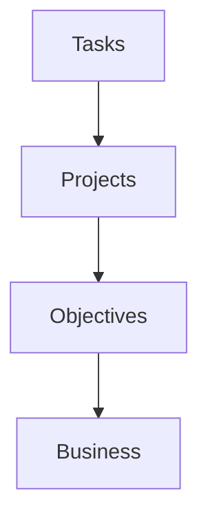
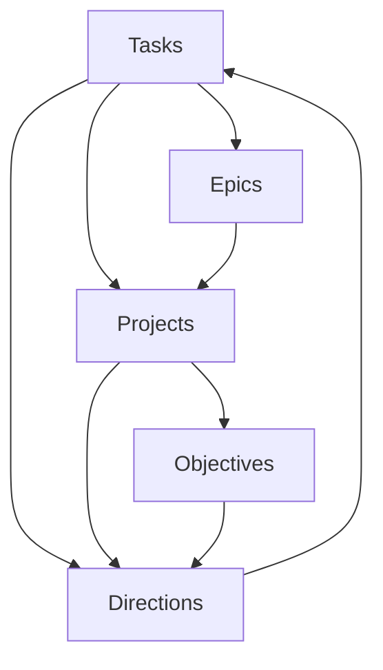

---
{"dg-publish":true,"dg-permalink":"project","permalink":"/project/","metatags":{"description":"Davon的项目管理","og:site_name":"DavonOs","og:title":"Project","og:type":"article","og:url":"https://zuji.eu.org/project","og:image":"https://cdn.pixabay.com/photo/2017/09/11/11/02/project-management-2738521_640.jpg","og:image:width":"400","og:image:alt":"articlecover","og:locale":"zh_cn"}}
---

**项目** Project：现在在做的事或生活中在积极努力的短期成果。

项目成为组织现代工作理想方式的特征：
- 发生在特定的时间段内，有开始和结束。
- 有明确的需要确定的结果，以便核对为完成，例如“完成”、“绿灯”、“启动”或“发布”。

项目示例：工作/个人/业余项目

了解你目前致力于哪些项目对于确定你的一周的优先级、计划你的进度以及对不重要的事情说不至关重要。

个人项目管理的难点
- 多重任务易遗忘，缺乏系统工具支持导致效率低。
GithubProject、GithubWiki、Githubissue 这些都是跟踪编码项目的好方法，但你有多喜欢这点？

传统项目管理中的核心角色：
- **策划者**：负责整体规划和时间表。 
- **实干家**：实际执行任务。 
- **有远见的人**：提供方向和愿景。 
- **研究者**：搜集信息并改进项目。 
- **维修工**：维护已有成果，确保持续运作。

**敏捷 vs 瀑布模型**： 
- 瀑布模型严格分阶段，适合明确需求的项目；
- 敏捷模型灵活迭代，适合不确定性高的项目。

**传统项目管理的问题**：
- 自上而下的结构僵化，不适应个人生活的多样性和变化。 当你试图把所有东西都装进这样的桶里时，就像有很多摩擦。
- 任务、项目和目标的关系非线性，现有工具难以充分捕捉这些动态。 

**作者提出的解决方案**： 
- **Teapot D Framework**：一种全新的个人项目管理框架，简化目标设置和任务管理。 
- 该框架借鉴 OKRs 等成熟方法，但更加注重灵活性和个人适用性。

1. **Tasks（任务）**：
    任务是项目中需要完成的最基本单元，通常是具体的工作或行动项。任务可以是任何单独的工作活动，通常需要由一个或多个团队成员执行，且有明确的开始和结束时间。任务一般是短期的，关注的是完成特定目标的步骤。
2. **Epics（史诗）**：
    史诗是较大的工作单位，通常用于敏捷项目管理中，尤其是在Scrum和Kanban框架下。史诗包含了多个较小的任务或子任务，是一个较为宏大的目标或需求，通常需要较长的时间来完成。Epics在整个项目中扮演的是更高层次的规划和指导作用，后续会被拆解为多个用户故事（User Stories）或任务。
3. **Projects（项目）**：
    项目是为了实现特定目标或交付某种产品、服务或成果而开展的临时性工作。项目有明确的开始和结束时间，目标明确，通常有预算和资源限制。项目管理是对整个项目的规划、执行、监控和收尾的过程，涵盖了从需求收集到最终交付的各个环节。
4. **Objectives（目标）**：
    目标是项目或工作所要达成的具体结果或成就。目标通常是衡量项目成功的标准，具有明确性、可量化性和时间性。它们可以是项目的总体目标，也可以是团队或个人在执行项目时的具体小目标。明确的目标有助于项目团队集中精力，确保所有工作都是朝着同一方向进行。
5. **Directions（方向）**：
    方向指的是项目的总体方向或战略定位，通常由项目的高级管理层或决策者设定。方向帮助团队明确工作的大致框架和策略，确保所有成员在执行任务时都朝着正确的目标前进。在项目执行过程中，方向可能会根据外部环境或内部需求的变化进行调整。

很多时候我们不知道如何定义或框定事物，比如我想成为更好的开发者。
目标是那些更具体的事情，就你想做的事而言。有时项目像文件夹，没有目标。
生活是在变化和进化的，与其不断强迫自己进入一个盒子里，系统本身应该是自适应的。
有时你没有项目，只有一些支持等待的任务。有时某些项目是如此之大，以至于它们应该有Epics，否则你就不可能以一种有意义的方式组织你的任务。
良好的个人项目管理运行我们做的是有机地发展我们的系统，而不是强迫自己在特定框架内遵循某种特定的模式。就像我们对笔记进行分类来帮助我们理解事物一样，但最终这些并不是全部。
一个让它与用户一起生活和呼吸的系统，以一种不局限于别人议程的方式。

SPEAR Model
我们其实有自己不同的部分，为不同的优先事项而竞争，取决于我们之前所处的环境
Seer - The visionary
Pilot - Resonsible for getting us from point A to point B。主要负责绘制我们如何从一个目的地到另一个目的地
Airplane - Experiencing the journey
Engineer - Equvalent of the maintainer
Reasearcher - Learner

[BenCodeZen 系列Obsidian教程与分享-项目管理技](https://www.bilibili.com/video/BV1Kt421H7K7/)

