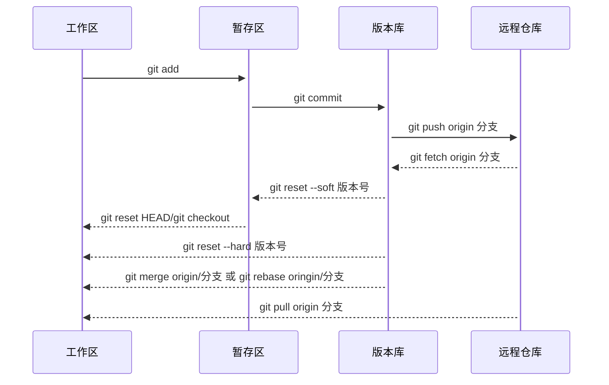

---
{"dg-publish":true,"dg-permalink":"archive/git","permalink":"/archive/git/","tags":["Git"]}
---


<aside>
💡 Git是一个**分布式**的版本控制软件
</aside>

Git简介与安装（略）

什么是分布式：文件夹拷贝→本地版本控制→集中式版本控制→分布式版本控制

为什么要做版本控制：保留之前所有的版本，方便回滚和修改。

项目下载

在Github上找到您要同步的项目，并复制项目的URL。

打开命令行工具（如Terminal或Command Prompt）。

使用git clone命令将项目克隆到本地。在命令行中输入以下命令：`git clone <项目URL>`，将项目的URL替换为您复制的项目URL即可

例：`https://github.com/tangly1024/NotionNext.git` 

注意，如此下载只有项目的主分支，而本地不存在其他项目分支。要将 GitHub 项目上的所有分支克隆到本地，可以为git clone命令添加--mirror 参数：`git clone --mirror <项目URL>`

例：`git clont --mirror https://github.com/tangly1024/NotionNext.git`

输入命令后， Git 会在本地创建一个裸版本的存储库，保存项目的所有分支和标签信息。

如何将git仓库克隆到指定文件夹中？

`git clone <repository_url> <destination_folder>`

`<repository_url>`是要克隆的Git仓库的URL地址，`<destination_folder>`是指定的目标文件夹路径。
示例：`git clone <https://github.com/tangly1024/NotionNext.git> myfolder`NotionNext项目会被克隆到当前目录下的myfolder文件夹中。

你可以通过cd命令进入项目目录，查看所有文件和文件夹。

git对项目文件目录进行版本控制需要以下步骤：

文件管理——版本生成——版本回滚与恢复

1. 进入要管理的文件夹
2. 执行初始化命令，让Git帮我们管理当前文件夹：`git init`
管理当前目录下的文件状态：`git status`
🔔新增和修改过后的文件都是红色的。
3. 管理指定文件，如index.html（红变绿）：`git add index.html`
管理当前目录下所有文件： `git add .`
❗初次使用要进行个人信息配置用户名、邮箱，告诉Git你是谁再生成版本（仅需一次即可）：
`git config --global user.email "you@example.com" git config --global user.name "Your Name"`
4. 生成版本：`git commit -m '描述信息'`

如何回滚到指定版本

要回滚到指定版本，可以使用 git reset 命令并指定要回滚到的提交的哈希值或引用（如分支名）。以下是具体的步骤：

查询要回滚到的提交的哈希值或引用：

使用 `git log`命令查看提交历史，找到您希望回滚到的具体提交的哈希值或引用（如分支名）。

执行 `git reset` 命令进行版本回滚：

回滚到上一个版本：git reset --hard HEAD^ 这个命令将当前分支的 HEAD 指针回滚到上一个提交（即上一个版本），并丢弃之后的所有修改。如果您只需要撤销最后一次提交，而不是回滚到上一个版本，您可以使用 git reset --soft HEAD^ 命令。这个命令将撤销最后一次提交的内容，但保留对文件的更改，使其成为暂存区的状态。

回滚到指定提交的版本，可以执行：git reset --hard <commit-hash>将当前分支的 HEAD 指针直接指向指定的提交（即上一个版本），并丢弃之后的所有修改。

回滚到指定分支最新提交的版本，可以执行：git reset --hard <branch-name>

强制推送到远程分支：如果您想将回滚后的本地分支内容同步到远程分支，需要使用强制推送操作。执行类似以下命令：git push -f origin <branch-name>
请注意，使用强制推送命令会更改远程分支的历史记录，谨慎操作。

通过上述步骤，您可以将分支回滚到指定版本。请确保您了解回滚操作的后果，并在执行前备份重要数据。

您可以使用git pull命令来获取远程仓库的最新更新。输入以下命令：`git pull`就可以将Github项目的当前分支完整同步到本地，并随时获取最新的更新。

您可以通过 cd 命令进入项目文件夹，然后使用 git fetch --all 命令来获取所有分支的最新更新：git fetch --all
您可以使用 git branch -a 命令查看所有本地和远程的分支：git branch -a
这样，您就可以将 GitHub 上项目的所有分支（包括主干和其他分支）克隆到本地。要切换到其他分支，可以使用 git checkout 命令。

远程分支已经删除的情况下，在本地输入 git branch -a 为和还会显示已删除的分支
是的，即使远程分支已经被删除，当您运行 git branch -a 命令时，仍会显示已删除的远程分支。这是因为 git branch -a 命令显示了本地分支和远程跟踪分支（包括已删除的）。这些已删除的远程分支会以 remotes/origin/branch_name 的形式显示在列表中。

如果您想要清理已删除的远程分支，可以进行以下操作：

拉取最新的远程分支列表： 运行以下命令拉取最新的远程分支列表：

git fetch --prune
这将删除已经在远程仓库中不存在的分支的远程跟踪分支。

之后再次运行 git branch -a 命令查看已删除的远程分支是否被清理，已删除的远程分支应该不再显示在列表中。

通过运行 git fetch --prune 命令，您可以及时清理本地存储库中不再存在的远程分支。如果您有任何其他问题或需要进一步帮助，请随时告诉我。我很乐意帮助您。

如何删除本地git项目

要删除本地Git项目，您可以按照以下步骤操作：

打开命令行工具（如Terminal或Command Prompt）。

使用cd命令进入要删除的Git项目的目录，确保您在项目目录中，然后输入以下命令删除整个Git项目：`rm -rf .git`

这将删除项目目录中名为.git的Git版本控制文件夹，从而完全删除与Git相关的信息。

如果您只想删除项目文件，而保留Git的版本控制信息，可以直接删除项目文件夹。在命令行中，输入以下命令删除整个NotionNext项目目录：`rm -rf NotionNext`

注意：在执行删除操作之前，请确保您确实要删除项目，并且已经备份了任何重要的文件。删除项目后，将无法恢复删除的文件。

您也可以同时删除Git版本控制信息和项目文件夹。您可以使用以下命令将完全删除项目：

在项目所在的文件夹中（不是项目文件夹本身）执行以下命令：rm -rf myproject

这样会完全删除项目文件夹及其中所有文件和Git版本控制信息。请注意，一旦执行此操作，您将无法恢复删除的文件，请确保您真的想要删除项目。

git 删除本地分支并同步到远程GitHub

要在本地删除分支并将更改同步到远程 GitHub，您可以执行以下步骤：

删除本地分支： 使用以下命令删除本地分支：git branch -d <branch-name>

如果分支未完全合并，则可以使用 -D 选项强制删除：git branch -D <branch-name>

推送删除的分支到远程仓库： 如果您想要在远程仓库中删除相应的分支，可以使用以下命令：git push origin --delete <branch-name>
这将删除远程仓库中名为 <branch-name> 的分支。

通过执行以上步骤，您可以删除本地分支并将删除操作同步到远程 GitHub 仓库。请确保您要删除的分支不再需要，并谨慎执行删除操作，因为这将不可逆转。如果还有其他问题或疑问，请随时告诉我。

本地Git获取Github远程项目分支

使用 git fetch 命令来获取远程的分支信息。此命令会将远程分支的信息拉取到本地，但并不会自动地在本地创建这些分支。输入以下命令：git fetch
查看远程分支列表。您可以使用以下命令查看获取到的远程分支列表：git branch -r
这会列出所有远程分支。如果要查看本地和远程分支的全部分支（包括远程分支），可以使用以下命令：git branch -a
您可以使用 git checkout 命令来切换到远程分支。例如，要切换到名为 feature-branch 的远程分支，可以输入以下命令：git checkout -b feature-branch origin/feature-branch
这将在本地创建一个与远程分支对应的本地分支，并切换到该分支上。

通过这些步骤，您可以在本地 Git 中获取 GitHub 上的远程项目分支，并进行操作和管理。

通过$ git branch -r查看到如下分支
origin/HEAD -> origin/sync
origin/blog
origin/entertain
origin/main
origin/sync

如何将远程的blog、entertain、main的分支拉到本地

要将远程的 blog、entertain 和 main 分支拉取到本地，请按照以下步骤操作：

首先，确保您已经使用 git fetch 命令获取了最新的远程分支信息。

使用 git checkout -b 命令将远程分支拉取到本地并切换到相应的本地分支。例如，如果要拉取远程的 blog 分支到本地，可以执行以下命令：git checkout -b blog origin/blog
这将在本地创建一个名为 blog 的本地分支，并将其对应于远程的 origin/blog 分支。

类似地，您可以使用以下命令拉取 entertain 和 main 分支到本地：
git checkout -b entertain origin/entertain
git checkout -b main origin/main
这样，您就成功将远程的 blog、entertain 和 main 分支拉取到本地，并创建相应的本地分支。您可以使用 git branch 命令查看本地分支列表，以确保分支已经成功创建。

如何将远程的SYNC分支同步到本地

要将远程的 SYNC 分支同步到本地，可以按照以下步骤操作：

首先，确保您已经切换到需要同步的本地分支，或者新建一个本地分支来接收远程 SYNC 分支的内容。假设您想将远程 SYNC 分支同步到当前本地分支，可以执行以下步骤。

执行以下命令将远程 SYNC 分支的内容拉取到本地：

git pull origin SYNC
这个命令会先从远程存储库拉取 SYNC 分支的内容到本地，并自动合并到当前本地分支。如果存在冲突，Git 会提示您进行解决。

如果您只想将远程 SYNC 分支的内容拉取到本地，并且不进行合并操作，可以使用以下命令：
git fetch origin SYNC
这个命令会将远程 SYNC 分支的内容拉取到本地，但不会自动合并。您需要手动选择合并操作。

通过这些步骤，您可以将远程的 SYNC 分支同步到本地，以保持本地分支与远程存储库同步。希望这能帮助到您，如有任何疑问，请随时告诉我。

Your branch is behind 'origin/blog' by 1 commit, and can be fast-forwarded.
(use "git pull" to update your local branch)
这个提示表明您当前所在的分支比远程存储库中的 origin/blog 分支落后了 1 个提交，并且可以通过快进（fast-forward）操作进行更新。如果您想要将本地分支与远程分支同步，可以按照提示中建议的操作进行：

执行 git pull 命令来拉取远程 origin/blog 分支的最新提交并合并到当前本地分支：
git pull
这个命令将会拉取远程存储库中的最新提交到本地，然后尝试将这些提交合并到当前分支。如果没有冲突，合并将会自动完成。

如果在执行 git pull 命令时遇到冲突（conflicts），您需要手动解决冲突后再进行提交。解决冲突后，可以使用 git add 和 git commit 来完成合并提交。

通过执行 git pull 命令，您可以将本地分支与远程存储库中的 origin/blog 分支同步，消除落后的提交，使本地分支保持最新状态。希望这对您有所帮助！如果有任何其他问题，请随时告诉我。

我希望远程的版本也回滚到我本地落后的版本
如果您想要将远程存储库中的 origin/blog 分支也回滚到您本地落后的版本，可以按照以下步骤操作：

回滚本地分支到落后版本：

首先，您可以按照前面提到的方法使用 git reset --hard HEAD^ 或 git reset --hard <commit-hash> 将本地分支回滚到落后的版本。
强制推送到远程分支：

一旦本地分支回滚到您希望的版本，您可以使用 git push 命令进行强制推送到远程存储库的 origin/blog 分支。要执行这个操作，需要指定 -f 或 --force 选项来强制推送：
git push -f origin HEAD:blog
这个命令将强制将本地分支的当前状态推送到远程的 origin/blog 分支，覆盖远程存储库中的内容。请注意，强制推送会更改远程历史记录，因此在执行之前请确保您知晓操作的后果。

通过以上步骤，您可以将远程存储库中的 origin/blog 分支回滚到与本地分支相同的落后版本。请谨慎使用强制推送命令，确保您已经备份好重要的数据。希望这个解决方案对您有所帮助！如果您有任何疑问或需要进一步帮助，请随时告诉我。

git本地新建一个分支并推送到远程GitHub仓库
要在本地创建一个新分支并将其推送到远程 GitHub 仓库，您可以执行以下步骤：

创建并切换到新分支： 使用以下命令在本地创建并切换到新分支：

git checkout -b <new-branch-name>
这将创建一个名为 <new-branch-name> 的新分支，并将您切换到该分支。

进行必要的更改和提交： 在新分支上进行您需要的修改和提交。

推送新分支到远程仓库： 一旦您完成了在新分支上的工作，并且想要将该分支推送到远程 GitHub 仓库，您可以使用以下命令：

git push origin <new-branch-name>
这将把新创建的分支推送到远程 GitHub 仓库。

通过执行以上步骤，您可以在本地创建一个新分支并将其推送到远程 GitHub 仓库。请确保您已经完成了所需的更改和提交，并在推送之前仔细检查您的更改。如果还有其他问题或疑问，请随时告诉我，我很乐意帮助您。

Git如何取消合并操作

要取消 Git 中的合并操作，您可以使用以下方法之一：

使用 git merge --abort： 如果您正在进行合并操作但决定取消它，可以使用 git merge --abort 命令。这会使 Git 回到合并前的状态，并放弃任何合并的进展。

使用 git reset： 如果您已经完成了合并操作，并且想要取消合并并将 HEAD 移回到之前的提交，您可以使用 git reset 命令。根据您的需要，可以选择使用 --hard 或 --soft 选项：

git reset --hard HEAD^：取消合并并丢弃所有更改。
git reset --soft HEAD^：取消合并但保留更改，并将合并的更改放入暂存区。
请注意，在使用 git reset 时，请务必小心，因为它会更改您的存储库历史记录。确保在执行之前理解其影响，并备份任何重要的更改。



# 认识分支：bug修复工作流

分支可以实现开发环境的隔离，给使用者提供多个环境，意味着你可以把你的工作从开发主线上分离开来，以免影响主线开发。

线上代码BUG如何紧急修复

创建新的分支修复BUG后合并到主干线master

查看目前所在分支（假设为master）：
`git branch`

`* master`

在master分支下创建一个新的分支（命名为dev）：`git branch dev` 相当于创建了一个v3版本

切换回master分支：`git checkout master` 相当于回滚到V2版本

切换回dev分支：`git checkout dev` 回到v3版本

现在master分支出现BUG，需要紧急修复

1. git chekout master
2. git branch bug
3. 修改代码后
`git status`
`git add .`
`git commit -m 'V4'`
4. 将BUG分支合并到master（可能产生冲突）：
`git chekout master`先回到主分支，再把BUG分支拉回来
`git merge bug`
❗注意：谁合并谁，切换分支再合并

如何取消合并？
当我们使用`git merge`合并代码，但还没有add时，想要取消这次合并，使用`git merge --abort`
如果已经`git add`了，则用`git reflog`显示指令历史操作，再用`git reset --hard commit id`
5. 删除bug分支：`git branch -d bug`
6. 切换到dev分支继续完成开发：`git checkout dev`
此处代码是从v2拆分过来，BUG并未修复，继续开发新功能
`git add .`
`git commit -m '新功能开发完毕v5'`
`git log`
7. 切换回master分支，将dev分支进行合并
`git checkout master`
`git merge dev`
⚠️共同修改过同一行数据，就会产生冲突，需要手动修复解决
8. 提交
`git add .`
`git commit -m '解决bug和新功能合并bug'`

项目创建至少需要两个分支

master（正式版）

dev（开发版）

# Github：代码云端托管仓库

注册新建github仓库，获取远程仓库地址链接

## 项目上传与下载

1. 将本地代码上传至github的操作：
    - 给远程仓库起别名：`git remote add origin 远程仓库地址`
    - 向远程推送代码：`git push -u origin 分支`不同分支需要分别推送
2. 初次在公司新电脑下载代码
    - 克隆远程仓库代码：`git clone 远程仓库地址`（内部已实现`git remote add origin 远程仓库地址`，无需每次添加仓库名）
    `git branch`看似只有一个master分支，但dev分支已拉取
    - 切换到dev分支，继续开发：`git checkout dev`

使用 -b拉取指定dev分支：`git clone -b dev 远程仓库地址`

查看当前项目拉的是哪个分支的代码详情：`git branch -vv`

查看分支上的递交情况：`git show-branch`

## 异地工作流

第一天在公司开发新代码：

1. 切换到dev分支进行开发：`git checkout dev`
❗注意：dev分支代码一定要跟master最新的代码保持一致
2. `git merge master`把master分支合并到dev，仅一次
3. 在回家之前提交新代码：
`git add .` 
`git commit -m '在公司第一天开发的代码'`
`git push -u origin master`-u为默认，可省略（默认提交到master分支） 
`git push origin dev`（手动指定代码提交到dev分支）

git branch查看还在dev分支 

详细说明一下git push orign命令
当您在本地 Git 仓库中添加、修改或删除文件后，需要将这些改动推送到远程存储库（通常是在 GitHub 或类似的服务上）。git push origin 命令就是用来将本地分支的提交推送到远程存储库的命令，具体说明如下：

回家后继续

`git status`

`git branch` 发现还在master分支

`git checkout dev`

要在公司已开发提交新功能的基础上继续写代码，需要先把本地代码做一次更新

`git clone`是第一次本地完全没有文件时把所有代码全部拷贝一份，本地有代码情况下更新就可以了

从远程dev分支把代码拉取下来：`git pull origin dev`

代码修改开发完以后

`git add .`

`git commit -m '在家里开发了新代码'`

`git push origin dev`

开发完毕，要上线

将dev分支合并到master，进行上线：`git checkout master` `git merge dev` `git push origin master`

把dev分支也推送到远程：`git chekout dev` `git merge master` `git push origin dev`

可能存在的问题

公司代码未做提交

回家后可以写其他功能再提交

第二天如果要拉代码，拉的就是在家的代码，本地还有代码合并，可能要手动解决冲突

解决完冲突继续开发，直到开发完成。

补充内容：

`git pull origin dev`等同于`git fetch origin dev` 和 `git merge origin/dev`这两个命令

# rebase应用场景

rebase（变基）：使git记录简介

1. 将多个记录整合成一个记录

git rebase -i HEAD~3

注意：不要把已经push到远程仓库的记录进行合并

1. 把分支记录合并成一条

`git rebase 分支`：保持提交记录简洁，不分叉。

1. 忘记提交代码的场景

把原本的git pull origin dev 变成 git fetch origin dev

再执行git rebase origin/dev

如遇冲突，手动解决完

`git rebase --continue`

# 快速解决冲突

1.安装beyond compare

2.在git中进行配置：

`git config --local merge.tool bc3`

`git config --local mergetool.path '把bc安装路径复制到此处'`

`git config --local mergetool.keepBackup false`-不用保留备份

`--local`只在当前项目生效

3.应用`git mergetool` 解决冲突

> 记录图形展示：`git log --graph --pretty=format:"%h %s”`
> 

# gitflow多人协同开发工作流

假设已有master分支的v1版本

dev分支，把master分支拉下来，把某个功能拆分给A、B俩人/团队开发，每个人都有自己的分支。

1. 创建第一版项目并打上标签

Github创建一个组织

在组织内新建一个项目库

`git tag -a v1 -m '第一版'`

`git push origin --tags`

tag相当于哈希值

`git checkout -b dev`

`git push origin dev`

邀请成员进入组织

项目成员权限设置

成员开发

代码review

pull/merge request

项目库settings→branch→require pull request，需要几个人review……

项目成员提交一个pull request，选中把哪个分支合并到哪个分支

add your reivew，同意后 pull request

测试上线预发布

`git checkout -b release`

`git push origin release`

一般不轻易改代码

给开源项目贡献代码

fork仓库，将别人的源代码拷贝到自己的远程仓库

在自己仓库进行代码修改

给源代码作者提交申请（pull request）

# 其他

配置文件

对当前项目配置文件：项目/.git/config

`git config —local user.name`

全局配置文件：~/.gitconfig

`git config —global user.name`

系统配置文件（注意需要root权限）：/etc/.gitconfig

`git config —system user.name`

`git remote add origin 地址` 默认添加在本地配置文件中（`--local`）

免密登录

url中实现

原来的地址：https://github.com/tangly1024/notionnext.git

修改的地址：https://用户名:密码@github.com/tangly1024/notionnext.git

git remote add origin https://用户名:密码@github.com/tangly1024/notionnext.git

git push origin master

SSH实现

生成公钥和私钥（默认放在~/.ssh目录下，id_rsa.pub公钥、id_rsa私钥）

ssh-keygen

拷贝公钥的内容，设置到github—settings—SSH and GPGkeys—new ssh key添加

在git本地中配置ssh地址

git remote add origin git@github.com:tangly1024/notionnext.git

以后使用

git push origin master

git 自动管理凭证

git忽略文件

让Git不再管理当前目录下的某些文件。

创建一个.gitignore

```html
*.h
!a.h
files/
*.py[c|a|d]
```

更多参考：[https://github.com/github/gitignore](https://github.com/github/gitignore)

任务管理

issuses，文档以及任务管理

wiki，项目说明描述文档。

git 界面 清屏
在 Git 命令行界面中，您可以使用以下命令来清屏：

在 Windows 系统中，您可以使用 cls 命令来清屏，如下所示：
cls
在 macOS 或 Linux 系统中，您可以使用 clear 命令来清屏，如下所示：
clear
这些命令可帮助您清除屏幕上的内容，使 Git 命令行界面更加整洁。您可以在输入其他 Git 命令之前使用这些命令来清屏。

在windows的gitbash如何清屏
在 Windows 的 Git Bash 中，可以使用以下方法来清屏：

使用快捷键：按下 Ctrl + L 组合键即可清屏。

使用命令：输入 clear 命令后按回车键也可以清屏。

无论是使用快捷键还是命令，都可以帮助您清除 Git Bash 界面上的内容，使其更加整洁。希望对您有所帮助！如果您有任何其他问题或疑问，请随时告诉我。

[Git修改分支名，保持本地和远程一致_gerrit代码仓库上的分支名称是和本地一致的吗-CSDN博客](https://blog.csdn.net/shadow_yi_0416/article/details/115226301)

# 外部资源

[Git - Book](https://git-scm.com/book/zh/v2)

[Git Cheat Sheet](http://git-cheatsheet.com/)

总结：git push origin 命令主要用来将本地分支的提交推送到远程存储库。在执行此命令前，请确保本地分支已经提交了修改，并与远程存储库同步。

git push origin feature-branch
如果要为远程存储库的分支起一个不同名的分支，可以指定推送到的远程分支：
git push origin feature-branch:new-feature-branch
这个命令会将本地的 feature-branch 分支推送到远程存储库的 new-feature-branch 分支。

示例：假设您有一个本地分支 feature-branch，要将其推送到远程存储库的同名分支（例如，也叫 feature-branch），可以执行以下命令：

如果您在使用 git push origin 命令前，没有指定分支名称，那么 Git 会将当前所在分支的提交推送到远程存储库的同名分支。

git push origin <branch-name>：这个命令将本地的指定分支 <branch-name> 的提交推送到远程存储库（通常 origin 是默认的远程存储库名称）。