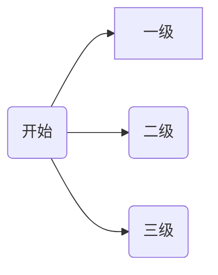
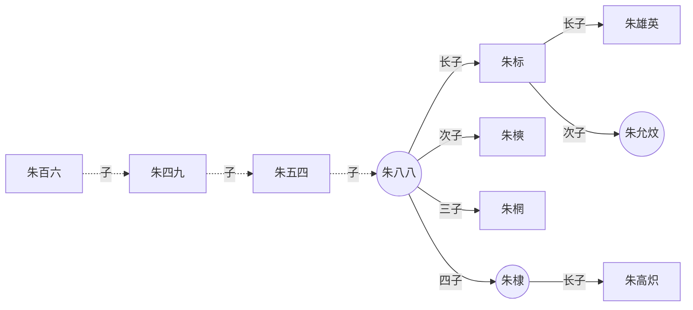
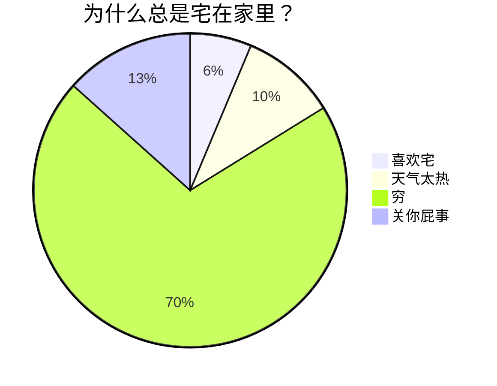

---
{"dg-publish":true,"dg-permalink":"markdown","permalink":"/markdown/","metatags":{"description":"这里是 🏡Davon的数字花园，是个人不断发展的想法的集合，作为半成品的思考，在可探索的空间中，随时间推移不断播种、修剪、塑造","og:site_name":"DavonOs","og:title":"Markdown","og:type":"article","og:url":"https://zuji.eu.org/markdown","og:image":"https://markdown.com.cn/hero.png","og:image:width":"400","og:image:alt":"articlecover","og:locale":"zh_cn"}}
---


[Markdown语法参考 | obsidian](https://coffeetea.top/zh/markdown/)
[Markdown语法](https://lgf4591.github.io/quartz-obsidian/markdown%E8%AF%AD%E6%B3%95)

[Cmd Markdown在线编辑器](https://www.zybuluo.com/mdeditor)
[Arya - 在线 Markdown 编辑器](https://markdown.lovejade.cn/)
[微信公众号markdown排版工具](https://markdown.com.cn/editor/)


标题&目录

不同数量的`#`可以完成不同的标题，和 HTML 一样共有六级，如下：
```md
# 这是一级标题
## 这是二级标题
### 这是三级标题
#### 这是四级标题
##### 这是五级标题
###### 这是六级标题
```

粗体、斜体、粗体和斜体，删除线，需要在文字前后加不同的标记符号。如下：


**这个是粗体**：左右各两个星号`**`

*这个是斜体*：左右各一个星号`*`

***这个是粗体加斜体***：左右各三个星号`*`

~~删除线~~：左右各两个波浪号`~`

<u>下划线</u>：与HTML一样，使用`<u></u>`标签

注：如果想给字体换颜色或居中显示，需要使用内嵌HTML来实现。

分割线：英文状态下三个“-”

---

列表&引用

无序列表的使用，在符号`-`后加空格使用。如下：

```
- 无序列表 1
- 无序列表 2
- 无序列表 3
```

如果要控制列表的层级，则需要在符号`-`前使用空格。如下：

- 无序列表 1
- 无序列表 2
 - 无序列表 2.1
 - 无序列表 2.2

有序列表的使用，在数字及符号`.`后加空格后输入内容，如下：

1. 有序列表 1
2. 有序列表 2
3. 有序列表 3

引用

引用的格式在符号`>`后面书写文字。如下：

> 读一本好书，就是在和高尚的人谈话。 ——歌德

脚注

脚注 的格式：在需要脚注的地方，输入`[^脚注代号]`，推荐使用数字序号。在其他区域，输入：
`[^脚注代号]:脚注内容`


网页

外链的格式：`[显示文本内容](链接地址 "提示信息文本")`。微信公众号仅支持公众号文章链接，即域名为`https://mp.weixin.qq.com/`的合法链接。

图片

图片格式：``

支持 jpg、png、gif、svg 等图片格式，svg 文件示例如下：


在 Markdown 中绘制函数图像 

首先用 [Mathematica]([matlab和mathmatica的在线版|Jerkwin](https://jerkwin.github.io/2020/11/18/matlab%E5%92%8Cmathmatica%E7%9A%84%E5%9C%A8%E7%BA%BF%E7%89%88/)) 绘图并导出 SVG

```
Plot[Sin[x], {x, -4, 4}, PlotPoints -> 2]
Export["sin.svg", %]
```

接下来使用 [svgo](https://github.com/svg/svgo) 做一下压缩：

```sh
svgo --pretty sin.svg
```

得到的代码直接复制进来就好啦～
 
<svg xmlns="http://www.w3.org/2000/svg" xmlns:xlink="http://www.w3.org/1999/xlink" width="480" height="223pt" viewBox="0 0 360 223">
    <defs>
        <symbol overflow="visible" id="a">
            <path d="M5.29-2.191H.55v-.82h4.74zm0 0"/>
        </symbol>
        <symbol overflow="visible" id="b">
            <path d="M3.234 0v-1.715H.125v-.805l3.27-4.636h.714v4.636h.97v.805h-.97V0zm0-2.52v-3.226L.992-2.52zm0 0"/>
        </symbol>
        <symbol overflow="visible" id="c">
            <path d="M5.035-.844V0H.305a1.54 1.54 0 01.101-.61c.121-.324.313-.64.578-.953.266-.312.649-.671 1.149-1.085.777-.637 1.304-1.141 1.578-1.516.273-.371.41-.723.41-1.055 0-.347-.125-.644-.375-.883-.246-.238-.574-.359-.973-.359-.421 0-.761.129-1.015.383-.254.254-.383.605-.387 1.055L.47-5.117c.062-.672.293-1.188.699-1.54.402-.355.945-.53 1.625-.53.687 0 1.23.19 1.629.57.402.383.601.855.601 1.418 0 .285-.058.566-.175.844-.118.277-.313.566-.582.875-.274.304-.723.726-1.356 1.257-.527.442-.867.743-1.015.903a2.868 2.868 0 00-.372.476zm0 0"/>
        </symbol>
        <symbol overflow="visible" id="d">
            <path d="M3.727 0h-.88v-5.602c-.21.204-.488.407-.831.606a5.902 5.902 0 01-.926.457v-.852c.492-.23.922-.511 1.289-.84.367-.328.629-.648.781-.957h.567zm0 0"/>
        </symbol>
        <symbol overflow="visible" id="e">
            <path d="M.906 0v-1H1.91v1zm0 0"/>
        </symbol>
        <symbol overflow="visible" id="f">
            <path d="M.414-3.531c0-.844.09-1.528.262-2.043.176-.516.433-.914.777-1.192.344-.28.774-.421 1.297-.421.383 0 .719.078 1.008.23.289.156.531.379.719.672.187.289.335.644.445 1.062.11.418.16.985.16 1.692 0 .84-.086 1.52-.258 2.035-.172.516-.43.914-.773 1.195-.344.281-.778.422-1.301.422-.691 0-1.234-.246-1.625-.742-.473-.594-.71-1.567-.71-2.91zm.906 0c0 1.176.137 1.957.41 2.347.278.387.614.582 1.02.582.402 0 .742-.195 1.016-.586.277-.39.414-1.171.414-2.343 0-1.18-.137-1.961-.414-2.348-.274-.387-.618-.582-1.028-.582-.402 0-.726.172-.965.516-.304.433-.453 1.238-.453 2.414zm0 0"/>
        </symbol>
        <symbol overflow="visible" id="g">
            <path d="M.414-1.875l.922-.078c.07.45.23.785.476 1.012.25.226.551.34.903.34.422 0 .781-.16 1.074-.477.293-.32.438-.742.438-1.27 0-.504-.141-.898-.422-1.187-.282-.29-.649-.434-1.106-.434a1.526 1.526 0 00-1.3.692L.57-3.383l.696-3.68h3.558v.844H1.97l-.387 1.922c.43-.3.879-.45 1.352-.45a2.14 2.14 0 011.582.65c.43.433.644.992.644 1.671 0 .649-.187 1.207-.566 1.68-.457.578-1.086.867-1.88.867-.651 0-1.183-.18-1.593-.547-.41-.363-.648-.847-.707-1.449zm0 0"/>
        </symbol>
    </defs>
    <path d="M7.66 35.668l5.371 8.715 5.367 9.754L23.77 64.78l5.37 11.371 5.372 11.914 5.367 12.274L50.62 125.2l5.371 12.198 5.367 11.786 5.371 11.195 5.372 10.426 5.367 9.492 5.37 8.414 5.372 7.203 5.371 5.883 5.367 4.465 5.371 2.98 5.371 1.453 5.368-.105 5.37-1.656 5.372-3.18 5.37-4.66 5.368-6.063 5.371-7.37 5.371-8.567 5.367-9.625 5.372-10.535 5.37-11.286 5.372-11.851 10.738-24.668 5.371-12.434 5.367-12.234 5.371-11.856 5.371-11.28 5.372-10.536 5.367-9.629 5.37-8.566 5.372-7.371 5.367-6.063 5.371-4.656 5.371-3.184 5.371-1.652 5.368-.105 5.37 1.449 5.372 2.984 5.367 4.465 5.371 5.879 5.371 7.203 5.371 8.418 5.367 9.492 5.372 10.426 5.37 11.191 10.739 23.985 5.371 12.418 5.371 12.441 5.367 12.277 5.371 11.914 5.371 11.368 5.372 10.644 5.367 9.758 5.37 8.715" fill="none" stroke-width="1.6" stroke-linecap="square" stroke="#5e81b5" stroke-miterlimit="3.25"/>
    <path d="M7.66 111.129v-4" fill="none" stroke-width=".2" stroke="#666" stroke-miterlimit="3.25"/>
    <use xlink:href="#a" x="1.66" y="123.128" fill="#666"/>
    <use xlink:href="#b" x="7.66" y="123.128" fill="#666"/>
    <path d="M29.14 111.129v-2.402M50.621 111.129v-2.402M72.102 111.129v-2.402M93.578 111.129v-4" fill="none" stroke-width=".2" stroke="#666" stroke-miterlimit="3.25"/>
    <use xlink:href="#a" x="87.58" y="123.128" fill="#666"/>
    <use xlink:href="#c" x="93.58" y="123.128" fill="#666"/>
    <path d="M115.059 111.129v-2.402M136.54 111.129v-2.402M158.02 111.129v-2.402M179.5 111.129v-4M200.98 111.129v-2.402M222.46 111.129v-2.402M243.941 111.129v-2.402M265.422 111.129v-4" fill="none" stroke-width=".2" stroke="#666" stroke-miterlimit="3.25"/>
    <use xlink:href="#c" x="262.42" y="123.128" fill="#666"/>
    <path d="M286.898 111.129v-2.402M308.379 111.129v-2.402M329.86 111.129v-2.402M351.34 111.129v-4" fill="none" stroke-width=".2" stroke="#666" stroke-miterlimit="3.25"/>
    <use xlink:href="#b" x="348.34" y="123.128" fill="#666"/>
    <path d="M.5 111.129h358M179.5 220.813h2.398M179.5 210.84h4" fill="none" stroke-width=".2" stroke="#666" stroke-miterlimit="3.25"/>
    <use xlink:href="#a" x="156.5" y="213.34" fill="#666"/>
    <g fill="#666">
        <use xlink:href="#d" x="162.5" y="213.34"/>
        <use xlink:href="#e" x="168.062" y="213.34"/>
        <use xlink:href="#f" x="170.84" y="213.34"/>
    </g>
    <path d="M179.5 200.867h2.398M179.5 190.898h2.398M179.5 180.926h2.398M179.5 170.957h2.398M179.5 160.984h4" fill="none" stroke-width=".2" stroke="#666" stroke-miterlimit="3.25"/>
    <use xlink:href="#a" x="156.5" y="163.484" fill="#666"/>
    <g fill="#666">
        <use xlink:href="#f" x="162.5" y="163.484"/>
        <use xlink:href="#e" x="168.062" y="163.484"/>
        <use xlink:href="#g" x="170.84" y="163.484"/>
    </g>
    <path d="M179.5 151.012h2.398M179.5 141.043h2.398M179.5 131.07h2.398M179.5 121.098h2.398M179.5 111.129h4M179.5 101.156h2.398M179.5 91.188h2.398M179.5 81.215h2.398M179.5 71.242h2.398M179.5 61.273h4" fill="none" stroke-width=".2" stroke="#666" stroke-miterlimit="3.25"/>
    <g fill="#666">
        <use xlink:href="#f" x="162.5" y="63.772"/>
        <use xlink:href="#e" x="168.062" y="63.772"/>
        <use xlink:href="#g" x="170.84" y="63.772"/>
    </g>
    <path d="M179.5 51.3h2.398M179.5 41.328h2.398M179.5 31.36h2.398M179.5 21.387h2.398M179.5 11.418h4" fill="none" stroke-width=".2" stroke="#666" stroke-miterlimit="3.25"/>
    <g fill="#666">
        <use xlink:href="#d" x="162.5" y="13.916"/>
        <use xlink:href="#e" x="168.062" y="13.916"/>
        <use xlink:href="#f" x="170.84" y="13.916"/>
    </g>
    <path d="M179.5 1.445h2.398M179.5 221.758V.5" fill="none" stroke-width=".2" stroke="#666" stroke-miterlimit="3.25"/>
</svg>

表格绘制

Obsidian中可直接使用鼠标右键插入

```md
| 左栏 | 中间栏 | 右栏 |
| -------- | -------- | ----- |
| 单元格 1 | 居中 | $1600 |
| 单元格 2 | 单元格 3 | $12 |
```

| 左栏    | 中间栏   | 右栏    |
| ----- | ----- | ----- |
| 单元格 1 | 居中    | $1600 |
| 单元格 2 | 单元格 3 | $12   |

可以使用冒号来定义表格的对齐方式，如下：

| 姓名    | 年龄  |     工作 |
| :---- | :-: | -----: |
| 小可爱   | 18  |   吃可爱多 |
| 小小勇敢  | 20  |  爬棵勇敢树 |
| 小小小机智 | 22  | 看一本机智书 |

可以`Shift`+`Enter`对一段长文本进行换行

代码块

如果在一个行内需要引用代码，只要用反引号引起来就好，如下：

Use the `printf()` function.

在需要高亮的代码块的前一行及后一行使用三个反引号，同时**第一行反引号后面表示代码块所使用的语言**，如下：

```java
// FileName: HelloWorld.java
public class HelloWorld {
  // Java 入口程序，程序从此入口
  public static void main(String[] args) {
    System.out.println("Hello,World!"); // 向控制台打印一条语句
  }
}
```

diff 不能同时和其他语言的高亮同时显示，且需要调整代码主题为微信代码主题以外的代码主题才能看到 diff 效果，使用效果如下:

```diff
+ 新增项
- 删除项
```


拓展文本格式

- **Markdown** 想实现更多的文本显示效果，只能依赖HTML标记和部分编辑器提供的**额外标识符**，属于拓展语法，旨在为 **Markdown使用者** 提供更多样式选择
- 个人**不是很推荐**在 MD 中使用 HTML，不过一些简单的标记还是可以 **轻度使用** 的

键盘文本的格式：`<kbd>Ctrl</kbd> + <kbd>X</kbd>`
键盘文本和行内代码一样可以作为突出显示着重文本的方式

放大文本的格式：`<big>这是一段放大文本</big>`

缩小文本的格式：`<small>这是一段缩小文本</small>`

高亮文本的格式：==这里是一段高亮文本==

多彩文本的格式：`<font color=orange>这是一段橘色文本</font>`

color 里的颜色支持 英文单词，[16进制](http://c.runoob.com/front-end/55 "可跳转至菜鸟教程了解")，[rgb](https://www.runoob.com/cssref/func-rgb-css.html "可跳转至菜鸟教程了解")，[rgba](https://www.runoob.com/cssref/func-rgba.html "可跳转至菜鸟教程了解")

上标的格式：`<sup>这里是上标内容</sup>`，X<sup>2</sup>

下标的格式：`<sub>这里是下标内容</sub>`，H<sub>2</sub>O

Latex 数学公式
[MathJax 参考手册](https://math.meta.stackexchange.com/questions/5020/mathjax-basic-tutorial-and-quick-reference)

公式块的格式：`$公式$`

行内公式使用方法，比如这个化学公式：$\ce{Hg^2+ ->[I-] HgI2 ->[I-] [Hg^{II}I4]^2-}$

块公式使用方法如下：

$$H(D_2) = -\left(\frac{2}{4}\log_2 \frac{2}{4} + \frac{2}{4}\log_2 \frac{2}{4}\right) = 1$$

矩阵：

$$
  \begin{pmatrix}
  1 & a_1 & a_1^2 & \cdots & a_1^n \\
  1 & a_2 & a_2^2 & \cdots & a_2^n \\
  \vdots & \vdots & \vdots & \ddots & \vdots \\
  1 & a_m & a_m^2 & \cdots & a_m^n \\
  \end{pmatrix}
$$

Mermaid 绘图







Callout 标注

```md
>[!info] 自定义标题
包裹的内容
可以是多行的内容
```
在标题部分可以使用 `-`和`+`符号，让callout面板折叠或者展开
```md
>[!info]+ 自定义标题
包裹的内容
可以是多行的内容
```

>[!info]+ 这是一个可折叠的info
> 包裹的内容
> 可以是折叠的多行的内容

>[!note] Note

>[!abstract] Abstract

>[!todo] Todo

>[!tip] Tip

>[!Question] Question

>[!warning] Warning

>[!failure] Failure

>[!danger] Danger

>[!bug] Bug

>[!example]

>[!quote]

