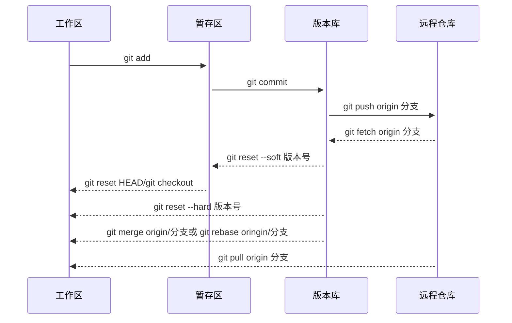

---
{"dg-publish":true,"dg-permalink":"program/git-memo","permalink":"/program/git-memo/","metatags":{"description":"借用一个开发项目，实战操作Git，实现本地及远程版本控制管理","og:site_name":"DavonOs","og:title":"Git 快速上手","og:type":"article","og:url":"https://zuji.eu.org/program/git-memo","og:image":null,"og:image:width":"400","og:image:alt":"articlecover","og:locale":"zh_cn"},"tags":["program/git"],"dg-note-properties":{"tags":"program/git"}}
---


Git 是一个**分布式**的<u>版本控制</u>软件

什么是分布式：文件夹拷贝→本地版本控制→集中式版本控制→分布式版本控制

为什么要做版本控制：保留之前所有的版本，方便回滚和修改。

## Git 安装与配置

全局用户名&邮箱配置

初次使用要补充个人信息告诉 Git 你是谁，配置用户名、邮箱，仅需首次安装执行一次；

如果单个项目使用单独身份，去掉 `--global`

```Git
git config --global user.email "you@example.com"
git config --global user.name "Your Name"
```
## 项目下载与初始化

在 Github 上找到您要同步的项目，并复制项目的 URL，这里以 digitalgarden 项目为例。

打开命令行工具（如 Terminal 或 Command Prompt）。

使用 `git clone` 命令将项目克隆到本地。在命令行中输入以下命令：`git clone <项目URL>`，将项目的 URL 替换为您复制的项目 URL 即可

例：`git clone https://github.com/oleeskild/digitalgarden.git`

注意，如此下载只包含项目的主分支，而本地不存在其他项目分支。要将 GitHub 项目上的所有分支克隆到本地，可以为 git clone 命令添加--mirror 参数：`git clone --mirror <项目URL>`

例：`git clont --mirror https://github.com/oleeskild/digitalgarden.git`

输入命令后， Git 会在本地创建一个裸版本的存储库，保存项目的所有分支和标签信息。

如何将 Git 仓库克隆到指定文件夹中？

除了手动进入文件夹目录外，可以通过命令：`git clone <repository_url> <destination_folder>` 将仓库克隆到指定文件夹下。

`<repository_url>` 是要克隆的 Git 仓库的 URL 地址，`<destination_folder>` 是指定的目标文件夹路径。

示例：`git clone https://github.com/oleeskild/digitalgarden.git myfolder` digitalgarden 项目会被克隆到当前目录下的 myfolder 文件夹中。

你可以通过 cd 命令进入项目目录，查看所有文件和文件夹。

## 本地版本管理

Git 对项目文件进行版本控制需要以下步骤：
### 版本生成

1. 初始化仓库
进入要管理的文件夹，执行初始化命令，让 Git 帮我们管理当前文件夹：` git init `
查看管理当前目录下的文件状态：` git status `
新增和修改过后的文件都是<font color=#f00;>红色</font>的。
`.git` 是生成的隐藏文件夹，Windows 显示隐藏文件、Mac 按 <kbd>Command</kbd>+<kbd>Shift</kbd>+<kbd>.</kbd> 查看
仅第一次项目需要 `git init`，后续不用重复执行

2. 文件加入暂存区
指定单个文件，如 <font color= #0ff;>index .html</font>（红变绿）：`git add index.html`
指定一类文件/整个文件夹，如 images：`git add images/`
当前目录下所有修改、新增文件： `git add .`
只处理修改、删除的文件，不包含新建未追踪文件：`git add -u`

3. 取消暂存
单个文件取消暂存，如 <font color=#f00;>index.html</font>（绿变红）退回工作区：`git restore --staged index.html`
整个文件夹取消暂存：`git restore --staged images/`
全部文件取消暂存：`git restore --staged .`
误删文件直接恢复：`git restore index.html` 或 `git restore .`

4. 生成版本信息
提交暂存区所有内容：`git commit -m '描述信息'`
修改文件后不用单独 `git add`，一步提交：`git commit -am '描述信息'`

5. 查看版本历史
完整详细日志：`git log`
极简单行日志，小白首选，显示短哈希值（回滚必备）：`git log --oneline`
图形化分支日志，看分支合并关系：`git log --oneline --graph`
`git log` 每一条记录前的 7 位字符 = `commit-hash` 哈希值，回滚、恢复文件全靠它

6. 新建 `.gitignore`
项目根目录新建文件，名字固定为 `.gitignore`，写入不需要 Git 管理的文件，示例：
```gitignore
# 系统缓存文件 
.DS_Store
 # 依赖文件夹 
 node_modules/ 
 # 日志、临时文件 
 *.log 
 *.tmp 
 # 密钥、环境配置 
 .env
```

| 符号     | 作用                      | 示例                                             |
| ------ | ----------------------- | ---------------------------------------------- |
| `*`    | 匹配任意长度任意字符（不含目录分隔符 `/`） | `*.log` 所有后缀 log 文件                            |
| `?`    | 匹配单个任意字符                | `img?.png` img1.png、img2.png，不匹配 img10.png     |
| `[]`   | 匹配括号内单个字符               | `[0-9].txt` 1.txt、5.txt                        |
| `**/`  | 递归匹配所有子目录               | `**/temp/` 所有层级下的 temp 文件夹全部忽略                 |
| `/` 开头 | 仅匹配**根目录**文件 / 文件夹      | `/readme.md` 只忽略项目根目录 readme，子文件夹 readme 不忽略   |
| `/` 结尾 | 代表文件夹，而非同名文件            | `node_modules/` 只过滤文件夹，不会过滤 node_modules.txt   |
| `!`    | 取反：排除忽略规则（强制追踪）         | `!important.log` 所有 log 忽略，唯独 important.log 保留 |

写入后，`git status` 不会再出现这些垃圾文件。

`.gitignore` 只对**未追踪的新建文件**生效；已经 `git add` 过的文件，写入规则不会自动移除，需要手动删除暂存：`git rm --cached 文件名`

### 版本回滚与恢复

回退到上一个版本
保留修改到暂存区：`git reset --soft HEAD^`
默认模式，修改保留在工作区：`git reset HEAD^`
彻底清空所有改动：`git reset --hard HEAD^`

`HEAD~2` 回退 2 个版本，`HEAD~3` 回退 3 个版本

回退到指定版本（哈希值）
使用 `git log` 或 `git log --oneine` 查看提交历史，找到目标版本哈希值。
保留修改，可重新提交：`git reset a62bc10`
彻底清空当前所有改动，回到干净旧版本：`git reset --hard a62bc10`

单独恢复某一文件到旧版本：`git checkout a62bc10 -- 文件路径`

如果用 `--hard` 误删提交，`git log` 看不到旧版本，用 `git reflog` 查看所有操作记录，拿到丢失版本哈希值，重新切回：`git reset -hard 丢失版哈希`

回滚到指定分支最新提交的版本，可以执行：`git reset --hard <branch-name>`

> [!note] 区分 3 种 `reset`
> 1. `--soft`：仅撤销 commit，文件保留在<font color= #0ff;>暂存区</font>（绿色），修改不丢失
> 2. 不带参数 `git reset HEAD^`：撤销 commit，文件退回<font color=#f00;>工作区</font>（红色），修改不丢失
> 3. `--hard`：撤销 commit + **清空所有本地修改**，未提交改动直接消失，谨慎使用！
### 删除本地 Git 仓库

进入要删除的 Git 项目的目录，确保您在项目目录中。

彻底删除整个 Git 项目（代码+版本库全部清空）：
```
# Mac / Linux 删除 digitalgarden 整个项目
rm -rf digitalgarden
# Windows
rmdir /s /q digitalgarden
```

仅删除版本控制（保留项目文件）
删除根目录隐藏 `.git` 文件夹，项目代码全部保留，彻底脱离 Git 管理
```
# Mac / Linux
rm -rf .git
# Windows cmd/PowerShell
rmdir /s /q .git
```
### 分支管理

分支可以实现开发环境的隔离，给使用者提供多个环境，意味着你可以把你的工作从开发主线上分离开来，以免影响主线开发。

日常项目管理创建至少需要两个分支：
- `main / master`：线上正式稳定版本（你初始仓库默认 master）
- `dev`：日常开发分支，所有新功能先在 dev 写完，测试完成再合并 main

1. 分支基础操作

查看本地所有分支（假设为 main）： `git branch`

`* main` （`*` 代表当前所在分支）

只创建分支，不切换：`git branch dev`
一步到位，创建+立刻切换分支，最常用：`git checkout -b dev`
切换回主分支：`git checkout main`

2. 分支开发完整流程

现在我们需要在 dev 分支上修改代码
	1. 切换到开发分支 `git chekout dev`
	2. 修改代码文件
	3. 暂存提交版本：`git add.` → `git commit -m 'fixed bug'`
	4. 合并 dev 代码到主线 main，`git chekout main` 先回到主分支，再把 dev 分支拉回来 `git merge dev` 完成对主线的修改 ❗谁合并谁，切换分支再合并

3. 代码冲突处理

⚠️如果在不同分支上修改过同一行数据，就会产生冲突，需要手动修复解决

打开冲突文件，Git 会自动标记冲突内容：
```
<<<<<<< HEAD（当前main分支代码）
原有配置
=======
dev分支修改后的配置
>>>>>>> dev
```

手动删除标记符号 `<<<<<< ===== >>>>>>`，保留最终想要的代码
保存文件，执行暂存 + 提交，合并完成
```
git add .
git commit -m "解决合并冲突，统一配置参数"
```

4. 如何取消合并？

合并过程中、未 add 提交，直接放弃本次合并：`git merge --abort`

已经提交合并、想要撤销这次合并：回退到合并前的版本，`git reset --hard HEAD^`

5. 删除分支
安全删除，分支已经合并完成，无未合并代码：`git branch -d dev`
强制删除：分支未合并，里面有未合并代码（谨慎）：`git branch -D dev`

6. 临时储藏代码

正在 dev 分支写一半代码，临时要切 main 分支改 bug，半成品不想生成无用 commit

储藏当前所有未提交改动，工作区变干净：`git stash`
查看所有储藏记录：`git stash list`
切换分支修改代码完成后，恢复储藏的代码：`git stash pop`

> [!tip]+ 效率优化
> 1. 自定义 Git 别名，少打长命令
> ```
> # gs = git status -s 精简状态
> git config --global alias.gs "status -s"
> # gl = 简洁日志
> git config --global alias.gl "log --oneline --graph"
> # gc = 快速提交
> git config --global alias.gc "commit -m"
> # 使用示例：直接输入 gs 代替 git status -s
> ```
> 2. 交互式暂存，选择性提交文件：`git add -i`

通用避坑总结

1. 提交描述不要写随便写 “修改”，规范：`feat`新功能、`fix`修复、`del`删除资源、`refactor`重构
2. 尽量少用 `git reset --hard`，会丢失未保存的本地修改
3. 合并分支前优先切换主线，遵循：切 main → merge dev
4. 不用`.gitignore`过滤敏感文件，不要提交密钥、密码、本地缓存
5. 执行删除`.git`、`reset --hard`、`branch -D`前先确认代码是否备份
6. 大量图片、静态资源修改优先操作整个文件夹`git add images/`，批量操作更高效

## Github：推送与同步

注册 Github，并 fork 原项目仓库，获取远程仓库地址链接。

将本地代码上传至 Github：

- 给远程仓库起别名：`git remote add origin 远程仓库地址`
- 向远程推送代码：`git push -u origin 分支`，不同分支需要分别推送。

从远程仓库初次下载代码：

- 克隆远程仓库代码：`git clone 远程仓库地址`（内部已实现 `git remote add origin 远程仓库地址`，无需每次添加仓库名） `git branch` 看似只有一个 main 分支，但 dev 分支已拉取
- 切换到 dev 分支，继续开发：`git checkout dev`

使用 -b 拉取指定 dev 分支：`git clone -b dev 远程仓库地址`

查看当前项目拉的是哪个分支的代码详情：`git branch -vv`

查看分支上的递交情况：`git show-branch`

您可以使用 `git pull` 命令将 Github 项目的当前分支完整同步到本地，并随时获取最新的更新。

如何将远程的 dev 分支拉取到本地

首先，确保您已经切换到需要同步的本地分支，或者新建一个本地分支来接收远程 dev 分支的内容。假设您想将远程 dev 分支同步到当前本地分支，可以执行以下步骤。

执行以下命令将远程 dev 分支的内容拉取到本地：

`git pull origin dev` 这个命令会先从远程存储库拉取 dev 分支的内容到本地，并自动合并到当前本地分支。如果存在冲突，Git 会提示您进行解决。

如果您只想将远程 dev 分支的内容拉取到本地，并且不进行合并操作，可以使用以下命令：`git fetch origin dev` 这个命令会将远程 dev 分支的内容拉取到本地，但不会自动合并。您需要手动选择合并操作。

通过这些步骤，您可以将远程的 dev 分支同步到本地，以保持本地分支与远程存储库同步。希望这能帮助到您，如有任何疑问，请随时告诉我。

您可以使用 git branch -a 命令查看所有本地和远程的分支：git branch -a 这样，您就可以将 GitHub 上项目的所有分支（包括主干和其他分支）克隆到本地。要切换到其他分支，可以使用 git checkout 命令。

本地 Git 获取 Github 远程项目分支

使用 git fetch 命令来获取远程的分支信息。此命令会将远程分支的信息拉取到本地，但并不会自动地在本地创建这些分支。输入以下命令：git fetch 查看远程分支列表。您可以使用以下命令查看获取到的远程分支列表：git branch -r，这会列出所有远程分支。如果要查看本地和远程分支的全部分支（包括远程分支），可以使用以下命令：git branch -a



## 异地工作流

第一天在公司开发新代码：

1. 切换到 dev 分支进行开发：`git checkout dev` ❗注意：dev 分支代码一定要跟 master 最新的代码保持一致
2. `git merge master` 把 master 分支合并到 dev，仅一次
3. 在回家之前提交新代码： `git add .` `git commit -m '在公司第一天开发的代码'` `git push -u origin master`-u 为默认，可省略（默认提交到 master 分支） `git push origin dev`（手动指定代码提交到 dev 分支）

git branch 查看还在 dev 分支

详细说明一下 git push orign 命令当您在本地 Git 仓库中添加、修改或删除文件后，需要将这些改动推送到远程存储库（通常是在 GitHub 或类似的服务上）。git push origin 命令就是用来将本地分支的提交推送到远程存储库的命令，具体说明如下：

回家后继续

`git status`

`git branch` 发现还在 master 分支

`git checkout dev`

要在公司已开发提交新功能的基础上继续写代码，需要先把本地代码做一次更新

`git clone` 是第一次本地完全没有文件时把所有代码全部拷贝一份，本地有代码情况下更新就可以了

从远程 dev 分支把代码拉取下来：`git pull origin dev`

代码修改开发完以后

`git add .`

`git commit -m '在家里开发了新代码'`

`git push origin dev`

开发完毕，要上线

将 dev 分支合并到 master，进行上线：`git checkout master` `git merge dev` `git push origin master`

把 dev 分支也推送到远程：`git chekout dev` `git merge master` `git push origin dev`

可能存在的问题

公司代码未做提交

回家后可以写其他功能再提交

第二天如果要拉代码，拉的就是在家的代码，本地还有代码合并，可能要手动解决冲突

解决完冲突继续开发，直到开发完成。

补充内容：

`git pull origin dev` 等同于 `git fetch origin dev` 和 `git merge origin/dev` 这两个命令

### rebase 应用场景

rebase（变基）：使 git 记录简介

1. 将多个记录整合成一个记录：git rebase -i HEAD~3，不要把已经 push 到远程仓库的记录进行合并。
2. 把分支记录合并成一条：`git rebase 分支`：保持提交记录简洁，不分叉。
3. 忘记提交代码的场景：把原本的 git pull origin dev 变成 git fetch origin dev，再执行 git rebase origin/dev，如遇冲突，手动解决完，`git rebase --continue`

### 快速解决冲突

1.安装 beyond compare

2.在 git 中进行配置：

`git config --local merge.tool bc3`

`git config --local mergetool.path '把bc安装路径复制到此处'`

`git config --local mergetool.keepBackup false`-不用保留备份

`--local` 只在当前项目生效

3.应用 `git mergetool` 解决冲突

> 记录图形展示：`git log --graph --pretty=format:"%h %s”`

## Gitflow 多人协同开发工作流

假设已有 master 分支的 v 1 版本

dev 分支，把 master 分支拉下来，把某个功能拆分给 A、B 俩人/团队开发，每个人都有自己的分支。

1. 创建第一版项目并打上标签

Github 创建一个组织

在组织内新建一个项目库

`git tag -a v1 -m '第一版'`

`git push origin --tags`

tag 相当于哈希值

`git checkout -b dev`

`git push origin dev`

邀请成员进入组织

项目成员权限设置

成员开发

代码 review

pull/merge request

项目库 settings→branch→require pull request，需要几个人 review……

项目成员提交一个 pull request，选中把哪个分支合并到哪个分支

add your reivew，同意后 pull request

测试上线预发布

`git checkout -b release`

`git push origin release`

一般不轻易改代码

给开源项目贡献代码

fork 仓库，将别人的源代码拷贝到自己的远程仓库

在自己仓库进行代码修改

给源代码作者提交申请（pull request）

## 其他

配置文件

对当前项目配置文件：项目/.git/config

`git config —local user.name`

全局配置文件：~/.gitconfig

`git config —global user.name`

系统配置文件（注意需要 root 权限）：/etc/.gitconfig

`git config —system user.name`

`git remote add origin 地址` 默认添加在本地配置文件中（`--local`）

免密登录

url 中实现

原来的地址：`https://github.com/oleeskild/digitalgarden.git`

修改的地址：`https://用户名:密码@github.com/oleeskild/digitalgarden.git`

git remote add origin `https://用户名:密码@github.com/oleeskild/digitalgarden.git`

git push origin master

SSH 实现

生成公钥和私钥（默认放在~/.ssh 目录下，id_rsa.pub 公钥、id_rsa 私钥）

ssh-keygen

拷贝公钥的内容，设置到 github—settings—SSH and GPGkeys—new ssh key 添加

在 git 本地中配置 ssh 地址

`git remote add origin [git@github.com](mailto:git@github.com):oleeskild/digitalgarden.git`

以后使用

git push origin master

git 自动管理凭证

Git 忽略文件

让 Git 忽略当前目录下的某些文件，不再管理。

创建一个.gitignore

```html
*.h
!a.h
files/
*.py[c|a|d]
```

更多参考：[https://github.com/github/gitignore](https://github.com/github/gitignore)

任务管理

issuses，文档以及任务管理

wiki，项目说明描述文档。

Git 界面清屏：

Windows 中，使用 cls 命令来清屏。在 macOS 或 Linux 系统中，使用 clear 命令来清屏。 

在 windows 的 gitbash 如何清屏在 Windows 的 Git Bash 中，可以使用以下方法来清屏：

使用快捷键：按下 <kbd>Ctrl</kbd> + <kbd>L</kbd> 组合键即可清屏。

使用命令：输入 clear 命令后按回车键也可以清屏。

[Git修改分支名，保持本地和远程一致_gerrit代码仓库上的分支名称是和本地一致的吗-CSDN博客](https://blog.csdn.net/shadow_yi_0416/article/details/115226301)

## 外部资源

[Git - Book](https://git-scm.com/book/zh/v2)
