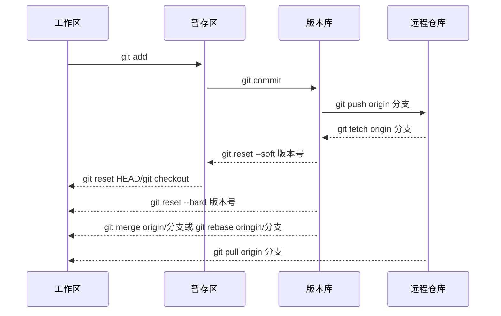

---
{"dg-publish":true,"dg-permalink":"program/git","permalink":"/program/git/","metatags":{"description":"借用一个开发项目，实战操作Git，实现本地及远程版本控制管理","og:site_name":"DavonOs","og:title":"Git 快速上手","og:type":"article","og:url":"https://zuji.eu.org/learn/program/git","og:image":null,"og:image:width":"400","og:image:alt":"articlecover","og:locale":"zh_cn"},"tags":["program/git"],"created":"2024-08-07 22:16","updated":"2025-07-17 08:33"}
---


Git简介与安装（略）

Git是一个**分布式**的<u>版本控制</u>软件

什么是分布式：文件夹拷贝→本地版本控制→集中式版本控制→分布式版本控制

为什么要做版本控制：保留之前所有的版本，方便回滚和修改。

## 项目下载与初始化

在 Github 上找到您要同步的项目，并复制项目的 URL，这里以 digitalgarden 项目为例。

打开命令行工具（如Terminal或Command Prompt）。

使用`git clone`命令将项目克隆到本地。在命令行中输入以下命令：`git clone <项目URL>`，将项目的URL替换为您复制的项目URL即可

例：`git clone https://github.com/oleeskild/digitalgarden.git`

注意，如此下载只包含项目的主分支，而本地不存在其他项目分支。要将 GitHub 项目上的所有分支克隆到本地，可以为 git clone 命令添加--mirror 参数：`git clone --mirror <项目URL>`

例：`git clont --mirror https://github.com/oleeskild/digitalgarden.git`

输入命令后， Git 会在本地创建一个裸版本的存储库，保存项目的所有分支和标签信息。

如何将 Git 仓库克隆到指定文件夹中？

除了手动进入文件夹目录外，可以通过命令：`git clone <repository_url> <destination_folder>`将仓库克隆到指定文件夹下。

`<repository_url>`是要克隆的Git仓库的URL地址，`<destination_folder>`是指定的目标文件夹路径。

示例：`git clone https://github.com/oleeskild/digitalgarden.git myfolder` digitalgarden项目会被克隆到当前目录下的 myfolder 文件夹中。

你可以通过 cd 命令进入项目目录，查看所有文件和文件夹。

## 本地版本管理

Git 对项目文件进行版本控制需要以下步骤：

### 版本生成

1. 进入要管理的文件夹，执行初始化命令，让Git帮我们管理当前文件夹：`git init` 查看管理当前目录下的文件状态：`git status` 🔔新增和修改过后的文件都是<font color=#f00;>红色</font>的。
2. 管理指定文件，如<font color= #0ff;>index .html</font>（红变绿）：`git add index.html` 管理当前目录下所有文件： `git add .`
3. ❗初次使用要补充个人信息告诉Git你是谁，配置用户名、邮箱，再生成版本（仅需一次）： `git config --global user.email "you@example.com"` 
   `git config --global user.name "Your Name"`
4. 生成版本信息：`git commit -m '描述信息'`。
5. 使用 `git log` 命令，可以查看提交的版本历史。

### 版本回滚与恢复

要回滚到指定版本，可以使用 `git reset` 命令并指定要回滚到的提交的哈希值或引用（如分支名）。以下是具体的步骤：

查询要回滚到的提交的哈希值或引用：

使用 `git log`命令查看提交历史，找到您希望回滚到的具体提交的哈希值或引用（如分支名）。

执行 `git reset` 命令进行版本回滚。

回滚到上一个版本：`git reset --hard HEAD^` 将当前分支的 HEAD 指针回滚到上一个提交（即上一个版本），并丢弃之后的所有修改。

如果只需要撤销最后一次提交，而不是回滚到上一个版本，可以使用`git reset --soft HEAD^` 命令。这个命令将撤销最后一次提交的内容，但保留对文件的更改，使其成为暂存区的状态。

回滚到指定提交的版本，可以执行：`git reset --hard <commit-hash>`将当前分支的 HEAD 指针直接指向指定的提交（即上一个版本），并丢弃之后的所有修改。

回滚到指定分支最新提交的版本，可以执行：`git reset --hard <branch-name>`

### 删除本地git项目

进入要删除的Git项目的目录，确保您在项目目录中，然后输入以下命令删除整个Git项目：`rm -rf .git`，这将删除项目目录中名为.git的Git版本控制文件夹，从而完全删除与Git相关的信息。

如果您只想删除项目文件，而保留Git的版本控制信息，可以直接删除项目文件夹。

在项目所在的文件夹中（不是项目文件夹本身），输入以下命令删除整个digitalgarden项目目录：`rm -rf digitalgarden`会完全删除项目文件夹及其中所有文件和Git版本控制信息。请注意，一旦执行此操作，您将无法恢复删除的文件，请确保您真的想要删除项目。

### 分支管理

分支可以实现开发环境的隔离，给使用者提供多个环境，意味着你可以把你的工作从开发主线上分离开来，以免影响主线开发。

在修改项目配置文件时，应通过新建分支来进行，最后再合并到主干线 main 上来。

项目创建至少需要两个分支：

main（正式版）

dev（开发版）

查看目前所在分支（假设为main）： `git branch`

`* main`

在main分支下创建一个新的分支（命名为dev）：`git branch dev` 相当于创建了一个v3版本，但此刻你仍然处于main分支。

切换到dev分支：`git checkout dev` 回到v3版本。

你也可以使用`git checkout -b <new-branch-name>`，创建一个名为 `<new-branch-name>` 的新分支，并直接切换到新分支。

切换回main分支：`git checkout main` 相当于回滚到V2版本

现在我们需要在dev分支上修改blog.config.js配置文件

1. git chekout dev
2. 修改NOTION_PAGE_ID等代码后保存 `git status` `git add .` `git commit -m 'V4'`
3. 将修改的dev分支合并到 main（可能产生冲突）： `git chekout main` 先回到主分支，再把BUG分支拉回来 `git merge dev` 完成对主线的修改 ❗谁合并谁，切换分支再合并 ⚠️如果在不同分支上修改过同一行数据，就会产生冲突，需要手动修复解决

如何取消合并？ 当我们使用`git merge`合并代码，但还没有add时，想要取消这次合并，使用`git merge --abort` 如果已经`git add`了，则用`git reflog`显示指令历史操作，再用`git reset --hard commit id`

git reset --hard HEAD^：取消合并并丢弃所有更改。 git reset --soft HEAD^：取消合并但保留更改，并将合并的更改放入暂存区。

删除分支：`git branch -d dev`

## Github：推送与同步

注册Github，并fork原项目仓库，获取远程仓库地址链接。

将本地代码上传至Github：

- 给远程仓库起别名：`git remote add origin 远程仓库地址`
- 向远程推送代码：`git push -u origin 分支`，不同分支需要分别推送。

从远程仓库初次下载代码：

- 克隆远程仓库代码：`git clone 远程仓库地址`（内部已实现`git remote add origin 远程仓库地址`，无需每次添加仓库名） `git branch`看似只有一个main分支，但dev分支已拉取
- 切换到dev分支，继续开发：`git checkout dev`

使用 -b拉取指定dev分支：`git clone -b dev 远程仓库地址`

查看当前项目拉的是哪个分支的代码详情：`git branch -vv`

查看分支上的递交情况：`git show-branch`

您可以使用`git pull`命令将Github项目的当前分支完整同步到本地，并随时获取最新的更新。

如何将远程的dev分支拉取到本地

首先，确保您已经切换到需要同步的本地分支，或者新建一个本地分支来接收远程 dev 分支的内容。假设您想将远程 dev分支同步到当前本地分支，可以执行以下步骤。

执行以下命令将远程 dev 分支的内容拉取到本地：

`git pull origin dev` 这个命令会先从远程存储库拉取 dev 分支的内容到本地，并自动合并到当前本地分支。如果存在冲突，Git 会提示您进行解决。

如果您只想将远程 dev 分支的内容拉取到本地，并且不进行合并操作，可以使用以下命令：`git fetch origin dev` 这个命令会将远程 dev 分支的内容拉取到本地，但不会自动合并。您需要手动选择合并操作。

通过这些步骤，您可以将远程的 dev 分支同步到本地，以保持本地分支与远程存储库同步。希望这能帮助到您，如有任何疑问，请随时告诉我。

您可以使用 git branch -a 命令查看所有本地和远程的分支：git branch -a 这样，您就可以将 GitHub 上项目的所有分支（包括主干和其他分支）克隆到本地。要切换到其他分支，可以使用 git checkout 命令。

本地Git获取Github远程项目分支

使用 git fetch 命令来获取远程的分支信息。此命令会将远程分支的信息拉取到本地，但并不会自动地在本地创建这些分支。输入以下命令：git fetch 查看远程分支列表。您可以使用以下命令查看获取到的远程分支列表：git branch -r，这会列出所有远程分支。如果要查看本地和远程分支的全部分支（包括远程分支），可以使用以下命令：git branch -a



## 异地工作流

第一天在公司开发新代码：

1. 切换到dev分支进行开发：`git checkout dev` ❗注意：dev分支代码一定要跟master最新的代码保持一致
2. `git merge master`把master分支合并到dev，仅一次
3. 在回家之前提交新代码： `git add .` `git commit -m '在公司第一天开发的代码'` `git push -u origin master`-u为默认，可省略（默认提交到master分支） `git push origin dev`（手动指定代码提交到dev分支）

git branch查看还在dev分支

详细说明一下git push orign命令当您在本地 Git 仓库中添加、修改或删除文件后，需要将这些改动推送到远程存储库（通常是在 GitHub 或类似的服务上）。git push origin 命令就是用来将本地分支的提交推送到远程存储库的命令，具体说明如下：

回家后继续

`git status`

`git branch` 发现还在master分支

`git checkout dev`

要在公司已开发提交新功能的基础上继续写代码，需要先把本地代码做一次更新

`git clone`是第一次本地完全没有文件时把所有代码全部拷贝一份，本地有代码情况下更新就可以了

从远程dev分支把代码拉取下来：`git pull origin dev`

代码修改开发完以后

`git add .`

`git commit -m '在家里开发了新代码'`

`git push origin dev`

开发完毕，要上线

将dev分支合并到master，进行上线：`git checkout master` `git merge dev` `git push origin master`

把dev分支也推送到远程：`git chekout dev` `git merge master` `git push origin dev`

可能存在的问题

公司代码未做提交

回家后可以写其他功能再提交

第二天如果要拉代码，拉的就是在家的代码，本地还有代码合并，可能要手动解决冲突

解决完冲突继续开发，直到开发完成。

补充内容：

`git pull origin dev`等同于`git fetch origin dev` 和 `git merge origin/dev`这两个命令

### rebase应用场景

rebase（变基）：使git记录简介

1. 将多个记录整合成一个记录：git rebase -i HEAD~3，不要把已经push到远程仓库的记录进行合并。
2. 把分支记录合并成一条：`git rebase 分支`：保持提交记录简洁，不分叉。
3. 忘记提交代码的场景：把原本的git pull origin dev 变成 git fetch origin dev，再执行git rebase origin/dev，如遇冲突，手动解决完，`git rebase --continue`

### 快速解决冲突

1.安装beyond compare

2.在git中进行配置：

`git config --local merge.tool bc3`

`git config --local mergetool.path '把bc安装路径复制到此处'`

`git config --local mergetool.keepBackup false`-不用保留备份

`--local`只在当前项目生效

3.应用`git mergetool` 解决冲突

> 记录图形展示：`git log --graph --pretty=format:"%h %s”`

## Gitflow多人协同开发工作流

假设已有master分支的v1版本

dev分支，把master分支拉下来，把某个功能拆分给A、B俩人/团队开发，每个人都有自己的分支。

1. 创建第一版项目并打上标签

Github创建一个组织

在组织内新建一个项目库

`git tag -a v1 -m '第一版'`

`git push origin --tags`

tag相当于哈希值

`git checkout -b dev`

`git push origin dev`

邀请成员进入组织

项目成员权限设置

成员开发

代码review

pull/merge request

项目库settings→branch→require pull request，需要几个人review……

项目成员提交一个pull request，选中把哪个分支合并到哪个分支

add your reivew，同意后 pull request

测试上线预发布

`git checkout -b release`

`git push origin release`

一般不轻易改代码

给开源项目贡献代码

fork仓库，将别人的源代码拷贝到自己的远程仓库

在自己仓库进行代码修改

给源代码作者提交申请（pull request）

## 其他

配置文件

对当前项目配置文件：项目/.git/config

`git config —local user.name`

全局配置文件：~/.gitconfig

`git config —global user.name`

系统配置文件（注意需要root权限）：/etc/.gitconfig

`git config —system user.name`

`git remote add origin 地址` 默认添加在本地配置文件中（`--local`）

免密登录

url中实现

原来的地址：`https://github.com/oleeskild/digitalgarden.git`

修改的地址：`https://用户名:密码@github.com/oleeskild/digitalgarden.git`

git remote add origin `https://用户名:密码@github.com/oleeskild/digitalgarden.git`

git push origin master

SSH实现

生成公钥和私钥（默认放在~/.ssh目录下，id_rsa.pub公钥、id_rsa私钥）

ssh-keygen

拷贝公钥的内容，设置到github—settings—SSH and GPGkeys—new ssh key添加

在git本地中配置ssh地址

`git remote add origin [git@github.com](mailto:git@github.com):oleeskild/digitalgarden.git`

以后使用

git push origin master

git 自动管理凭证

Git忽略文件

让Git忽略当前目录下的某些文件，不再管理。

创建一个.gitignore

```html
*.h
!a.h
files/
*.py[c|a|d]
```

更多参考：[https://github.com/github/gitignore](https://github.com/github/gitignore)

任务管理

issuses，文档以及任务管理

wiki，项目说明描述文档。

Git界面清屏：

Windows 中，使用 cls 命令来清屏。在 macOS 或 Linux 系统中，使用 clear 命令来清屏。 

在windows的gitbash如何清屏在 Windows 的 Git Bash 中，可以使用以下方法来清屏：

使用快捷键：按下 <kbd>Ctrl</kbd> + <kbd>L</kbd> 组合键即可清屏。

使用命令：输入 clear 命令后按回车键也可以清屏。

[Git修改分支名，保持本地和远程一致_gerrit代码仓库上的分支名称是和本地一致的吗-CSDN博客](https://blog.csdn.net/shadow_yi_0416/article/details/115226301)

## 外部资源

[Git - Book](https://git-scm.com/book/zh/v2)
