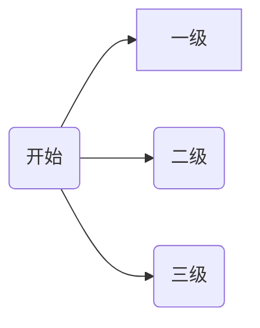

---
{"dg-publish":true,"tags":["DigitalGarden"],"permalink":"/digital-garden/","dgPassFrontmatter":true}
---


# 与其他解决方案的比较

## 优点

这个插件与其他流行的数字花园之间的主要区别之一是它通过插件与黑曜石集成。忽略初始设置，您永远不必触摸 Git。（除非你愿意。发布新注释就像使用 [publish single note 命令](https://dg-docs.ole.dev/getting-started/02-commands/#publish-single-note)一样简单。

这也使得只发布_一些_笔记变得更加容易，而不是将整个保险库发布到您的数字花园。

与黑曜石紧密集成的其他好处是，我们可以利用来自 Obsidian 社区的令人难以置信的插件和主题。到目前为止，此插件支持黑曜石特定功能，如 Dataview 查询、Excalidraw 和 Obisidian 主题。

由于有各种自定义选项，您还可以将其用作简单的笔记共享解决方案，创建指向您的笔记的链接，以便轻松与朋友和同事分享。如果您不需要它们，则无需启用所有花里胡哨的功能，例如反向链接、搜索和图表。

## 缺点

当然，这种与黑曜石紧密耦合的缺点是，这个花园不像其他一些花园那样容易与其他书写工具整合，而不是像黑曜石那样容易。

但是，如果您决定切换到另一个工具，您的所有文件仍然可以以纯文本形式使用，因此切换应该不会太难。

## 初始配置


Show home link
显示主页链接：默认开启。如果启用此功能，则导航栏将显示在每个笔记的顶部。站点名称将显示为标题，并且可以单击。单击它将带用户返回到主页笔记。默认情况下，站点名称为“Digital Garden”。这可以通过 04 外观设置#站点名称设置进行更改。

Show local graph for notes
显示笔记的本地图形：默认关闭。打开后，本地图形（如黑曜石中的图形）将显示在右侧。它将显示指向当前注释的传出和传入链接。它是交互式的，可以四处移动。单击其中一个节点将带您到相应的注释。
在桌面上，它显示在右侧。在移动设备上，它显示在底部。

Show a table of content
显示注释的目录：默认关闭。启用后，笔记中所有标题的列表将显示在右侧。单击其中一个标题将滚动到注释中的相应标题。
在桌面上，它显示在右侧。在移动设备上，它是隐藏的。

Show backlinks for notes
显示笔记的反向链接
默认关闭。启用后，您发布的笔记将显示一个链接到它的笔记列表。它只会显示已发布的注释。
在桌面和更大的屏幕上，它将被放置在右侧。在移动设备和较小的屏幕上，它被放在页面的底部。

显示内联标题
默认情况下处于关闭状态。启用后，文件名将显示在页面顶部。类似于 Obsidian v1.0 中引入的“显示内联标题”设置。

显示文件树侧边栏
默认情况下处于关闭状态。打开后，右侧将显示一个侧边栏，所有已发布的笔记都显示在 Obsidian 中放置的文件夹层次结构中。在较小的屏幕上，它会消失，但可以通过单击左上角的“汉堡包”菜单来查看。

链接预览
默认情况下处于关闭状态。启用后，当您将鼠标悬停在它们上面时，所有链接都会显示笔记内容的预览。

启用搜索
默认情况下处于关闭状态。启用后，用户可以选择轻松搜索所有已发布的笔记。可以通过单击右上角显示的搜索框来查看搜索框，如果启用了此功能，则还可以单击文件树侧边栏顶部的搜索框。也可以在 Windows/Linux 上按 CTRL+K 或在 MacOS 上按 CMD+K 来触发。
将弹出一个对话框。可以使用键盘的向上和向下箭头键来导航结果。按回车键将带您进入笔记。按 ESC 键将关闭搜索框。

启用搜索后，您还可以构建显示搜索和结果的 URL。这是通过在 URL 中指定“q”查询参数来完成的。
例如，对于此网站：https://dg-docs.ole.dev/?q=Commands

显示标签
默认情况下处于关闭状态。启用后，备忘录封面中的所有标签都会显示在页面顶部的备忘录标题下方。
如果启用了搜索功能，单击标签将弹出搜索框并显示带有该标签的所有注释。

让所有前线物质通过
默认情况下处于关闭状态。大多数用户都希望关闭此功能。这是一个主要针对高级用户的设置，他们修改了他们的模板，并希望完全控制传递给模板的 frontmatter 内容。默认情况下，插件无法识别的所有 frontmatter 属性在发布之前都会被剥离。这是为了防止如果静态站点生成器无法识别 frontmatter 中的数据，则 Netlify 中的构建会失败。（有关详细信息，请参见 11ty Front Matter Data）。如果您的站点突然停止工作，并且此功能已启用，那么尝试再次禁用它是值得的。

添加自定义组件

内容定制

自定义图像宽度：``


嵌入的文档不需要`dg-publish`属性

嵌入标题：`![[Some Other Note|Heading]]`

指定标题级别：`![[Some Other Note|###Heading]]`

标题等于嵌入文档的标题：`
<div class="transclusion internal-embed is-loaded"><a class="markdown-embed-link" href="/obsidian/" aria-label="Open link"><svg xmlns="http://www.w3.org/2000/svg" width="24" height="24" viewBox="0 0 24 24" fill="none" stroke="currentColor" stroke-width="2" stroke-linecap="round" stroke-linejoin="round" class="svg-icon lucide-link"><path d="M10 13a5 5 0 0 0 7.54.54l3-3a5 5 0 0 0-7.07-7.07l-1.72 1.71"></path><path d="M14 11a5 5 0 0 0-7.54-.54l-3 3a5 5 0 0 0 7.07 7.07l1.71-1.71"></path></svg></a><div class="markdown-embed">

<div class="markdown-embed-title">

# Obsidian使用手册

</div>


# obsidian简介

obsidian不是什么？
- 不是信息收集工具
- 不是Word
- 不是时间管理工具

obsidian是什么？
- 码字工具
- 深度管理知识内容片段的工具
	- 内容为基础
	- 链接为核心

我要用obsidian做什么？
- 写作
- 建立深度知识库
	- 关联知识点
	- 发现新知识点
- 建立索引
- 写清单日记

学obsidian真正重要的事
- 运用markdown码字
- 运用双链建立知识网络
- 最终形成自己的知识管理系统


## 🌱文件结构

资料库：

obsidian每个资料库是独立的，不同资料库里的信息无法互相连接，创建时需要想好这个资料库的定位是什么，要如何去使用这个资料库，不宜分太多，大类相同就放在一个库。

库内的.obsidian文件夹：

存放配置文件的文件夹，设置、主题、插件都是存放于此，创建新的库是没有这些配置的，可以把.obsidian文件夹直接复制到新库内，就可以直接使用。

## 认识界面

**一、最左侧称为功能区：**

快速切换：快速搜索笔记，创建切换笔记（常用，建议后期为此功能分配快捷键）

关系图谱：以图谱的形式展示所有笔记之间的链接关系

命令面板：让obsidian快速的去执行一些特定的命令


切换资料库
帮助：
设置：常用，内有各种设置，默认快捷键Ctrl+逗号

**二、笔记列表区：**

展示所有的文件夹和笔记

功能：新建文件、新建文件夹、排序

搜索功能（后期讲搜索技巧）

注意事项：库内笔记修改尽量在obsidian中进行

**三、展示区：**

查看、编辑笔记

**四、面板区：**

功能需要自定义设置

## 基础的设置

语言：设置-关于-语言；

外观：背景颜色、字体大小、快速调整字体大小功能（Ctrl+鼠标滚轮）、主题（建议用默认）

编辑器：默认编辑模式（建议设置为实时预览）、其他功能较多，也比较常用

文件与链接（重要）：

删除时确认删除提示：建议设置为需要提示确认删除

删除文件设置：建议设置为软件自带的回收站文件夹（.trash）

新建笔记的存放位置：推荐在根目录新建一个“00 inbox”文件夹作为新笔记的存放位置

附件默认存放路径：推荐在根目录新建一个“asset”文件夹作为附件的存放位置

快捷键：暂不涉及

核心插件（重要，是自带的插件，功能很多，但是需要自己手动开启）
	建议打开的插件：
	标签列表：显示打标签的笔记的信息
	日记（后面详细讲）
	模板（后面详细讲）
	星标：标记重点笔记
	大纲：目录功能
	幻灯片：精简PPT的功能 
	录音：录制音频保存到附件
	工作区：打开多个窗口，保存设置好的工作区布局
# Markdown

[markdown语法 | obsidian](https://coffeetea.top/zh/markdown/)

## 常用语法

**加粗：左右各两个星号**

*斜体：左右各一个星号*

~~删除线：左右各两个波浪线“~”~~

- 无序列表：*
* 无序列表：-
+ 无序列表：+

- [ ] 待办任务列表：- [ ] ，空框："-"+空格+[]+空格，快捷键：Ctrl+L
- [x] 勾选任务列表：- [x] ，空框："-"+空格+[x]+空格，

> 引用：英文大于符号+空格

分割线：英文状态下三个“-”

链接：英文中括号[]+小括号()，中括号内放链接名，小括号内放网址链接


绘制流程图



There is a footnote here [^1]
[^1]: Here are some extra information in a footnote

<mark style="background: transparent; color: yellow">黄色字体</mark>

Callout 标注

```md
> [!info] 自定义标题
包裹的内容
可以是多行的内容
```
在标题部分可以使用 `-`和`+`符号，让callout面板折叠或者展开
```md
[!info]+ 自定义标题
包裹的内容
可以是多行的内容
```

>[!info]+ 这是一个可折叠的info
> 包裹的内容
> 可以是折叠的多行的内容

>[!note] Note

>[!abstract] Abstract

>[!todo] Todo

>[!tip] Tip

>[!Question] Question

>[!warning] Warning

>[!failure] Failure

>[!danger] Danger

>[!bug] Bug

>[!example]

>[!quote]


## 高级用法

MathJax / LaTex

[MathJax 参考手册](https://math.meta.stackexchange.com/questions/5020/mathjax-basic-tutorial-and-quick-reference)

Latex输出公式
$for\quad变量\quad in\quad序列:$
$\frac{1}{0} = \infty$

绘制表格（可鼠标右键插入）

```md
| 左栏 | 中间栏 | 右栏 |
| -------- | -------- | ----- |
| 单元格 1 | 居中 | $1600 |
| 单元格 2 | 单元格 3 | $12 |
```


| 左栏    | 中间栏   | 右栏    |
| ----- | ----- | ----- |
| 单元格 1 | 居中    | $1600 |
| 单元格 2 | 单元格 3 | $12   |


[在线编辑器](https://www.zybuluo.com/mdeditor)

### 在 Markdown 中绘制函数图像 

使用 `SVG`

首先用 [Mathematica]([matlab和mathmatica的在线版|Jerkwin](https://jerkwin.github.io/2020/11/18/matlab%E5%92%8Cmathmatica%E7%9A%84%E5%9C%A8%E7%BA%BF%E7%89%88/)) 绘图并导出 SVG

```
Plot[Sin[x], {x, -4, 4}, PlotPoints -> 2]
Export["sin.svg", %]
```

接下来使用 [svgo](https://github.com/svg/svgo) 做一下压缩：

```sh
svgo --pretty sin.svg
```

得到的代码直接复制进来就好啦～
 
<svg xmlns="http://www.w3.org/2000/svg" xmlns:xlink="http://www.w3.org/1999/xlink" width="480" height="223pt" viewBox="0 0 360 223">
    <defs>
        <symbol overflow="visible" id="a">
            <path d="M5.29-2.191H.55v-.82h4.74zm0 0"/>
        </symbol>
        <symbol overflow="visible" id="b">
            <path d="M3.234 0v-1.715H.125v-.805l3.27-4.636h.714v4.636h.97v.805h-.97V0zm0-2.52v-3.226L.992-2.52zm0 0"/>
        </symbol>
        <symbol overflow="visible" id="c">
            <path d="M5.035-.844V0H.305a1.54 1.54 0 01.101-.61c.121-.324.313-.64.578-.953.266-.312.649-.671 1.149-1.085.777-.637 1.304-1.141 1.578-1.516.273-.371.41-.723.41-1.055 0-.347-.125-.644-.375-.883-.246-.238-.574-.359-.973-.359-.421 0-.761.129-1.015.383-.254.254-.383.605-.387 1.055L.47-5.117c.062-.672.293-1.188.699-1.54.402-.355.945-.53 1.625-.53.687 0 1.23.19 1.629.57.402.383.601.855.601 1.418 0 .285-.058.566-.175.844-.118.277-.313.566-.582.875-.274.304-.723.726-1.356 1.257-.527.442-.867.743-1.015.903a2.868 2.868 0 00-.372.476zm0 0"/>
        </symbol>
        <symbol overflow="visible" id="d">
            <path d="M3.727 0h-.88v-5.602c-.21.204-.488.407-.831.606a5.902 5.902 0 01-.926.457v-.852c.492-.23.922-.511 1.289-.84.367-.328.629-.648.781-.957h.567zm0 0"/>
        </symbol>
        <symbol overflow="visible" id="e">
            <path d="M.906 0v-1H1.91v1zm0 0"/>
        </symbol>
        <symbol overflow="visible" id="f">
            <path d="M.414-3.531c0-.844.09-1.528.262-2.043.176-.516.433-.914.777-1.192.344-.28.774-.421 1.297-.421.383 0 .719.078 1.008.23.289.156.531.379.719.672.187.289.335.644.445 1.062.11.418.16.985.16 1.692 0 .84-.086 1.52-.258 2.035-.172.516-.43.914-.773 1.195-.344.281-.778.422-1.301.422-.691 0-1.234-.246-1.625-.742-.473-.594-.71-1.567-.71-2.91zm.906 0c0 1.176.137 1.957.41 2.347.278.387.614.582 1.02.582.402 0 .742-.195 1.016-.586.277-.39.414-1.171.414-2.343 0-1.18-.137-1.961-.414-2.348-.274-.387-.618-.582-1.028-.582-.402 0-.726.172-.965.516-.304.433-.453 1.238-.453 2.414zm0 0"/>
        </symbol>
        <symbol overflow="visible" id="g">
            <path d="M.414-1.875l.922-.078c.07.45.23.785.476 1.012.25.226.551.34.903.34.422 0 .781-.16 1.074-.477.293-.32.438-.742.438-1.27 0-.504-.141-.898-.422-1.187-.282-.29-.649-.434-1.106-.434a1.526 1.526 0 00-1.3.692L.57-3.383l.696-3.68h3.558v.844H1.97l-.387 1.922c.43-.3.879-.45 1.352-.45a2.14 2.14 0 011.582.65c.43.433.644.992.644 1.671 0 .649-.187 1.207-.566 1.68-.457.578-1.086.867-1.88.867-.651 0-1.183-.18-1.593-.547-.41-.363-.648-.847-.707-1.449zm0 0"/>
        </symbol>
    </defs>
    <path d="M7.66 35.668l5.371 8.715 5.367 9.754L23.77 64.78l5.37 11.371 5.372 11.914 5.367 12.274L50.62 125.2l5.371 12.198 5.367 11.786 5.371 11.195 5.372 10.426 5.367 9.492 5.37 8.414 5.372 7.203 5.371 5.883 5.367 4.465 5.371 2.98 5.371 1.453 5.368-.105 5.37-1.656 5.372-3.18 5.37-4.66 5.368-6.063 5.371-7.37 5.371-8.567 5.367-9.625 5.372-10.535 5.37-11.286 5.372-11.851 10.738-24.668 5.371-12.434 5.367-12.234 5.371-11.856 5.371-11.28 5.372-10.536 5.367-9.629 5.37-8.566 5.372-7.371 5.367-6.063 5.371-4.656 5.371-3.184 5.371-1.652 5.368-.105 5.37 1.449 5.372 2.984 5.367 4.465 5.371 5.879 5.371 7.203 5.371 8.418 5.367 9.492 5.372 10.426 5.37 11.191 10.739 23.985 5.371 12.418 5.371 12.441 5.367 12.277 5.371 11.914 5.371 11.368 5.372 10.644 5.367 9.758 5.37 8.715" fill="none" stroke-width="1.6" stroke-linecap="square" stroke="#5e81b5" stroke-miterlimit="3.25"/>
    <path d="M7.66 111.129v-4" fill="none" stroke-width=".2" stroke="#666" stroke-miterlimit="3.25"/>
    <use xlink:href="#a" x="1.66" y="123.128" fill="#666"/>
    <use xlink:href="#b" x="7.66" y="123.128" fill="#666"/>
    <path d="M29.14 111.129v-2.402M50.621 111.129v-2.402M72.102 111.129v-2.402M93.578 111.129v-4" fill="none" stroke-width=".2" stroke="#666" stroke-miterlimit="3.25"/>
    <use xlink:href="#a" x="87.58" y="123.128" fill="#666"/>
    <use xlink:href="#c" x="93.58" y="123.128" fill="#666"/>
    <path d="M115.059 111.129v-2.402M136.54 111.129v-2.402M158.02 111.129v-2.402M179.5 111.129v-4M200.98 111.129v-2.402M222.46 111.129v-2.402M243.941 111.129v-2.402M265.422 111.129v-4" fill="none" stroke-width=".2" stroke="#666" stroke-miterlimit="3.25"/>
    <use xlink:href="#c" x="262.42" y="123.128" fill="#666"/>
    <path d="M286.898 111.129v-2.402M308.379 111.129v-2.402M329.86 111.129v-2.402M351.34 111.129v-4" fill="none" stroke-width=".2" stroke="#666" stroke-miterlimit="3.25"/>
    <use xlink:href="#b" x="348.34" y="123.128" fill="#666"/>
    <path d="M.5 111.129h358M179.5 220.813h2.398M179.5 210.84h4" fill="none" stroke-width=".2" stroke="#666" stroke-miterlimit="3.25"/>
    <use xlink:href="#a" x="156.5" y="213.34" fill="#666"/>
    <g fill="#666">
        <use xlink:href="#d" x="162.5" y="213.34"/>
        <use xlink:href="#e" x="168.062" y="213.34"/>
        <use xlink:href="#f" x="170.84" y="213.34"/>
    </g>
    <path d="M179.5 200.867h2.398M179.5 190.898h2.398M179.5 180.926h2.398M179.5 170.957h2.398M179.5 160.984h4" fill="none" stroke-width=".2" stroke="#666" stroke-miterlimit="3.25"/>
    <use xlink:href="#a" x="156.5" y="163.484" fill="#666"/>
    <g fill="#666">
        <use xlink:href="#f" x="162.5" y="163.484"/>
        <use xlink:href="#e" x="168.062" y="163.484"/>
        <use xlink:href="#g" x="170.84" y="163.484"/>
    </g>
    <path d="M179.5 151.012h2.398M179.5 141.043h2.398M179.5 131.07h2.398M179.5 121.098h2.398M179.5 111.129h4M179.5 101.156h2.398M179.5 91.188h2.398M179.5 81.215h2.398M179.5 71.242h2.398M179.5 61.273h4" fill="none" stroke-width=".2" stroke="#666" stroke-miterlimit="3.25"/>
    <g fill="#666">
        <use xlink:href="#f" x="162.5" y="63.772"/>
        <use xlink:href="#e" x="168.062" y="63.772"/>
        <use xlink:href="#g" x="170.84" y="63.772"/>
    </g>
    <path d="M179.5 51.3h2.398M179.5 41.328h2.398M179.5 31.36h2.398M179.5 21.387h2.398M179.5 11.418h4" fill="none" stroke-width=".2" stroke="#666" stroke-miterlimit="3.25"/>
    <g fill="#666">
        <use xlink:href="#d" x="162.5" y="13.916"/>
        <use xlink:href="#e" x="168.062" y="13.916"/>
        <use xlink:href="#f" x="170.84" y="13.916"/>
    </g>
    <path d="M179.5 1.445h2.398M179.5 221.758V.5" fill="none" stroke-width=".2" stroke="#666" stroke-miterlimit="3.25"/>
</svg>

## 使用建议

单个的符号后面都最好空一格

=不同段落之间空一行=


# 双链

入链（反向链接）

出链

双链的意义就在于，将所有的知识编织、串联起来，形成一个网络，每个信息都不是独立的，从一个信息点就可以链接到很多很多的信息点。

## 如何运用双链

### 创建链接

链接到文章：输入两个中括号即可生成链接。 

[[01 Project/人民公仆/行测的思维\|行测的思维]]

链接到文章内某个标题：在链接内的文章名尾部输入“#”即可选择标题。

[[01 Project/Hugo/Easy Hugo#你的第一页 Your first page\|Easy Hugo#你的第一页 Your first page]]

链接到文章内的段落，指向具体的块：选中链接的文本块后输入”^“会自动生成随机的链接代码，可以自定义修改：在链接内的文章内容块尾部输入“^”即可选择文本块。

[[01 Project/Python/列表的使用#^3f2edd\|列表的使用#^3f2edd]]

为链接的内容起一个别名：在链接内的文章名尾部输入“|”即可自定义链接别名

[[01 Project/沟通与表达#^4b541a\|个人特质]]

 “ #” “^” “|” 可以组合使用

将链接到的内容直接显示在当前文章中：在链接的开头，方括号前方加上“ ! ”


<div class="transclusion internal-embed is-loaded"><a class="markdown-embed-link" href="/xingce/" aria-label="Open link"><svg xmlns="http://www.w3.org/2000/svg" width="24" height="24" viewBox="0 0 24 24" fill="none" stroke="currentColor" stroke-width="2" stroke-linecap="round" stroke-linejoin="round" class="svg-icon lucide-link"><path d="M10 13a5 5 0 0 0 7.54.54l3-3a5 5 0 0 0-7.07-7.07l-1.72 1.71"></path><path d="M14 11a5 5 0 0 0-7.54-.54l-3 3a5 5 0 0 0 7.07 7.07l1.71-1.71"></path></svg></a><div class="markdown-embed">


</div></div>


### 查看链接

查看链接内容

核心插件->页面预览

按住Ctrl鼠标放到链接上，预览链接内容，如果无法预览，打开设置-核心插件-页面预览，打开即可。


打开链接面板

核心插件->反向链接&出链，可关闭开启。

关系图谱

### 双链的意义

线性笔记（各个独立笔记之间缺乏关联） vs 知识网络

管理知识片段

链接 ->关联思维
片段 -> 整合思维

内联标签

笔记有一个内联标签，而 frontmatter 中没有标签 
#python 


汉字注音
```html
<ruby>咖<rp>(</rp><rt>ka</rt><rp>)</rp> 啡<rp>(</rp><rt>fei</rt><rp>)</rp> 豆<rp>(</rp><rt>dou</rt><rp>)</rp> 的<rp>(</rp><rt>de</rt><rp>)</rp> 拼<rp>(</rp><rt>pin</rt><rp>)</rp> 音<rp>(</rp><rt>yin</rt><rp>)</rp> 注<rp>(</rp><rt>zhu</rt><rp>)</rp> 解<rp>(</rp><rt>jie</rt><rp>)</rp> 小<rp>(</rp><rt>xiao</rt><rp>)</rp> 程<rp>(</rp><rt>cheng</rt><rp>)</rp> 序<rp>(</rp><rt>xu</rt><rp>)</rp> </ruby>
```

<ruby>咖<rp>(</rp><rt>ka</rt><rp>)</rp> 啡<rp>(</rp><rt>fei</rt><rp>)</rp> 豆<rp>(</rp><rt>dou</rt><rp>)</rp> 的<rp>(</rp><rt>de</rt><rp>)</rp> 拼<rp>(</rp><rt>pin</rt><rp>)</rp> 音<rp>(</rp><rt>yin</rt><rp>)</rp> 注<rp>(</rp><rt>zhu</rt><rp>)</rp> 解<rp>(</rp><rt>jie</rt><rp>)</rp> 小<rp>(</rp><rt>xiao</rt><rp>)</rp> 程<rp>(</rp><rt>cheng</rt><rp>)</rp> 序<rp>(</rp><rt>xu</rt><rp>)</rp> </ruby>

简单批注
```html
我们<u title="游戏狂">咖啡豆</u>喜欢的obsidian
```

我们<u title="游戏狂">咖啡豆</u>喜欢的obsidian


# obsidian白板
信息的可视化、逻辑化，更直观的解决信息筛选过滤，理清问题背后的逻辑关系。

</div></div>
`

`
<div class="transclusion internal-embed is-loaded"><a class="markdown-embed-link" href="/obsidian/" aria-label="Open link"><svg xmlns="http://www.w3.org/2000/svg" width="24" height="24" viewBox="0 0 24 24" fill="none" stroke="currentColor" stroke-width="2" stroke-linecap="round" stroke-linejoin="round" class="svg-icon lucide-link"><path d="M10 13a5 5 0 0 0 7.54.54l3-3a5 5 0 0 0-7.07-7.07l-1.72 1.71"></path><path d="M14 11a5 5 0 0 0-7.54-.54l-3 3a5 5 0 0 0 7.07 7.07l1.71-1.71"></path></svg></a><div class="markdown-embed">

<div class="markdown-embed-title">

# This is aObsidian使用手册

</div>


# obsidian简介

obsidian不是什么？
- 不是信息收集工具
- 不是Word
- 不是时间管理工具

obsidian是什么？
- 码字工具
- 深度管理知识内容片段的工具
	- 内容为基础
	- 链接为核心

我要用obsidian做什么？
- 写作
- 建立深度知识库
	- 关联知识点
	- 发现新知识点
- 建立索引
- 写清单日记

学obsidian真正重要的事
- 运用markdown码字
- 运用双链建立知识网络
- 最终形成自己的知识管理系统


## 🌱文件结构

资料库：

obsidian每个资料库是独立的，不同资料库里的信息无法互相连接，创建时需要想好这个资料库的定位是什么，要如何去使用这个资料库，不宜分太多，大类相同就放在一个库。

库内的.obsidian文件夹：

存放配置文件的文件夹，设置、主题、插件都是存放于此，创建新的库是没有这些配置的，可以把.obsidian文件夹直接复制到新库内，就可以直接使用。

## 认识界面

**一、最左侧称为功能区：**

快速切换：快速搜索笔记，创建切换笔记（常用，建议后期为此功能分配快捷键）

关系图谱：以图谱的形式展示所有笔记之间的链接关系

命令面板：让obsidian快速的去执行一些特定的命令


切换资料库
帮助：
设置：常用，内有各种设置，默认快捷键Ctrl+逗号

**二、笔记列表区：**

展示所有的文件夹和笔记

功能：新建文件、新建文件夹、排序

搜索功能（后期讲搜索技巧）

注意事项：库内笔记修改尽量在obsidian中进行

**三、展示区：**

查看、编辑笔记

**四、面板区：**

功能需要自定义设置

## 基础的设置

语言：设置-关于-语言；

外观：背景颜色、字体大小、快速调整字体大小功能（Ctrl+鼠标滚轮）、主题（建议用默认）

编辑器：默认编辑模式（建议设置为实时预览）、其他功能较多，也比较常用

文件与链接（重要）：

删除时确认删除提示：建议设置为需要提示确认删除

删除文件设置：建议设置为软件自带的回收站文件夹（.trash）

新建笔记的存放位置：推荐在根目录新建一个“00 inbox”文件夹作为新笔记的存放位置

附件默认存放路径：推荐在根目录新建一个“asset”文件夹作为附件的存放位置

快捷键：暂不涉及

核心插件（重要，是自带的插件，功能很多，但是需要自己手动开启）
	建议打开的插件：
	标签列表：显示打标签的笔记的信息
	日记（后面详细讲）
	模板（后面详细讲）
	星标：标记重点笔记
	大纲：目录功能
	幻灯片：精简PPT的功能 
	录音：录制音频保存到附件
	工作区：打开多个窗口，保存设置好的工作区布局
# Markdown

[markdown语法 | obsidian](https://coffeetea.top/zh/markdown/)

## 常用语法

**加粗：左右各两个星号**

*斜体：左右各一个星号*

~~删除线：左右各两个波浪线“~”~~

- 无序列表：*
* 无序列表：-
+ 无序列表：+

- [ ] 待办任务列表：- [ ] ，空框："-"+空格+[]+空格，快捷键：Ctrl+L
- [x] 勾选任务列表：- [x] ，空框："-"+空格+[x]+空格，

> 引用：英文大于符号+空格

分割线：英文状态下三个“-”

链接：英文中括号[]+小括号()，中括号内放链接名，小括号内放网址链接


绘制流程图


There is a footnote here [^1]
[^1]: Here are some extra information in a footnote

<mark style="background: transparent; color: yellow">黄色字体</mark>

Callout 标注

```md
> [!info] 自定义标题
包裹的内容
可以是多行的内容
```
在标题部分可以使用 `-`和`+`符号，让callout面板折叠或者展开
```md
[!info]+ 自定义标题
包裹的内容
可以是多行的内容
```

>[!info]+ 这是一个可折叠的info
> 包裹的内容
> 可以是折叠的多行的内容

>[!note] Note

>[!abstract] Abstract

>[!todo] Todo

>[!tip] Tip

>[!Question] Question

>[!warning] Warning

>[!failure] Failure

>[!danger] Danger

>[!bug] Bug

>[!example]

>[!quote]


## 高级用法

MathJax / LaTex

[MathJax 参考手册](https://math.meta.stackexchange.com/questions/5020/mathjax-basic-tutorial-and-quick-reference)

Latex输出公式
$for\quad变量\quad in\quad序列:$
$\frac{1}{0} = \infty$

绘制表格（可鼠标右键插入）

```md
| 左栏 | 中间栏 | 右栏 |
| -------- | -------- | ----- |
| 单元格 1 | 居中 | $1600 |
| 单元格 2 | 单元格 3 | $12 |
```


| 左栏    | 中间栏   | 右栏    |
| ----- | ----- | ----- |
| 单元格 1 | 居中    | $1600 |
| 单元格 2 | 单元格 3 | $12   |


[在线编辑器](https://www.zybuluo.com/mdeditor)

### 在 Markdown 中绘制函数图像 

使用 `SVG`

首先用 [Mathematica]([matlab和mathmatica的在线版|Jerkwin](https://jerkwin.github.io/2020/11/18/matlab%E5%92%8Cmathmatica%E7%9A%84%E5%9C%A8%E7%BA%BF%E7%89%88/)) 绘图并导出 SVG

```
Plot[Sin[x], {x, -4, 4}, PlotPoints -> 2]
Export["sin.svg", %]
```

接下来使用 [svgo](https://github.com/svg/svgo) 做一下压缩：

```sh
svgo --pretty sin.svg
```

得到的代码直接复制进来就好啦～
 
<svg xmlns="http://www.w3.org/2000/svg" xmlns:xlink="http://www.w3.org/1999/xlink" width="480" height="223pt" viewBox="0 0 360 223">
    <defs>
        <symbol overflow="visible" id="a">
            <path d="M5.29-2.191H.55v-.82h4.74zm0 0"/>
        </symbol>
        <symbol overflow="visible" id="b">
            <path d="M3.234 0v-1.715H.125v-.805l3.27-4.636h.714v4.636h.97v.805h-.97V0zm0-2.52v-3.226L.992-2.52zm0 0"/>
        </symbol>
        <symbol overflow="visible" id="c">
            <path d="M5.035-.844V0H.305a1.54 1.54 0 01.101-.61c.121-.324.313-.64.578-.953.266-.312.649-.671 1.149-1.085.777-.637 1.304-1.141 1.578-1.516.273-.371.41-.723.41-1.055 0-.347-.125-.644-.375-.883-.246-.238-.574-.359-.973-.359-.421 0-.761.129-1.015.383-.254.254-.383.605-.387 1.055L.47-5.117c.062-.672.293-1.188.699-1.54.402-.355.945-.53 1.625-.53.687 0 1.23.19 1.629.57.402.383.601.855.601 1.418 0 .285-.058.566-.175.844-.118.277-.313.566-.582.875-.274.304-.723.726-1.356 1.257-.527.442-.867.743-1.015.903a2.868 2.868 0 00-.372.476zm0 0"/>
        </symbol>
        <symbol overflow="visible" id="d">
            <path d="M3.727 0h-.88v-5.602c-.21.204-.488.407-.831.606a5.902 5.902 0 01-.926.457v-.852c.492-.23.922-.511 1.289-.84.367-.328.629-.648.781-.957h.567zm0 0"/>
        </symbol>
        <symbol overflow="visible" id="e">
            <path d="M.906 0v-1H1.91v1zm0 0"/>
        </symbol>
        <symbol overflow="visible" id="f">
            <path d="M.414-3.531c0-.844.09-1.528.262-2.043.176-.516.433-.914.777-1.192.344-.28.774-.421 1.297-.421.383 0 .719.078 1.008.23.289.156.531.379.719.672.187.289.335.644.445 1.062.11.418.16.985.16 1.692 0 .84-.086 1.52-.258 2.035-.172.516-.43.914-.773 1.195-.344.281-.778.422-1.301.422-.691 0-1.234-.246-1.625-.742-.473-.594-.71-1.567-.71-2.91zm.906 0c0 1.176.137 1.957.41 2.347.278.387.614.582 1.02.582.402 0 .742-.195 1.016-.586.277-.39.414-1.171.414-2.343 0-1.18-.137-1.961-.414-2.348-.274-.387-.618-.582-1.028-.582-.402 0-.726.172-.965.516-.304.433-.453 1.238-.453 2.414zm0 0"/>
        </symbol>
        <symbol overflow="visible" id="g">
            <path d="M.414-1.875l.922-.078c.07.45.23.785.476 1.012.25.226.551.34.903.34.422 0 .781-.16 1.074-.477.293-.32.438-.742.438-1.27 0-.504-.141-.898-.422-1.187-.282-.29-.649-.434-1.106-.434a1.526 1.526 0 00-1.3.692L.57-3.383l.696-3.68h3.558v.844H1.97l-.387 1.922c.43-.3.879-.45 1.352-.45a2.14 2.14 0 011.582.65c.43.433.644.992.644 1.671 0 .649-.187 1.207-.566 1.68-.457.578-1.086.867-1.88.867-.651 0-1.183-.18-1.593-.547-.41-.363-.648-.847-.707-1.449zm0 0"/>
        </symbol>
    </defs>
    <path d="M7.66 35.668l5.371 8.715 5.367 9.754L23.77 64.78l5.37 11.371 5.372 11.914 5.367 12.274L50.62 125.2l5.371 12.198 5.367 11.786 5.371 11.195 5.372 10.426 5.367 9.492 5.37 8.414 5.372 7.203 5.371 5.883 5.367 4.465 5.371 2.98 5.371 1.453 5.368-.105 5.37-1.656 5.372-3.18 5.37-4.66 5.368-6.063 5.371-7.37 5.371-8.567 5.367-9.625 5.372-10.535 5.37-11.286 5.372-11.851 10.738-24.668 5.371-12.434 5.367-12.234 5.371-11.856 5.371-11.28 5.372-10.536 5.367-9.629 5.37-8.566 5.372-7.371 5.367-6.063 5.371-4.656 5.371-3.184 5.371-1.652 5.368-.105 5.37 1.449 5.372 2.984 5.367 4.465 5.371 5.879 5.371 7.203 5.371 8.418 5.367 9.492 5.372 10.426 5.37 11.191 10.739 23.985 5.371 12.418 5.371 12.441 5.367 12.277 5.371 11.914 5.371 11.368 5.372 10.644 5.367 9.758 5.37 8.715" fill="none" stroke-width="1.6" stroke-linecap="square" stroke="#5e81b5" stroke-miterlimit="3.25"/>
    <path d="M7.66 111.129v-4" fill="none" stroke-width=".2" stroke="#666" stroke-miterlimit="3.25"/>
    <use xlink:href="#a" x="1.66" y="123.128" fill="#666"/>
    <use xlink:href="#b" x="7.66" y="123.128" fill="#666"/>
    <path d="M29.14 111.129v-2.402M50.621 111.129v-2.402M72.102 111.129v-2.402M93.578 111.129v-4" fill="none" stroke-width=".2" stroke="#666" stroke-miterlimit="3.25"/>
    <use xlink:href="#a" x="87.58" y="123.128" fill="#666"/>
    <use xlink:href="#c" x="93.58" y="123.128" fill="#666"/>
    <path d="M115.059 111.129v-2.402M136.54 111.129v-2.402M158.02 111.129v-2.402M179.5 111.129v-4M200.98 111.129v-2.402M222.46 111.129v-2.402M243.941 111.129v-2.402M265.422 111.129v-4" fill="none" stroke-width=".2" stroke="#666" stroke-miterlimit="3.25"/>
    <use xlink:href="#c" x="262.42" y="123.128" fill="#666"/>
    <path d="M286.898 111.129v-2.402M308.379 111.129v-2.402M329.86 111.129v-2.402M351.34 111.129v-4" fill="none" stroke-width=".2" stroke="#666" stroke-miterlimit="3.25"/>
    <use xlink:href="#b" x="348.34" y="123.128" fill="#666"/>
    <path d="M.5 111.129h358M179.5 220.813h2.398M179.5 210.84h4" fill="none" stroke-width=".2" stroke="#666" stroke-miterlimit="3.25"/>
    <use xlink:href="#a" x="156.5" y="213.34" fill="#666"/>
    <g fill="#666">
        <use xlink:href="#d" x="162.5" y="213.34"/>
        <use xlink:href="#e" x="168.062" y="213.34"/>
        <use xlink:href="#f" x="170.84" y="213.34"/>
    </g>
    <path d="M179.5 200.867h2.398M179.5 190.898h2.398M179.5 180.926h2.398M179.5 170.957h2.398M179.5 160.984h4" fill="none" stroke-width=".2" stroke="#666" stroke-miterlimit="3.25"/>
    <use xlink:href="#a" x="156.5" y="163.484" fill="#666"/>
    <g fill="#666">
        <use xlink:href="#f" x="162.5" y="163.484"/>
        <use xlink:href="#e" x="168.062" y="163.484"/>
        <use xlink:href="#g" x="170.84" y="163.484"/>
    </g>
    <path d="M179.5 151.012h2.398M179.5 141.043h2.398M179.5 131.07h2.398M179.5 121.098h2.398M179.5 111.129h4M179.5 101.156h2.398M179.5 91.188h2.398M179.5 81.215h2.398M179.5 71.242h2.398M179.5 61.273h4" fill="none" stroke-width=".2" stroke="#666" stroke-miterlimit="3.25"/>
    <g fill="#666">
        <use xlink:href="#f" x="162.5" y="63.772"/>
        <use xlink:href="#e" x="168.062" y="63.772"/>
        <use xlink:href="#g" x="170.84" y="63.772"/>
    </g>
    <path d="M179.5 51.3h2.398M179.5 41.328h2.398M179.5 31.36h2.398M179.5 21.387h2.398M179.5 11.418h4" fill="none" stroke-width=".2" stroke="#666" stroke-miterlimit="3.25"/>
    <g fill="#666">
        <use xlink:href="#d" x="162.5" y="13.916"/>
        <use xlink:href="#e" x="168.062" y="13.916"/>
        <use xlink:href="#f" x="170.84" y="13.916"/>
    </g>
    <path d="M179.5 1.445h2.398M179.5 221.758V.5" fill="none" stroke-width=".2" stroke="#666" stroke-miterlimit="3.25"/>
</svg>

## 使用建议

单个的符号后面都最好空一格

=不同段落之间空一行=


# 双链

入链（反向链接）

出链

双链的意义就在于，将所有的知识编织、串联起来，形成一个网络，每个信息都不是独立的，从一个信息点就可以链接到很多很多的信息点。

## 如何运用双链

### 创建链接

链接到文章：输入两个中括号即可生成链接。 

[[01 Project/人民公仆/行测的思维\|行测的思维]]

链接到文章内某个标题：在链接内的文章名尾部输入“#”即可选择标题。

[[01 Project/Hugo/Easy Hugo#你的第一页 Your first page\|Easy Hugo#你的第一页 Your first page]]

链接到文章内的段落，指向具体的块：选中链接的文本块后输入”^“会自动生成随机的链接代码，可以自定义修改：在链接内的文章内容块尾部输入“^”即可选择文本块。

[[01 Project/Python/列表的使用#^3f2edd\|列表的使用#^3f2edd]]

为链接的内容起一个别名：在链接内的文章名尾部输入“|”即可自定义链接别名

[[01 Project/沟通与表达#^4b541a\|个人特质]]

 “ #” “^” “|” 可以组合使用

将链接到的内容直接显示在当前文章中：在链接的开头，方括号前方加上“ ! ”


<div class="transclusion internal-embed is-loaded"><a class="markdown-embed-link" href="/xingce/" aria-label="Open link"><svg xmlns="http://www.w3.org/2000/svg" width="24" height="24" viewBox="0 0 24 24" fill="none" stroke="currentColor" stroke-width="2" stroke-linecap="round" stroke-linejoin="round" class="svg-icon lucide-link"><path d="M10 13a5 5 0 0 0 7.54.54l3-3a5 5 0 0 0-7.07-7.07l-1.72 1.71"></path><path d="M14 11a5 5 0 0 0-7.54-.54l-3 3a5 5 0 0 0 7.07 7.07l1.71-1.71"></path></svg></a><div class="markdown-embed">


</div></div>


### 查看链接

查看链接内容

核心插件->页面预览

按住Ctrl鼠标放到链接上，预览链接内容，如果无法预览，打开设置-核心插件-页面预览，打开即可。


打开链接面板

核心插件->反向链接&出链，可关闭开启。

关系图谱

### 双链的意义

线性笔记（各个独立笔记之间缺乏关联） vs 知识网络

管理知识片段

链接 ->关联思维
片段 -> 整合思维

内联标签

笔记有一个内联标签，而 frontmatter 中没有标签 
#python 


汉字注音
```html
<ruby>咖<rp>(</rp><rt>ka</rt><rp>)</rp> 啡<rp>(</rp><rt>fei</rt><rp>)</rp> 豆<rp>(</rp><rt>dou</rt><rp>)</rp> 的<rp>(</rp><rt>de</rt><rp>)</rp> 拼<rp>(</rp><rt>pin</rt><rp>)</rp> 音<rp>(</rp><rt>yin</rt><rp>)</rp> 注<rp>(</rp><rt>zhu</rt><rp>)</rp> 解<rp>(</rp><rt>jie</rt><rp>)</rp> 小<rp>(</rp><rt>xiao</rt><rp>)</rp> 程<rp>(</rp><rt>cheng</rt><rp>)</rp> 序<rp>(</rp><rt>xu</rt><rp>)</rp> </ruby>
```

<ruby>咖<rp>(</rp><rt>ka</rt><rp>)</rp> 啡<rp>(</rp><rt>fei</rt><rp>)</rp> 豆<rp>(</rp><rt>dou</rt><rp>)</rp> 的<rp>(</rp><rt>de</rt><rp>)</rp> 拼<rp>(</rp><rt>pin</rt><rp>)</rp> 音<rp>(</rp><rt>yin</rt><rp>)</rp> 注<rp>(</rp><rt>zhu</rt><rp>)</rp> 解<rp>(</rp><rt>jie</rt><rp>)</rp> 小<rp>(</rp><rt>xiao</rt><rp>)</rp> 程<rp>(</rp><rt>cheng</rt><rp>)</rp> 序<rp>(</rp><rt>xu</rt><rp>)</rp> </ruby>

简单批注
```html
我们<u title="游戏狂">咖啡豆</u>喜欢的obsidian
```

我们<u title="游戏狂">咖啡豆</u>喜欢的obsidian


# obsidian白板
信息的可视化、逻辑化，更直观的解决信息筛选过滤，理清问题背后的逻辑关系。

</div></div>
`


如果您在笔记中编写任何 HTML，它们将在花园中呈现。这意味着您可以在网站上创建自定义的“类似网站”组件。例如，在 [Digital Garden - Publish Obsidian Notes For Free#Sites people have created](https://dg-docs.ole.dev/#sites-people-have-created) 中呈现的网格是使用 divs 和图像标签以及一些自定义内联样式创建的。

> [!warning] 
> HTML 的开始和结束标记之间不能有任何空换行符，否则将被打印而不是渲染出来

<div style="display: flex; flex-wrap: wrap; align-items: center; justify-content: center;"> <div style="display: flex; flex-direction: column; justify-content: center;align-items:center;">  <a href="https://notes.thatother.dev/">That Other Dev</a> </div> <div style="display: flex; flex-direction: column; justify-content: center;align-items: center">  <a href="https://syleria.netlify.app/">Syleria</a> </div> </div>

按钮设置

你可以用 SVG，或者只创建一个 html 按钮。

#### SVG 按钮

```
[](https://ko-fi.com/oleeskild)
```

[](https://ko-fi.com/oleeskild)


### HTML 按钮

<a href="https://github.com/oleeskild/obsidian-digital-garden/issues/55" target="_blank"><button>Submit your site</button></a>

添加按钮样式
<a href="https://github.com/oleeskild/obsidian-digital-garden/issues/55" target="_blank"><button style=" font-size: 28px; padding: 10px; height: fit-content; margin-top: 50px; background: var(--text-accent); font-weight: 600; color: var(--text-on-accent); "> Submit your digital garden site </button></a>
## Dataview queries

插件支持发布 dataview 查询结果。只需发布包含查询的页面即可。该插件将按发布时的原样呈现结果。如果结果发生变化，您将需要重新发布该注释。

它支持所有查询类型：dataview、dataviewjs、内联 dataview 和内联 dataviewjs。

由于插件“冻结”结果并发布它，您实际上甚至会将 dataview 查询中的链接视为反向链接。

您需要安装 dataview 插件的 0.5.39 或更高版本才能正常工作。